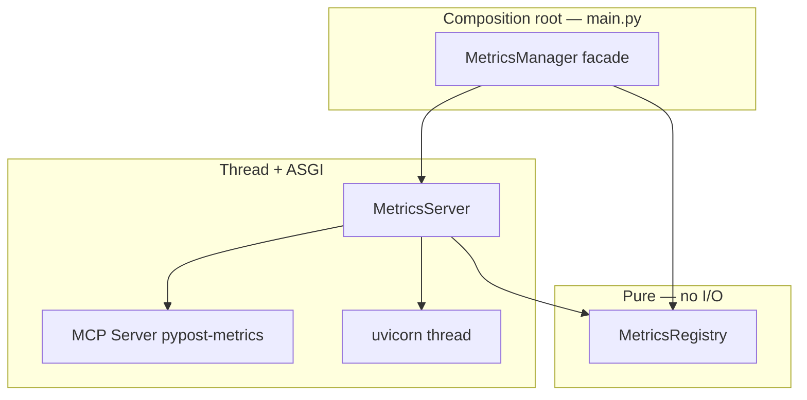

# PYPOST-75: MetricsManager split architecture

## Research

- PYPOST-44 review (TD-3) identified three responsibilities in `pypost/core/metrics.py`:
  counters, MCP resources, uvicorn lifecycle.
- PYPOST-40 audit R7 recommended `MetricsRegistry` + `MetricsServer` split (PYPOST-49).
- PYPOST-23 originally named these entities at requirements time; implementation deferred until
  injection (PYPOST-44) and test coverage (PYPOST-79) landed.

## Implementation Plan

1. Create `MetricsRegistry` — move `_init_metrics` and all `track_*` methods.
2. Create `MetricsServer` — move MCP handlers, `_create_app`, uvicorn thread lifecycle.
3. Slim `MetricsManager` to compose both and delegate public API unchanged.
4. Run `tests/test_metrics_manager.py` and metrics-dependent storage/adapter tests.

## Architecture



### Module responsibilities

| Module | Class | Responsibility |
| --- | --- | --- |
| `pypost/core/metrics_registry.py` | `MetricsRegistry` | `CollectorRegistry`, counter definitions, `track_*` |
| `pypost/core/metrics_server.py` | `MetricsServer` | MCP `metrics://all`, Starlette app, uvicorn lifecycle |
| `pypost/core/metrics.py` | `MetricsManager` | Facade; delegates to registry + server |

### Dependency direction

```
metrics_registry.py  (no imports from metrics_server)
        ↑
metrics_server.py
        ↑
metrics.py
```

Call sites continue importing `MetricsManager` only.

### Alternatives considered

| Option | Verdict |
| --- | --- |
| Facade + split modules | **Selected** — minimal call-site churn |
| Rename all injections to `MetricsRegistry` | Rejected — large diff, server still needed at root |
| Move MCP handlers to `mcp_server_impl.py` | Deferred — observability MCP is metrics-specific |

## Q&A

| Question | Answer |
| --- | --- |
| Can tests use `MetricsRegistry` directly? | Yes — preferred for counter-only unit tests. |
| Who starts the server? | `main.py` still calls `metrics_manager.start_server(...)`. |
