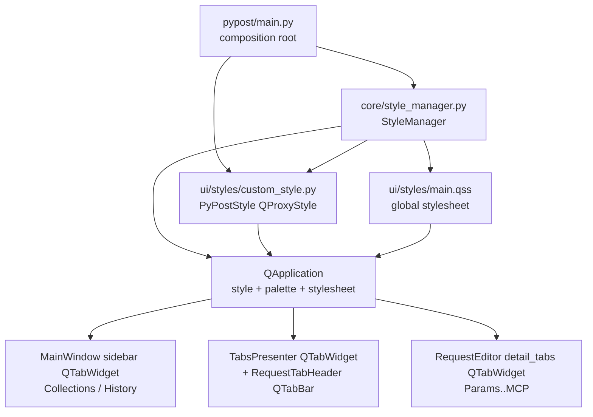

# PYPOST-792: macOS UI layout broken — overlapping tab labels and misaligned close buttons

## Research

### Affected widgets

All three broken regions are `QTabBar`-based; the rest of the UI (URL bar, Send button,
response area) does not use tab bars, which matches the reported blast radius:

1. Sidebar tabs — plain `QTabWidget` in `MainWindow._build_layout`
   (`pypost/ui/main_window.py:151-153`): `addTab(..., "Collections")`, `addTab(..., "History")`.
2. Request tab bar — `QTabWidget` owned by `TabsPresenter`
   (`pypost/ui/presenters/tabs_presenter.py:137-139`) with a custom `QTabBar` installed by
   `RequestTabHeader.attach` (`pypost/ui/widgets/tab_header.py`), closable tabs and a trailing
   `+` pseudo-tab (24x24 `QPushButton` in the tab's LeftSide button slot).
3. Request editor sub-tabs — plain `QTabWidget` `detail_tabs`
   (`pypost/ui/widgets/request_editor.py:123-193`) with "Params", "Headers", "Body", "Script",
   "MCP".

None of these widgets set local styles; all tab styling comes from the global pipeline.

### Styling pipeline

- `pypost/main.py:50-52` — composition root installs `PyPostStyle` (a `QProxyStyle`) and calls
  `set_close_button_size(48)`.
- `MainWindow.apply_settings` (`pypost/ui/main_window.py:311-325`) — on startup and on every
  settings change calls `StyleManager.apply_theme` then `StyleManager.apply_styles`.
- `StyleManager.apply_theme` (`pypost/core/style_manager.py:77-94`) — for theme `system`
  re-installs `PyPostStyle` with `set_close_button_size(48)`; for `dark`/`light` installs plain
  Fusion with a palette (no `PyPostStyle`).
- `StyleManager.apply_styles` (`pypost/core/style_manager.py:96-102`) — loads every
  `pypost/ui/styles/*.qss` file and applies the combined sheet to the whole application.

### Root cause

Three defects cooperate; all shipped in commit `766efa9` ("PYPOST-4 add external styling
support") and are platform-agnostic in code but most destructive under the macOS native style.

**RC1 — active zero-padding rule in `main.qss` (drives regions 1 and 3, worsens 2).**
`pypost/ui/styles/main.qss:12-14` contains:

```css
QTabBar::tab {
    padding: 0px 0px 0px 0px;
}
```

The comment above it ("Example ... Uncomment and modify") claims the block is a disabled
example, but the rule is live. Per Qt's documented style-sheet model, setting any box-model
property on `QTabBar::tab` stops native rendering of tabs; every property not set explicitly
falls back to bare defaults (no border, transparent background), and here padding is forced to
zero. Each tab therefore collapses to exactly its text width. Adjacent labels render flush
against each other — "CollectionsHistory" and "ParamsHeadersBodyScriptMCP" — and tab
boundaries in the request tab bar become invisible/inconsistent. The trailing `+` pseudo-tab
collapses to the 24px button with no chrome, producing the cramped `+` control.

macOS is hit hardest because with theme `system` the base style is the native macOS style,
whose tab look (segmented control: spacing, separators, margins) is produced entirely by the
native renderer that this rule disables. Fusion-based setups retain more visible structure, so
the defect was reported as macOS-specific, but the rule is harmful on every platform.

**RC2 — 48px close-indicator metric (drives region 2).**
`PyPostStyle.pixelMetric` (`pypost/ui/styles/custom_style.py:11-17`) returns
`close_button_size` (default 48, and explicitly set to 48 in `pypost/main.py:51` and
`pypost/core/style_manager.py:84`) for `PM_TabCloseIndicatorWidth/Height`. `QTabBar` sizes its
per-tab close-button widgets from these metrics, so every closable tab gets a 48x48 close
button — about three times the label height, while RC1 simultaneously prevents the tab from
growing. The button is drawn on top of the tab title (on macOS the close button occupies the
leading side of the tab, directly over the start of the label). The bundled
`close.svg`/`close-hover.svg` icons are 48x48 SVGs; they scale, so they need no change once
the metric is fixed.

**RC3 — cramped `+` new-tab control.**
Not an independent defect: `RequestTabHeader.ensure_plus_tab` places a fixed 24x24 button in
an empty-label tab, and RC1 strips all padding around it. Restoring native tab chrome resolves
the spacing; no change to `tab_header.py` is expected.

### External references

- [Qt Style Sheets overview][qt-qss-doc] — customizing one box-model property of a
  sub-control disables native rendering for it.
- [Qt Forum, "Changing QTabBar::tab border color breaks the width & padding?"][qt-forum-tab]
  — confirms the all-or-nothing behavior.
- [StackOverflow, "Styling ::tab of a QTabBar element results in style lose"][so-tab-lose].
- [PyQt mailing list, tab labels clipped/overlapping on macOS with QSS][pyqt-macos-tabs].

[qt-qss-doc]: https://doc.qt.io/qt-6/stylesheet.html
[qt-forum-tab]: https://forum.qt.io/topic/120486/
[so-tab-lose]: https://stackoverflow.com/questions/7706634/
[pyqt-macos-tabs]: https://riverbankcomputing.com/pipermail/pyqt/2020-March/042618.html

## Implementation Plan

Three small iterations for Step 3, each independently testable:

1. **Iteration 1 — remove the zero-padding QSS rule (RC1).**
   - Delete the `QTabBar::tab { padding: 0px ... }` block and the misleading "example"
     comment from `pypost/ui/styles/main.qss`; keep the `QTabBar::close-button` image rules
     (they style only the close-button sub-control and do not affect tab geometry).
   - Add regression tests (new `tests/test_tab_layout_regression.py`, offscreen, explicit
     `pytest.mark.timeout` per `.cursor/lsr/do-testing.md`):
     - loaded QSS contains no `QTabBar::tab` rule that zeroes padding (guard at the
       `StyleManager.load_styles()` level, platform-independent);
     - a `QTabBar` with the sidebar labels and one with the five editor sub-tab labels,
       with the app stylesheet applied, yields non-intersecting `tabRect(i)` rectangles,
       each wider than its label's text advance (spacing exists again).
2. **Iteration 2 — restore native close-indicator size (RC2).**
   - Change `PyPostStyle.close_button_size` default from 48 to `None`; `pixelMetric` falls
     through to the base style unless a size was explicitly configured via
     `set_close_button_size` (API kept, now opt-in).
   - Drop the `set_close_button_size(48)` calls in `pypost/main.py` and
     `StyleManager.apply_theme`.
   - Tests: default `PyPostStyle` reports the base style's close-indicator metrics (not 48)
     while `set_close_button_size` still overrides; a `QTabWidget` wired through
     `RequestTabHeader.attach` has per-tab close buttons no taller than the tab rect.
3. **Iteration 3 — quality gate and manual macOS verification.**
   - Add the missing `check` target (`check: lint test`, with `##` description comment) to
     the root `Makefile`: the DoD requires `make check`, which does not exist today, and the
     workspace Makefile rule mandates it as the convenience gate.
   - Run `make check`; fix fallout if any (e.g. style-related assertions in existing tests).
   - Manual verification on macOS dark mode via `make run`: the three regions from the Jira
     screenshot plus the unaffected regions (URL bar, Send button, response area), light mode
     spot-check, and theme switch `system` → `dark` → `system` via Settings.

Out of scope (flag as tech debt in Step 6, do not fix here): duplicated style bootstrapping
between `pypost/main.py` and `StyleManager.apply_theme`; the Makefile lacking the full
self-documenting `help` infrastructure required by the workspace rule.

## Architecture

### Module diagram



### Modules and responsibilities

- `pypost/ui/styles/main.qss` — declarative global styling. After the fix it customizes only
  what PyPost intends to customize (close-button icons, tree branch icons, menus, tooltips)
  and no longer overrides `QTabBar::tab` geometry, so tab layout is owned by the platform
  style again.
- `pypost/ui/styles/custom_style.py` (`PyPostStyle`) — the only programmatic style hook.
  Contract change: close-indicator metrics are the base style's defaults unless a caller
  explicitly opts in via `set_close_button_size(int)`; `pixelMetric` no longer hardcodes 48.
- `pypost/core/style_manager.py` (`StyleManager`) — unchanged orchestration (load QSS, apply
  theme/palette); stops forcing the 48px close-button size when re-installing `PyPostStyle`
  for the `system` theme.
- `pypost/main.py` — unchanged composition root; stops forcing the 48px close-button size.
- Tab-owning widgets (`MainWindow`, `TabsPresenter`/`RequestTabHeader`, `RequestEditor`) —
  intentionally untouched; they were never the defect. This keeps the fix a pure styling-layer
  change with no behavioral risk on other platforms.
- `tests/test_tab_layout_regression.py` (new) — pins the corrected geometry so the
  "shipped example" class of regression cannot silently return.

### Interaction scheme

Startup: `main.py` installs `PyPostStyle` → `MainWindow.__init__` → `apply_settings` →
`StyleManager.apply_theme(app, theme)` (style + palette) → `StyleManager.apply_styles(app)`
(combined QSS + font-size rule). Settings changes re-run the same `apply_settings` path.
Every `QTabBar` in the app picks up both the active `QStyle` (metrics, native rendering) and
the application stylesheet; there is no per-widget styling for tabs. Fixing the two shared
inputs therefore fixes all three regions at once.

### Patterns and justification

- **Proxy pattern (`QProxyStyle`), kept** — `PyPostStyle` stays the single programmatic
  extension point over the platform style; the fix narrows it to opt-in overrides instead of
  unconditional ones ("native by default, override by exception").
- **Single source of truth for styling** — all styling continues to flow through
  `StyleManager` + bundled QSS; no per-widget `setStyleSheet` patches, no platform-specific
  branches (`sys.platform` checks) are introduced. Restoring native defaults is what makes
  the fix correct on macOS, Windows and Linux simultaneously.
- **Regression-test guard** — geometry-level tests (tab rects, close-button size) rather than
  stylesheet string snapshots wherever possible, so the guard survives legitimate future QSS
  edits.

### Interfaces

- `PyPostStyle.set_close_button_size(size: int) -> None` — kept, unchanged signature.
- `PyPostStyle.pixelMetric(...)` — behavior change: returns base-style values for
  `PM_TabCloseIndicatorWidth/Height` unless a size was configured. No production caller
  configures one after this task.
- `StyleManager.apply_theme(app, theme)` / `apply_styles(app_or_widget, font_size)` —
  signatures unchanged.
- No public API additions or removals; no model, presenter, or persistence changes.

## Q&A

- **Q**: Why did the bug manifest only on macOS when the defective rule is global?
- **A**: With the default `system` theme the base style on macOS is the native one, whose tab
  visuals (segment spacing, separators, close-button placement) come entirely from the native
  renderer that the QSS rule disables. Fusion (used on Linux and for `dark`/`light` themes)
  degrades less visibly. The fix removes the rule for all platforms, and offscreen tests keep
  the geometry guarded cross-platform.
- **Q**: Why delete the padding rule instead of styling tabs fully in QSS?
- **A**: Requirements forbid visual redesign. Recreating native-looking tabs in QSS for three
  platforms is high-effort, high-drift; restoring platform rendering is the minimal correct
  change. Explicit QSS tab styling remains a documented fallback if a future task actually
  wants custom tab chrome.
- **Q**: Why make the close-size override opt-in instead of picking a smaller constant?
- **A**: Any constant (e.g. 16) would again fight per-platform, per-DPI native metrics — the
  same failure mode as the 48px value. The base style already provides the correct
  platform-specific default; `set_close_button_size` remains for deliberate overrides.
- **Q**: Do the 48x48 close SVG icons need resizing?
- **A**: No. SVGs are resolution-independent and Qt scales the `image:` into the sub-control
  rectangle, which after the fix is sized by native metrics.
- **Q**: Does the `+` new-tab control need code changes?
- **A**: No change expected: its cramping is a consequence of RC1. Iteration 3's manual pass
  verifies it; only if it still looks cramped on macOS would a targeted follow-up be filed.
- **Q**: Why add `make check` in this task?
- **A**: The agreed DoD states "`make check` passes", but the target does not exist yet; the
  workspace Makefile rule requires such a convenience gate and allows adding targets when a
  task needs a repeatable workflow. The broader `help`-target compliance gap is recorded as
  tech debt instead.
