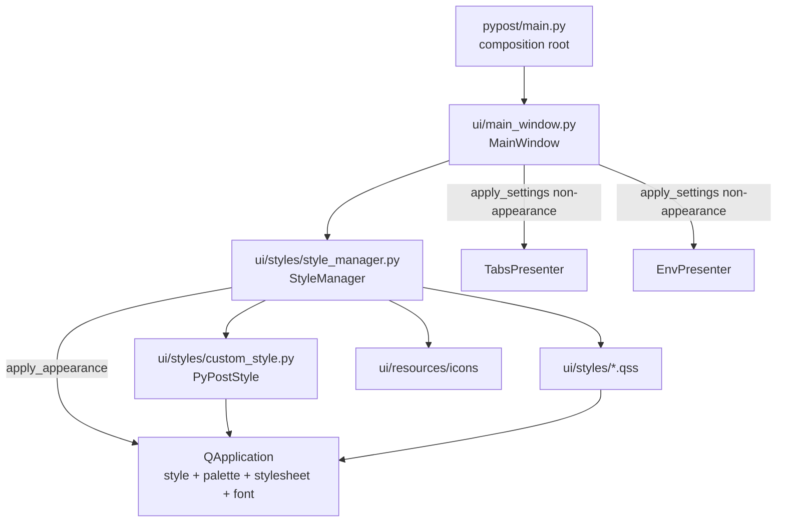

# PYPOST-793: Consolidate PyPostStyle bootstrapping into single StyleManager entry point

## Research

### Current state (post-PYPOST-702)

PYPOST-702 removed duplicate `PyPostStyle()` installation from `pypost/main.py`
(commit `bc72d91`). The composition root no longer touches appearance:

```33:69:pypost/main.py
def main():
    logger.info("PyPost starting up")
    app = QApplication(sys.argv)
    app.setApplicationName("PyPost")
    # ... ConfigManager, MetricsManager, AlertManager ...
    window = MainWindow(
        metrics=metrics_manager,
        template_service=template_service,
        config_manager=config_manager,
        alert_manager=alert_manager,
    )
    window.show()
```

Initial appearance is applied inside `MainWindow.__init__` via `apply_settings`, and again
on first `showEvent` (Qt post-show polish workaround):

```69:111:pypost/ui/main_window.py
        self.style_manager = StyleManager()
        # ...
        self.apply_settings(self.settings)
```

```313:327:pypost/ui/main_window.py
    def apply_settings(self, settings: AppSettings) -> None:
        self.settings = settings
        logger.debug("apply_settings_start font_size=%d", settings.font_size)
        app = QApplication.instance()
        if app:
            self.style_manager.apply_theme(app, settings.theme)
            self.style_manager.apply_styles(app, font_size=settings.font_size)
            font = app.font()
            font.setPointSize(settings.font_size)
            app.setFont(font)
            logger.debug(
                "apply_settings_font_applied point_size=%d", app.font().pointSize()
            )
        self.tabs.apply_settings(settings)
        self.env.apply_settings(settings)
```

`StyleManager` exposes three independent methods but **no orchestrated pipeline**:

| Method | Responsibility |
|--------|----------------|
| `apply_theme(app, theme)` | Installs `PyPostStyle` (system) or Fusion + palette (light/dark) |
| `apply_styles(app_or_widget, font_size)` | Loads sorted `*.qss`, appends font-size rule, replaces stylesheet |
| `load_styles()` | Returns concatenated QSS (tests, internal) |

`PyPostStyle` (`custom_style.py`) is unchanged — a `QProxyStyle` that delegates native tab
metrics to the platform style unless `set_close_button_size` is called explicitly (default
`None`; PYPOST-792 policy).

### Gap vs requirements (R-P3-004)

| Aspect | Today | Required |
|--------|-------|----------|
| Who owns the **full** appearance pipeline (theme → QSS → font)? | `MainWindow.apply_settings` orchestrates three calls | `StyleManager` single entry point |
| Duplicate native styling at launch? | No (PYPOST-702 fixed) | Still required — no regression |
| Settings save refresh | Same three-step sequence in `apply_settings` | Same outcomes via consolidated entry point |
| Developer docs | `doc/dev/ui_font_and_styles.md` still claims `main.py` installs `PyPostStyle()` | Accurate pipeline description (Step 7) |

The remaining debt is **orchestration ownership**, not duplicate `PyPostStyle` calls.
`MainWindow` still encodes call order and font application — knowledge that belongs in style
management per PYPOST-792 tech-debt follow-up and audit finding R-P3-004.

### Call-order invariant (PYPOST-404)

Qt re-polish from `setStyleSheet()` resets the application font if `setFont` ran earlier.
The consolidated entry point **must preserve**:

1. `apply_theme` — style + palette
2. `apply_styles` — global QSS (+ font-size rule)
3. `app.setFont` — default application font point size

This order is non-negotiable for behavioral parity.

### Option analysis

| Option | Description | Verdict |
|--------|-------------|---------|
| **A — `StyleManager.apply_appearance`** | New method encapsulates theme + styles + font; `MainWindow` delegates | **Selected** — minimal diff, clear ownership, same call sites |
| **B — Bootstrap from `main.py`** | Composition root calls appearance before `MainWindow` | Rejected — broader startup wiring out of scope; settings already loaded in `MainWindow` via `StateManager` |
| **C — Move font logic into `apply_styles`** | Merge `setFont` into stylesheet method | Rejected — blurs QSS vs font responsibilities; harder to test independently |
| **D — Inject `StyleManager` at composition root** | `main.py` creates and passes `StyleManager` | Rejected — requirements exclude broader manager injection refactors |

### External references

- [Qt QApplication::setStyle](https://doc.qt.io/qt-6/qapplication.html#setStyle) — application-wide style
- [Qt Style Sheets](https://doc.qt.io/qt-6/stylesheet.html) — `setStyleSheet` triggers re-polish
- [QProxyStyle](https://doc.qt.io/qt-6/qproxystyle.html) — platform-native metrics via delegation
- Prior art: `ai-tasks/PYPOST-404/20-architecture.md` (call-order fix),
  `ai-tasks/PYPOST-792/60-tech-debt.md` (duplication follow-up → PYPOST-793)

## Implementation Plan

High-level steps for Step 3 (development):

1. **Add consolidated entry point on `StyleManager`**
   - New method `apply_appearance(app, *, theme: str, font_size: int) -> None`.
   - Internally: `apply_theme` → `apply_styles(font_size=...)` → read `app.font()`, set point
     size, `app.setFont(font)`.
   - Move appearance-related DEBUG logging from `MainWindow.apply_settings` into
     `apply_appearance` (preserve log intent; no new observability scope in Step 3 unless
     Step 5 requires it).
   - Docstring documents call-order contract and that this is the **only** production path for
     full application appearance.

2. **Simplify `MainWindow.apply_settings`**
   - Replace the three appearance calls with one `self.style_manager.apply_appearance(...)`.
   - Keep non-appearance delegation: `self.tabs.apply_settings`, `self.env.apply_settings`.
   - `showEvent` timer reapply unchanged — still calls `apply_settings`.

3. **Leave unchanged**
   - `pypost/main.py` — no appearance calls (already clean after PYPOST-702).
   - `PyPostStyle` / `custom_style.py` — no changes.
   - Low-level `apply_theme`, `apply_styles`, `load_styles` — remain public for unit tests.

4. **Tests**
   - Add `tests/test_style_manager_appearance.py` (or extend existing style-manager tests)
     covering full pipeline order and font survival after stylesheet.
   - Update `tests/test_apply_settings_font.py` to mock/assert `apply_appearance` instead of
     individual `apply_theme` / `apply_styles` where appropriate.
   - Run full `make check`.

5. **Documentation (Step 7 if not needed for acceptance)**
   - Fix `doc/dev/ui_font_and_styles.md`: remove stale `main.py` `PyPostStyle` claim; document
     `StyleManager.apply_appearance` as the authoritative pipeline.

## Architecture

### Target module diagram



### Startup and settings refresh flow

```text
Application start:
  main() → QApplication → MainWindow.__init__
    → StyleManager()
    → apply_settings(settings)
      → style_manager.apply_appearance(app, theme, font_size)   ← authoritative
      → tabs.apply_settings / env.apply_settings

First show (unchanged):
  showEvent → QTimer.singleShot(0) → apply_settings(same path)

Settings save (unchanged caller):
  open_settings → save_config → apply_settings(same path)
```

### Modules and responsibilities

| Module | Layer | Responsibility after change |
|--------|-------|----------------------------|
| `pypost/ui/styles/style_manager.py` | UI | **Owns full appearance pipeline** via `apply_appearance`; theme, QSS, font-size rule, default font |
| `pypost/ui/styles/custom_style.py` | UI | `PyPostStyle` proxy — native tab metrics; unchanged |
| `pypost/ui/styles/*.qss` | UI | Declarative global stylesheet assets; unchanged |
| `pypost/ui/main_window.py` | UI | Delegates appearance to `StyleManager.apply_appearance`; orchestrates presenter settings only |
| `pypost/main.py` | Entry | Composition root — **no appearance setup** |

### Selected patterns and justification

| Pattern | Application | Justification |
|---------|-------------|---------------|
| **Facade / single entry point** | `StyleManager.apply_appearance` | One place for pipeline order and policy; closes R-P3-004 ownership gap |
| **Proxy (`QProxyStyle`)** | `PyPostStyle` | Preserved — platform-native tab chrome (PYPOST-792) |
| **Composition** | `MainWindow` owns `StyleManager` instance | Existing pattern; no composition-root injection refactor |
| **Replace-not-accumulate QSS** | `apply_styles` | Unchanged — prevents duplicate rules on settings reload |

### Main interfaces / APIs

#### New — `StyleManager.apply_appearance`

```python
def apply_appearance(
    self,
    app: QApplication,
    *,
    theme: str,
    font_size: int,
) -> None:
    """Apply full application appearance from persisted settings.

    Order: theme (style + palette) → global QSS (+ font-size rule) → app default font.
    Production callers must use this method; do not reimplement the sequence elsewhere.
    """
```

#### Unchanged — building blocks (retained for tests and internal use)

- `StyleManager.apply_theme(app, theme: str = "system") -> None`
- `StyleManager.apply_styles(app_or_widget, font_size: int | None = None) -> None`
- `StyleManager.load_styles() -> str`
- `PyPostStyle.set_close_button_size(size: int) -> None` — opt-in; no production caller

#### Changed — `MainWindow.apply_settings`

```python
def apply_settings(self, settings: AppSettings) -> None:
    self.settings = settings
    app = QApplication.instance()
    if app:
        self.style_manager.apply_appearance(
            app,
            theme=settings.theme,
            font_size=settings.font_size,
        )
    self.tabs.apply_settings(settings)
    self.env.apply_settings(settings)
```

### Affected files (Step 3)

| File | Change |
|------|--------|
| `pypost/ui/styles/style_manager.py` | Add `apply_appearance`; optional log relocation |
| `pypost/ui/main_window.py` | Delegate appearance; remove inline pipeline |
| `tests/test_style_manager_appearance.py` | **New** — pipeline integration tests |
| `tests/test_apply_settings_font.py` | Update mocks/assertions for `apply_appearance` |
| `doc/dev/ui_font_and_styles.md` | Step 7 — document new entry point; remove stale `main.py` note |

### Test plan notes

| Test area | Action | Parity check |
|-----------|--------|--------------|
| `StyleManager.apply_appearance` | New tests: theme applied, QSS contains font rule, `app.font().pointSize()` correct after full pipeline | Call order matches PYPOST-404 fix |
| `test_apply_settings_font.py` | Mock `apply_appearance` or patch internals; assert `MainWindow` delegates with correct `theme`/`font_size` | Existing T-1..T-3 font assertions unchanged |
| `test_style_manager_theme.py` | No change — low-level `apply_theme` still tested | system/light/dark/invalid fallback |
| `test_style_manager_font.py` | No change — low-level `apply_styles` still tested | font-size rule, tooltip QSS |
| `test_tab_layout_regression.py` | No change unless pipeline wiring breaks QSS load path | macOS tab layout / close-indicator policy |
| Full suite | `make check` | All existing assertions pass without weakening |

Manual regression (Step 3 verification): first launch and Settings save with `system`,
`light`, and `dark` themes; confirm macOS native tab chrome unchanged.

### Risks and mitigations

| Risk | Likelihood | Mitigation |
|------|------------|------------|
| Call-order regression (font reset) | Low if `apply_appearance` copies exact sequence | Dedicated test: font survives `setStyleSheet` |
| Tests mock old method names | Medium | Update `test_apply_settings_font` in same PR |
| Doc drift persists | Low | Step 7 updates `ui_font_and_styles.md` |

## Q&A

- **Q**: Why not call `apply_appearance` from `main.py` at startup?
- **A**: Requirements exclude broader composition-root refactors. Settings for appearance come
  from `StateManager` inside `MainWindow`. Centralizing **ownership** in `StyleManager` satisfies
  R-P3-004 without moving settings loading.

- **Q**: Does this change user-visible behavior?
- **A**: No. Same operations in the same order; only the owning module moves.

- **Q**: Why keep `apply_theme` / `apply_styles` public?
- **A**: Existing unit tests and fine-grained coverage remain valuable; `apply_appearance`
  composes them without removing the building blocks.

- **Q**: What about `showEvent` double-apply?
- **A**: Unchanged. Still calls `apply_settings`, which delegates to `apply_appearance` — same
  pipeline, same outcomes.

- **Q**: Is `main.py` duplicate `PyPostStyle` still a problem?
- **A**: No — PYPOST-702 removed it. Stale documentation is corrected in Step 7; the code gap
  is orchestration in `MainWindow`, not duplicate style installation.
