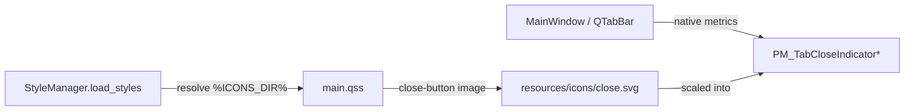

# PYPOST-796: Improve close.svg contrast on dark tab chrome

## Research

### Current wiring (unchanged by this task)

Tab close icons are referenced from `pypost/ui/styles/main.qss`:

```12:18:pypost/ui/styles/main.qss
QTabBar::close-button {
    image: url(%ICONS_DIR%/close.svg);
}

QTabBar::close-button:hover {
    image: url(%ICONS_DIR%/close-hover.svg);
}
```

`StyleManager.load_styles()` resolves `%ICONS_DIR%` to `pypost/ui/resources/icons/`. Qt scales the
48×48 SVG into the rectangle from `PM_TabCloseIndicatorWidth` / `PM_TabCloseIndicatorHeight` (native
metrics via `PyPostStyle` — PYPOST-792).

### Asset state

| File | Stroke | Background | Notes |
| --- | --- | --- | --- |
| `close.svg` | `#666666` | none | Low contrast on dark tab chrome (problem) |
| `close-hover.svg` | `#333333` | `#E0E0E0` pill | Clearly visible (no change) |

### Contrast analysis (approximate)

Against typical dark native tab chrome (~`#333333`–`#3D3D3D`):

| Stroke | Contrast vs dark chrome | vs light chrome (~`#F0F0F0`) |
| --- | --- | --- |
| `#666666` (current) | ~3.1:1 — marginal / fails for small UI | ~5.7:1 — good |
| `#999999` (proposed) | ~5.0:1 — improved | ~2.8:1 — acceptable for small control |
| `#888888` (alternative) | ~4.5:1 | ~3.3:1 — more balanced |

**Decision:** Use `#999999` for default stroke — prioritizes the reported dark-mode defect while
keeping the icon recognizable on light chrome. Single-colour SVG cannot optimize both extremes
without theme-specific assets (out of scope).

### External references

- [WCAG 2.2 — Non-text contrast (1.4.11)](https://www.w3.org/WAI/WCAG22/Understanding/non-text-contrast.html) — 3:1 for UI components
- PYPOST-792 tab policy: `doc/dev/ui_font_and_styles.md`, `tests/test_tab_layout_regression.py`
- Prior debt note: `ai-tasks/PYPOST-792/60-tech-debt.md`

## Implementation Plan

1. **Update `close.svg`** — change both path `stroke` attributes from `#666666` to `#999999`.
   Preserve viewBox, stroke-width (3), line caps/joins, and dimensions.
2. **Leave unchanged** — `close-hover.svg`, `main.qss`, `style_manager.py`, `custom_style.py`,
   tab layout tests.
3. **Validate** — run `make check`; existing tab layout regression tests guard QSS/metrics policy.
4. **Document** (Step 7) — update `doc/dev/ui_font_and_styles.md` close-icon section and
   troubleshooting row.

No Python code changes expected unless a content assertion test is added (not required — asset-only
change with existing regression coverage).

## Architecture

### Module diagram (unchanged)



### Change surface

| Component | Change |
| --- | --- |
| `pypost/ui/resources/icons/close.svg` | Stroke `#666666` → `#999999` |
| `doc/dev/ui_font_and_styles.md` | Document default stroke colour; update troubleshooting |
| All other modules | No change |

### Risks and mitigations

| Risk | Mitigation |
| --- | --- |
| Light-tab contrast slightly reduced | `#999999` remains visible; hover unchanged; scope accepts trade-off |
| Tab layout regression | No QSS or metrics changes; existing regression tests |
| Icon looks mismatched vs hover | Hover uses pill + dark stroke — independent visual language preserved |

## Q&A

- **Q**: Why not use Qt `color`/`opacity` in QSS?
- **A**: Close-button rules use `image: url(...)` only; QSS cannot tint bundled SVG without
  replacing assets or adding code paths — out of scope.

- **Q**: Why not theme-specific icons?
- **A**: Requires runtime icon selection or duplicate QSS — disproportionate for this polish task.
