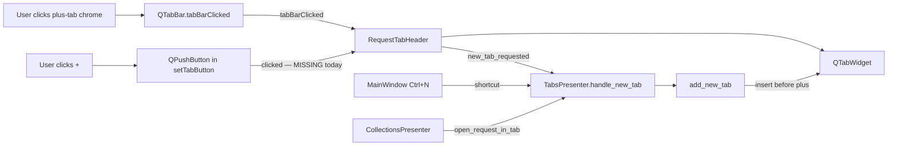

# PYPOST-797: New tab (+) button does not open a new request tab

## Research

### Symptom and scope

After PYPOST-792 restored native tab rendering on macOS, clicking the trailing **+** control
in the request tab bar does nothing. `Ctrl+N` (and collection "New tab" context menu) still
open tabs via `TabsPresenter.handle_new_tab` — only the visible **+** click path is broken.

Affected region: request tab bar only (`RequestTabHeader` + `TabsPresenter`). Sidebar tabs and
editor sub-tabs are out of scope (regression checks only).

### Code path for the + control

1. `RequestTabHeader.ensure_plus_tab()` (`pypost/ui/widgets/tab_header.py:37-49`) adds a
   trailing placeholder tab marked with `PLUS_TAB_MARKER` and embeds a 24×24 `QPushButton("+")`
   via `QTabBar.setTabButton(index, LeftSide, plus_btn)`.
2. `RequestTabHeader._on_tab_bar_clicked()` (`tab_header.py:75-77`) listens to
   `QTabBar.tabBarClicked` and emits `new_tab_requested` when the plus index is clicked.
3. `TabsPresenter.__init__` (`pypost/ui/presenters/tabs_presenter.py:140-142`) connects
   `new_tab_requested` → `handle_new_tab("plus_button")` → `add_new_tab()`.

Keyboard shortcut path (unaffected):

```text
MainWindow hotkey Ctrl+N → TabsPresenter.handle_new_tab("shortcut") → add_new_tab()
```

### Root cause (verified)

**RC — `QPushButton` click is not wired; only `tabBarClicked` is.**

The `+` control is a real `QPushButton` child widget placed on the tab via `setTabButton`.
Per Qt semantics, `tabBarClicked` fires when the user clicks the **tab chrome** at an index —
not when they click an embedded tab-button widget. The `QPushButton` consumes mouse events;
its `clicked` signal is never connected to `new_tab_requested`.

Reproduction (offscreen, current code):

| Action | `new_tab_requested` emitted? |
| --- | --- |
| `tabBarClicked.emit(plus_idx)` (what tests do) | Yes |
| `QTest.mouseClick(plus_btn)` on the actual widget | **No** |

Users click the visible **+** button; the handler listens to the wrong signal. Existing tests
in `tests/test_tab_header.py` and `tests/test_tabs_presenter.py` synthesize
`tabBarClicked.emit(...)`, so they pass while the real click path is untested — a coverage gap
introduced when PYPOST-293/PYPOST-302 moved the control to `setTabButton` layout.

### Why PYPOST-792 surfaced the defect

PYPOST-792 fixed styling only (`main.qss` zero-padding rule, `PyPostStyle` close-indicator
metric). It did not change `tab_header.py` or presenter wiring. The functional regression is a
**latent interaction bug** exposed when native tab chrome was restored:

- Before RC1, the plus placeholder tab collapsed to bare button geometry with no tab padding.
  Clicks on or near **+** were more likely to hit tab-bar chrome and fire `tabBarClicked`.
- After RC1, native tab segments restore proper layout; the embedded `QPushButton` is the
  dominant, correctly hit-tested click target. Users now click the button widget exclusively,
  which has no handler.

The defect is platform-agnostic in code (confirmed offscreen) but was reported on macOS because
PYPOST-792 targeted macOS layout and users re-tested the tab bar there first.

### External references

- [Qt `QTabBar::setTabButton`](https://doc.qt.io/qt-6/qtabbar.html#setTabButton) — embeds a
  widget on a tab; the widget is interactive independently of `tabBarClicked`.
- [Qt `QTabBar::tabBarClicked`](https://doc.qt.io/qt-6/qtabbar.html#tabBarClicked) — emitted
  when the user clicks a tab at an index, not when clicking an embedded tab-button widget.
- [Qt setTabButton troubleshooting](https://runebook.dev/en/docs/qt/qtabbar/setTabButton) —
  custom tab buttons require explicit `clicked` → slot wiring.

## Implementation Plan

Single focused iteration for Step 3:

1. **Wire the + button `clicked` signal** in `RequestTabHeader.ensure_plus_tab()`:
   - Connect `plus_btn.clicked` to emit `new_tab_requested` (reuse `_on_tab_bar_clicked`
     logic or a small dedicated slot).
   - Keep the existing `tabBarClicked` handler as a fallback for clicks on plus-tab chrome
     outside the button (belt-and-suspenders; no behavior change for that path).
2. **Fix test coverage gap** — update plus-tab click tests to click the real widget:
   - `tests/test_tab_header.py::test_plus_tab_click_emits_new_tab_requested` — use
     `QTest.mouseClick` on `tabButton(plus_idx, LeftSide)` instead of
     `tabBarClicked.emit`.
   - `tests/test_tabs_presenter.py::test_plus_tab_click_adds_request_tab` — same pattern.
3. **Quality gate** — `make check`; manual macOS verification per Jira reproduction steps.
4. **Docs** — update `doc/dev/request_actions.md` troubleshooting ("Ctrl+N works but + click
   does nothing") to mention `plus_btn.clicked` wiring.

Out of scope: tab-bar redesign, changing new-tab payload, reverting PYPOST-792 styling.

## Architecture

### Module diagram



### Modules and responsibilities

| Module | Responsibility | Change |
| --- | --- | --- |
| `pypost/ui/widgets/tab_header.py` (`RequestTabHeader`) | Tab-bar chrome: plus placeholder, close setup, label helpers, **+ click wiring** | Connect `plus_btn.clicked` → `new_tab_requested` |
| `pypost/ui/presenters/tabs_presenter.py` (`TabsPresenter`) | Request tab lifecycle; `handle_new_tab` / `add_new_tab` orchestration | No change expected |
| `pypost/ui/main_window.py` | Hotkeys (`Ctrl+N`), presenter composition | No change |
| `pypost/ui/styles/*`, `style_manager.py` | Tab rendering (PYPOST-792) | No change — layout preserved |
| `tests/test_tab_header.py`, `tests/test_tabs_presenter.py` | Plus-tab behavior regression | Click real button widget, not synthetic signal |

### Interaction scheme (after fix)

1. User clicks the visible **+** `QPushButton`.
2. `QPushButton.clicked` fires → `RequestTabHeader` emits `new_tab_requested`.
3. `TabsPresenter.handle_new_tab("plus_button")` logs, increments
   `gui_new_tab_actions_total{source="plus_button"}`, calls `add_new_tab()`.
4. `add_new_tab` inserts a `RequestTab` before the plus placeholder, selects it, optionally
   persists tab state. Plus tab remains last (`ensure_plus_tab` idempotent guard).

Secondary path (unchanged): click on plus-tab chrome outside the button → `tabBarClicked` →
same `new_tab_requested` emission.

### Patterns and justification

- **Single entry handler** (existing) — all new-tab sources converge on
  `TabsPresenter.handle_new_tab(source)`; the fix only completes the missing mouse path into
  `RequestTabHeader`.
- **Qt tab-button pattern** — `setTabButton` widgets must wire their own signals (same pattern
  as custom close buttons in Qt docs). `tabBarClicked` alone is insufficient when an
  interactive child widget is present.
- **Composition** (existing) — `RequestTabHeader` owns tab-bar mechanics; presenter owns tab
  content. Click wiring stays in the header; no presenter changes.
- **Minimal diff** — one `connect()` in `ensure_plus_tab`, test updates, doc tweak. No styling
  rollback, no API surface change.

### Main interfaces

| Interface | Contract |
| --- | --- |
| `RequestTabHeader.new_tab_requested` | Emitted on **+** click (button `clicked` primary; `tabBarClicked` fallback) |
| `TabsPresenter.handle_new_tab(source: str)` | Unchanged; `source="plus_button"` for + path |
| `TabsPresenter.add_new_tab(request_data=None, save_state=True)` | Unchanged; inserts before plus index |
| `RequestTabHeader.ensure_plus_tab()` | Idempotent; creates placeholder + wires button click |
| `PLUS_TAB_MARKER` | Unchanged marker in `QTabBar.tabData` |

No new public APIs. No model, persistence, or metrics schema changes.

## Q&A

- **Q**: Why not remove the `QPushButton` and rely on `tabBarClicked` only?
- **A**: Requirements preserve PYPOST-792 visual layout (dedicated **+** control, 24×24
  button in `LeftSide` slot). Removing the button would change appearance. Wiring `clicked`
  is the Qt-correct minimal fix.

- **Q**: Why did tests not catch this?
- **A**: Tests emit `tabBarClicked` synthetically, bypassing the `QPushButton` widget. Step 3
  updates them to `QTest.mouseClick` on the real button — the interaction users perform.

- **Q**: Is `Ctrl+N` affected?
- **A**: No. It routes through `MainWindow` hotkey → `handle_new_tab("shortcut")`, independent
  of `RequestTabHeader` click wiring.

- **Q**: Will double-firing occur if both `clicked` and `tabBarClicked` fire?
- **A**: Qt delivers the click to the child button, not the tab bar, when the cursor is over
  the button. Clicks on tab chrome outside the button can still use `tabBarClicked`. No
  duplicate-tab risk in normal use; if needed, a guard flag can debounce within one event loop
  tick (unlikely to be required).

- **Q**: Does this revert PYPOST-792 styling?
- **A**: No. Pure signal wiring in `tab_header.py`; `main.qss` and `PyPostStyle` untouched.

- **Q**: Should collection "New tab" be retested?
- **A**: Yes as a regression check — it uses `open_request_in_tab` → `add_new_tab`, not the +
  button path, but confirms no collateral damage.
