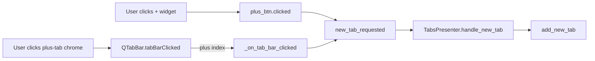

# PYPOST-798: Architecture

## Context

PYPOST-797 restored the primary plus-tab click path (`plus_btn.clicked` → `new_tab_requested`).
The fallback handler `_on_tab_bar_clicked` in `RequestTabHeader` was retained for chrome clicks
outside the embedded button but had zero test coverage.

## Click paths (unchanged production code)

## Test design

| Layer | Test | Mechanism |
| --- | --- | --- |
| Header unit | `test_plus_tab_tab_bar_clicked_emits_new_tab_requested` | `tabBarClicked.emit(plus_idx)` |
| Header unit | `test_non_plus_tab_bar_clicked_does_not_emit_new_tab` | `tabBarClicked.emit(0)` with request tab present |
| Presenter unit | `test_plus_tab_tab_bar_clicked_adds_request_tab` | `tabBarClicked.emit(plus_idx)` via presenter widget tab bar |

No new abstractions or mocks required. Tests mirror existing plus-tab test setup
(`_make_header`, `_make_presenter`, `_plus_tab_index`).

## Files touched

- `tests/test_tab_header.py` — two new tests
- `tests/test_tabs_presenter.py` — one new test
- `doc/dev/request_actions.md` — Testing section (Step 7)
