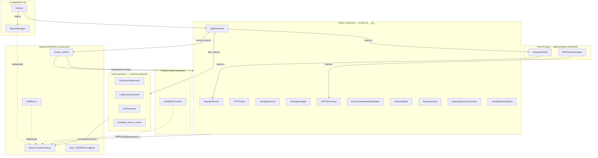

# PYPOST-799: Close optional-metrics guard debt (PYPOST-44 TD-2)

## Research

| Source | Finding |
| --- | --- |
| `pypost/core/metrics_protocol.py` | `MetricsTrackerProtocol`, `NullMetrics`, `NULL_METRICS`, `resolve_metrics()` — delivered in PYPOST-73/74 |
| Repo grep `if self._metrics` in `pypost/` | **0 matches** — optional-injection guards removed |
| Repo grep `resolve_metrics` in `pypost/` | 11 consumers normalize at construction or mixin wiring |
| `tests/test_metrics_protocol.py` | Protocol satisfaction, no-op smoke, resolve helper covered |
| [Python typing — Protocols](https://typing.python.org/en/latest/reference/protocols.html) | Structural subtyping (`@runtime_checkable`) fits duck-typed trackers without ABC inheritance |
| [DI + Protocol pattern](https://mufraggi.eu/articles/building-robust-python-projects-mastering-dependency-injection/) | Constructor injection against a protocol decouples consumers from concrete `MetricsManager` |
| [Null Object for optional telemetry](https://github.com/seanbrar/nullscope) | Industry pattern: inject a no-op implementation when observability is disabled |

**Naming note:** Jira summary references `MetricsProtocol`; the shipped contract is
`MetricsTrackerProtocol` (PYPOST-73). Renaming is out of scope per requirements unless it blocks
closure ([PYPOST-675](https://pypost.atlassian.net/browse/PYPOST-675) tracks type-hint polish).

## Implementation Plan

Verification-first closure — no architectural redesign expected.

1. **Confirm protocol module** — `MetricsTrackerProtocol` defines all `track_*` / `set_mcp_server_up`
   methods; `NullMetrics` implements each as a no-op; `resolve_metrics(None)` returns `NULL_METRICS`.
2. **Audit consumers** — every direct tracking consumer either:
   - calls `resolve_metrics(metrics)` in `__init__` / mixin wiring, or
   - receives an already-resolved `MetricsTrackerProtocol` from an upstream normalizer.
3. **Audit call sites** — grep for `if self._metrics` and other optional-injection guards; remediate
   any stragglers (none found in current tree).
4. **Regression tests** — run `tests/test_metrics_protocol.py` and `make test`; confirm no user-visible
   behavior change when metrics is omitted vs configured.
5. **Close debt** — mark PYPOST-44 TD-2 resolved in `60-tech-debt.md` and consolidated debt index;
   link typing/adapter follow-ups without blocking closure.

## Architecture

### System module diagram



### Module responsibilities

| Module | Responsibility |
| --- | --- |
| `metrics_protocol.py` | Tracking contract (`MetricsTrackerProtocol`), no-op default (`NullMetrics` / `NULL_METRICS`), single normalization helper (`resolve_metrics`) |
| `qt/metrics.py` (`MetricsManager`) | Production tracker: Prometheus counters + Qt lifecycle signals; satisfies protocol structurally |
| `metrics_otel.py` (`OtelMetricsTracker`) | Alternate production backend (PYPOST-579); same protocol surface |
| Direct consumers | Accept `MetricsTrackerProtocol \| None`, store `resolve_metrics(metrics)`, call `track_*` without null guards |
| Leaf presenters / helpers | Accept non-optional `MetricsTrackerProtocol` from upstream that already resolved |
| Pass-through wrappers | Forward optional `metrics` to a downstream consumer that resolves (e.g. `RequestWorker` → `RequestService`) |
| `main.py` | Composition root: creates `MetricsManager`, injects into `MainWindow` and service graph |

### Module interaction scheme

1. **Optional at root** — `main.py` may inject `MetricsManager` or callers may omit metrics; startup
   is unaffected.
2. **Normalize once** — each consumer boundary that owns `_metrics` calls `resolve_metrics()` exactly
   once; downstream code always holds a concrete tracker.
3. **Direct recording** — business code calls `self._metrics.track_*()` unconditionally; domain
   guards (e.g. hidden-key count, cancelled rename) remain — only optional-injection guards are gone.
4. **Silent omission** — when `None` is passed, `NULL_METRICS` absorbs all calls with no side effects.
5. **Preserved output** — when a real tracker is injected, counters and events flow through unchanged.

### Architectural patterns

| Pattern | Application | Justification |
| --- | --- | --- |
| **Protocol (structural typing)** | `MetricsTrackerProtocol` | Duck typing + mypy checks without forcing inheritance; `@runtime_checkable` enables `isinstance` in tests |
| **Null Object** | `NullMetrics` / `NULL_METRICS` | Eliminates `if metrics:` at call sites; preserves silent omission semantics |
| **Constructor injection** | All consumers | Explicit wiring from composition root; test doubles via `MagicMock(spec=...)` |
| **Single normalization point** | `resolve_metrics()` | One function converts `None` → shared singleton; avoids mutable-default pitfalls |
| **Facade** | `MetricsManager` | Bundles registry + server lifecycle at root; consumers depend only on tracking protocol |

### Main interfaces / APIs

```python
# pypost/core/metrics_protocol.py

@runtime_checkable
class MetricsTrackerProtocol(Protocol):
    def track_request_sent(self, method: str) -> None: ...
    def track_response_received(self, method: str, status_code: str) -> None: ...
    # ... all track_* / set_mcp_server_up methods

class NullMetrics:
    """No-op tracker — implements every protocol method."""

NULL_METRICS: MetricsTrackerProtocol = NullMetrics()

def resolve_metrics(metrics: MetricsTrackerProtocol | None) -> MetricsTrackerProtocol:
    return metrics if metrics is not None else NULL_METRICS
```

**Consumer contract (direct owner):**

```python
def __init__(self, metrics: MetricsTrackerProtocol | None = None) -> None:
    self._metrics = resolve_metrics(metrics)

def some_method(self) -> None:
    self._metrics.track_request_sent(method)  # no if self._metrics guard
```

**Consumer contract (leaf / upstream-resolved):**

```python
def __init__(self, metrics: MetricsTrackerProtocol) -> None:
    self._metrics = metrics  # already resolved by TabsPresenter / MainWindow
```

### Type boundaries

| Layer | Parameter type | Stored type | Default when omitted |
| --- | --- | --- | --- |
| Composition root | `MetricsManager` | N/A | real facade from `main.py` |
| Direct consumer `__init__` | `MetricsTrackerProtocol \| None` | `MetricsTrackerProtocol` | `NULL_METRICS` via `resolve_metrics` |
| Leaf presenter / render helper | `MetricsTrackerProtocol` | `MetricsTrackerProtocol` | upstream must resolve |
| Tests | `MagicMock(spec=MetricsTrackerProtocol)` or real instance | explicit | no global patching |

### Verification checklist (Step 3)

| Check | Expected result | Current status |
| --- | --- | --- |
| `rg 'if self\._metrics' pypost/` | 0 matches | Pass |
| All `_metrics` owners use `resolve_metrics` or receive resolved tracker | Consistent pattern | Pass (11 resolve sites + leaf presenters) |
| `tests/test_metrics_protocol.py` | Green | Pass (existing coverage) |
| `make test` | Full suite green | To run in Step 3 |
| User-visible behavior when metrics omitted | Unchanged | To confirm in Step 3 |

### Out-of-scope follow-ups (do not block closure)

| Ticket | Item |
| --- | --- |
| [PYPOST-675](https://pypost.atlassian.net/browse/PYPOST-675) | Narrow constructor hints from `\| None` to required `MetricsTrackerProtocol` |
| [PYPOST-579](https://pypost.atlassian.net/browse/PYPOST-579) | OpenTelemetry adapter (already implements protocol) |
| [PYPOST-75](https://pypost.atlassian.net/browse/PYPOST-75) | MetricsManager facade split (registry vs server) |

## Q&A

| Question | Answer |
| --- | --- |
| Is new code required? | Unlikely — PYPOST-73/74 delivered the architecture; Step 3 verifies and closes any gap. |
| Why `MetricsTrackerProtocol` not `MetricsProtocol`? | Shipped name from PYPOST-73; business need is the stable recording contract, not rename ([10-requirements.md](10-requirements.md)). |
| Where does normalization happen? | `resolve_metrics()` at consumer `__init__` or mixin `set_metrics`; pass-through wrappers delegate to resolving downstream. |
| Do business-condition guards stay? | Yes — only optional-injection `if self._metrics` guards are in scope for removal. |
| What proves TD-2 is closed? | Zero optional-injection guards, direct `track_*` calls, tests green, debt artifact updated. |
