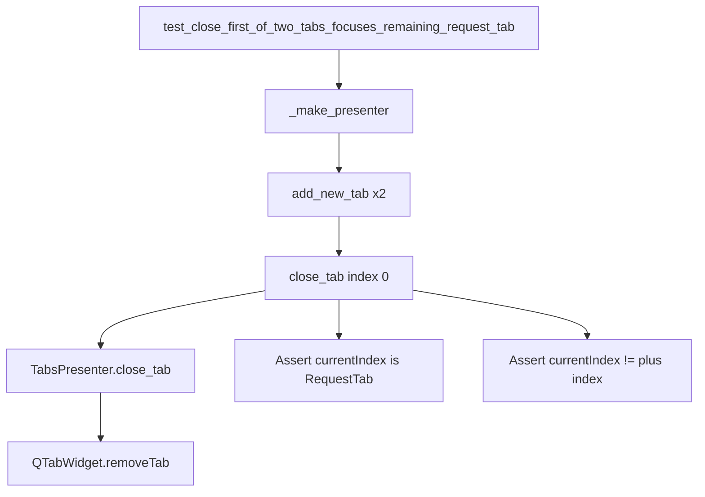

# PYPOST-818: Architecture — close-tab focus regression test

## Research

- `TabsPresenter.close_tab` removes a request tab via `QTabWidget.removeTab` and ignores
  close on the plus index (`RequestTabHeader.is_plus_tab_index`).
- Navigable cycling (`handle_next_tab` / `handle_previous_tab`) already excludes the plus tab
  via `navigable_tab_indices()`, but close does not explicitly re-select a request tab.
- Existing close/cycle coverage in `tests/test_tabs_presenter.py` asserts tab counts and cycle
  indices (e.g. `test_handle_close_tab_closes_current`, `test_handle_next_tab_cycles`) but does
  not assert that after closing the first of two request tabs the current index is a
  `RequestTab` and not `PLUS_TAB_MARKER`.
- Qt `removeTab` typically leaves an adjacent page selected; the plus tab must never become
  current when a request tab remains.

## Implementation Plan

1. Add one presenter unit test in `tests/test_tabs_presenter.py`.
2. Reuse `_make_presenter`, `_plus_tab_index`, `_request_tab_count`, and `close_tab`.
3. Scenario: two `add_new_tab()` calls → `close_tab(0)` → assert one request tab remains,
   `currentIndex` is not the plus index, and `widget(current)` is a `RequestTab`.
4. Run targeted pytest, then `make test` (or equivalent suite entry).
5. Touch production code only if the assertion fails.

## Architecture

No new modules or APIs. Test-only guard on existing presenter close path.

| Layer | Responsibility |
| --- | --- |
| `TabsPresenter.close_tab` | Remove request tab; ignore plus; ensure ≥1 request tab |
| `RequestTabHeader` | Plus marker / `is_plus_tab_index` |
| Test helpers | `_make_presenter`, `_plus_tab_index`, `_request_tab_count` |

## Q&A

| Question | Answer |
| --- | --- |
| Why presenter unit test, not MainWindow? | Matches existing tab close/cycle style; fast under `make test`. |
| Why close index 0 specifically? | Acceptance: first of two; that index shift is the risky case next to `+`. |
