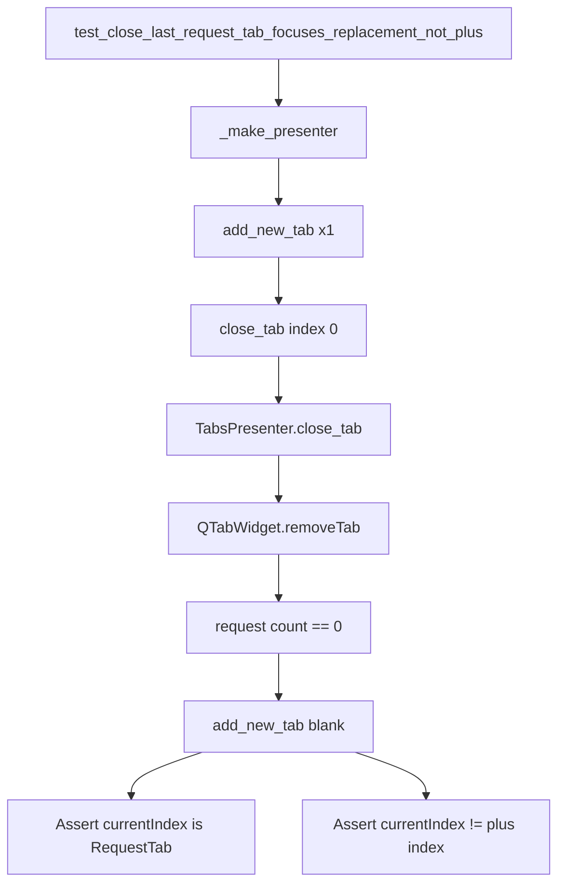

# PYPOST-819: Architecture — last-tab close focus regression test

## Research

- `TabsPresenter.close_tab` removes a request tab via `QTabWidget.removeTab`, ignores close on
  the plus index (`RequestTabHeader.is_plus_tab_index`), and when
  `_request_tab_count() == 0` calls `add_new_tab(save_state=False)`.
- `add_new_tab` inserts a blank `RequestTab` before the plus placeholder and calls
  `setCurrentWidget(tab)`, so focus moves to the replacement request tab — not the `+`.
- Existing coverage:
  - `test_close_tab_ensures_at_least_one_tab` asserts count stays 1 after closing the only tab,
    but does **not** assert focus is off the plus control.
  - `test_close_first_of_two_tabs_focuses_remaining_request_tab` (PYPOST-818) covers multi-tab
    close focus, not the last-tab replacement path.
- Product expectation to document in the test: closing the last request tab creates a
  replacement blank request tab ("New Request") and focuses it; the `+` must never be the
  sole active selection without a request workspace.

## Implementation Plan

1. Add one presenter unit test in `tests/test_tabs_presenter.py`.
2. Reuse `_make_presenter`, `_plus_tab_index`, `_request_tab_count`, and `close_tab`.
3. Scenario: one `add_new_tab()` → `close_tab(0)` → assert one request tab remains,
   `currentIndex` is not the plus index, `widget(current)` is a `RequestTab`, and tab text is
   the blank replacement ("New Request").
4. Run targeted pytest, then `make test`.
5. Touch production code only if the assertion fails.
6. Update `doc/dev/request_actions.md` Testing table if appropriate.

## Architecture

No new modules or APIs. Test-only guard on existing presenter last-tab close path.

| Layer | Responsibility |
| --- | --- |
| `TabsPresenter.close_tab` | Remove request tab; if none remain, `add_new_tab` |
| `TabsPresenter.add_new_tab` | Insert blank request tab; `setCurrentWidget` |
| `RequestTabHeader` | Plus marker / `is_plus_tab_index` |
| Test helpers | `_make_presenter`, `_plus_tab_index`, `_request_tab_count` |

## Q&A

| Question | Answer |
| --- | --- |
| Why presenter unit test, not MainWindow? | Matches PYPOST-818 and existing tab close style; fast under `make test`. |
| Why not extend `test_close_tab_ensures_at_least_one_tab`? | Keep a dedicated focus/regression test with product-expectation docstring (acceptance). |
| Production change expected? | No — verify replacement via `add_new_tab` already works. |
