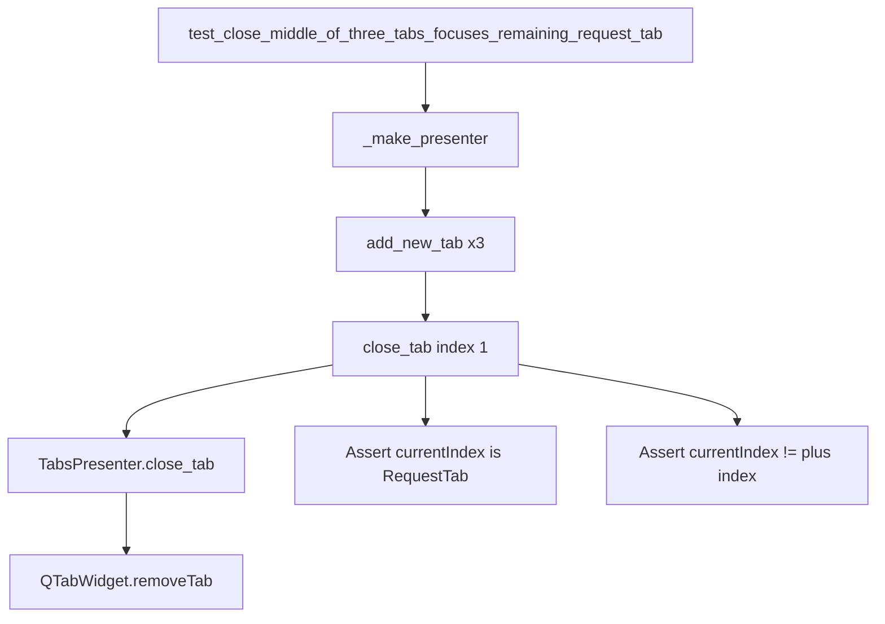

# PYPOST-820: Architecture — middle-tab close focus regression test

## Research

- `TabsPresenter.close_tab` removes a request tab via `QTabWidget.removeTab` and ignores
  close on the plus index (`RequestTabHeader.is_plus_tab_index`).
- PYPOST-818 added `test_close_first_of_two_tabs_focuses_remaining_request_tab` for closing
  index 0 of two request tabs.
- PYPOST-819 covers closing the last remaining request tab (blank replacement, not `+`).
- Closing the middle of three request tabs (indices 0, 1, 2 + trailing `+`) is a distinct
  index-shift case: after `removeTab(1)`, current selection must remain a `RequestTab`, not
  `PLUS_TAB_MARKER`.
- Qt `removeTab` typically leaves an adjacent page selected; the plus tab must never become
  current when a request tab remains.

## Implementation Plan

1. Add one presenter unit test in `tests/test_tabs_presenter.py`.
2. Reuse `_make_presenter`, `_plus_tab_index`, `_request_tab_count`, and `close_tab`.
3. Scenario: three `add_new_tab()` calls → `close_tab(1)` → assert two request tabs remain,
   `currentIndex` is not the plus index, and `widget(current)` is a `RequestTab`.
4. Run targeted pytest, then `make test` (or equivalent suite entry).
5. Touch production code only if the assertion fails.

## Architecture

No new modules or APIs. Test-only guard on existing presenter close path.

| Layer | Responsibility |
| --- | --- |
| `TabsPresenter.close_tab` | Remove request tab; ignore plus; ensure ≥1 request tab |
| `RequestTabHeader` | Plus marker / `is_plus_tab_index` |
| Test helpers | `_make_presenter`, `_plus_tab_index`, `_request_tab_count` |

## Q&A

| Question | Answer |
| --- | --- |
| Why presenter unit test, not MainWindow? | Matches PYPOST-818/819 style; fast under `make test`. |
| Why close index 1 specifically? | Acceptance: middle of three; that index shift is the risky case. |
