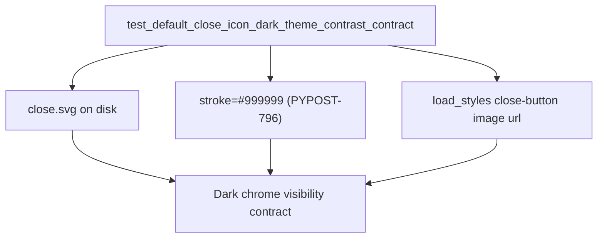

# PYPOST-821: Architecture — dark-theme tab close icon contrast smoke test

## Research

### Post-PYPOST-796 contract

| Asset | Stroke | Role |
| --- | --- | --- |
| `pypost/ui/resources/icons/close.svg` | `#999999` | Default close (dark-chrome visibility) |
| `pypost/ui/resources/icons/close-hover.svg` | `#333333` + `#E0E0E0` pill | Hover (unchanged) |

Prior state (`#666666`) was hard to see on dark native tab chrome (~`#333333`–`#3D3D3D`).
PYPOST-796 chose `#999999` (~5:1 vs typical dark chrome). Debt note in
`ai-tasks/PYPOST-796/60-tech-debt.md` explicitly left **SVG stroke colour** untested.

### Existing coverage

`tests/test_tab_layout_regression.py` already guards:

- No active `QTabBar::tab` box-model rules in shipped QSS
- Native tab spacing geometry
- Close-indicator metrics (native vs opt-in override)

It does **not** assert close.svg stroke or QSS icon path.

### Wiring

```12:17:pypost/ui/styles/main.qss
QTabBar::close-button {
    image: url(%ICONS_DIR%/close.svg);
}

QTabBar::close-button:hover {
    image: url(%ICONS_DIR%/close-hover.svg);
}
```

`StyleManager.load_styles()` replaces `%ICONS_DIR%` with the resolved icons directory.
Pixel contrast against rendered native chrome is impractical offscreen; static file + QSS
assertions match acceptance preference.

### External references

- [WCAG 2.2 non-text contrast](https://www.w3.org/WAI/WCAG22/Understanding/non-text-contrast.html)
  — design rationale for `#999999`; not computed in the smoke test
- `doc/dev/ui_font_and_styles.md` — documents default stroke and troubleshooting
- PYPOST-796 artifacts under `ai-tasks/PYPOST-796/`

## Implementation Plan

1. Extend `tests/test_tab_layout_regression.py` with one smoke test (module already has
   `pytestmark = pytest.mark.timeout(60)`).
2. Resolve icons path the same way production does (`StyleManager().icons_dir` or package
   relative path under `pypost/ui/resources/icons`).
3. Assert `close.svg` exists; both path strokes are `#999999` (not `#666666`).
4. Assert loaded QSS close-button rule still references `close.svg` (and hover
   `close-hover.svg`) after `%ICONS_DIR%` resolution.
5. Document the dark-theme contrast contract in the test docstring.
6. Update `doc/dev/ui_font_and_styles.md` to mention the automated stroke/path guard.
7. Run targeted pytest, then `make test`. No production change unless assertions fail.

## Architecture

No new modules or APIs. Test-only guard on existing asset + QSS wiring.



| Layer | Responsibility |
| --- | --- |
| `close.svg` | Shipped default close stroke colour |
| `main.qss` | Maps close-button (and hover) to icon files |
| `StyleManager` | Resolves `%ICONS_DIR%` |
| Smoke test | Locks path + stroke + QSS reference |

## Q&A

| Question | Answer |
| --- | --- |
| Why not render and measure luminance? | Offscreen CI lacks stable native dark tab chrome; acceptance prefers static asset/path. |
| Why assert QSS too? | Guards against pointing close-button at a different/low-contrast asset. |
| Why keep hover assertions light? | Hover was never the defect; optional sanity that hover still references `close-hover.svg`. |
