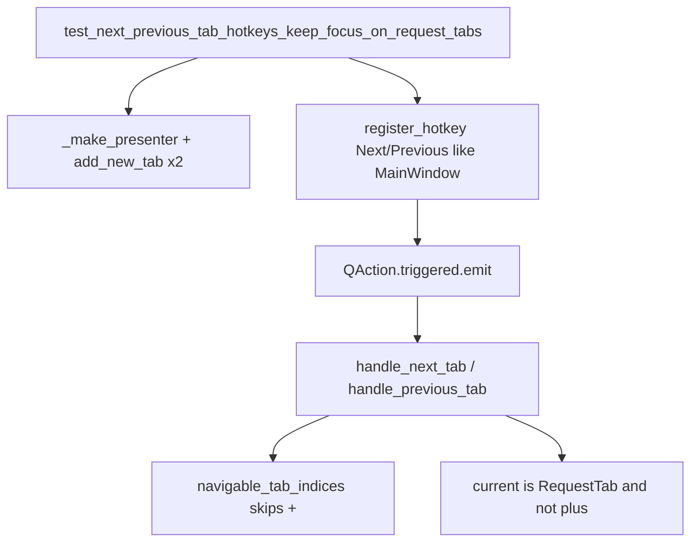

# PYPOST-822: Architecture — next/previous tab hotkey focus regression test

## Research

- Product hotkey map lives in `MainWindow._setup_shortcuts` via `register_hotkey` /
  `register_hotkey_group` (`pypost/ui/hotkeys.py`). Tabs section bindings:
  - **Next Tab**: `Ctrl+Tab` → `TabsPresenter.handle_next_tab`
  - **Previous Tab**: `Ctrl+Shift+Tab` → `TabsPresenter.handle_previous_tab`
- `handle_next_tab` / `handle_previous_tab` cycle `RequestTabHeader.navigable_tab_indices()`,
  which excludes the plus placeholder (`PLUS_TAB_MARKER`).
- Existing `test_handle_next_tab_cycles` / `test_handle_previous_tab_cycles` call slots
  directly and assert index wrap; they do not assert “not `+`” and do not exercise the
  hotkey registration path.
- PYPOST-818/819/820 added close-focus tests in `tests/test_tabs_presenter.py` asserting
  `currentIndex != plus` and `widget(current)` is `RequestTab`.
- `tests/test_hotkeys.py` covers `register_hotkey` / `collect_hotkey_rows` but not tab focus.
- GUI docs (`doc/dev/gui_testing.md`) prefer calling slots / widget APIs under offscreen Qt;
  synthetic `QShortcut` / key-event delivery is known to be unreliable on
  `QT_QPA_PLATFORM=offscreen` (no stable focus/window activation for shortcut contexts).

## Implementation Plan

1. Extend `tests/test_tabs_presenter.py` with one regression test (same helpers as siblings).
2. Open ≥2 request tabs; confirm trailing plus exists.
3. Register the product Tabs next/previous hotkeys with `register_hotkey` on a host widget,
   wiring the same slots as `MainWindow._setup_shortcuts`.
4. Assert registered actions expose the product keys (`Ctrl+Tab` / `Ctrl+Shift+Tab`).
5. Activate via `QAction.triggered.emit()` (product registration path without flaky key
   delivery). Document why key events are not used.
6. Drive next then previous; after each switch assert current index is a `RequestTab` and
   not the plus index (including wrap from last request tab).
7. Run targeted pytest, then `make test`. Production fix only if assertions fail.

## Architecture

No new modules or APIs. Test-only guard on existing hotkey map → presenter cycle path.

| Layer | Responsibility |
| --- | --- |
| `MainWindow._setup_shortcuts` | Product hotkey map (source of truth for keys/slots) |
| `register_hotkey` | Creates tagged `QAction` + connects slot |
| `TabsPresenter.handle_next_tab` / `handle_previous_tab` | Cycle navigable request tabs |
| `RequestTabHeader.navigable_tab_indices` | Exclude plus placeholder |
| Test | Register map, trigger actions, assert focus contract |

## Q&A

| Question | Answer |
| --- | --- |
| Why not `QTest.keyClick` / `QShortcut`? | Offscreen Qt often fails to deliver shortcuts without a real activated window; acceptance allows documenting and using the closest product path. |
| Why `triggered.emit`? | Still goes through `register_hotkey` wiring (action → slot), matching the product map. |
| Why presenter file, not only `test_hotkeys.py`? | Focus assertions need `TabsPresenter` + plus tab helpers already in this module. |
