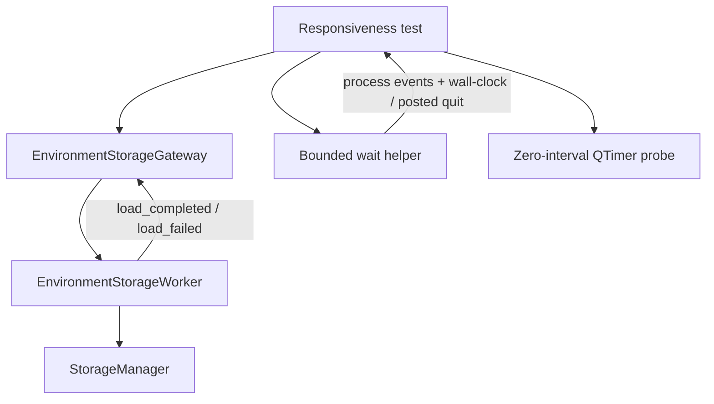

# PYPOST-823: Responsiveness check must finish during encrypted environment load

## Research

### Observed failure

- Jira: [PYPOST-823](https://pypost.atlassian.net/browse/PYPOST-823).
- Command: `make test` → `QT_QPA_PLATFORM=offscreen pytest tests/ -m "not slow"`.
- Stuck item:
  `tests/test_env_storage_responsiveness.py`
  `::test_event_loop_stays_responsive_during_encrypted_load`.
- Suite sat ~9 minutes near ~25% progress until external SIGTERM; exit code 2.
- Module mark: `pytestmark = pytest.mark.timeout(120)` — so a clean fail at 120s was
  expected, but did not stop the hang.

### Current components (from PYPOST-486)

| Piece | Path | Role |
| --- | --- | --- |
| Worker | `pypost/core/qt/environment_storage_worker.py` | Background `QThread` load/save |
| Gateway | `pypost/core/qt/environment_storage_gateway.py` | Queue + signal bridge |
| Tests | `tests/test_env_storage_responsiveness.py` | Timer fires during async ops |
| Wait helper | `_process_until` (same module) | Nested `QEventLoop` + `QTimer` |

Encrypted path (product): `EnvPresenter` → `EnvironmentStorageGateway.load_async()` →
`EnvironmentStorageWorker` → `StorageManager.load_environments()` → gateway
`load_completed` / `load_failed`.

### What the hanging test does

1. Builds a large encrypted fixture (8 envs × 40 hidden keys) via sync
   `storage.save_environments(...)`.
2. Starts a zero-interval single-shot `QTimer` as the responsiveness probe.
3. Calls `gateway.load_async()` and waits with `_process_until` until
   `load_completed` or `load_failed` (default 10 s via QTimer ticks).
4. Asserts the probe timer fired and the loaded list length matches.

Isolation check (this Step 2 session): the three module tests **pass in ~0.26 s** under
`QT_QPA_PLATFORM=offscreen`. The hang is therefore **suite-context / intermittent**, not a
deterministic encrypt/decrypt bug at fixture size 8×40.

### Root-cause hypothesis (primary)

**H1 — Nested `QEventLoop.exec()` stuck; `pytest-timeout` SIGALRM cannot cut it.**

1. `_process_until` blocks in C++ `QEventLoop.exec()` until a Python `QTimer` slot calls
   `loop.quit()` or the load signal path satisfies the predicate.
2. Local probe: a bare `QEventLoop.exec()` with **no** timers does **not** return when
   `SIGALRM` fires after 1 s — Python never runs the handler while control stays in Qt C++.
3. A loop **with** a working 10 ms `QTimer` exits on schedule (~0.5 s for a 500 ms budget).
4. Therefore: if the timeout `QTimer` fails to deliver Python callbacks (or `quit` is never
   processed) **and** `load_completed` / `load_failed` never arrive, the wait is unbounded.
5. Module `timeout(120)` uses the default **signal** method
   ([pytest-timeout](https://github.com/pytest-dev/pytest-timeout)). That matches
   `.cursor/lsr/do-testing.md` (forbid `method="thread"` for Qt event-loop tests), but
   SIGALRM alone is **not** a reliable kill switch for a stuck `exec()` without periodic
   return to Python. PYPOST-548 assumed SIGALRM interrupts nested `exec()`; that assumption
   is **wrong** for the no-callback case and explains a multi-minute stall past 120 s until
   SIGTERM.

**Why the nested loop / timers may fail only in the full suite (secondary):**

- **H2 — Load signals not delivered in the nested loop.** Commit `9cf9f24` replaced
  tight `processEvents` polling with `QEventLoop` because QThread signals were unreliable
  mid-suite; residual dispatcher/affinity pollution can still strand waits.
- **H3 — Gateway drops `QThread` without `wait()` / `deleteLater()`.**
  `_on_worker_finished` only sets `self._worker = None`; under suite churn, GC of a live
  `QThread` or unfinished native threads can disturb later signal delivery.
- **H4 — Module-local `qt_app` vs shared `qapp`.** Responsiveness tests use a module
  fixture; others use `tests/conftest.py` `qapp`. Duplicate lifecycle is a known hang class.
- **H5 — Sync fixture encrypt on the test thread.** Setup encrypt finishes quickly in
  isolation; unlikely sole cause of a 9‑minute stall, but work still runs on the UI thread
  before the async assertion.

**Out of scope as primary cause (this Step 2):** encryption policy, Fernet format, or
keyring blocking — the test forces env-key encryption via
`PYPOST_ENV_ENCRYPTION_*` and passes alone.

### External guidance used

- [pytest-timeout README](https://github.com/pytest-dev/pytest-timeout) — signal vs thread;
  signal may not interrupt native blocks; thread kills the process (avoid for Qt per project
  rules).
- [pytest-qt waitSignal](https://pytest-qt.readthedocs.io/en/latest/signals.html) —
  bounded waits for thread signals (project does not depend on pytest-qt today).
- [Qt QThread](https://doc.qt.io/qt-6/qthread.html) — queue signals to the GUI thread; do not
  touch widgets from the worker.
- Prior architecture: `ai-tasks/PYPOST-486/20-architecture.md`,
  `ai-tasks/PYPOST-548/20-architecture.md` (timeout policy; update SIGALRM/`exec` caveat).

## Implementation Plan

Preference: **restore a finishing check** with minimal product change. Touch production only
if H3 (or a real responsiveness regression) is confirmed during Step 3.

### Phase A — Make the wait time-bounded in Python (test harness)

1. Replace or harden `_process_until` so the main thread **periodically returns to Python**
   while still processing Qt events:
   - Keep nested-loop or `processEvents` pumping so QThread queued signals deliver.
   - Drive the deadline with `time.monotonic()` (wall clock), not only `elapsed += interval`
     on a QTimer.
   - From a **daemon `threading.Timer`** (or equivalent), post `loop.quit()` onto the GUI
     thread via `QTimer.singleShot(0, loop.quit)` /
     `QMetaObject.invokeMethod(..., Qt.QueuedConnection)` so a dead QTimer cannot leave
     `exec()` stuck forever.
2. On deadline: fail with an explicit message
   (`load_completed`/`load_failed` not seen; busy/pending flags; optional worker state).
3. Align the save responsiveness test and any other `_process_until` callers in this module
   (and optionally `tests/test_environment_storage_gateway.py`) with the same helper.
4. Prefer reusing `qapp` from `tests/conftest.py` instead of a second module `qt_app`.
5. Keep `pytest.mark.timeout` (signal method). Do **not** switch Qt tests to
   `method="thread"`.

### Phase B — Confirm async load still completes under suite load

1. Reproduce with full `make test` or a prefix of prior Qt modules if the hang is rare.
2. If load signals never fire: inspect gateway/worker lifecycle (H3) — after `finished`,
   `deleteLater()` the worker (and optionally `wait` with a short timeout) before clearing
   the reference; parent the worker to the gateway.
3. If product load is wrong relative to PYPOST-486: fix the smallest gateway/worker defect;
   do not change encryption policy or on-disk format.

### Phase C — Preserve business intent of the check

1. Keep asserting that a zero-interval (or short) timer fires while encrypted load runs.
2. Keep a representative encrypted fixture (current 8×40 is fine unless profiling says
   otherwise).
3. Failed load must `pytest.fail` with the error payload (already present); hang must become
   assertion/timeout failure within the non-slow suite budget (internal wait ≤ ~10 s;
   module timeout as backstop once Python runs again).

### Phase D — Verification

1. Isolation: module green.
2. Full `make test` (or targeted stress before/after heavy Qt modules): no multi-minute stall
   on this node id.
3. Negative check: force a stuck worker (or never-emit mock) and prove the wait fails in
   seconds with a clear message, without needing SIGTERM.

## Architecture

### System view (unchanged product topology)



### Wait helper contract (Step 3 target)

```text
_process_until(predicate, timeout_ms=10_000) -> None
  Preconditions: QApplication instance exists (prefer shared qapp).
  Behavior:
    - Pump Qt events so QueuedConnection signals from QThread deliver.
    - Exit when predicate() is true OR wall-clock deadline passes.
    - Guaranteed exit even if QTimer slots never run (posted quit from timer thread).
  Postcondition:
    - assert predicate() with actionable failure text, or raise before hang.
```

No change to `StorageManager` encrypt/decrypt APIs or `EnvironmentStorageWorker.run()`
crypto path unless Phase B finds a product defect.

### Modules and responsibilities

| Module | Responsibility | Change |
| --- | --- | --- |
| `tests/test_env_storage_responsiveness.py` | Assertions + bounded wait | **Yes** (primary) |
| `tests/test_environment_storage_gateway.py` | Gateway unit waits | Optional helper |
| `environment_storage_gateway.py` | Queue, worker lifecycle | Only if H3 |
| `environment_storage_worker.py` | Background load/save | Unlikely |
| `StorageManager` / codec / keys | Persistence & crypto | **No** |

### Selected patterns

1. **Dual deadline (Qt pump + Python wall clock).** Fixes the SIGALRM/`exec` blind spot
   without using `timeout(method="thread")`.
2. **Cross-thread posted quit.** Watchdog that cannot itself block the GUI thread.
3. **Gateway worker lifecycle hygiene (conditional).** `deleteLater` / short `wait` matches
   Qt ownership guidance and PYPOST-486 tech debt on thread churn.
4. **Preserve PYPOST-486 dual-path product design.** Async only when encryption is on;
   this task restores the verifier, not the crypto architecture.

### Interfaces (unchanged unless Phase B)

Gateway / worker public signals and methods remain as in PYPOST-486
(`load_async`, `save_async`, `load_completed`, `load_failed`, `is_busy`, `wait_idle`). Any
lifecycle fix stays inside gateway private slots.

### Failure semantics after fix

| Case | Desired outcome |
| --- | --- |
| Load succeeds, loop responsive | Pass (probe fired; env count OK) |
| Load fails | `pytest.fail` with failure payload |
| Load never completes | Fail within internal timeout (~10 s), clear message |
| Nested loop / Qt timer broken | Watchdog still ends wait; no multi-minute SIGTERM |
| Outer `timeout(120)` | Backstop once Python runs; not the sole hang defense |

## Q&A

- **Q:** Is this only a flaky test?
  **A:** The hang removes the quality-gate signal for PYPOST-486 responsiveness. Fix the
  wait (and product only if needed) so the check finishes with pass/fail.

- **Q:** Why not `pytest.mark.timeout(..., method="thread")`?
  **A:** Project testing rules forbid thread method for GUI/`QEventLoop` tests (segfault
  risk). Harden the wait so signal-method timeouts can run again.

- **Q:** Why did PYPOST-548 not prevent this?
  **A:** Markers were added, but SIGALRM does not interrupt a stuck C++ `exec()` without
  Python callbacks. Bounded waits must return to Python on a wall-clock deadline.

- **Q:** Prefer test fix or production fix?
  **A:** Start with the harness (Phase A). Change gateway worker lifecycle only if suite
  reproduction shows missing `load_*` signals (H3).

- **Q:** May encryption behavior change?
  **A:** No intentional policy/format change; only restore reliable verification unless a
  real responsiveness regression is found.
