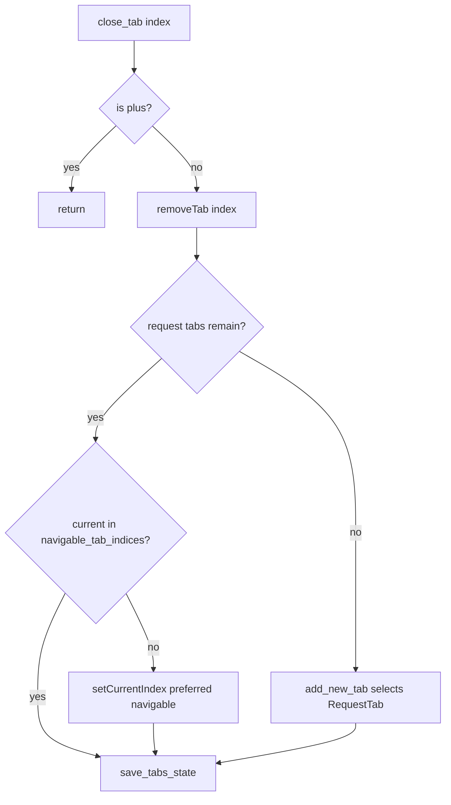

# PYPOST-824: Closing the rightmost request tab must not focus the + control

## Research

### Observed failure

- Jira: PYPOST-824 (siblings PYPOST-825 / PYPOST-826 share root cause).
- Failures in `tests/test_tabs_presenter.py`:
  - `test_close_rightmost_of_three_tabs_does_not_land_on_plus`
  - `test_close_rightmost_of_two_tabs_does_not_land_on_plus`
  - `test_handle_close_tab_closes_current`
- Assertion: `assertNotEqual(current, plus_idx)` after `close_tab` / `handle_close_tab`
  when the closed tab was the rightmost request tab (adjacent to trailing `+`).
- Example: three request tabs → `close_tab(2)` → current index equals plus index.

### Current close path

| Piece | Path | Role |
| --- | --- | --- |
| Presenter | `pypost/ui/presenters/tabs_presenter.py` | `close_tab`, `handle_close_tab` |
| Header | `pypost/ui/widgets/tab_header.py` | `is_plus_tab_index`, `navigable_tab_indices` |
| Tests | `tests/test_tabs_presenter.py` | Close-focus regression coverage |

`close_tab` today:

1. Ignore close if index is plus.
2. `QTabWidget.removeTab(index)`.
3. If no request tabs remain → `add_new_tab(save_state=False)` (selects new RequestTab).
4. `save_tabs_state()`.

`handle_close_tab` only calls `close_tab(currentIndex)`.

`handle_next_tab` / `handle_previous_tab` already use `navigable_tab_indices()` and
reselect when current is not navigable. Close does **not**.

### Root cause

Qt `QTabWidget.removeTab` advances `currentIndex` to the next tab when the current
(or selected) tab is removed. For layout `[R0, R1, R2, +]`, removing `R2` leaves
`[R0, R1, +]` with current on `+` (former index 3 slid to 2).

Closing first or middle often leaves current on a remaining `RequestTab`, which is why
PYPOST-818 / PYPOST-820 tests could pass while rightmost-close tests fail. Those tasks
documented optional explicit reselect as deferred hardening; production now needs it.

### External / prior guidance

- Qt `QTabWidget::removeTab`: current index moves to an adjacent tab; when the removed tab
  is last before a trailing placeholder, that placeholder becomes current.
- Prior architecture: `ai-tasks/PYPOST-818/20-architecture.md`,
  `ai-tasks/PYPOST-820/20-architecture.md`, `ai-tasks/PYPOST-819/20-architecture.md`.
- Tech debt from 818/820: explicit `setCurrentIndex` to a navigable request tab after
  close.

## Implementation Plan

1. After `removeTab` in `TabsPresenter.close_tab`, if request tabs remain, ensure current
   is in `self._header.navigable_tab_indices()`.
2. If current is not navigable (typically `+`), select a preferred remaining request tab:
   prefer `index - 1` when that index is still navigable (tab left of the closed one);
   otherwise fall back to the last navigable index.
3. Leave the zero-request-tab branch unchanged (`add_new_tab` already focuses the
   replacement RequestTab).
4. Do not change `handle_close_tab` beyond inheriting the fixed `close_tab` behavior.
5. Verify the three failing tests plus related close-focus tests via
   `make test PYTEST_ARGS="tests/test_tabs_presenter.py -k 'close_tab or land_on_plus or handle_close' -v"`.

Out of scope for this change (optional follow-up): apply the same reselect in
`close_tabs_for_request_ids` if bulk delete can leave current on `+`.

## Architecture

### Flow after fix

### Modules and responsibilities

| Module | Responsibility | Change |
| --- | --- | --- |
| `TabsPresenter.close_tab` | Remove request tab; ensure focus on navigable tab | **Yes** |
| `TabsPresenter.handle_close_tab` | Close current via `close_tab` | No (inherits) |
| `RequestTabHeader.navigable_tab_indices` | List request-tab indices (exclude `+`) | Reuse only |
| `tests/test_tabs_presenter.py` | Regression assertions | No new tests required |

### Selected pattern

Mirror next/previous tab: treat `navigable_tab_indices()` as the source of truth for
focusable tabs after structural tab-bar changes. Prefer the previous request tab when
reselecting so close feels leftward-adjacent, matching common desktop tab UX.

### Interfaces

No new public APIs. Behavior change is internal to `close_tab` after `removeTab`.

## Q&A

- **Q:** Why not rely on Qt’s default current after `removeTab`?
  **A:** With a trailing non-request `+` tab, rightmost close selects `+`. Product rule
  forbids that.
- **Q:** Why prefer `index - 1` over always `indices[0]`?
  **A:** Closing the last request tab should leave the user on the previous neighbor, not
  jump to the first tab.
- **Q:** Does `add_new_tab` still cover closing the last request tab?
  **A:** Yes; the reselect branch runs only when request tabs remain.
- **Q:** Do siblings PYPOST-825 / 826 need separate production changes?
  **A:** No; same `close_tab` path. Tickets may close as duplicates once this fix is green.
