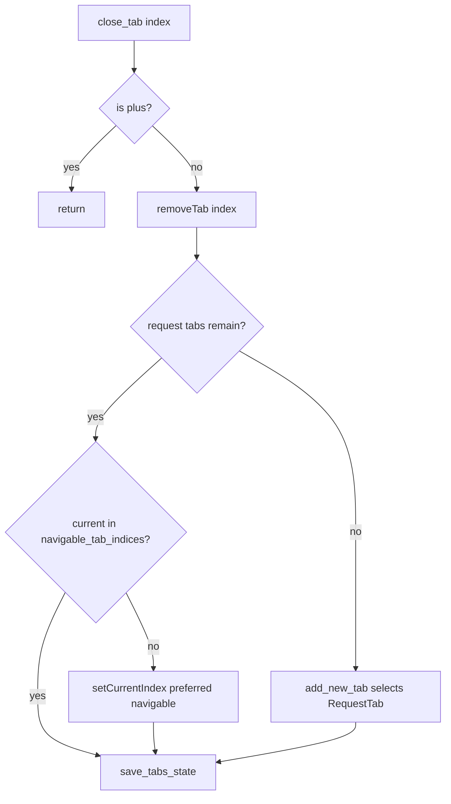

# PYPOST-825: Closing the rightmost of two request tabs must not focus the + control

## Research

### Observed failure (ticket entry point)

- Jira: PYPOST-825 (siblings PYPOST-824 / PYPOST-826 share root cause).
- Primary failing test in `tests/test_tabs_presenter.py`:
  - `test_close_rightmost_of_two_tabs_does_not_land_on_plus`
- Related coverage (same defect class):
  - `test_close_rightmost_of_three_tabs_does_not_land_on_plus`
  - `test_handle_close_tab_closes_current`
- Assertion: `assertNotEqual(current, plus_idx)` after `close_tab(1)` with two request
  tabs (layout `[R0, R1, +]` → remove `R1` → must not leave current on `+`).

### Current close path (post PYPOST-824)

| Piece | Path | Role |
| --- | --- | --- |
| Presenter | `pypost/ui/presenters/tabs_presenter.py` | `close_tab`, `handle_close_tab` |
| Header | `pypost/ui/widgets/tab_header.py` | `is_plus_tab_index`, `navigable_tab_indices` |
| Tests | `tests/test_tabs_presenter.py` | Close-focus regression coverage |
| Prior fix | `ai-tasks/PYPOST-824/` | Production navigable reselect in `close_tab` |

`close_tab` after PYPOST-824:

1. Ignore close if index is plus.
2. `QTabWidget.removeTab(index)`.
3. If no request tabs remain → `add_new_tab(save_state=False)`.
4. Else if current is not in `navigable_tab_indices()`, `setCurrentIndex` to preferred
   navigable (prefer `index - 1`, else last navigable).
5. `save_tabs_state()`.

### Root cause

Qt `QTabWidget.removeTab` advances `currentIndex` to the next tab. For layout
`[R0, R1, +]`, removing `R1` leaves `[R0, +]` with current on `+` unless the presenter
reselects. PYPOST-824 added that reselect; this ticket’s two-tab scenario is the same
trap with fewer request tabs.

### External / prior guidance

- Qt `QTabWidget::removeTab`: current moves to an adjacent tab; trailing `+` becomes
  current when the removed tab was immediately before it.
- Production architecture and plan: `ai-tasks/PYPOST-824/20-architecture.md`.
- Prior deferred hardening: `ai-tasks/PYPOST-818/20-architecture.md`,
  `ai-tasks/PYPOST-820/20-architecture.md`.

## Implementation Plan

1. **Do not** duplicate the PYPOST-824 production change unless verification fails.
2. Run targeted tests:
   `make test PYTEST_ARGS="tests/test_tabs_presenter.py -k 'close_rightmost_of_two or close_rightmost_of_three or land_on_plus or handle_close_tab' -v"`.
3. Run related close-focus filter:
   `make test PYTEST_ARGS="tests/test_tabs_presenter.py -k 'close_tab or land_on_plus or handle_close' -v"`.
4. If all pass, document verification-only close; link siblings PYPOST-824 / PYPOST-826.
5. If any named land-on-plus test fails, re-apply or repair the navigable reselect in
   `TabsPresenter.close_tab` (same plan as PYPOST-824) — only then edit production.

Out of scope: `close_tabs_for_request_ids` bulk reselect (already tracked as follow-up
from PYPOST-824 / PYPOST-831).

## Architecture

### Flow (shared with PYPOST-824; no new modules)

### Modules and responsibilities

| Module | Responsibility | Change for PYPOST-825 |
| --- | --- | --- |
| `TabsPresenter.close_tab` | Remove request tab; ensure focus on navigable tab | **None** if PYPOST-824 already present |
| `TabsPresenter.handle_close_tab` | Close current via `close_tab` | No |
| `RequestTabHeader.navigable_tab_indices` | List request-tab indices (exclude `+`) | Reuse only |
| `tests/test_tabs_presenter.py` | Regression assertions | No new tests required |

### Selected pattern

Verification-only sibling close: reuse PYPOST-824’s navigable reselect after `removeTab`.
Two-tab rightmost close is covered by the same branch (`preferred = max(0, index - 1)`).

### Interfaces

No new public APIs. No production interface change for this ticket when verification
passes.

## Q&A

- **Q:** Does the two-tab case need different reselect logic than three-tab?
  **A:** No. Same Qt trap and same preferred-index formula.
- **Q:** Do we ship a second production patch here?
  **A:** No, unless tests still fail after PYPOST-824.
- **Q:** How does this relate to PYPOST-826?
  **A:** Same `close_tab` path via `handle_close_tab`; sibling verification ticket.
