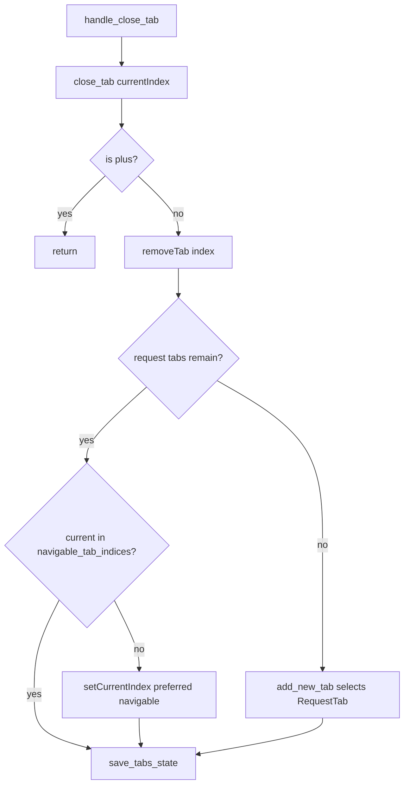

# PYPOST-826: Close-current must not leave focus on the + control

## Research

### Observed failure (ticket entry point)

- Jira: PYPOST-826 (siblings PYPOST-824 / PYPOST-825 share root cause).
- Failing test: `tests/test_tabs_presenter.py::TestTabsPresenter::test_handle_close_tab_closes_current`
- Assertion: after `handle_close_tab` with two request tabs and current on the rightmost
  request tab, `currentIndex` must not equal the plus-tab index, and the current widget
  must be a `RequestTab`.

### Call chain

| Piece | Path | Role |
| --- | --- | --- |
| Close-current | `TabsPresenter.handle_close_tab` | Reads `currentIndex`, calls `close_tab` |
| Close path | `TabsPresenter.close_tab` | `removeTab` + post-close focus |
| Header | `RequestTabHeader.navigable_tab_indices` | Request-tab indices (exclude `+`) |
| Test | `test_handle_close_tab_closes_current` | Close-current regression |

`handle_close_tab` does not implement its own focus logic; it only closes the current
index via `close_tab`.

### Root cause (shared with PYPOST-824)

Qt `QTabWidget.removeTab` advances `currentIndex` to the next tab. For layout
`[R0, R1, +]`, closing current `R1` leaves current on `+`. Product rule forbids that.

PYPOST-824 already implements post-`removeTab` reselect via `navigable_tab_indices()`
inside `close_tab` (prefer previous navigable index). That change is the production fix
for this ticket’s entry point as well.

### External / prior guidance

- Architecture and fix plan: `ai-tasks/PYPOST-824/20-architecture.md`
- Prior deferred hardening: PYPOST-818 / PYPOST-820 tech debt on explicit post-close
  reselect
- Dev docs: `doc/dev/request_actions.md` (updated under PYPOST-824)

## Implementation Plan

1. **Verify first:** run `test_handle_close_tab_closes_current` (and related close-focus
   coverage) against the tree that already contains the PYPOST-824 `close_tab` fix.
2. **If PASS:** do **not** modify `tabs_presenter.py`; document verification and sibling
   linkage in this task’s artifacts.
3. **If FAIL:** apply the same navigable reselect in `close_tab` as designed in PYPOST-824
   (single shared production path); do not add a parallel fix only in `handle_close_tab`.
4. Keep `handle_close_tab` as a thin wrapper (`close_tab(currentIndex)`).

Out of scope: duplicate production change when verification already passes; bulk
`close_tabs_for_request_ids` reselect (tracked under PYPOST-824 / PYPOST-831).

## Architecture

### Flow (inherited from PYPOST-824)

### Modules and responsibilities

| Module | Responsibility | Change for PYPOST-826 |
| --- | --- | --- |
| `TabsPresenter.handle_close_tab` | Close current via `close_tab` | None (inherits fix) |
| `TabsPresenter.close_tab` | Remove tab; ensure navigable focus | Already fixed in PYPOST-824 |
| `RequestTabHeader.navigable_tab_indices` | List request-tab indices | Reuse only |
| `tests/test_tabs_presenter.py` | Regression for close-current | Verify only |

### Selected pattern

No new architecture for this ticket. Treat PYPOST-826 as a **verification / documentation
sibling** of the PYPOST-824 close-path fix. Single source of truth for post-close focus
remains `close_tab`.

### Interfaces

No new public APIs. Behavior is inherited from `close_tab`.

## Q&A

- **Q:** Why not fix focus inside `handle_close_tab`?
  **A:** Would duplicate logic; every close path must go through `close_tab`.
- **Q:** Why document architecture if no code changes?
  **A:** Records the shared root cause, call chain, and “no duplicate patch” decision for
  audit and sibling coordination with PYPOST-824 / PYPOST-825.
- **Q:** Does verification replace Step 3 development?
  **A:** Step 3 is “verify green; change production only if still red.” That is the
  intentional development outcome for this sibling ticket.
