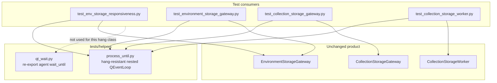

# PYPOST-827: Port hang-resistant process_until to sibling gateway/worker tests

## Research

### Problem and scope

- Jira: [PYPOST-827](https://pypost.atlassian.net/browse/PYPOST-827), follow-up from
  [PYPOST-823](https://pypost.atlassian.net/browse/PYPOST-823).
- Requirements: `ai-tasks/PYPOST-827/10-requirements.md`.
- PYPOST-823 hardened nested `QEventLoop` waits in
  `tests/test_env_storage_responsiveness.py` so a stuck/silent `QTimer` cannot leave
  `exec()` hanging past a wall-clock deadline.
- Three sibling modules still use the **old timer-only** `_process_until` (elapsed counter
  advanced only when a `QTimer` fires). Same hang class if timers stall mid-suite:

| Module | Local helper | Default timeout |
| --- | --- | --- |
| `tests/test_environment_storage_gateway.py` | method `_process_until` | 5000 ms |
| `tests/test_collection_storage_gateway.py` | method `_process_until` | 5000 ms |
| `tests/test_collection_storage_worker.py` | method `_process_until` | 5000 ms |

Debt source: `ai-tasks/PYPOST-823/60-tech-debt.md` (Medium — port or extract shared helper).

### Reference hardened wait (PYPOST-823)

`tests/test_env_storage_responsiveness.py` `_process_until(predicate, *, timeout_ms,
use_poll_timer=True)`:

1. Nested `QEventLoop.exec()` so queued `QThread` signals still deliver (why these tests
   need a nested loop rather than plain `processEvents` sleep).
2. Optional 10 ms `QTimer` poll: quit when `predicate()` is true **or**
   `time.monotonic() >= deadline` (wall clock, not `elapsed += interval`).
3. Daemon `threading.Timer(remaining_s, post_quit)` that posts
   `QTimer.singleShot(0, loop, loop.quit)` onto the **GUI-thread** `QEventLoop` context.
4. Assert `predicate()` after exit with an explicit timeout message.

Hang-regression tests in the same module prove (a) wall-clock exit and (b) posted-quit
alone when `use_poll_timer=False`.

Documented contract: `doc/dev/gui_testing.md` § Bounded nested `QEventLoop` waits.

### Existing helper: `tests/helpers/qt_wait.py`

Current content is a **thin re-export** of production `pypost.agent.ui_wait.wait_until`
(PYPOST-837 / PYPOST-840). That helper:

- Polls with `QCoreApplication.processEvents()` + `time.sleep(interval)`.
- Uses wall-clock `time.monotonic()` deadlines.
- Does **not** enter nested `QEventLoop.exec()`.
- Serves agent/UI settle waits, not gateway/worker signal delivery under nested-loop needs.

**Decision: do not extend `qt_wait.py` with nested-loop + posted-quit.** Mixing strategies
in one module would blur two hang defenses, risk regressing the agent re-export contract,
and contradict the documented split (processEvents settle vs nested-loop signal wait).

### Why timer-only siblings hang (same class as PYPOST-823)

1. Old helpers only call `loop.quit()` from a `QTimer` slot; timeout is “virtual” tick count.
2. If timers stop delivering Python callbacks, `exec()` stays in Qt C++.
3. Module `pytest.mark.timeout(120)` uses SIGALRM (project rule: no `method="thread"` for
   Qt). SIGALRM does not interrupt nested C++ `exec()` without periodic return to Python
   ([pytest-timeout](https://github.com/pytest-dev/pytest-timeout); PYPOST-823 research).

### External guidance

- [Qt QTimer](https://doc.qt.io/qt-6/qtimer.html) — `singleShot(msec, context, functor)`
  runs the functor on the **context object's thread**; context must live on a thread with a
  running event loop. Bare `singleShot` from a worker thread owns the timer there and never
  fires (matches PYPOST-823 comment on `QTimer.singleShot(0, loop, loop.quit)`).
- [Qt QEventLoop](https://doc.qt.io/qt-6/qeventloop.html) — nested `exec()` / `quit()`;
  `processEvents(..., QDeadlineTimer)` (Qt 6.7+) is wall-clock for draining events but is
  **not** a substitute for nested `exec()` wait-for-signal when delivery needs a running
  nested loop (project already chose nested loop for QThread signals mid-suite).
- [pytest-qt waitUntil](https://pytest-qt.readthedocs.io/en/stable/wait_until.html) —
  condition waits exist, but the project does not depend on pytest-qt; adopting it is out
  of scope vs porting the proven PYPOST-823 helper.
- Nested-loop quit pitfalls ([pytest-qt #284](https://github.com/pytest-dev/pytest-qt/issues/284)):
  `quit()` while only pumping via `processEvents` can fail to exit on some platforms —
  reinforces keeping the dual-path (poll timer **and** cross-thread posted quit into
  `exec()`), not switching siblings to processEvents-only.

### Placement options considered

| Option | Pros | Cons |
| --- | --- | --- |
| A. Extend `tests/helpers/qt_wait.py` | One import path | Collides with agent re-export; two unrelated wait models |
| B. New sibling helper under `tests/helpers/` | Clear nested-loop contract; one definition for three siblings | Second wait module (acceptable; different purpose) |
| C. Three inlined copies of hardened wait | Fast | Violates DoD “single shared definition” |
| D. Put helper in `pypost/` production | Shared with product | Test-only harness; requirements prefer harness-only |

**Chosen: B** — add `tests/helpers/process_until.py` (settled name; hang-resistant nested
`QEventLoop` wait). Optionally point the responsiveness module at the same helper
(allowed by requirements; recommended for one definition).

## Implementation Plan

Test-harness only. No product gateway/worker/storage changes unless Step 3 uncovers a
genuine defect that blocks honest verification.

1. **Extract** PYPOST-823 `_process_until` into `tests/helpers/process_until.py` as a
   public `process_until(...)` with the same semantics (`timeout_ms`, optional
   `use_poll_timer`, wall-clock + daemon posted quit, assert on failure).
2. **Wire siblings**: replace each class `_process_until` with calls to the shared helper
   (module-level import; drop unused local `QEventLoop`/`QTimer` imports if unused).
3. **Optionally unify** `tests/test_env_storage_responsiveness.py` onto the shared helper
   and keep hang-regression tests either in that module (importing the helper) or moved
   next to the helper (prefer keeping regression tests near the proven suite path unless
   Step 3 shows duplication pain).
4. **Do not** change `tests/helpers/qt_wait.py` beyond leaving it as the agent
   `wait_until` re-export.
5. **Preserve** existing assertions and business outcomes in the three sibling modules
   (spy counts, payload equality, coalescing behavior).
6. **Verify** with `make test` (or focused pytest on the three modules + responsiveness
   hang-regression tests) under `QT_QPA_PLATFORM=offscreen`.
7. **Docs (Step 7):** update `doc/dev/gui_testing.md` to point at the shared helper instead
   of “reference only in responsiveness module” / “siblings still old.”

## Architecture

### Module diagram



### Module responsibilities

| Module | Responsibility |
| --- | --- |
| `tests/helpers/process_until.py` | Single hang-resistant nested-loop wait: wall-clock deadline, optional poll timer, cross-thread posted quit, fail-assert message |
| `tests/helpers/qt_wait.py` | Unchanged — re-export production processEvents settle wait |
| Three sibling test modules | Exercise gateway/worker async outcomes; call shared `process_until` instead of local timer-only copies |
| Responsiveness module | Optional consumer of shared helper; owns hang-regression tests proving wall-clock + posted-quit |
| Product gateways/workers | Unchanged |

### Interaction scheme

1. Test starts async load/save / worker and builds a predicate (usually `QSignalSpy` count).
2. Test calls shared `process_until(predicate, timeout_ms=...)`.
3. Helper runs nested `exec()`; poll timer and/or signals may satisfy the predicate.
4. If timers stall, daemon timer still posts `loop.quit()` on the GUI thread at the
   wall-clock deadline.
5. Helper asserts predicate; test continues with existing business assertions.
6. Suite never depends on timer-only quit for these three modules.

### Patterns

- **Extract Shared Helper** — one definition; no copy-drift (DoD).
- **Dual-deadline nested wait** — wall-clock monotonic deadline + Qt poll; posted quit as
  backstop when Qt timers fail (PYPOST-823 proven pattern).
- **Separation of wait strategies** — nested-loop signal wait (`process_until`) vs
  processEvents settle (`wait_until`); do not merge APIs.
- **Test harness isolation** — helper lives under `tests/helpers/`, not production.

### Main interfaces

```python
def process_until(
    predicate: Callable[[], bool],
    *,
    timeout_ms: int = 5_000,
    use_poll_timer: bool = True,
) -> None:
    """Pump nested QEventLoop until predicate() or wall-clock deadline.

    Posts loop.quit() from a daemon thread via QTimer.singleShot(0, loop, loop.quit)
    so a silent QTimer cannot hang exec() past the deadline.

    Raises:
        AssertionError: predicate still false after the wait ends.
    """
```

Consumer sketch (siblings):

```python
from tests.helpers.process_until import process_until

# was: self._process_until(lambda: spy.count() == 1)
process_until(lambda: spy.count() == 1, timeout_ms=5_000)
```

Defaults: siblings keep **5000 ms** (current). Responsiveness may keep **10000 ms** via
explicit argument. `use_poll_timer=False` is for hang-regression proof only.

### Out of architecture scope (separate tickets)

- Richer timeout diagnostics (busy/pending / worker state) — PYPOST-828.
- Shared `qapp` fixture alignment — PYPOST-830.
- Production worker lifecycle hygiene — PYPOST-829.

## Q&A

- Q: Extend `qt_wait.py` or add a sibling helper?
  A: **Sibling helper.** `qt_wait.py` is the agent `wait_until` re-export (processEvents
  settle). Nested-loop + posted-quit is a different contract; keep them separate.
- Q: Must the responsiveness module also import the shared helper?
  A: Not required by DoD (three siblings sharing one definition). **Recommended** so the
  proven implementation and hang-regression tests share one source and docs can point to
  `tests/helpers/process_until.py`.
- Q: Why not switch siblings to `wait_until` / processEvents?
  A: These modules historically use nested `QEventLoop` for reliable QThread signal
  delivery mid-suite (same reason as PYPOST-823). Equivalence to PYPOST-823 requires the
  nested-loop + posted-quit pattern, not only wall-clock processEvents polling.
- Q: Why not adopt pytest-qt `waitUntil` / `waitSignal`?
  A: Project does not depend on pytest-qt; requirements ask to port proven PYPOST-823
  behavior. New dependency is out of scope.
- Q: Product code changes?
  A: None by default. Harness-only unless Step 3 finds a real gateway/worker defect.
- Q: Assertion style (`assert` vs `self.assertTrue`)?
  A: Shared helper should use plain `assert` (pytest-friendly), matching the
  responsiveness module. Unittest-style sibling classes already run under pytest.
- Q: Links used?
  A:
  - [Qt QTimer](https://doc.qt.io/qt-6/qtimer.html)
  - [Qt QEventLoop](https://doc.qt.io/qt-6/qeventloop.html)
  - [pytest-timeout](https://github.com/pytest-dev/pytest-timeout)
  - [pytest-qt waitUntil](https://pytest-qt.readthedocs.io/en/stable/wait_until.html)
  - [pytest-qt #284](https://github.com/pytest-dev/pytest-qt/issues/284) (nested quit /
    processEvents pitfalls)
  - Project: `doc/dev/gui_testing.md`, `ai-tasks/PYPOST-823/20-architecture.md`,
    `ai-tasks/PYPOST-827/10-requirements.md`
