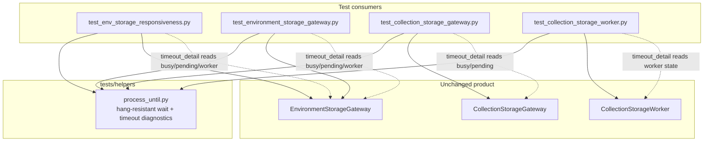

# PYPOST-828: Richer timeout diagnostics for Qt wait failures

## Research

### Problem and deferred origin

- Jira: [PYPOST-828](https://pypost.atlassian.net/browse/PYPOST-828), Architecture Phase A
  item 2 from [PYPOST-823](https://pypost.atlassian.net/browse/PYPOST-823); deferred again
  by [PYPOST-827](https://pypost.atlassian.net/browse/PYPOST-827).
- Requirements: `ai-tasks/PYPOST-828/10-requirements.md`.
- Shared helper: `tests/helpers/process_until.py` (hang-resistant nested `QEventLoop`,
  wall-clock deadline + daemon posted quit).
- Current timeout assert (generic, env-load biased):

```python
assert predicate(), (
    f"condition not met within {timeout_ms}ms "
    "(wall-clock deadline; load_completed/load_failed or predicate never true)"
)
```

- Debt notes: `ai-tasks/PYPOST-823/60-tech-debt.md` (generic text; busy/pending /
  worker deferred); `ai-tasks/PYPOST-827/60-tech-debt.md` (same; also neutralize
  `load_completed/load_failed` wording for collection consumers).

### Call-site inventory (what state is available)

| Consumer | Wait purpose | Busy/pending available? | Worker available? |
| --- | --- | --- | --- |
| `test_env_storage_responsiveness.py` | Encrypted load/save settle; idle gate | Yes — `EnvironmentStorageGateway.is_busy()`, `has_pending_work()` | Via gateway `_worker` when running |
| `test_environment_storage_gateway.py` | Spy count on load/save | Yes — same gateway APIs | Via gateway `_worker` |
| `test_collection_storage_gateway.py` | Spy count on load | Yes — `CollectionStorageGateway.is_busy()`, `has_pending_work()` | Via gateway `_worker` |
| `test_collection_storage_worker.py` | Spy on worker signals | No gateway (not part of wait context) | Yes — local `CollectionStorageWorker` |
| Hang-regression tests (responsiveness) | Prove deadline / posted quit | None (predicate always false) | None |

Gateway public APIs already used by tests:

- `is_busy()` — worker exists and `isRunning()`.
- `has_pending_work()` — busy **or** queued pending load/save.
- Optional worker view: `isRunning()`, and for env worker the operation kind when present.

Collection worker tests wait on the worker alone; busy/pending **may be omitted** (not part
of that wait’s business context). Timeout text must still include duration + reason.

### Why today’s message fails triage

1. It says the wait timed out, not whether work was still in flight.
2. It hard-codes env signal names even for collection / pure-worker waits.
3. Maintainers must re-run or add temporary logging to learn `is_busy` /
   `has_pending_work` / worker `isRunning` at the deadline — the exact signals
   PYPOST-823 Phase A named.

### External practices (timeout diagnostics)

- **pytest assert messages** — custom messages with dynamic values are the standard way
  to make complex waits actionable when assert rewriting does not apply to helpers under
  `tests/helpers/` ([pytest assert docs](https://docs.pytest.org/en/stable/how-to/assert.html);
  helpers are not rewritten).
- **pytest-timeout** — dumps thread stacks on outer timeout; complementary backstop, not a
  substitute for in-wait state ([pytest-timeout](https://github.com/pytest-dev/pytest-timeout)).
- **Playwright / UI waits** — timeout errors include *observed state* (call log, expected vs
  received), not only “timed out after Nms”
  ([Playwright timeouts](https://github.com/microsoft/playwright/blob/main/docs/src/test-timeouts-js.md)).
- **Common wait helpers** — optional `message` / diagnostic callback evaluated **on failure**
  so the snapshot reflects state at the deadline (Ray `wait_for_condition`, redis-py
  `wait_for_condition`, Soniq `wait_until(..., message=...)`).

Implication for this task: enrich the helper’s timeout `AssertionError` with a
deadline-time snapshot supplied by the caller (or a small formatting helper), without
changing hang-defense timing.

### Placement options considered

| Option | Pros | Cons |
| --- | --- | --- |
| A. Optional `timeout_detail: Callable[[], str] \| None` on `process_until` | Lazy snapshot at failure; no product coupling; works for gateway and worker-only waits | Call sites must pass a lambda (or shared formatter) |
| B. Duck-type `is_busy` / `has_pending_work` inside the helper | Zero call-site changes for gateways | Magic; breaks worker-only waits; couples harness to gateway shape |
| C. Required static `message: str` only | Simple | Stale if state changes during wait; easy to omit busy/pending |
| D. Production logging on timeout | Visible in product logs | Out of scope; requirements prefer harness-only |

**Chosen: A** — optional diagnostic callable (plus a small shared formatter for gateway
busy/pending and optional worker fields). Neutralize the env-biased default reason string
for all consumers.

## Implementation Plan

Test-harness only. Do **not** re-port siblings (PYPOST-827 done). Do **not** change
hang-resistant timing, poll interval, or posted-quit behavior.

1. **Extend** `process_until` with an optional keyword-only diagnostic hook evaluated
   **only** when the predicate is still false after the wait ends. Append its return value
   to the `AssertionError` text. Leave `timeout_ms` / `use_poll_timer` semantics unchanged.
2. **Neutralize** the default reason: drop hard-coded `load_completed/load_failed`; state
   wall-clock deadline + predicate still false (and any caller-supplied detail).
3. **Add** a small helper in the same module (or adjacent) to format gateway busy/pending
   and optional worker running/operation snippets so call sites stay one-liners.
4. **Wire** consumers that observe storage async load/save via a gateway to pass
   busy/pending (required for those waits). Wire worker-only waits to pass optional worker
   state. Hang-regression tests need no busy/pending; update `match=` patterns for the new
   default wording.
5. **Cover** diagnostics with focused tests: timeout message includes busy/pending when a
   detail callback reports them; worker-only detail when provided; default message remains
   actionable without a callback; hang-defense timings still exit in ~300 ms.
6. **Verify** with focused pytest on helper consumers + hang regressions under
   `QT_QPA_PLATFORM=offscreen` (prefer `make test` / Makefile targets per workspace rules).
7. **Docs (Step 7):** note richer timeout text in `doc/dev/gui_testing.md` § Bounded nested
   waits (and related storage async notes if they quote the old message).

## Architecture

### Module diagram



### Module responsibilities

| Module | Responsibility | Change |
| --- | --- | --- |
| `tests/helpers/process_until.py` | Nested-loop wait; build timeout `AssertionError` with duration, reason, optional detail | **Yes** (API + message) |
| Gateway / worker test modules | Pass `timeout_detail` where busy/pending or worker context exists | **Yes** (call-site wiring) |
| Hang-regression tests | Still prove wall-clock / posted-quit; assert on new default message | **Yes** (`match` only) |
| Product gateways / workers / storage | Async runtime behavior | **No** (unless a real defect blocks honest verification) |
| `tests/helpers/qt_wait.py` | processEvents settle wait | **No** |

### Interaction scheme

1. Test starts async work and builds a predicate (spy count, Event, etc.).
2. Test calls `process_until(predicate, timeout_ms=..., timeout_detail=...)`.
3. Helper runs the unchanged dual-deadline nested wait (poll timer + posted quit).
4. On success: return; detail callable is **not** invoked.
5. On deadline with predicate still false: invoke `timeout_detail()` if provided (best-effort;
   detail failures must not mask the timeout), compose AssertionError, raise.
6. Maintainer reads CI failure: duration + reason + busy/pending and/or worker snippet.

### Selected patterns

1. **Lazy diagnostic callback** — snapshot state at failure time (pytest / Playwright style
   “show observed state”), not a stale string captured at wait start.
2. **Optional context** — worker (and busy/pending when not in business context) stay
   optional; required busy/pending only for gateway load/save waits.
3. **Harness-only enrichment** — no product API change; reuse existing `is_busy` /
   `has_pending_work` / `QThread.isRunning`.
4. **Preserve hang defense** — diagnostics run after the wait ends; never extend the
   deadline or re-enter nested `exec()` for formatting.
5. **Single shared wait** — all `process_until` consumers get the richer default reason;
   gateway/worker wiring supplies domain detail (DoD consistency).

### Main interfaces

```python
def process_until(
    predicate: Callable[[], bool],
    *,
    timeout_ms: int = 5_000,
    use_poll_timer: bool = True,
    timeout_detail: Callable[[], str] | None = None,
) -> None:
    """Pump nested QEventLoop until predicate() or wall-clock deadline.

    On timeout, AssertionError includes timeout_ms, a neutral reason, and
    (when provided) the string returned by timeout_detail().

    Raises:
        AssertionError: predicate still false after the wait ends.
    """


def format_storage_async_timeout_detail(
    *,
    is_busy: bool | None = None,
    has_pending_work: bool | None = None,
    worker_running: bool | None = None,
    worker_operation: str | None = None,
) -> str:
    """Format busy/pending and optional worker fields for timeout AssertionError text.

    Omit None fields. Suitable for gateway waits (busy/pending required) and
    worker-only waits (busy/pending omitted; worker fields optional).
    """
```

Consumer sketches:

```python
# Gateway wait (busy/pending required)
process_until(
    lambda: spy.count() >= 1 or fail_spy.count() >= 1,
    timeout_ms=10_000,
    timeout_detail=lambda: format_storage_async_timeout_detail(
        is_busy=gateway.is_busy(),
        has_pending_work=gateway.has_pending_work(),
        worker_running=(
            gateway._worker.isRunning() if gateway._worker is not None else False
        ),
    ),
)

# Worker-only wait (busy/pending omitted; optional worker state)
process_until(
    lambda: spy.count() == 1,
    timeout_ms=5_000,
    timeout_detail=lambda: format_storage_async_timeout_detail(
        worker_running=worker.isRunning(),
    ),
)

# Hang-regression / no domain context
process_until(lambda: False, timeout_ms=300)
```

Example timeout text (illustrative):

```text
condition not met within 10000ms (wall-clock deadline; predicate still false);
busy=True pending=True worker_running=True
```

### Failure semantics (unchanged timing)

| Case | Desired outcome |
| --- | --- |
| Predicate becomes true | Pass; no diagnostic call |
| Predicate false at deadline | Fail within deadline; enriched AssertionError |
| No `timeout_detail` | Fail with duration + neutral reason (still actionable) |
| `timeout_detail` raises | Prefer still raising timeout AssertionError with note; do not hang |
| Qt timer stall | Posted quit still ends wait; diagnostics after exit |
| Outer `pytest.mark.timeout` | Unchanged backstop once Python runs |

### Out of architecture scope

- Sibling wait port (PYPOST-827 — done).
- Shared `qapp` alignment (PYPOST-830).
- Production worker lifecycle hygiene (PYPOST-829).
- Env-presenter timer-only nested wait (PYPOST-877).
- Changing hang-defense timing or merging with `qt_wait.wait_until`.

## Q&A

- Q: Why a callable instead of a static message string?
  A: Busy/pending and worker state change during the wait. Evaluating at timeout captures
  the triage-relevant snapshot (same idea as Playwright “received” / call-log state).

- Q: Why not introspect gateways inside `process_until`?
  A: Worker-only and hang-regression waits have no gateway. Duck-typing would couple the
  helper to product types and miss optional worker context. Call-site detail keeps the
  contract explicit.

- Q: Must every call site pass busy/pending?
  A: Only waits that observe storage async load/save via a gateway. Worker-only and pure
  hang-regression waits omit those flags; they still get duration + reason.

- Q: Does this change pass/fail or deadlines?
  A: No. Same dual-deadline wait; only the timeout AssertionError text grows.

- Q: Should we touch production for diagnostics?
  A: No by default. Public `is_busy` / `has_pending_work` already expose the required
  signals. Reading `_worker` for optional running state is acceptable in tests (already
  done in gateway unit tests).

- Q: How do hang-regression tests change?
  A: Keep proving ~300 ms exit; update `pytest.raises(..., match=...)` to the new neutral
  default wording. Optionally add a small test that a provided `timeout_detail` appears in
  the message.

- Q: Links used?
  A:
  - [pytest assert docs](https://docs.pytest.org/en/stable/how-to/assert.html)
  - [pytest-timeout](https://github.com/pytest-dev/pytest-timeout)
  - [Playwright test timeouts](https://github.com/microsoft/playwright/blob/main/docs/src/test-timeouts-js.md)
  - Project: `doc/dev/gui_testing.md`, `tests/helpers/process_until.py`,
    `ai-tasks/PYPOST-823/20-architecture.md`, `ai-tasks/PYPOST-827/20-architecture.md`,
    `ai-tasks/PYPOST-827/60-tech-debt.md`, `ai-tasks/PYPOST-828/10-requirements.md`
