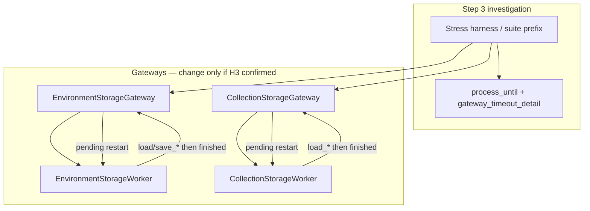

# PYPOST-829: Confirm or clear stranded storage-worker completion risk (H3)

## Research

### Origin and current status

- Jira: [PYPOST-829](https://pypost.atlassian.net/browse/PYPOST-829), Low follow-up from
  [PYPOST-823](https://pypost.atlassian.net/browse/PYPOST-823).
- Requirements: `ai-tasks/PYPOST-829/10-requirements.md`.
- PYPOST-823 named **H3** as a secondary suite-churn hypothesis: after a storage
  `QThread` finishes, the gateway clears `self._worker = None` without
  `deleteLater()` / short `wait()`. Under heavy Qt suite pressure that *might*
  disturb later signal delivery so load/save completion outcomes never arrive
  (stranded). Phase B of PYPOST-823 was conditional; Step 3 did **not** confirm
  H3, so product lifecycle was left unchanged
  (`ai-tasks/PYPOST-823/20-architecture.md`, `60-tech-debt.md`).
- Sibling tickets settled adjacent wait concerns without touching H3:
  - [PYPOST-827](https://pypost.atlassian.net/browse/PYPOST-827) — shared hang-resistant
    `process_until`.
  - [PYPOST-828](https://pypost.atlassian.net/browse/PYPOST-828) — timeout diagnostics
    (`busy=` / `pending=` / `worker_running=`).
  - [PYPOST-830](https://pypost.atlassian.net/browse/PYPOST-830) — shared `qapp` (out of
    scope here).

### Current production lifecycle (unchanged since PYPOST-486 / PYPOST-754)

| Component | Path | Finish handling today |
| --- | --- | --- |
| Env gateway | `pypost/core/qt/environment_storage_gateway.py` | `_on_worker_finished`: `self._worker = None`, then drain `_pending_save` / `_pending_load` via `_start_operation` |
| Collection gateway | `pypost/core/qt/collection_storage_gateway.py` | Same pattern: clear ref, then restart `_pending_load` via `_start_load` |
| Env worker | `pypost/core/qt/environment_storage_worker.py` | `QThread` subclass; emits op signals then returns from `run()` |
| Collection worker | `pypost/core/qt/collection_storage_worker.py` | Same |

Both gateways parent **neither** the worker nor connect `finished → deleteLater`.
The only strong Python reference is `self._worker`. Dropping it leaves lifetime to
Python GC + Qt ownership (worker has no `QObject` parent).

In-repo contrast (transient workers elsewhere):

- `pypost/ui/presenters/tabs_presenter.py` — `worker.finished.connect(worker.deleteLater)`
- `pypost/ui/widgets/code_editor.py` — same

Docs: `doc/dev/environment_storage_async.md` (topology, queue/coalescing,
`wait_idle`); collection async path in `doc/dev/collection_loading.md`.

### Signal / restart ordering (why a naive fix can race)

Typical env load sequence:

1. Worker thread emits `load_finished` / `load_failed` (queued to GUI).
2. `run()` returns; `QThread.finished` emits (also queued to GUI when the slot lives
   on the gateway).
3. GUI delivers op completion first (connection / post order), then
   `_on_worker_finished`.
4. Finish handler clears `_worker` and may immediately start a **new** worker for
   pending save/load.

Any teardown must therefore:

- Keep the finished worker alive long enough that already-queued op-completion
  events are not dropped by premature destruction.
- **Not** block or corrupt the pending-restart path (clear pending flags, then
  `_start_*` on a fresh instance).
- Avoid calling unbounded `wait()` on the GUI thread (would freeze UI / suite
  event pumping).

### What “stranded completion” means for this task

Listeners (presenter or `QSignalSpy` / `process_until` waits) never see
`load_completed` / `load_failed` / `save_completed` / `save_failed` after the
worker has finished its work, under representative suite churn. Distinct from:

- Hang-resistant wait failures (PYPOST-823/827) — wait ends; predicate false for
  other reasons.
- Busy/pending timeout text (PYPOST-828) — diagnostics only.
- Tabs-presenter focus flakes — unrelated.

### External Qt guidance (lifecycle)

- [Qt QThread](https://doc.qt.io/qt-6/qthread.html) — connect `finished()` to
  `QObject::deleteLater()` for cleanup; deleting a **running** `QThread` crashes;
  `wait()` synchronizes with post-`finished` native cleanup (TLS destructors may
  still run after `finished` is emitted).
- [Qt Forum / KDAB multithreading notes](https://www.kdab.com/documents/multithreading-with-qt.pdf)
  — prefer owning teardown; `wait` when joining before destroying the manager object.
- [PySide “Destroyed while thread is still running”](https://stackoverflow.com/questions/28040837/pyside-threads-destroyed-whie-still-running)
  — classic failure when a `QThread` is GC’d while `isRunning()`.
- Transient-task pattern used in-repo and in community samples: create per op,
  `finished → deleteLater`, release the Python ref after scheduling deletion
  ([gist lifecycle example](https://gist.github.com/asilichenko/0336cc5d8983f4656d2d6ee715fb74ce)).

Implication: `deleteLater` + optional **short** `wait` after `finished` is
standard hygiene; it is still **speculative** for H3 until suite evidence shows
stranded outcomes. Blocking forever in `_on_worker_finished` is unacceptable.

### Existing test surface (investigation harness)

| Module | Role for H3 |
| --- | --- |
| `tests/test_environment_storage_gateway.py` | Load/save completion + pending load after save |
| `tests/test_collection_storage_gateway.py` | Load completion + queued second load |
| `tests/test_env_storage_responsiveness.py` | Encrypted load/save under nested-loop waits |
| `tests/helpers/process_until.py` | Bounded waits + `gateway_timeout_detail` |

None currently assert post-finish teardown hygiene or deliberately stress
worker GC / rapid restart under suite-prefix churn.

### Reproduction approaches considered

| Approach | Pros | Cons |
| --- | --- | --- |
| A. Full `make test` + watch for gateway wait timeouts with `busy=False` yet missing spy | Real suite churn | Rare/noisy; hard to attribute to H3 vs other flakes |
| B. Prefix stress: run heavy Qt modules then gateway/responsiveness modules in one process | Closer to historical hang context | Still intermittent; needs a clear H3 fingerprint |
| C. Focused stress unit: many rapid load/save cycles + pending restarts; force GC (`gc.collect`) between ops | Deterministic, attributable | May not reproduce suite-only affinity pollution |
| D. Force wrong lifecycle in a **test double** (drop ref without deleteLater while signals pending) to validate a regression probe | Proves the check fails when teardown is wrong | Does not prove production H3 is live |

**Chosen investigation strategy (Step 3):** combine **C** (primary, attributable)
with a short **B** sample (suite-context sanity). Use **D** only if a product fix
lands and needs a negative regression probe. Treat a clean C+B as
**not reproduced** unless stranded completions appear with the H3 fingerprint
below.

### Decision criteria (confirm vs not)

**H3 confirmed** if, under the agreed stress (C and/or B), at least one of:

1. Expected gateway completion signal never arrives within the bounded
   `process_until` budget while `gateway_timeout_detail` shows work should have
   finished (e.g. `busy=False`, `pending=False`, `worker_running=False`) after a
   prior finish — i.e. stranded outcome, not “still running.”
2. Reproducible Qt/Python warnings consistent with destroying a live `QThread`
   (`Destroyed while thread is still running`) correlated with missing subsequent
   completions on the same gateway.
3. Pending restart drops or never starts (queued load/save after finish never
   produces a second completion) attributable to teardown ordering—not mock setup
   error.

**H3 not reproduced** if C completes without (1)–(3) across a agreed iteration
count (architecture default: ≥200 rapid cycles per gateway including pending
restart paths; plus one suite-prefix sample of gateway + responsiveness modules
after a non-trivial Qt prefix, or full `make test` if cheap enough), and no
stranded fingerprint appears. Outcome: document evidence; **no mandatory product
change**; complete Steps 1–7 with not-needed / safely deferred notes.

Ambiguous timeouts (busy still true, worker still running) are **not** H3 — they
are hang/worker/storage issues owned elsewhere.

## Implementation Plan

Investigation-first. Product code changes only on confirm.

### Phase 0 — Baseline (no product change)

1. Record current `_on_worker_finished` behavior for both gateways (clear ref →
   drain pending).
2. Note in-repo `deleteLater` precedents (tabs / code editor) as the fix template
   if needed.

### Phase 1 — Reproduce / refute H3

1. Add (or temporarily script) a **stress harness** under `tests/` that:
   - Uses shared hang-resistant `process_until` + `gateway_timeout_detail`.
   - Drives EnvironmentStorageGateway through rapid load/save and
     save-then-queued-load cycles (≥200 iterations or equivalent wall budget
     under module timeout).
   - Drives CollectionStorageGateway through rapid load + queued-second-load
     cycles similarly.
   - Optionally calls `gc.collect()` after idle between batches to amplify
     premature-destruction risk.
2. Run suite-prefix or full `make test` sample; triage any gateway wait failure
   with PYPOST-828 detail text against the fingerprint above.
3. Write findings into Step 3 / later artifacts (confirm or not).

### Phase 2a — If not reproduced

1. No production gateway change.
2. Keep or slim the stress test only if it remains cheap and valuable as a
   canary; otherwise document manual/agent reproduction steps in Step 7 and
   avoid permanent suite cost for an unconfirmed risk.
3. Complete cleanup / observability / tech-debt / docs with “H3 not confirmed”
   evidence.

### Phase 2b — If confirmed (both gateways)

1. Implement orderly teardown in **both**
   `EnvironmentStorageGateway._on_worker_finished` and
   `CollectionStorageGateway._on_worker_finished` using the same private pattern
   (see Architecture).
2. Preserve pending restart semantics exactly (save coalescing / load queue
   unchanged in business terms).
3. Add regression coverage: rapid restart + completion delivery after finish;
   optionally a negative probe that fails if teardown again strands outcomes.
4. Do not change encryption, on-disk formats, or presenter UX beyond reliable
   completion delivery.

### Phase 3 — Verification

1. Isolation: gateway + responsiveness modules green.
2. Stress harness green (or intentionally removed with documented rationale if
   not-confirmed path).
3. If product fix: full `make test` / `make check` as quality gate allows.

## Architecture

### System view



### Modules and responsibilities

| Module | Responsibility | Change if confirmed | Change if not |
| --- | --- | --- | --- |
| `environment_storage_gateway.py` | Queue, coalesce, bridge signals, worker lifecycle | Yes — finish teardown | No |
| `collection_storage_gateway.py` | Single-flight load + pending restart | Yes — same teardown | No |
| Storage workers | Background load/save | Unlikely (no API change) | No |
| Presenters / MainWindow | Consumers of gateway signals | No | No |
| `tests/test_*_storage_gateway.py` / stress | Reproduce + regression | Yes | Optional canary only |
| `tests/helpers/process_until.py` | Bounded waits / detail | Reuse only | Reuse only |
| `StorageManager` / encryption | Persistence & crypto | **No** | **No** |

### Selected patterns and justification

1. **Investigation-first / evidence gate.** Matches requirements: speculative
   lifecycle edits risk racing pending restart; business value is a settled risk.
2. **Symmetric gateway lifecycle.** If either gateway needs the fix, both get it
   (PYPOST-823 named the collection analogue; requirements forbid leaving one
   defective).
3. **Capture → schedule delete → short join → clear → restart pending** (confirm
   path only):

```text
_on_worker_finished():
  finished = self._worker
  self._worker = None
  if finished is not None:
      finished.deleteLater()          # Qt-owned deferred delete
      finished.wait(SHORT_MS)         # optional short join; must return quickly
  # THEN drain pending (start brand-new worker) — never reuse `finished`
```

Justification vs alternatives:

| Option | Verdict |
| --- | --- |
| Only `self._worker = None` (today) | Keep if H3 not reproduced |
| `finished.connect(worker.deleteLater)` at start **and** clear+restart in slot | OK if `_on_worker_finished` is connected **before** `deleteLater`, or delete is done inside the slot after capture; prefer in-slot capture to keep ordering explicit |
| Unbounded `wait()` in finish slot | Reject — freezes GUI / suite pumps |
| Parent worker to gateway without `deleteLater` | Incomplete alone; parented delete on gateway destroy does not fix mid-suite GC between ops |
| Redesign to long-lived thread + moveToThread worker | Out of scope (architecture rewrite) |

`SHORT_MS` guidance for Step 3 if confirmed: small (on the order of tens to a
few hundred ms). After a queued `finished` on the GUI thread, `wait` should
usually return immediately; the timeout is a safety bound, not a sleep.

4. **Regression fingerprint.** Assert N successive completions (including at
   least one pending-restart path) under rapid cycling; failure mode is missing
   spy count / timeout with idle detail — not a redesign of `process_until`.

### Interfaces / APIs

**Public gateway APIs unchanged** (unless a genuine defect forces a tiny addition,
which is not expected):

- Env: `load_async`, `save_async`, `is_busy`, `has_pending_work`, `wait_idle`,
  signals `load_completed` / `load_failed` / `save_completed` / `save_failed`.
- Collection: `load_async`, `is_busy`, `has_pending_work`, signals
  `load_completed` / `load_failed`.

Lifecycle hygiene stays inside private `_on_worker_finished` (and helpers if
extracted for DRY between the two gateways — optional, only if both change).

### Failure / decision matrix

| Observation | Path |
| --- | --- |
| Stress + suite sample: all completions arrive; no destroy-while-running | Not confirmed → document; no product change |
| Missing completion with idle timeout detail after finish | Confirmed → Phase 2b both gateways + regression |
| Timeout while still busy / worker_running | Not H3 → triage as other ticket / flake |
| Fix applied but pending restart flakes | Revisit ordering: ensure pending drain **after** capture/clear, never touch deleted worker |

## Q&A

- **Q:** Why not always add `deleteLater` / `wait` now?
  **A:** H3 was never confirmed. Unbounded or poorly ordered teardown can race
  pending load/save restart. Requirements prefer evidence over speculative
  product change.

- **Q:** Why both gateways if only env stress fails?
  **A:** Same finish pattern and same latent risk; requirements require alignment
  so half the async storage surface is not left defective.

- **Q:** Is calling `wait()` from `_on_worker_finished` safe?
  **A:** Only a **short** wait after `finished` has already been delivered to the
  GUI thread (slot runs queued). It joins native cleanup; it must not become an
  unbounded GUI block. Prefer returning immediately when `isFinished()`.

- **Q:** Could `deleteLater` run before pending restart and break the next op?
  **A:** No if the finished instance is captured, `_worker` cleared, deletion
  scheduled on **that** instance, and `_start_*` assigns a **new** worker. Do not
  reuse the finished object.

- **Q:** How does this relate to PYPOST-827/828/830?
  **A:** Those improve waits, timeout text, and app fixture sharing. This ticket
  only settles optional worker-teardown hygiene (H3).

- **Q:** What is Done without a product fix?
  **A:** Documented failed reproduction under the agreed stress approach, Steps
  1–7 artifacts complete, ticket may close as not-needed / safely deferred.

- **Q:** External references used?
  **A:**
  [Qt QThread](https://doc.qt.io/qt-6/qthread.html),
  [KDAB Multithreading with Qt](https://www.kdab.com/documents/multithreading-with-qt.pdf),
  [PySide destroyed-while-running](https://stackoverflow.com/questions/28040837/pyside-threads-destroyed-whie-still-running),
  prior `ai-tasks/PYPOST-823/20-architecture.md` / `60-tech-debt.md`,
  `doc/dev/environment_storage_async.md`.
