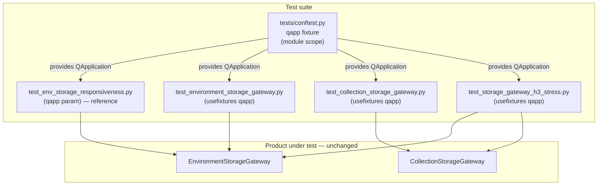

# PYPOST-830: Align gateway tests on shared qapp fixture

## Research

### Origin and requirements

- Jira: [PYPOST-830](https://pypost.atlassian.net/browse/PYPOST-830), Medium Debt
  (2 SP), follow-up from [PYPOST-823](https://pypost.atlassian.net/browse/PYPOST-823).
- Requirements: `ai-tasks/PYPOST-830/10-requirements.md`.
- PYPOST-823 deferred shared-fixture consistency as Low debt; siblings
  [PYPOST-827](https://pypost.atlassian.net/browse/PYPOST-827)–[PYPOST-829](https://pypost.atlassian.net/browse/PYPOST-829)
  owned wait sharing, timeout diagnostics, and H3 investigation. This ticket
  only closes gateway Qt-application lifecycle alignment.

### Shared fixture (established convention)

`tests/conftest.py` already defines:

```python
@pytest.fixture(scope="module")
def qapp():
    """Shared QApplication for Qt widget tests (module-scoped singleton)."""
    app = QApplication.instance() or QApplication([])
    yield app
```

- Ensures a single process-wide `QApplication` via `instance()` reuse.
- Module scope matches how consumers request it once per test module.
- Suite already sets `QT_QPA_PLATFORM=offscreen` before Qt imports in the same
  file.

Reference consumer: `tests/test_env_storage_responsiveness.py` — pytest-native
functions request `qapp` as a parameter (e.g. `def test_...(qapp):`). No
module-local `QApplication` construction.

### Targets still using module-local lifecycle

| Module | Style today | Local lifecycle | Uses `cls.app` after create? |
| --- | --- | --- | --- |
| `tests/test_environment_storage_gateway.py` | `unittest.TestCase` | `setUpClass` → `QApplication.instance() or QApplication([])` | No (side-effect only) |
| `tests/test_collection_storage_gateway.py` | `unittest.TestCase` | Same | No |
| `tests/test_storage_gateway_h3_stress.py` | `unittest.TestCase` | Same | No |

All three already share `pytestmark = pytest.mark.timeout(120)` and
`process_until` / `gateway_timeout_detail` from PYPOST-827/828. Product gateways
under test are unchanged:
`EnvironmentStorageGateway`, `CollectionStorageGateway`.

### Why unittest.TestCase cannot copy responsiveness parameter style verbatim

pytest documents that `unittest.TestCase` methods **cannot** take fixture
arguments the way plain pytest functions do
([Using unittest-based tests with pytest](https://docs.pytest.org/en/stable/how-to/unittest.html)).
The supported side-effect pattern is `@pytest.mark.usefixtures("qapp")` on the
class or module — equivalent to requesting the fixture without binding it to a
parameter ([usefixtures](https://docs.pytest.org/en/stable/how-to/fixtures.html#use-fixtures-in-classes-and-modules-with-usefixtures)).

In-repo contrast: many UI suites use **plain** classes (not `TestCase`) with
`def test_...(self, qapp)` (e.g. `tests/test_save_dialog.py`). That works
because they are not `unittest.TestCase`.

### External Qt / pytest-qt guidance

- [pytest-qt `qapp`](https://pytest-qt.readthedocs.io/en/stable/reference.html):
  prefer one shared application for the process; `QApplication` must not be
  destroyed and recreated per test.
- [pytest-qt QApplication docs](https://pytest-qt.readthedocs.io/en/stable/qapplication.html):
  custom / session fixtures live in `conftest.py`; do not invent per-module app
  factories.
- Community note ([pytest-qt#394](https://github.com/pytest-dev/pytest-qt/issues/394)):
  wrong fixture scope / multiple app construction is a known crash and flake
  class.

This repo does **not** need to switch to pytest-qt’s built-in session `qapp`.
The project fixture already implements the same singleton pattern with
module scope; Step 3 should **reuse** it, not replace or re-scope it.

### Scope discipline

Many other modules still use `setUpClass` / local `QApplication` (tree, dialogs,
main window, etc.). Requirements explicitly out-of-scope suite-wide migration.
Only the three gateway surface modules above are in scope for PYPOST-830.

## Implementation Plan

1. **Leave product code and `tests/conftest.py` `qapp` unchanged** unless a
   defect in the existing fixture blocks alignment (unexpected).
2. **Align each of the three target modules** onto the shared fixture:
   - Remove `setUpClass` `QApplication` creation and unused `cls.app`.
   - Drop direct `from PySide6.QtWidgets import QApplication` when unused.
   - Request shared `qapp` via the unittest-compatible convention
     `@pytest.mark.usefixtures("qapp")` on the `TestCase` class (or combine with
     existing module `pytestmark` if preferred for clarity).
3. **Do not convert** gateway `TestCase` classes to free functions unless a
   Step 3 snag forces it; assertion style and coverage stay the same.
4. **Verify** with the default quality gate focused on the three modules, then
   a broader green check as required by DoD (same coverage intent; no product
   behavior change).
5. Record aligned modules in later task artifacts; no deferral expected for H3
   stress (it is the closely related gateway stress module named in the ticket).

## Architecture

### System modules (test-only change)



### Module responsibilities

| Module / component | Responsibility after alignment |
| --- | --- |
| `tests/conftest.py` `qapp` | Single shared Qt application factory for the suite |
| Gateway unit test modules | Assert async load/save / queue behavior; obtain app via shared fixture |
| H3 stress module | Rapid churn / GC probe; same app convention as gateway units |
| Responsiveness module | Unchanged reference for fixture consumption |
| Product gateways / storage | No architectural change |

### Dependencies

- Target tests **depend on** `qapp` for a live Qt event loop / `QObject` context
  (signals, `QSignalSpy`, `process_until`).
- Targets **do not** own application lifecycle after alignment.
- No new packages, markers, or suite plugins.

### Selected patterns and justification

| Pattern | Choice | Why |
| --- | --- | --- |
| Shared fixture reuse | Keep module-scoped `qapp` in `conftest.py` | Already the PYPOST-823 convention; matches pytest-qt singleton guidance |
| Unittest integration | `@pytest.mark.usefixtures("qapp")` | TestCase cannot take fixture params; side-effect-only need matches usefixtures |
| Minimal surface | Edit only the three named modules | Scope discipline; 2 SP debt ticket |
| No product DI change | Tests still construct gateways with mocks | Alignment is test harness only |

### Main interfaces (test harness)

| Interface | Contract |
| --- | --- |
| `qapp` fixture | Yields existing or new `QApplication`; module-scoped; process singleton via `instance()` |
| Consumer request | Responsiveness: `qapp` parameter. Gateway `TestCase`: `usefixtures("qapp")` |
| Removed interface | Module-local `setUpClass` / `cls.app` application ownership |

### Explicit non-goals (architecture)

- Do not migrate unrelated `setUpClass` `QApplication` modules.
- Do not change `qapp` fixture scope to session or replace with pytest-qt’s
  plugin fixture in this ticket.
- Do not alter gateway product teardown (PYPOST-829), `process_until`, or
  timeout diagnostics.

## Q&A

- Q: Is converting gateway tests to free functions required for Done?
  A: No. Requesting the shared `qapp` fixture (via `usefixtures` on
  `TestCase`) satisfies the shared-convention outcome. Full style migration to
  responsiveness-like free functions is optional churn.

- Q: Why include H3 stress?
  A: Requirements and the Jira summary call out the closely related gateway
  stress module that still uses module-local `setUpClass` `QApplication`. Align
  it the same way; no deferral planned.

- Q: Will `usefixtures("qapp")` actually create the app if tests never read it?
  A: Yes. pytest activates the fixture for each marked test/class; the fixture
  body runs `QApplication.instance() or QApplication([])` before tests execute.

- Q: Could pytest inject `qapp` into `TestCase` methods as `(self, qapp)`?
  A: Official pytest guidance says no for `unittest.TestCase`. Prefer
  `usefixtures`. Plain pytest classes elsewhere in the repo can keep parameter
  style.

- Q: Does this change product load/save behavior?
  A: No. Only how automated checks obtain `QApplication`.

- Q: Links used?
  A:
  - [pytest unittest + fixtures](https://docs.pytest.org/en/stable/how-to/unittest.html)
  - [pytest usefixtures](https://docs.pytest.org/en/stable/how-to/fixtures.html#use-fixtures-in-classes-and-modules-with-usefixtures)
  - [pytest-qt qapp reference](https://pytest-qt.readthedocs.io/en/stable/reference.html)
  - [pytest-qt QApplication](https://pytest-qt.readthedocs.io/en/stable/qapplication.html)
  - [pytest-qt#394](https://github.com/pytest-dev/pytest-qt/issues/394)
