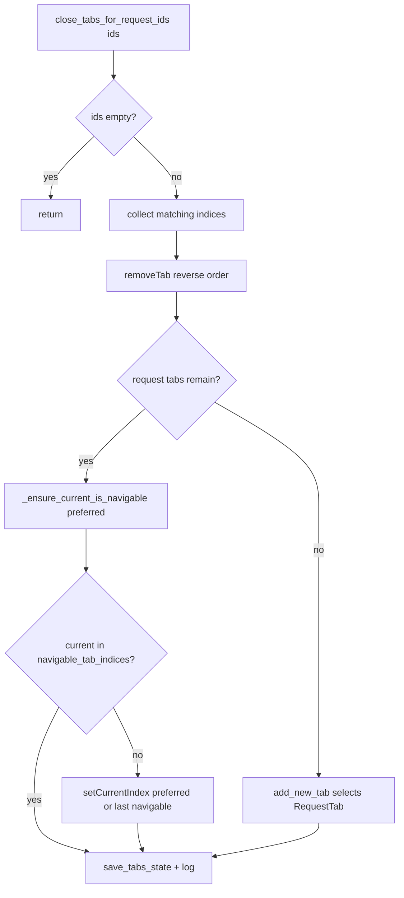
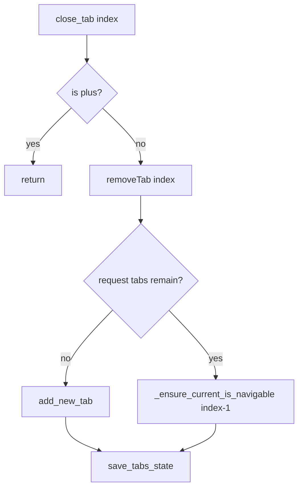

# PYPOST-831: Reselect navigable tab after close_tabs_for_request_ids

## Research

### Observed gap

- Jira: [PYPOST-831](https://pypost.atlassian.net/browse/PYPOST-831)
  (deferred from [PYPOST-824](https://pypost.atlassian.net/browse/PYPOST-824)
  tech debt).
- PYPOST-824 fixed `TabsPresenter.close_tab` so Qt `removeTab` cannot leave
  focus on trailing `+` when request tabs remain.
- `close_tabs_for_request_ids` still loops `removeTab` without that reselect.
  Bulk-closing the rightmost open request tab(s) can leave `currentIndex` on
  `+`.

### Current paths (production)

| Piece | Path | Role |
| --- | --- | --- |
| Presenter | `pypost/ui/presenters/tabs_presenter.py` | `close_tab`, `close_tabs_for_request_ids` |
| Header | `pypost/ui/widgets/tab_header.py` | `navigable_tab_indices`, `is_plus_tab_index` |
| Wiring | `pypost/ui/main_window_signals.py` | `requests_deleted` → `close_tabs_for_request_ids` |
| Tests | `tests/test_tabs_presenter.py` | Single-close land-on-plus coverage; bulk close covers count/ids only |

`close_tab` today (after PYPOST-824):

1. Ignore close if index is plus.
2. `QTabWidget.removeTab(index)`.
3. If no request tabs remain → `add_new_tab(save_state=False)`.
4. Else if `currentIndex` not in `navigable_tab_indices()` →
   `setCurrentIndex` preferred (`index - 1` if navigable, else last navigable).
5. `save_tabs_state()`.

`close_tabs_for_request_ids` today:

1. Collect indices whose `request_data.id` is in the deleted set.
2. `removeTab` in reverse index order (no reselect).
3. If no request tabs remain → `add_new_tab(save_state=False)`.
4. `save_tabs_state()` + log.

No call to `navigable_tab_indices()` / `setCurrentIndex` after the loop.

### Root cause

Same as PYPOST-824: Qt `QTabWidget.removeTab` (via `QTabBar`) advances
`currentIndex` to an adjacent tab. With layout `[R0, R1, R2, +]`, removing
`R2` (or a bulk set that includes the rightmost request tab(s)) leaves current
on `+`. Qt’s `QTabBar.selectionBehaviorOnRemove` only chooses left/right/previous
among remaining tabs; it cannot skip a trailing non-request placeholder, so
product focus must stay explicit via `navigable_tab_indices()`.

References:

- [QTabBar.selectionBehaviorOnRemove](https://doc.qt.io/qt-6/qtabbar.html#selectionBehaviorOnRemove-prop)
- [QTabWidget.removeTab](https://doc.qt.io/qt-6/qtabwidget.html#removeTab)
- Prior art: `ai-tasks/PYPOST-824/20-architecture.md`,
  `ai-tasks/PYPOST-824/60-tech-debt.md`

### Existing coverage gap

Bulk tests assert closed counts and replacement blank tab, not
`currentIndex != plus`. Single-close tests
(`test_close_rightmost_of_*_does_not_land_on_plus`) already lock the
single-path rule.

## Implementation Plan

1. Extract the PYPOST-824 reselect body into a private helper on
   `TabsPresenter`, e.g. `_ensure_current_is_navigable(preferred_index: int)`.
2. Call that helper from `close_tab` (behavior-preserving refactor of the
   existing inline block).
3. After the `removeTab` loop in `close_tabs_for_request_ids`, when request
   tabs remain, call the same helper once (not per removal) so focus ends on a
   navigable request tab.
4. Preferred index for bulk: `max(0, min(indices_to_close) - 1)` — left neighbor
   of the leftmost closed tab; helper falls back to last navigable if preferred
   is not in `navigable_tab_indices()`.
5. Leave the zero-request-tab branch unchanged (`add_new_tab` already focuses
   a replacement RequestTab).
6. Add presenter tests that fail if bulk close of rightmost open request
   tab(s) leaves current on `+` while a request tab remains; keep existing
   single-close tests green.
7. Verify via
   `make test PYTEST_ARGS="tests/test_tabs_presenter.py -k 'close_tabs_for_request_ids or land_on_plus or close_tab' -v"`.

Out of scope: changing when bulk close runs, plus-tab chrome, keyboard
next/previous beyond reuse of `navigable_tab_indices()`, MainWindow e2e.

## Architecture

### Flow after fix



Single-close continues to use the same helper after one `removeTab`:



### Modules and responsibilities

| Module | Responsibility | Change |
| --- | --- | --- |
| `TabsPresenter._ensure_current_is_navigable` | If current not navigable and request tabs remain, `setCurrentIndex` preferred / last navigable | **New** (private) |
| `TabsPresenter.close_tab` | Single remove + ensure navigable | Refactor to call helper |
| `TabsPresenter.close_tabs_for_request_ids` | Bulk remove + ensure navigable once | **Yes** |
| `RequestTabHeader.navigable_tab_indices` | Request-tab indices (exclude `+`) | Reuse only |
| `main_window_signals` | Delete → bulk close wiring | No |
| `tests/test_tabs_presenter.py` | Bulk close must not land on `+` | **New / extended** |

### Selected patterns

- **MVP presenter ownership:** focus after structural tab-bar changes stays in
  `TabsPresenter`; header only reports navigable indices.
- **DRY helper:** second call site justifies
  `_ensure_current_is_navigable` (as noted in PYPOST-824 tech debt) instead of
  duplicating the inline PYPOST-824 block.
- **Explicit reselect over Qt remove behavior:** trailing `+` is not a request
  workspace; `selectionBehaviorOnRemove` cannot express “skip plus”.
- **Once-per-bulk-operation ensure:** avoid N intermediate `setCurrentIndex`
  calls during reverse `removeTab`; one post-loop ensure matches the product
  outcome and keeps the empty → `add_new_tab` path simple.

### Interfaces

```python
def _ensure_current_is_navigable(self, preferred_index: int) -> None:
    """If current is not a request tab, select preferred or last navigable."""
```

No new public APIs. Callers:

- `close_tab`: `preferred_index = index - 1` (same as today).
- `close_tabs_for_request_ids`: `preferred_index = max(0, min(indices_to_close) - 1)`
  when `indices_to_close` is non-empty and request tabs remain.

## Q&A

- **Q:** Why not call `close_tab` in a loop for bulk close?
  **A:** Bulk path already batches reverse `removeTab`, a single empty check,
  one `save_tabs_state`, and one log line. Routing through `close_tab` would
  multiply save/log and risk double `add_new_tab` mid-loop. Share only the
  reselect helper.
- **Q:** Why extract `_ensure_current_is_navigable` now?
  **A:** Second production call site. PYPOST-824 deferred extraction until a
  third site; for this debt ticket, extraction is the cleanest way to apply
  “the same” rule without copy-paste.
- **Q:** Why one ensure after the bulk loop instead of after each `removeTab`?
  **A:** Requirements only constrain the final active tab. One ensure is
  enough, avoids flicker, and keeps preferred-index logic tied to the closed
  set (`min(indices_to_close) - 1`).
- **Q:** Does `selectionBehaviorOnRemove` fix this without a helper?
  **A:** No. Qt still selects an adjacent remaining tab, which can be `+`.
- **Q:** Must single-close tests change?
  **A:** No functional change expected; refactor of `close_tab` should keep
  existing land-on-plus tests green.
- **Q:** What if bulk close removes every request tab?
  **A:** Existing `add_new_tab` branch runs; helper is not needed (no
  navigable indices until the blank tab exists, and `add_new_tab` focuses it).
