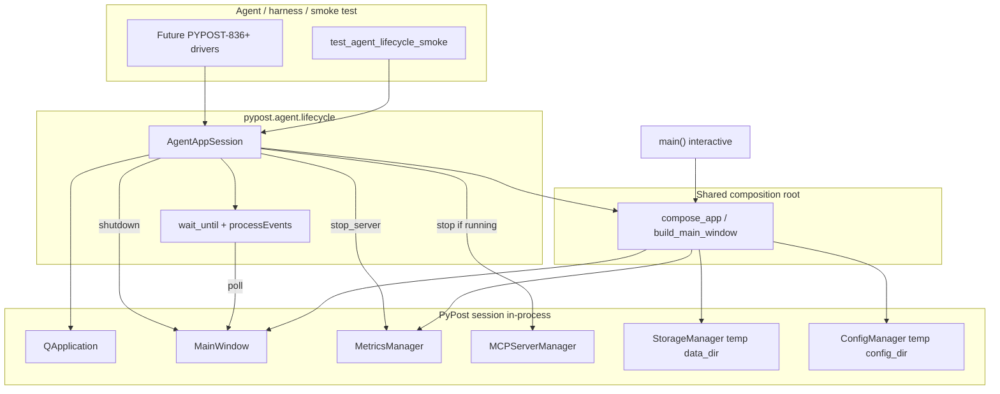

# PYPOST-833: Agent app lifecycle — launch, ready, shutdown

## Research

### Jira / epic context

- Story: [PYPOST-833](https://pypost.atlassian.net/browse/PYPOST-833) — launch → ready →
  shutdown contract for agent/harness use.
- Epic: [PYPOST-832](https://pypost.atlassian.net/browse/PYPOST-832) — E2E Agent UI Testing.
- Siblings (out of scope here): PYPOST-834 identity, PYPOST-835 snapshots, PYPOST-836 actions,
  PYPOST-837 settle waits, PYPOST-838 golden flow, PYPOST-839 broader docs/`make` packaging.

### Current production startup / shutdown

| Piece | Path | Behavior today |
| --- | --- | --- |
| Human launch | `make run` → `PYTHONPATH=. … pypost/main.py` | Interactive desktop; no agent ready contract |
| Composition root | `pypost/main.py` | `QApplication` → managers → `MainWindow` → `show()` → `app.exec()` |
| Startup logs | `app_startup`, `main_window_initialized`, `app_shutdown` | Catalogued in `doc/dev/logging.md` |
| Async ready gates | `MainWindow` `_startup_collections_ready` / `_startup_env_ready` | Private; tab/tree restore waits on both (PYPOST-509 / PYPOST-754) |
| Exit path | `MainWindow.handle_exit` | Flushes `StateManager`, optionally `env.wait_storage_idle()`, then `QApplication.quit()` |
| Post-`exec` cleanup | `main.py` | `metrics_manager.stop_server()` after event loop returns |

Gaps for agents:

1. No documented harness API distinct from interactive `make run`.
2. Ready state is internal; agents cannot poll or wait on a public condition.
3. No smoke that asserts launch → ready → clean shutdown under offscreen Qt.
4. Default `main()` uses user config/data dirs and fixed metrics ports — unsuitable for
   parallel/CI agent sessions without isolation.

### Offscreen / CI Qt patterns (repo)

- `tests/conftest.py` sets `QT_QPA_PLATFORM=offscreen` before Qt imports.
- `Makefile` `test` / `test-slow` / `test-cov` export the same platform.
- Shared `qapp` fixture: `QApplication.instance() or QApplication([])` (module scope).
- Project docs: `doc/dev/gui_testing.md` — offscreen is sufficient; Xvfb not required.
- Bounded poll helper: `tests/helpers/qt_wait.wait_until` (processEvents + wall-clock timeout).
- Heavy nested waits: `_process_until` pattern in `tests/test_env_storage_responsiveness.py`
  (PYPOST-823) — deadline + posted quit so pytest-timeout can still kill hangs.

### Process / lifecycle patterns (repo)

- In-process Qt tests dominate; there is **no** existing agent subprocess harness.
- `tests/helpers/mcp_live_server.LiveMCPServer`: start → `wait_for_port` → stop/join —
  good template for “ready then tear down” and ephemeral ports.
- Metrics/MCP servers use background threads + stop events; `main.py` stops metrics after
  `app.exec()` returns. Agent shutdown must mirror that (and stop MCP if started).
- `ConfigManager(config_dir=…)` and `StorageManager(data_dir=…)` already support injectable
  paths — use temp dirs for harness isolation (no leftover user locks/files).

### External guidance (web)

- Qt for Python: single `QApplication`; event loop via `exec()`; prefer cleanup on
  `aboutToQuit` because `exec()` may not return on some platforms
  ([QCoreApplication](https://doc.qt.io/qtforpython-6/PySide6/QtCore/QCoreApplication.html)).
- Headless CI: `QT_QPA_PLATFORM=offscreen` is the standard approach (matches this repo);
  Xvfb is optional when offscreen is enough.
- External Qt agent harnesses (e.g. qt-pilot) use **subprocess + IPC** inside Xvfb. That is
  heavier than needed for PYPOST-833 and duplicates work siblings will own for actions.
  Prefer **in-process** lifecycle aligned with existing GUI tests.

### Architectural decision: in-process session (not subprocess)

| Option | Pros | Cons |
| --- | --- | --- |
| **A. In-process `AgentAppSession`** | Matches `qapp` + widget tests; siblings can drive the same `MainWindow`; no IPC | Same-process port/data isolation required |
| B. Subprocess + ready via stdout/file | Real process boundaries; orphan detection is literal | Needs IPC for later actions/snapshots; larger scope than FR set |

**Choose A.** Lifecycle contract lives in-process; smoke proves ready/shutdown without
inventing IPC. Orphan/lock requirements map to: stop background servers, quit Qt cleanly,
release temp dirs, and leave no listening metrics/MCP ports from the session.

## Implementation Plan

1. **Expose UI ready on `MainWindow`** — public `@property is_ui_ready: bool` (optional
   `ui_ready` signal later if a sibling needs it) set when collections + environments
   startup loads complete and `_maybe_complete_startup_restore` has run (same gate as
   today, made observable).
2. **Factor shared composition** — extract a small factory from `main.py` (e.g.
   `compose_app(...)` / `build_main_window(...)`) that wires managers → `MainWindow` with
   injectable `config_dir` / `data_dir` / metrics bind. Both interactive `main()` and
   `AgentAppSession` call this factory so agent isolation does not fork a second
   composition root.
3. **Add `AgentAppSession` harness** under `pypost/agent/` (package for epic growth) that:
   - Sets/ensures `QT_QPA_PLATFORM=offscreen` when requested (default for agent/CI).
   - Creates `QApplication` if needed (reuse instance rule).
   - Calls the shared composition factory with **isolated** dirs and an **ephemeral**
     metrics port (`free_port` pattern).
   - Shows `MainWindow`, then waits for ready via `wait_until`-style
     **processEvents pumping** (see Event-loop model) — never `app.exec()` for the
     agent session.
   - On shutdown: `handle_exit()` (or equivalent), stop metrics/MCP, close window; ready
     timeouts raise explicit `TimeoutError`.
4. **Smoke test** `tests/test_agent_lifecycle_smoke.py` — launch → assert ready → shutdown;
   runnable under `make test` (offscreen). Mark timeout per `.cursor/lsr/do-testing.md`.
5. **Minimal contract docs** — short section in `doc/dev/` (or stub linked from
   `doc/dev/gui_testing.md`) stating that FR1’s documented entry point **is**
   `pypost.agent.lifecycle.AgentAppSession`. Broader agent-e2e `make` packaging is
   deferred to PYPOST-839 (optional; not required for FR1).
6. **Do not change** default interactive `make run` UX beyond readiness exposure and the
   shared-factory extract.

## Architecture

### Module diagram



### Module responsibilities

| Module | Responsibility |
| --- | --- |
| `pypost/agent/__init__.py` | Public re-exports for harness API |
| `pypost/agent/lifecycle.py` | `AgentAppSession`: launch, wait-ready, shutdown; env/offscreen; isolation |
| `pypost/main.py` (or small helper next to it) | Shared composition factory; `main()` uses it then `app.exec()` |
| `pypost/ui/main_window.py` | Public `@property is_ui_ready: bool`; set true after startup restore gate |
| `tests/helpers/qt_wait.py` | Reuse `wait_until` for ready polling (processEvents + deadline) |
| `tests/test_agent_lifecycle_smoke.py` | FR7: launch → ready → shutdown |
| `doc/dev/agent_lifecycle.md` (or short addition to `gui_testing.md`) | Documented contract for agents/maintainers |

### Composition: shared factory (not a mirrored root)

`AgentAppSession` must **not** copy-paste `main()`’s manager wiring as a second composition
root. Cost of a shared factory is low (`main.py` is already a linear composition root with
injectable dirs/ports). Decision:

- Extract a shared builder (name TBD in Step 3, e.g. `compose_app` / `build_main_window`)
  that returns the wired `MainWindow` plus handles needed for shutdown (metrics, MCP).
- `main()` calls the factory with default user paths/ports, then `show()` + `app.exec()`.
- `AgentAppSession` calls the **same** factory with temp dirs + ephemeral metrics port,
  then `show()` + processEvents wait (no `exec()`).

Intentional divergence is only the **event-loop ownership** and isolation knobs — not the
object graph.

### Event-loop model

| Path | Event loop | Ready wait |
| --- | --- | --- |
| Interactive `main()` / `make run` | Blocks on `app.exec()` until quit | N/A (human) |
| `AgentAppSession` | Never calls `app.exec()`; pumps via processEvents | Poll `is_ui_ready` until true or timeout |

Agent sessions keep the caller’s thread free for harness/smoke code. Startup and ready use
**processEvents-style pumping** via `tests.helpers.qt_wait.wait_until` (or an equivalent
bounded pump next to the session) — the same pattern as existing GUI tests.

Rationale: hanging `app.exec()` would freeze the harness until quit and force IPC or a
second thread for “wait until ready then drive UI.” Shutdown uses `handle_exit()` /
`QApplication.quit()` equivalents without relying on `exec()` having been entered.

### Interaction scheme

1. **Launch:** harness ensures offscreen (when configured), creates/reuses `QApplication`,
   calls shared composition factory with isolated dirs/ports, `show()`, pumps pending
   events (no `app.exec()`).
2. **Ready:** poll `window.is_ui_ready` via `wait_until` (processEvents + wall-clock
   timeout) until true or `TimeoutError`. Ready means startup collections + environments
   loaded and restore path completed — safe for sibling UI actions to *begin*, not “all
   background work forever idle.”
3. **Use (siblings):** same process holds `session.window`; further pumps/waits stay
   processEvents-based (sibling stories).
4. **Shutdown:** `handle_exit()` → stop metrics (and MCP if up) → ensure no session-owned
   listeners remain; context manager `finally` always runs cleanup on failure.
5. **Smoke:** only steps 1–2–4; no product flow.

### Selected patterns

| Pattern | Why |
| --- | --- |
| Context manager / session object | Guarantees shutdown on exceptions (same idea as `live_mcp_server`) |
| Shared composition factory | One object graph for `main()` and agents; isolation via injectables |
| `@property is_ui_ready: bool` | Single pollable shape; optional signal deferred unless a sibling needs it |
| Bounded poll (`wait_until` / processEvents) | Distinguishes not-ready vs hang; clear `TimeoutError`; no `exec()` hang |
| Offscreen Qt platform | CI / display-less requirement; already project standard |
| Temp config/data dirs | Avoid user-dir contention and leftover locks between runs |

### Main interfaces

```python
class AgentAppSession:
    """In-process PyPost lifecycle for agents and smoke tests.

    Does not call QApplication.exec(). Ready wait pumps events via wait_until.
    """

    def __init__(
        self,
        *,
        offscreen: bool = True,
        config_dir: Path | None = None,  # default: tempfile
        data_dir: Path | None = None,    # default: tempfile
        ready_timeout: float = 30.0,
    ) -> None: ...

    @property
    def app(self) -> QApplication: ...

    @property
    def window(self) -> MainWindow: ...

    def start(self) -> AgentAppSession:
        """Launch, pump events until is_ui_ready, or raise TimeoutError."""
        ...

    def shutdown(self) -> None:
        """Request clean exit; stop background servers; release session resources."""
        ...

    def __enter__(self) -> AgentAppSession: ...
    def __exit__(self, *exc: object) -> None: ...


# On MainWindow (production surface for readiness) — property, not a bare method:
@property
def is_ui_ready(self) -> bool:
    """True after startup collections+env loads and restore gate completed."""
    ...
```

### FR1 documented entry point

**FR1 is satisfied by `pypost.agent.lifecycle.AgentAppSession` alone** — the documented,
project-supported automation entry point (importable under `PYTHONPATH=.` / the installed
package layout used by tests).

| Concern | Owner |
| --- | --- |
| Documented agent launch API | This story: `AgentAppSession` |
| Quality-gate proof | This story: smoke under `make test` (already offscreen) |
| Human interactive launch | Unchanged: `make run` → `main()` |
| Optional `make agent-*` / epic packaging | **Deferred to PYPOST-839** — not required for FR1 |

No separate CLI or Makefile target is required in PYPOST-833 for FR1.

### Dependency rules

- `pypost.agent` may depend on `pypost.main` helpers / UI / core.
- Production UI must **not** depend on `pypost.agent` (one-way).
- Smoke tests depend on agent package + `qt_wait`; must not require display.
- Sibling stories extend the session (actions on `session.window`); they do not redefine
  launch/ready/shutdown.

### Failure / observability expectations

| Failure | Expected behavior |
| --- | --- |
| Never becomes ready | `TimeoutError` with message naming ready condition; shutdown still attempted |
| Shutdown hang | Existing storage-idle wait + pytest timeout; session `finally` stops servers |
| Port bind conflict | Ephemeral ports for metrics (and MCP when started) |

### Out of scope (architecture boundary)

- Widget `objectName` conventions (PYPOST-834), snapshots (835), click/type (836),
  post-action settle (837), golden flow (838), epic-wide `make agent-e2e` packaging (839).

## Q&A

- **Q:** Why not subprocess for “real” process orphans?
  **A:** Sibling action/snapshot stories need a live `MainWindow`. Subprocess+IPC is a
  larger design (qt-pilot style) and is not required for the FR set. Clean shutdown is
  defined as stopping session-owned background servers + releasing temp dirs without
  leaving a hung Qt session (agent path never enters a blocking `app.exec()`).

- **Q:** Is `main_window_initialized` enough for ready?
  **A:** No. That log fires before async collections/env load. Ready must wait for the
  existing startup restore gate (`_startup_collections_ready` and `_startup_env_ready`).

- **Q:** Should ready wait for history async load?
  **A:** No for this story. History uses `defer_initial_load=True`; “UI actions may begin”
  aligns with collections+env restore already used for tab/tree restore.

- **Q:** Does this replace `make run`?
  **A:** No. Humans keep interactive `app.exec()` launch. Agents use `AgentAppSession`
  (processEvents wait). Optional Makefile packaging is PYPOST-839.

- **Q:** Does FR1 require a `make` target?
  **A:** No. `AgentAppSession` is the documented entry point. A `make agent-*` target is
  optional and deferred to PYPOST-839.

- **Q:** Why not call `app.exec()` inside `AgentAppSession`?
  **A:** `exec()` blocks until quit; the harness could not wait-for-ready then drive the
  same-process UI. Use processEvents pumping (`wait_until`) like existing GUI tests.

- **Q:** Method vs property for `is_ui_ready`?
  **A:** Prefer `@property` returning `bool` so callers poll `window.is_ui_ready`
  consistently. An optional `ui_ready` signal may be added later if a sibling needs it;
  it is not required for FR3.

- **Q:** Shared factory or intentional mirror of `main.py`?
  **A:** Shared factory. Wiring is already a short composition root; duplicating it in
  `AgentAppSession` would drift. Only event-loop ownership and isolation knobs differ.

- **Q:** Where do docs live vs PYPOST-839?
  **A:** This story states the lifecycle contract (entry = `AgentAppSession`, ready,
  shutdown, event-loop model). Epic-wide agent-e2e Makefile/docs packaging stays in
  PYPOST-839.

- **Q:** Why `pypost/agent/` instead of only `tests/helpers/`?
  **A:** Agents and future MCP/UI tools need an importable product-adjacent API, not a
  test-only helper. Smoke tests then consume the same API.
