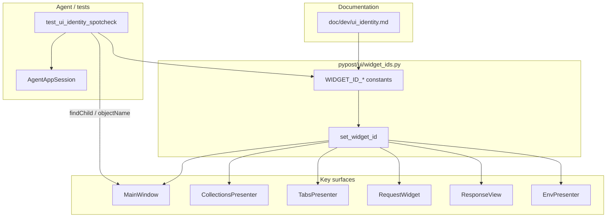

# PYPOST-834: Stable UI identity for key widgets

## Research

### Jira / epic context

- Story: [PYPOST-834](https://pypost.atlassian.net/browse/PYPOST-834) — stable UI
  identity for key surfaces.
- Epic: [PYPOST-832](https://pypost.atlassian.net/browse/PYPOST-832) — E2E Agent UI
  Testing.
- Builds on: [PYPOST-833](https://pypost.atlassian.net/browse/PYPOST-833)
  (`AgentAppSession`, `MainWindow.is_ui_ready`).
- Siblings (out of scope): PYPOST-835 snapshots, PYPOST-836 actions, PYPOST-837
  settle waits, PYPOST-838 golden flow, PYPOST-839 packaging.

### Current identity state in the repo

| Surface | Where built | Identity today |
| --- | --- | --- |
| Main window | `pypost/ui/main_window.py` | No `objectName` |
| Collection tree | `CollectionsPresenter._view` (`QTreeView`) | None |
| Request tabs | `TabsPresenter._tabs` (`QTabWidget`) | None (plus tab has
  `plus_tab_placeholder`) |
| URL / method / Send | `RequestWidget` in `request_editor.py` | Attribute names
  only (`url_input`, `method_combo`, `send_btn`) |
| Response panel | `ResponseView` | None |
| Environments entry | `EnvPresenter` (`_env_selector`, `_manage_btn`, `_widget`) | None |
| Settings entry | `MainWindow.settings_btn` | None |

Only existing `setObjectName` in product UI: `plus_tab_placeholder` on the trailing
plus-tab placeholder (`tab_header.py`). Theme tests use `qapp.style().objectName()`
for Fusion style detection — unrelated to widget identity.

Agents cannot use Python attribute names across process boundaries or snapshot tools;
they need Qt-level names discoverable via `findChild` / accessibility trees.

### Qt / PySide6 guidance (web + project stack)

- Project pins **PySide6 6.11.1** (`pyproject.toml`) — supports
  `QWidget.accessibleIdentifier` (since Qt 6.9) in addition to classic
  `QObject.objectName`.
- Industry automation practice (Squish / Qt testing — see Qt knowledge base
  “Explicitly Naming Objects”): set **`objectName`** explicitly so tools and
  `findChild` can locate widgets.
- Qt docs: `accessibleName` / `accessibleDescription` are **localized**,
  user-facing strings for assistive tech — **not** suitable as the sole stable
  automation key.
- Qt 6.9+ `accessibleIdentifier` is a fixed programmatic id for AT/tests; useful
  as a mirror of `objectName`, not a replacement for `findChild` (lookup still
  typically uses `objectName`).

**Decision:** Primary contract = **`objectName`**. Optionally mirror the same
string on `accessibleIdentifier` where the widget is a `QWidget` (for AT/tools).
Do **not** use `accessibleName` or button/label text as the agent identity.

### Lookup scoping for per-tab controls

Each `RequestTab` owns its own `RequestWidget` + `ResponseView`. If every tab
sets the same `objectName` on URL/Send/response, `MainWindow.findChild(...)`
returns the **first** match in the tree — which may not be the active tab.

**Decision:** Use the **same** stable names on every tab’s controls (names are
surface roles, not instance ids). Document that agents must scope lookup to the
**current** `RequestTab` (or walk `findChildren` and filter by current widget).
Spot-check asserts identities on the current tab after ready.

### Theme / locale stability

- Theme changes stylesheets/fonts; they must **not** rewrite `objectName`.
- Visible strings (`"Send"`, `"Settings"`) may change with future i18n; identities
  must be English snake_case constants, never derived from `text()` /
  `windowTitle()`.

## Implementation Plan

1. **Constants module** `pypost/ui/widget_ids.py` — canonical string constants for
   key surfaces; single source of truth for production setters, docs, and tests.
2. **Helper** `set_widget_id(widget, widget_id)` in the same module — sets
   `objectName`; if the object is a `QWidget`, also sets `accessibleIdentifier`
   to the same value (best-effort; skip if API missing).
3. **Apply at construction** on key surfaces (no deferred rename on theme apply):
   - `MainWindow` → main window + settings button
   - `CollectionsPresenter` → tree view
   - `TabsPresenter` → tab widget
   - `RequestWidget` → method combo, URL input, Send button
   - `ResponseView` → root panel
   - `EnvPresenter` → env bar container, env selector, Manage button
4. **Document convention** in `doc/dev/ui_identity.md`; link from
   `doc/dev/agent_lifecycle.md` and/or `gui_testing.md`.
5. **Spot-check** `tests/test_ui_identity_spotcheck.py` — `AgentAppSession` →
   ready → assert each key identity via `objectName` / `findChild` (scoped for
   per-tab controls). Timeout per `.cursor/lsr/do-testing.md`.
6. **Do not** invent snapshot/action APIs; siblings consume these ids.

## Architecture

### Module diagram



### Module responsibilities

| Module | Responsibility |
| --- | --- |
| `pypost/ui/widget_ids.py` | Canonical id strings + `set_widget_id` helper |
| `MainWindow` | Set ids on window and settings entry |
| `CollectionsPresenter` | Set id on collection tree view |
| `TabsPresenter` | Set id on request `QTabWidget` |
| `RequestWidget` | Set ids on method, URL, Send |
| `ResponseView` | Set id on response panel root |
| `EnvPresenter` | Set ids on environments entry widgets |
| `doc/dev/ui_identity.md` | Convention + catalog of key ids |
| `tests/test_ui_identity_spotcheck.py` | FR10 spot-check after UI ready |

### Naming convention (contract)

| Rule | Detail |
| --- | --- |
| Form | `pypost_<surface>` snake_case ASCII |
| Prefix | Always `pypost_` to avoid clashing with Qt internals / styles |
| Stability | Literal constants; never derived from visible text |
| Primary API | `QObject.objectName` |
| Mirror | `QWidget.accessibleIdentifier` = same string when applicable |
| Not identity | `accessibleName`, `windowTitle`, button `text()`, stylesheet object names |
| Uniqueness | One role name per surface type; per-tab controls share the role name |
| Lookup | Window-level for global chrome; **current tab** scope for URL/method/Send/response |

### Canonical key identities

| Constant | Value | Widget |
| --- | --- | --- |
| `MAIN_WINDOW` | `pypost_main_window` | `MainWindow` |
| `COLLECTION_TREE` | `pypost_collection_tree` | Collections `QTreeView` |
| `REQUEST_TABS` | `pypost_request_tabs` | Request `QTabWidget` |
| `METHOD_COMBO` | `pypost_method_combo` | Method `QComboBox` |
| `URL_INPUT` | `pypost_url_input` | URL line edit |
| `SEND_BUTTON` | `pypost_send_button` | Send `QPushButton` |
| `RESPONSE_PANEL` | `pypost_response_panel` | `ResponseView` root |
| `ENV_BAR` | `pypost_env_bar` | Environments top-bar container |
| `ENV_SELECTOR` | `pypost_env_selector` | Environment `QComboBox` |
| `ENV_MANAGE_BUTTON` | `pypost_env_manage_button` | Manage environments button |
| `SETTINGS_BUTTON` | `pypost_settings_button` | Settings entry button |

### Main interfaces

```python
# pypost/ui/widget_ids.py
MAIN_WINDOW = "pypost_main_window"
COLLECTION_TREE = "pypost_collection_tree"
REQUEST_TABS = "pypost_request_tabs"
METHOD_COMBO = "pypost_method_combo"
URL_INPUT = "pypost_url_input"
SEND_BUTTON = "pypost_send_button"
RESPONSE_PANEL = "pypost_response_panel"
ENV_BAR = "pypost_env_bar"
ENV_SELECTOR = "pypost_env_selector"
ENV_MANAGE_BUTTON = "pypost_env_manage_button"
SETTINGS_BUTTON = "pypost_settings_button"

def set_widget_id(widget: QObject, widget_id: str) -> None:
    """Set objectName and mirror accessibleIdentifier on QWidgets."""
    ...
```

Spot-check sketch:

```python
with AgentAppSession(offscreen=True) as session:
    w = session.window
    assert w.objectName() == MAIN_WINDOW
    assert w.findChild(QTreeView, COLLECTION_TREE) is not None
    tab = w.tabs._tabs.currentWidget()  # or public accessor
    assert tab.findChild(QObject, URL_INPUT) is not None
    ...
```

Prefer public paths where available (`collections.widget`, `tabs.widget`,
`env.widget`) over private attributes in the spot-check.

### Interaction scheme

1. Production constructors call `set_widget_id` once when widgets are created.
2. Theme/`apply_settings` does not touch ids.
3. After `is_ui_ready`, agents resolve widgets by constant ids.
4. Spot-check proves FR2–FR8 via those constants after ready.

### Selected patterns

| Pattern | Why |
| --- | --- |
| Central constants module | One catalog; docs/tests/code stay aligned |
| `objectName` primary | `findChild`, Squish-style tools, all Qt versions used here |
| Mirror `accessibleIdentifier` | Extra AT/test hook on PySide6 6.11 without locale coupling |
| Shared role names per tab | Stable contract; lookup scoped to current tab |
| AgentAppSession spot-check | Reuses PYPOST-833 ready gate; offscreen CI |

### Dependency rules

- `pypost/ui/*` may import `widget_ids`; production must **not** import
  `pypost.agent`.
- Tests may import `widget_ids` + `AgentAppSession`.
- Sibling stories import constants; they do not redefine strings inline.

### Out of scope (architecture boundary)

- Naming every dialog/history/MCP control.
- Snapshot tree generation (835), click/type (836), settle waits (837).
- Changing `plus_tab_placeholder` unless needed for consistency (optional
  rename deferred as non-blocker).

## Q&A

- **Q:** Why not only `accessibleIdentifier`?
  **A:** `findChild` and most Qt automation still key off `objectName`. Mirror
  both for AT; contract is `objectName`.

- **Q:** Why not `accessibleName`?
  **A:** Qt documents it as localized user-facing text — unstable across locale.

- **Q:** Unique per-tab objectNames?
  **A:** No — role names stay stable; agents scope to the current tab.

- **Q:** Does theme apply clear objectNames?
  **A:** No; setters run at construction only. Spot-check after ready is enough
  for this story; optional theme re-apply assert can be a follow-up.

- **Q:** Where do docs live vs PYPOST-839?
  **A:** This story adds `doc/dev/ui_identity.md` and links from lifecycle/GUI
  testing docs. Epic packaging stays in PYPOST-839.
