# PYPOST-835: UI state snapshot for agents

## Research

### Jira / epic context

- Story: [PYPOST-835](https://pypost.atlassian.net/browse/PYPOST-835) — UI state
  snapshot for agents.
- Epic: [PYPOST-832](https://pypost.atlassian.net/browse/PYPOST-832) — E2E Agent UI
  Testing.
- Builds on: [PYPOST-833](https://pypost.atlassian.net/browse/PYPOST-833)
  (`AgentAppSession`, `MainWindow.is_ui_ready`) and
  [PYPOST-834](https://pypost.atlassian.net/browse/PYPOST-834)
  (`pypost.ui.widget_ids`, `doc/dev/ui_identity.md`).
- Siblings (out of scope): PYPOST-836 actions, PYPOST-837 settle waits,
  PYPOST-838 golden flow, PYPOST-839 packaging.

### Existing MCP server patterns (what “tool” means here)

| Piece | Role today |
| --- | --- |
| `MCPServerImpl` | Exposes **collection HTTP requests** as MCP `list_tools` / `call_tool` |
| Registration | `register_tools(requests)` from `expose_as_mcp` requests; not UI ops |
| Transport | Streamable HTTP + legacy SSE via Starlette |
| Secrets | `McpSecretsPolicy` (schema filter) + `McpResponseSanitizer` (response text) |
| Env suppliers | `EnvVariableSnapshot` via `EnvPresenter` → `MCPServerManager` |

The product MCP server is an **HTTP-tool gateway for agents**, not an in-process
UI control plane. Adding `ui_snapshot` there would mix cross-process network MCP
with Qt widget inspection, require a live MCP server during harness smoke, and
duplicate the in-process epic pattern from PYPOST-833/834.

**Decision:** Snapshot is a **Python agent API** under `pypost.agent`, callable
from `AgentAppSession` / tests after `is_ui_ready`. It is **not** a new network
MCP tool on `MCPServerImpl`. Epic packaging (839) may later wrap this API; this
story does not invent a parallel MCP surface.

### Existing secrets / masking policy (reuse, do not reinvent)

| Surface | Module | Agent-/log-visible rule |
| --- | --- | --- |
| Env UI display | `HIDDEN_MASK` (`********`) in `pypost.core.constants` | Hidden env values shown masked in manager/hover |
| History write | `SensitiveDataMaskingPolicy` | Hidden-derived + heuristic redaction before persist |
| MCP responses | `McpResponseSanitizer` → `sensitive_text_sanitizer` | Redact hidden values + Bearer/query/JSON heuristics |
| MCP `list_tools` | `McpSecretsPolicy` | Strip env/hidden keys from agent-visible schema |
| Env supplier cache | `EnvVariableSnapshot` | Thread-safe copies of vars + `hidden_keys` |

Shared text redaction entry point for agent-visible strings:

```python
from pypost.core.sensitive_text_sanitizer import sanitize_text

sanitize_text(text, env_vars=env_vars, hidden_keys=hidden_keys)
```

That replaces cleartext occurrences of hidden env **values** and applies the same
heuristic redactions MCP/history already use (`***` placeholder for heuristics;
UI display mask remains `********` where the widget already shows it).

**Decision:** Snapshot string values pass through `sanitize_text` with the active
environment’s variables and `hidden_keys` (from `MainWindow.env` /
`EnvVariableSnapshot`). No new secrets model, no cleartext back door for hidden
keys. Widgets that already display `HIDDEN_MASK` stay as displayed.

### Widget identity / accessibility / Qt feed for a snapshot

| Source | Use for snapshot |
| --- | --- |
| `objectName` / `widget_ids` | Stable **name** when set (`pypost_*`) |
| `accessibleIdentifier` | Mirror of id (834); optional confirm, not primary |
| `QWidget.isVisible()` | Gate for “visible UI” |
| Widget type / Qt class | Stable **role** mapping (e.g. `line_edit`, `button`) |
| Type-specific getters | **value** (`text()`, `currentText()`, tab title, etc.) |
| Parent → children | **hierarchy** |
| `QAccessibleInterface` | Optional enrichment later; **not** primary walker |

Qt docs ([QAccessibleInterface](https://doc.qt.io/qtforpython-6/PySide6/QtGui/QAccessibleInterface.html),
[Accessibility for QWidget](https://doc.qt.io/qt-6/accessible-qwidget.html)): AT
clients walk `role` / `text` / `child` trees. In practice for this repo:

- Offscreen CI may have incomplete AT plugin coverage.
- Agents already key off `objectName` (834).
- Masking needs env context the AT tree does not carry.

**Decision:** Primary capture = **visible `QWidget` tree walk** from
`MainWindow`, mapping class → role, `objectName` → name, typed getters → value,
children → hierarchy. Do not depend on `QAccessible.queryAccessibleInterface` for
v1 correctness.

### Architectural decision: agent API vs MCP tool

| Option | Pros | Cons |
| --- | --- | --- |
| **A. `pypost.agent` Python snapshot API** | Matches 833/834; works with offscreen `AgentAppSession`; easy unit/integration tests | Out-of-process agents need a later wrapper (839+) |
| B. New `MCPServerImpl` tool | Familiar “tool” word in AC | Wrong MCP domain (HTTP requests); needs MCP up; Qt on network path |
| C. Screenshot-only | Easy | Fails FR structured shape / AC |

**Choose A.**

## Implementation Plan

1. **Snapshot types + capture** in `pypost/agent/ui_snapshot.py`:
   - Public `capture_ui_snapshot(window) -> dict` (JSON-serializable tree).
   - Optional thin `AgentAppSession.ui_snapshot()` that requires started/ready and
     delegates to `capture_ui_snapshot(self.window)`.
2. **Walker:** Recurse visible `QWidget` children from `MainWindow`; skip
   invisible widgets; prune pure layout chrome that has no name/value and no
   named/value descendants (keep hierarchy useful, not exhaustive).
3. **Role / name / value extractors** for common types used in key surfaces
   (`QLineEdit`, `QComboBox`, `QPushButton`, `QLabel`, `QTabWidget`,
   `QTreeView`/`QAbstractItemView` selection summary, `QTextEdit`/`QPlainTextEdit`
   truncated text, generic `QWidget` fallback with empty value).
4. **Masking:** Before emitting any string `value`, call
   `sanitize_text(..., env_vars=..., hidden_keys=...)` from the active env
   snapshot on `window.env` (reuse existing supplier/cache; do not read secrets
   from disk independently).
5. **Export** from `pypost.agent` (`__init__.py` / `__all__`) so harnesses import
   alongside `AgentAppSession`.
6. **Tests:**
   - Unit: shape schema + masking (hidden value redacted in a synthetic node).
   - Integration: `AgentAppSession` → ready → snapshot contains key `pypost_*`
     names and nested `children`; assert basic content (e.g. main window name,
     collection tree / tabs present).
7. **Docs (Step 7):** Short `doc/dev/ui_snapshot.md` + links from
   `agent_lifecycle.md` / `ui_identity.md` — not required to finish architecture;
   noted for Step 7.
8. **Do not** register MCP tools, change lifecycle ready semantics, or redefine
   widget ids.

## Architecture

### Module diagram

```mermaid
flowchart TB
  subgraph Harness["Agent / harness / tests"]
    Smoke[test_ui_snapshot_*]
    Future[PYPOST-836+ drivers]
  end

  subgraph AgentAPI["pypost.agent"]
    Session[AgentAppSession]
    SnapAPI["ui_snapshot.capture_ui_snapshot"]
  end

  subgraph UI["Visible Qt UI"]
    MW[MainWindow]
    Ids[widget_ids objectName]
    Widgets[Visible QWidget tree]
  end

  subgraph Secrets["Existing masking — reuse"]
    EnvSnap[EnvVariableSnapshot / env suppliers]
    San[sensitive_text_sanitizer.sanitize_text]
  end

  Smoke --> Session
  Future --> Session
  Smoke --> SnapAPI
  Session -->|ready window| SnapAPI
  SnapAPI -->|walk isVisible| MW
  MW --> Widgets
  Widgets --> Ids
  SnapAPI --> EnvSnap
  SnapAPI --> San
  San -->|masked values| SnapAPI
```



### Module responsibilities

| Module | Responsibility |
| --- | --- |
| `pypost/agent/ui_snapshot.py` | Capture API, walker, role/value extractors, tree dict shape |
| `pypost/agent/lifecycle.py` | Unchanged ready gate; optional `ui_snapshot()` convenience |
| `pypost/agent/__init__.py` | Export `capture_ui_snapshot` (and session helper if added) |
| `pypost/ui/widget_ids.py` | Unchanged identity constants; names appear in snapshot |
| `pypost/core/sensitive_text_sanitizer.py` | Unchanged; applied to snapshot values |
| `MainWindow` / presenters | Unchanged; provide live widgets + env for hidden keys |
| `tests/test_ui_snapshot_*.py` | Shape + masking unit tests; ready integration spot-check |
| `MCPServerImpl` | **Out of scope** — no UI snapshot tool |

### Snapshot shape (contract)

JSON-serializable tree. Each node:

| Field | Type | Meaning |
| --- | --- | --- |
| `role` | `str` | Control kind (`window`, `button`, `line_edit`, `combo_box`, `tab_widget`, `tree_view`, `text_edit`, `widget`, …) |
| `name` | `str` | `objectName` if set, else `""` |
| `value` | `str` \| `null` | Visible value/summary after masking; `null` when not applicable |
| `children` | `list` | Nested visible child nodes (same shape) |

Root is the main window node (`name` = `pypost_main_window` when 834 is applied).
Hierarchy is parent/child nesting — not a flat list.

Example (abbreviated):

```json
{
  "role": "window",
  "name": "pypost_main_window",
  "value": null,
  "children": [
    {
      "role": "tree_view",
      "name": "pypost_collection_tree",
      "value": "",
      "children": []
    },
    {
      "role": "tab_widget",
      "name": "pypost_request_tabs",
      "value": "Untitled",
      "children": [
        {
          "role": "line_edit",
          "name": "pypost_url_input",
          "value": "https://example.com",
          "children": []
        }
      ]
    }
  ]
}
```

Stability rules:

- Field names and nesting are the stable contract for tests/agents.
- `role` strings are English snake_case vocabulary owned by the snapshot module.
- Prefer including nodes with a non-empty `name` (key ids) even if value is empty.
- Truncate very long text values (response bodies) to a documented max length so
  snapshots stay verification-sized (minimalism NFR).

### Main interfaces

```python
# pypost/agent/ui_snapshot.py

def capture_ui_snapshot(window: MainWindow) -> dict[str, Any]:
    """Return a structured visible-UI tree (roles, names, values, hierarchy).

    Sensitive substrings follow sensitive_text_sanitizer with the active
    environment variables and hidden_keys. Caller should ensure is_ui_ready.
    """
    ...


# Optional convenience on AgentAppSession
def ui_snapshot(self) -> dict[str, Any]:
    """capture_ui_snapshot(self.window); requires started session."""
    ...
```

Integration sketch:

```python
with AgentAppSession(offscreen=True) as session:
    assert session.window.is_ui_ready
    snap = capture_ui_snapshot(session.window)
    assert snap["name"] == MAIN_WINDOW
    assert snap["role"] == "window"
    assert isinstance(snap["children"], list)
    # find named surfaces in the tree for post-action checks
```

### Interaction scheme

1. Agent starts `AgentAppSession` and waits until `is_ui_ready` (833).
2. Agent may act via identities (834) / future actions (836).
3. Agent calls `capture_ui_snapshot(window)` (or `session.ui_snapshot()`).
4. Walker visits visible widgets; builds role/name/value/children.
5. Every emitted string value is sanitized with active `env_vars` + `hidden_keys`.
6. Tests assert shape and presence of key named surfaces after ready.

### Selected patterns

| Pattern | Why |
| --- | --- |
| Agent package API | Aligns with 833/834 in-process epic; CI offscreen without MCP |
| Visible widget walk | Reliable under offscreen; uses `objectName` from 834 |
| Reuse `sanitize_text` | Same agent-visible redaction as MCP responses; no parallel secrets |
| Nested dict tree | Machine-checkable roles/names/values/hierarchy (FR2–FR3) |
| Pruned visibility | Minimalism NFR — verification tree, not full QObject dump |
| Session optional helper | Discoverability without forcing all callers through session |

### Dependency rules

- `pypost.agent.ui_snapshot` may import Qt widgets, `MainWindow` typing, and
  `pypost.core.sensitive_text_sanitizer`.
- Production `pypost/ui/*` must **not** import `pypost.agent`.
- Snapshot must **not** import or extend `MCPServerImpl` for v1.
- Do not duplicate `HIDDEN_MASK` / sanitizer heuristics in the agent module.

### Out of scope (architecture boundary)

- Network MCP `ui_snapshot` tool.
- Click/type/select (836), settle waits (837), golden flow (838).
- Changing widget id catalog (834) or ready semantics (833).
- Exhaustive capture of hidden/offscreen/historical widgets.
- New secrets policy or alternate mask strings for agents.
- Screenshot-as-primary verification.

## Q&A

- **Q:** Why not expose this as an MCP tool on `MCPServerImpl`?
  **A:** That server exposes HTTP collection tools to network clients. UI
  observation belongs with the in-process agent API (`AgentAppSession`), same as
  lifecycle and identity. A later packaging story can wrap the Python API if
  needed.

- **Q:** Why not walk `QAccessibleInterface` as the primary tree?
  **A:** Offscreen CI and masking needs favor a visible `QWidget` walk keyed by
  `objectName`. Accessibility can enrich later; it is not required for AC.

- **Q:** How are sensitive values handled without a new policy?
  **A:** Reuse `sanitize_text` with active env vars and `hidden_keys`, the same
  path MCP response sanitization uses. UI cells that already show `********`
  remain masked as displayed.

- **Q:** Must every widget appear?
  **A:** No. Visible widgets useful for verification — especially named key
  surfaces and controls with values — plus hierarchy. Pure unnamed chrome without
  value or named descendants may be pruned.

- **Q:** Where do env vars / hidden keys come from?
  **A:** The live `MainWindow.env` path that already feeds MCP suppliers
  (`EnvVariableSnapshot`), not a second secrets store.

- **Q:** How do tests satisfy FR5 without the golden flow (838)?
  **A:** Unit tests for shape + masking; integration after `AgentAppSession`
  ready asserting key names/basic content under `make test` / offscreen.
