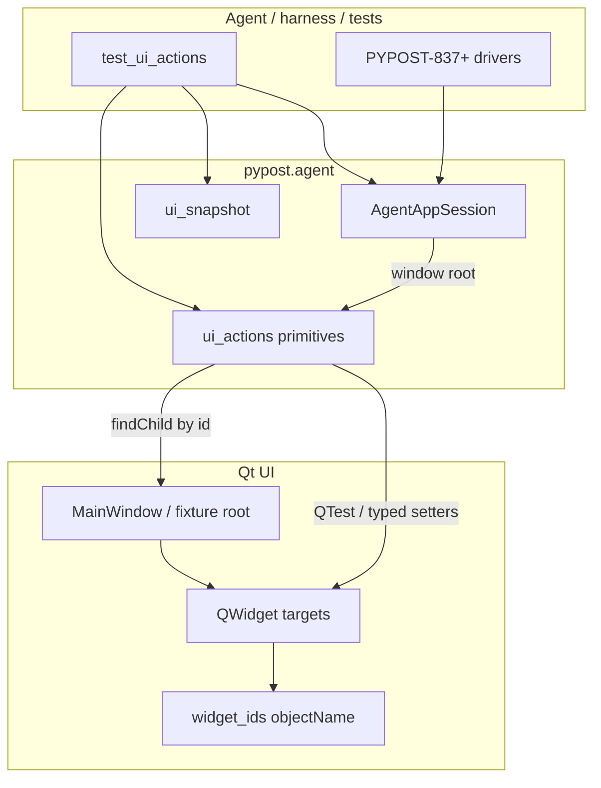

# PYPOST-836: Agent UI action tools

## Research

### Jira / epic context

- Story: [PYPOST-836](https://pypost.atlassian.net/browse/PYPOST-836) — Agent UI
  action tools.
- Epic: [PYPOST-832](https://pypost.atlassian.net/browse/PYPOST-832) — E2E Agent UI
  Testing.
- Builds on: PYPOST-833 (`AgentAppSession`), PYPOST-834 (`widget_ids`),
  PYPOST-835 (`capture_ui_snapshot` / `session.ui_snapshot()`).
- Siblings (out of scope): PYPOST-837 settle waits, PYPOST-838 golden flow,
  PYPOST-839 packaging.

### Existing agent / MCP patterns (delivery surface)

| Piece | Role today |
| --- | --- |
| `MCPServerImpl` | Exposes **collection HTTP requests** as MCP tools |
| `AgentAppSession` | In-process launch → ready → shutdown for harnesses |
| `capture_ui_snapshot` | In-process observation API under `pypost.agent` |
| `widget_ids` | Stable `objectName` identities for lookup |

Same decision as PYPOST-835: the product MCP server is an HTTP-tool gateway for
collection requests, not an in-process UI control plane. UI actions belong with
the Python agent API next to lifecycle and snapshot.

**Decision:** Actions are a **Python agent API** under `pypost.agent`, callable
from `AgentAppSession` / tests after `is_ui_ready`. They are **not** new network
MCP tools on `MCPServerImpl`. Packaging (839) may later wrap this API.

### Qt interaction primitives (reuse project practice)

| Need | Mechanism |
| --- | --- |
| Lookup by id | `QObject.findChild(QWidget, objectName)` (documented in `ui_identity.md`) |
| Click | `QTest.mouseClick` (already used in GUI tests) |
| Type/fill | Clear + set text on line/text edits (deterministic under offscreen); pump events |
| Select | `QComboBox` `findText` / `setCurrentIndex` (and analogous for simple lists) |
| Key/hotkey | `QTest.keyClick` with optional modifiers |
| Interactable | `isVisible()` and `isEnabled()` before acting |

PySide6 exposes `QTest.mouseClick` / `keyClick` / `keyClicks` (confirmed in
project venv). Prefer `QTest` over inventing synthetic `QMouseEvent` posts so
behavior matches existing GUI tests
([Qt Test](https://doc.qt.io/qtforpython-6/PySide6/QtTest/QTest.html)).

### Architectural decision: agent API vs MCP tool

| Option | Pros | Cons |
| --- | --- | --- |
| **A. `pypost.agent` Python action API** | Matches 833–835; offscreen CI; clear errors | Out-of-process agents need later wrapper (839+) |
| B. New `MCPServerImpl` tools | Literal “MCP tools” in AC | Wrong MCP domain; needs MCP up; Qt on network path |
| C. Ad-hoc test-only helpers | Fast | Fails FR7 discoverability / epic consistency |

**Choose A.** Satisfies “prefer MCP tools **or** local agent interface consistent
with existing MCP patterns” via the same local agent surface as snapshot.

## Implementation Plan

1. **Action module** `pypost/agent/ui_actions.py`:
   - Lookup helper by `widget_id` under a root widget.
   - Exceptions: missing vs not interactable (actionable messages with id + reason).
   - Primitives: `ui_click`, `ui_fill`, `ui_select`, `ui_send_key`.
2. **Session helpers** on `AgentAppSession` that require a started session and
   delegate to the module with `self.window` as root.
3. **Export** from `pypost.agent` (`__init__.py` / `__all__`).
4. **Tests** (`tests/test_ui_actions.py`):
   - Fixture UI: each primitive success path + missing + not-interactable.
   - Main-window subset: after `AgentAppSession` ready, fill URL and/or click a
     named control; assert via widget state or snapshot.
5. **Observability (Step 5):** DEBUG scalars only (primitive, widget_id, outcome);
   never typed text or selection values.
6. **Docs (Step 7):** Short `doc/dev/ui_actions.md` + links from
   `agent_lifecycle.md` / `ui_identity.md`.
7. **Do not** register MCP tools, change widget id catalog, or add settle waits.

## Architecture

### Module diagram



### Module responsibilities

| Module | Responsibility |
| --- | --- |
| `pypost/agent/ui_actions.py` | Lookup, interactable checks, primitives, exceptions |
| `pypost/agent/lifecycle.py` | Optional session convenience methods |
| `pypost/agent/__init__.py` | Export primitives + exceptions |
| `pypost/ui/widget_ids.py` | Unchanged identity constants |
| `tests/test_ui_actions.py` | Fixture + main-window subset coverage |
| `MCPServerImpl` | **Out of scope** — no UI action MCP tools |

### Error contract

| Condition | Exception | Message must include |
| --- | --- | --- |
| No widget with `objectName == widget_id` under root | `UiTargetNotFoundError` | `widget_id` |
| Widget found but not visible or not enabled (or wrong type for primitive) | `UiTargetNotInteractableError` | `widget_id` + reason |

Both subclass a shared `UiActionError` for catch-all handling.

### Main interfaces

```python
# pypost/agent/ui_actions.py

class UiActionError(Exception): ...
class UiTargetNotFoundError(UiActionError): ...
class UiTargetNotInteractableError(UiActionError): ...

def ui_click(root: QWidget, widget_id: str) -> None: ...
def ui_fill(root: QWidget, widget_id: str, text: str) -> None: ...
def ui_select(root: QWidget, widget_id: str, option: str) -> None: ...
def ui_send_key(
    root: QWidget,
    widget_id: str,
    key: str,
    *,
    modifiers: Qt.KeyboardModifier = Qt.KeyboardModifier.NoModifier,
) -> None: ...
```

`AgentAppSession` mirrors these with `self.window` as root after `start()`.

### Interaction scheme

1. Agent starts `AgentAppSession` and waits until `is_ui_ready`.
2. Agent calls `ui_fill(window, URL_INPUT, "…")` / `ui_click` / etc.
3. Module resolves `findChild(QWidget, widget_id)`; raises if missing.
4. Module checks visible + enabled (+ type suitability); raises if not interactable.
5. Module applies the primitive and pumps Qt events.
6. Agent may call `ui_snapshot()` to verify (835); settle waits remain 837.

### Selected patterns

| Pattern | Why |
| --- | --- |
| Agent package API | Aligns with 833–835; CI offscreen without MCP |
| Identity-first lookup | AC + `ui_identity.md` contract |
| Explicit exceptions | FR3–FR4 actionable errors |
| `QTest` for click/key | Matches existing GUI tests |
| Deterministic fill via setters | Reliable under offscreen vs fragile keyClicks-only |
| Optional session helpers | Discoverability without forcing all callers through session |

### Dependency rules

- `pypost.agent.ui_actions` may import Qt widgets/test and use `widget_ids` only as
  caller-supplied strings (no hard dependency on the catalog module required).
- Production `pypost/ui/*` must **not** import `pypost.agent`.
- Actions must **not** import or extend `MCPServerImpl` for v1.

### Out of scope (architecture boundary)

- Network MCP UI action tools.
- Settle/wait helpers (837), golden flow (838), packaging (839).
- Changing widget id catalog (834) or ready semantics (833).
- Drag-and-drop, multi-touch, accessibility-tree-only drivers.
- Logging typed text or selection values.

## Q&A

- **Q:** Why not expose these as MCP tools on `MCPServerImpl`?
  **A:** That server exposes HTTP collection tools. UI drive belongs with the
  in-process agent API, same as lifecycle and snapshot.

- **Q:** Why fill via setters instead of only `keyClicks`?
  **A:** Offscreen CI needs deterministic text entry. `ui_send_key` covers
  real key delivery for hotkeys and single-key cases.

- **Q:** How are duplicate per-tab ids handled?
  **A:** Lookup is scoped to the provided root. Callers pass the current tab (or
  window) as root; `findChild` returns the first match under that root. Document
  this; do not invent a second identity scheme.

- **Q:** Is post-action settle included?
  **A:** No — PYPOST-837. Actions may `processEvents` once so the immediate
  effect is applied; quiescence waits are a sibling story.
