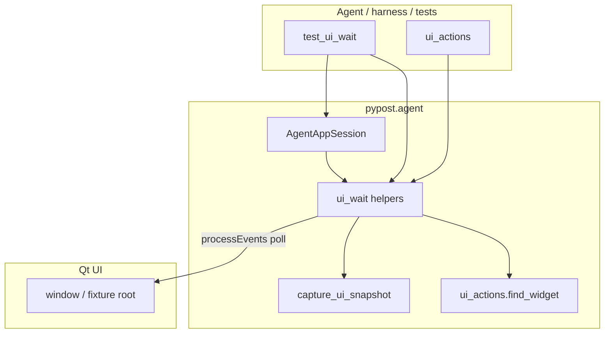

# PYPOST-837: Settle/wait helpers for UI actions

## Research

### Jira / epic context

- Story: PYPOST-837 — Settle/wait helpers for UI actions.
- Epic: PYPOST-832 — E2E Agent UI Testing.
- Builds on: PYPOST-833 (`AgentAppSession`), PYPOST-834 (`widget_ids`),
  PYPOST-835 (`capture_ui_snapshot`), PYPOST-836 (`ui_actions`).
- Related debt: PYPOST-840 — deduplicate lifecycle `_wait_until` vs
  `tests.helpers.qt_wait` without `pypost` → `tests/` imports.
- Siblings (out of scope): PYPOST-838 golden flow, PYPOST-839 packaging.

### Existing wait patterns

| Piece | Role today |
| --- | --- |
| `tests.helpers.qt_wait.wait_until` | Bounded `processEvents` + sleep poll for tests |
| `pypost.agent.lifecycle._wait_until` | Intentional duplicate for ready wait (no tests import) |
| `QTest` / single `processEvents` in actions | Immediate effect only; not settle |

Qt docs recommend pumping the event loop while waiting rather than nesting
`QEventLoop.exec()` in harness code; wall-clock deadlines prevent hangs
([Qt Test](https://doc.qt.io/qtforpython-6/PySide6/QtTest/QTest.html) /
processEvents patterns already used in `doc/dev/gui_testing.md`).

### Architectural decision: where the helper lives

| Option | Pros | Cons |
| --- | --- | --- |
| **A. `pypost.agent.ui_wait`** | Matches 833–836 agent API; session helpers natural | Core poll only useful to agent package unless re-exported |
| B. New `pypost.ui.qt_wait` util | Lightweight; easy for tests to re-export | Splits agent surface across packages |
| C. Keep tests helper + lifecycle duplicate | Zero new modules | Fails FR9 / AC for agent use |

**Choose A** with a single production module that owns both the core poll and
condition helpers. `AgentAppSession` and package exports expose them.
`tests.helpers.qt_wait.wait_until` becomes a thin re-export of the production
`wait_until` (tests → production is allowed). Lifecycle drops its private
duplicate and calls the production poll.

### Condition helpers

| Helper | Condition | Returns |
| --- | --- | --- |
| `wait_until` | Arbitrary `Callable[[], bool]` | `None` |
| `wait_for_widget` | `find_widget` succeeds | `QWidget` |
| `wait_for_enabled` | Widget exists, visible, enabled | `QWidget` |
| `wait_for_text` | Text equals expected or predicate true | `QWidget` |
| `wait_for_snapshot` | `predicate(capture_ui_snapshot(root))` | snapshot `dict` |

Text extraction: `QLineEdit` / `QComboBox.currentText` / `QLabel` /
`QPushButton.text` / plain/text edits — same family as actions; wrong types
raise a clear timeout diagnostic or a typed error before waiting when the
widget exists but cannot yield text.

### Timeouts and diagnostics

| Constant | Default | Purpose |
| --- | --- | --- |
| `DEFAULT_UI_WAIT_TIMEOUT_S` | `10.0` | Documented default for condition waits |
| `DEFAULT_UI_WAIT_INTERVAL_S` | `0.05` | Poll interval (matches existing helpers) |

On timeout raise `UiWaitTimeoutError` (subclass of `TimeoutError`) with:
`timeout_s`, `condition` (short name), `message`, and `diagnostics` (dict of
scalars / short strings — never full snapshot trees or secret-length values).

## Implementation Plan

1. Add `pypost/agent/ui_wait.py`: core `wait_until`, condition helpers,
   defaults, `UiWaitTimeoutError`.
2. Wire `AgentAppSession` convenience methods; export from `pypost.agent`.
3. Replace `lifecycle._wait_until` with production `wait_until`.
4. Point `tests/helpers/qt_wait.wait_until` at production `wait_until`.
5. Tests (`tests/test_ui_wait.py`): QTimer-delayed exist/enable/text/snapshot
   success; timeout diagnostics; session integration after an action.
6. Observability: DEBUG success/timeout scalars only.
7. Docs: `doc/dev/ui_wait.md` + links from actions/lifecycle/gui_testing.

## Architecture

### Module diagram



### Module responsibilities

| Module | Responsibility |
| --- | --- |
| `pypost/agent/ui_wait.py` | Poll loop, condition helpers, defaults, timeout error |
| `pypost/agent/lifecycle.py` | Ready wait + session `wait_*` convenience |
| `pypost/agent/__init__.py` | Export wait API |
| `tests/helpers/qt_wait.py` | Thin re-export of production `wait_until` |
| `tests/test_ui_wait.py` | Async fixture + session coverage |
| `MCPServerImpl` | **Out of scope** |

### Main interfaces

```python
# pypost/agent/ui_wait.py

DEFAULT_UI_WAIT_TIMEOUT_S: float = 10.0
DEFAULT_UI_WAIT_INTERVAL_S: float = 0.05

class UiWaitTimeoutError(TimeoutError):
    timeout_s: float
    condition: str
    diagnostics: dict[str, object]

def wait_until(
    condition: Callable[[], bool],
    *,
    timeout: float = DEFAULT_UI_WAIT_TIMEOUT_S,
    interval: float = DEFAULT_UI_WAIT_INTERVAL_S,
    message: str = "condition not met within timeout",
    condition_name: str = "predicate",
    diagnostics_factory: Callable[[], dict[str, object]] | None = None,
) -> None: ...

def wait_for_widget(root: QWidget, widget_id: str, *, timeout: float = ...) -> QWidget: ...
def wait_for_enabled(root: QWidget, widget_id: str, *, timeout: float = ...) -> QWidget: ...
def wait_for_text(
    root: QWidget,
    widget_id: str,
    expected: str | Callable[[str], bool],
    *,
    timeout: float = ...,
) -> QWidget: ...
def wait_for_snapshot(
    root: QWidget,
    predicate: Callable[[dict[str, Any]], bool],
    *,
    timeout: float = ...,
) -> dict[str, Any]: ...
```

`AgentAppSession` mirrors these with `self.window` as root after `start()`.

### Interaction scheme

1. Agent starts session → ready (uses production `wait_until`).
2. Agent calls `ui_click` / `ui_fill` / etc.
3. Agent calls `wait_for_*` for the expected settle condition.
4. Helper polls with `processEvents` until true or raises `UiWaitTimeoutError`.
5. Agent continues (optional snapshot verification).

### Dependency rules

- `ui_wait` may import `ui_actions.find_widget` and `capture_ui_snapshot`.
- Production must **not** import `tests.*`.
- `tests.helpers.qt_wait` may import `pypost.agent.ui_wait` only (not reverse).
- No MCP registration for waits.

### Out of scope (architecture boundary)

- Network MCP wait tools.
- Golden flow (838), packaging (839).
- Full event-queue idle detection.
- Changing action primitives or identity catalog.

## Q&A

- **Q:** Why not only document the tests helper for agents?
  **A:** Agents run against production packages; importing `tests/` from
  `pypost` is forbidden and breaks packaging.

- **Q:** Why re-export into `tests.helpers.qt_wait`?
  **A:** Preserves existing test imports while eliminating the duplicate poll
  loop (addresses PYPOST-840 for the shared helper).

- **Q:** Why subclass `TimeoutError`?
  **A:** Existing ready wait raises `TimeoutError`; subclass keeps
  `except TimeoutError` working while adding diagnostics attributes.
