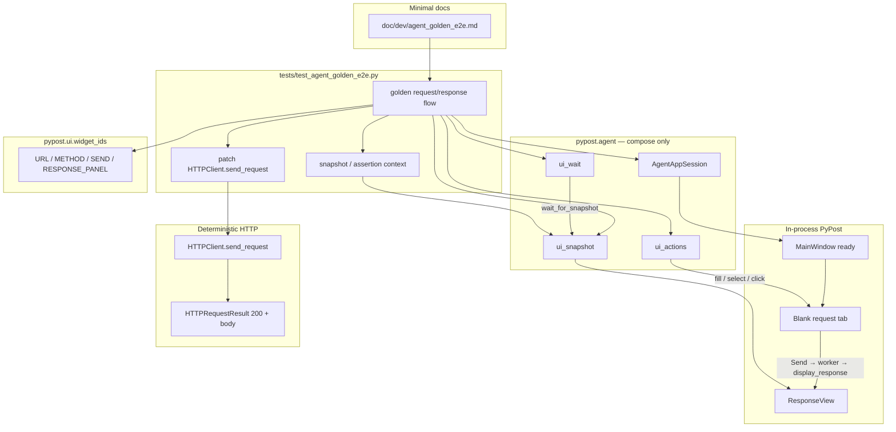

# PYPOST-838: Golden e2e — agent completes one product flow

## Research

### Jira / epic context

- Story: [PYPOST-838](https://pypost.atlassian.net/browse/PYPOST-838) — one golden
  product flow composing the agent UI stack.
- Epic: [PYPOST-832](https://pypost.atlassian.net/browse/PYPOST-832) — E2E Agent UI
  Testing.
- Builds on (compose, do not redefine):
  - [PYPOST-833](https://pypost.atlassian.net/browse/PYPOST-833) —
    `AgentAppSession`, `MainWindow.is_ui_ready`
  - [PYPOST-834](https://pypost.atlassian.net/browse/PYPOST-834) —
    `pypost.ui.widget_ids`
  - [PYPOST-835](https://pypost.atlassian.net/browse/PYPOST-835) —
    `capture_ui_snapshot` / `session.ui_snapshot()`
  - [PYPOST-836](https://pypost.atlassian.net/browse/PYPOST-836) —
    `ui_click` / `ui_fill` / `ui_select` / …
  - [PYPOST-837](https://pypost.atlassian.net/browse/PYPOST-837) —
    `wait_for_*` / `UiWaitTimeoutError`
- Sibling packaging (out of scope): PYPOST-839 — broader agent-e2e docs/`make`
  packaging.

### Existing agent surface (production APIs to compose)

| Capability | Module | Public entry |
| --- | --- | --- |
| Lifecycle | `pypost.agent.lifecycle` | `AgentAppSession` (context manager; offscreen default) |
| Identity | `pypost.ui.widget_ids` | `URL_INPUT`, `METHOD_COMBO`, `SEND_BUTTON`, `RESPONSE_PANEL`, … |
| Actions | `pypost.agent.ui_actions` | `ui_fill`, `ui_select`, `ui_click` (+ session mirrors) |
| Snapshot | `pypost.agent.ui_snapshot` | `capture_ui_snapshot` / `session.ui_snapshot()` |
| Wait | `pypost.agent.ui_wait` | `wait_for_snapshot`, `wait_until`, … (+ session mirrors) |

Package re-exports live in `pypost.agent.__init__`. Docs already cover each
piece: `doc/dev/agent_lifecycle.md`, `ui_identity.md`, `ui_actions.md`,
`ui_snapshot.md`, `ui_wait.md`.

Sibling spot-checks already prove pieces in isolation under offscreen Qt:

- `tests/test_agent_lifecycle_smoke.py`
- `tests/test_ui_identity_spotcheck.py`
- `tests/test_ui_actions.py` (includes main-window fill URL + select method)
- `tests/test_ui_snapshot.py`
- `tests/test_ui_wait.py`

None of those yet drive **Send → response UI outcome** through the composed
stack.

### Product UI path for the golden flow

| Step | Surface | How agents address it today |
| --- | --- | --- |
| Ready | `MainWindow` | `AgentAppSession.start()` waits on `is_ui_ready` |
| Open/create request | Request tabs | Empty agent `data_dir` → `restore_tabs` opens one blank tab (no plus-click required) |
| Set URL | `pypost_url_input` | `ui_fill(…, URL_INPUT, …)` |
| Set method | `pypost_method_combo` | `ui_select(…, METHOD_COMBO, …)` |
| Send | `pypost_send_button` | `ui_click(…, SEND_BUTTON)` |
| Response | `pypost_response_panel` | `ResponseView.display_response` sets `status_label` (`Status: N`) and `body_view` text |

Per-tab controls share role ids; lookup is scoped to the current tab / window
root (834 contract). After `is_ui_ready` with a fresh session there is exactly
one request tab — window-scoped `findChild` is safe for this golden scenario.

Status and body widgets under `ResponseView` do **not** have dedicated
`objectName`s today (only the panel root does). Snapshot still captures them as
visible `label` / `text_edit` children with values (835 walker keeps unnamed
nodes when they have a value). That is sufficient for wait + assert without
expanding the identity catalog.

### HTTP execution path (what to mock)

Send creates a one-shot `RequestWorker` (`QThread`) which builds a real
`RequestService` that calls `HTTPClient.send_request`. Established CI pattern:

```python
# tests/test_default_retry_policy_integration.py
patch(
    "pypost.core.request_service.HTTPClient.send_request",
    side_effect=[...],
)
```

Return type is `HTTPRequestResult(response=ResponseData(...), resolved=...)`.
History / retry / worker signal wiring stay real; only the network boundary is
stubbed.

**Decision:** Mock at `HTTPClient.send_request` (same patch target as existing
integration tests). Do **not** mock `RequestWorker` wholesale (that would skip
the UI → worker → response panel path). Do **not** depend on live external HTTP.
Do **not** introduce `pytest-httpx` / transport-level mocks for this story —
PyPost’s request path uses `requests.Session` inside `HTTPClient`, and the
project already standardizes on patching `send_request`.

### Offscreen / CI

- `tests/conftest.py` and `Makefile` `test` / `test-slow` / `test-cov` set
  `QT_QPA_PLATFORM=offscreen`.
- `AgentAppSession(offscreen=True)` also `setdefault`s the same env var.
- Documented project stance: `doc/dev/gui_testing.md` — offscreen is enough;
  Xvfb not required.

Golden scenario runs under **`make test`** (fast suite). No new Makefile target
in this story (839 owns epic packaging).

### External guidance (web)

- Qt/PySide UI tests: pump the event loop while waiting; prefer bounded waits
  over nested `exec()` ([pytest-qt](https://github.com/pytest-dev/pytest-qt) /
  project `ui_wait` already follows this).
- Deterministic UI+API tests mock the HTTP boundary and assert UI state
  ([PySide mocking patterns](https://www.ancisoft.com/blog/unit-and-functional-testing-a-pyside-based-application/)).
- Transport-level httpx fixtures (`pytest-httpx`) are popular for httpx apps;
  this repo’s golden path should stay aligned with the existing
  `HTTPClient.send_request` patch pattern instead.

### Architectural decision: where the golden lives

| Option | Pros | Cons |
| --- | --- | --- |
| **A. One pytest under `tests/` composing `pypost.agent`** | Matches sibling spot-checks; `make test` + offscreen; FR1/FR11 path clear | Not a separate CLI |
| B. New `pypost.agent.golden` product module | Importable “scenario runner” | Over-builds; duplicates test harness; out of minimalism NFR |
| C. Subprocess + IPC e2e | Process isolation | Conflicts with in-process epic architecture (833–837) |

**Choose A.** The golden scenario **is** a documented pytest that imports the
same agent APIs agents will use. FR1’s “documented agent/harness path” =
`AgentAppSession` + this test module + short `doc/dev` run instructions (not a
new framework).

## Implementation Plan

1. **Add golden test** `tests/test_agent_golden_e2e.py`:
   - Module `pytestmark = pytest.mark.timeout(...)` per
     `.cursor/lsr/do-testing.md` (budget large enough for session launch +
     Send settle; align with lifecycle smoke ~60s unless Step 3 measures lower).
   - Single intentional scenario function (one product flow).
2. **Compose siblings only** — import from `pypost.agent` and
   `pypost.ui.widget_ids`; no new action/wait/snapshot APIs.
3. **HTTP mock** — `unittest.mock.patch` on
   `pypost.core.request_service.HTTPClient.send_request` returning a canned
   `HTTPRequestResult` with `ResponseData(status_code=200, body=…)` and matching
   `ResolvedRequestFields`.
4. **Drive flow** after ready:
   - Confirm a request tab exists (blank tab from restore; create via public
     presenter path only if absent — prefer relying on restore).
   - `ui_fill(URL_INPUT, FIXTURE_URL)`, `ui_select(METHOD_COMBO, FIXTURE_METHOD)`,
     `ui_click(SEND_BUTTON)`.
   - `wait_for_snapshot` (or session helper) until response UI shows expected
     status/body substrings.
   - Assert final snapshot / structured observation matches fixture expectations.
5. **Failure diagnostics** — on wait timeout or assertion failure, include
   snapshot (or RESPONSE_PANEL subtree) and step label in the failure message /
   `UiWaitTimeoutError` diagnostics factory.
6. **Minimal docs** — short `doc/dev/agent_golden_e2e.md` describing the run
   path (`make test` filter / file path), composition diagram, fixture
   constants, and failure diagnostics. Link from `agent_lifecycle.md` (and
   optionally `gui_testing.md`). Broader packaging stays PYPOST-839.
7. **No production redesign** expected. Do not add status/body widget ids unless
   Step 3 proves snapshot wait is unreliable under offscreen (fallback only;
   would be a minimal 834-compatible addition, not a catalog redesign).

## Architecture

### Module diagram



### Module responsibilities

| Module | Responsibility |
| --- | --- |
| `tests/test_agent_golden_e2e.py` | One golden scenario; HTTP mock; assertions; failure context |
| `pypost.agent.lifecycle.AgentAppSession` | Launch → ready → shutdown (unchanged) |
| `pypost.ui.widget_ids` | Stable control ids (unchanged) |
| `pypost.agent.ui_actions` | Drive URL/method/Send (unchanged) |
| `pypost.agent.ui_wait` | Settle after Send (unchanged) |
| `pypost.agent.ui_snapshot` | Observe response UI; failure dumps (unchanged) |
| `doc/dev/agent_golden_e2e.md` | Documented run path for maintainers/agents |
| `HTTPClient.send_request` (mocked in test) | Deterministic OK outcome |

No new modules under `pypost/agent/` for v1. Optional tiny **test-local** helpers
(e.g. `_snapshot_contains`, `_response_panel_excerpt`) may live in the golden
test file or `tests/helpers/` if they stay golden-specific — not a parallel
agent API.

### Golden scenario flow (canonical)

Fixture constants (exact strings chosen in Step 3; deterministic):

| Constant | Example intent |
| --- | --- |
| `FIXTURE_URL` | Stable URL string filled into the editor (never fetched live) |
| `FIXTURE_METHOD` | e.g. `GET` |
| `FIXTURE_STATUS` | `200` |
| `FIXTURE_BODY` | Short body, e.g. `{"ok": true}` (well under snapshot truncate limit) |

Steps:

1. **Launch** — `with AgentAppSession(offscreen=True) as session:` until ready.
2. **Open/create** — rely on blank restored tab; assert URL/Send identities exist
   via `find_widget` / ids (identity capability).
3. **Edit** — `session.ui_fill(URL_INPUT, FIXTURE_URL)`;
   `session.ui_select(METHOD_COMBO, FIXTURE_METHOD)` (action capability).
4. **Mock arm** — patch `HTTPClient.send_request` before Send so the worker
   cannot hit the network.
5. **Send** — `session.ui_click(SEND_BUTTON)`.
6. **Wait** — `session.wait_for_snapshot(predicate)` until the tree shows
   `Status: {FIXTURE_STATUS}` and `FIXTURE_BODY` (or pretty-printed equivalent)
   under / near `RESPONSE_PANEL` (wait + snapshot capabilities).
7. **Assert** — explicit assertions on the returned snapshot (and optionally
   typed children of `RESPONSE_PANEL` as a secondary check).
8. **Shutdown** — context manager exits; session cleanup runs.

Pretty-print note: `ResponseView.display_response` pretty-prints JSON bodies.
Fixture body and assertion must agree on the **displayed** form (pretty JSON or
plain text), not only the raw `ResponseData.body` bytes.

### HTTP mocking strategy

| Concern | Choice |
| --- | --- |
| Patch target | `pypost.core.request_service.HTTPClient.send_request` |
| Return | `HTTPRequestResult` with `ResponseData(status_code=200, …)` |
| Scope | Active for the Send + wait window (context manager around steps 4–7) |
| What stays real | UI, `RequestWorker` thread, `RequestService`, response panel update |
| What is forbidden | Live network as primary path; mocking entire `RequestWorker` class |

Worker runs on a `QThread`; the mock must be applied on the import path the
worker uses (`request_service.HTTPClient.send_request`) so the background
thread sees it. Existing retry integration tests already validate this shape.

### Failure diagnostics

| Failure mode | Diagnostic |
| --- | --- |
| Ready never happens | Existing lifecycle `TimeoutError` / session logs |
| Missing control | `UiTargetNotFoundError` / `UiTargetNotInteractableError` with `widget_id` |
| Response never settles | `UiWaitTimeoutError` with `condition`, `timeout_s`, and a
  diagnostics factory including step name + short RESPONSE_PANEL excerpt
  (status/body snippets — not a full untruncated tree dump if huge) |
| Wrong status/body | `pytest` assertion message includes expected vs observed values **and**
  a captured snapshot subtree (or last `wait_for_snapshot` result) |

Implementation sketch for Step 3 (not code yet): a helper
`assert_response_ui(snap, *, status, body)` that on failure raises with
`msg=… + json.dumps(excerpt)`. Prefer attaching context in the assert message
over screenshots (835 chose structured snapshot as primary observation).

### Selected patterns

| Pattern | Why |
| --- | --- |
| Composition over new framework | AC: use siblings 833–837; minimalism NFR |
| In-process `AgentAppSession` | Aligns with epic; drives same `MainWindow` |
| Patch `HTTPClient.send_request` | Repo-proven determinism; keeps UI→worker path real |
| `wait_for_snapshot` for response settle | Async worker; snapshot already encodes status/body text |
| One pytest file as documented path | FR1 + FR11 via `make test`; 839 owns broader packaging |
| Diagnosable assert / timeout context | FR10 without manual replay |

### Main interfaces (consume, do not redefine)

```python
# Composition sketch for Step 3 — public APIs already exist.

from unittest.mock import patch

from pypost.agent import AgentAppSession
from pypost.core.http_client import HTTPRequestResult, ResolvedRequestFields
from pypost.models.response import ResponseData
from pypost.ui.widget_ids import METHOD_COMBO, SEND_BUTTON, URL_INPUT

FIXTURE_URL = "https://example.test/agent-golden"
FIXTURE_METHOD = "GET"
FIXTURE_STATUS = 200
FIXTURE_BODY = '{"ok": true}'


def _canned_ok() -> HTTPRequestResult:
    return HTTPRequestResult(
        response=ResponseData(
            status_code=FIXTURE_STATUS,
            headers={"Content-Type": "application/json"},
            body=FIXTURE_BODY,
            elapsed_time=0.01,
            size=len(FIXTURE_BODY),
        ),
        resolved=ResolvedRequestFields(
            url=FIXTURE_URL, headers={}, body=""
        ),
    )


def _response_ready(snap: dict) -> bool:
    """True when snapshot shows expected status and body text."""
    ...


with AgentAppSession(offscreen=True) as session:
    session.ui_fill(URL_INPUT, FIXTURE_URL)
    session.ui_select(METHOD_COMBO, FIXTURE_METHOD)
    with patch(
        "pypost.core.request_service.HTTPClient.send_request",
        return_value=_canned_ok(),
    ):
        session.ui_click(SEND_BUTTON)
        snap = session.wait_for_snapshot(_response_ready, timeout=...)
    # assert status/body; on failure include snap excerpt
```

### Dependency rules

- Golden test may import `pypost.agent`, `pypost.ui.widget_ids`, models, and
  `HTTPRequestResult` types for the mock return value.
- Production `pypost/**` must **not** gain a dependency on the golden test.
- Do not add MCP UI tools or extend `MCPServerImpl` for this story.
- Do not redefine lifecycle/identity/actions/snapshot/wait contracts.

### FR mapping

| FR | Architectural answer |
| --- | --- |
| FR1 documented path | `AgentAppSession` + `tests/test_agent_golden_e2e.py` + `doc/dev/agent_golden_e2e.md` |
| FR2 lifecycle | Session context manager |
| FR3 identity | `widget_ids` constants for URL/method/Send/response panel |
| FR4 actions | `ui_fill` / `ui_select` / `ui_click` |
| FR5 wait | `wait_for_snapshot` after Send |
| FR6 snapshot | Capture for wait predicate + failure context |
| FR7 product outcome | Blank tab → set URL/method → Send → assert status/body |
| FR8 deterministic HTTP | Patch `HTTPClient.send_request` → canned 200 |
| FR9 offscreen | `AgentAppSession(offscreen=True)` + `make test` env |
| FR10 diagnosable failure | Snapshot excerpt / wait diagnostics / assert message |
| FR11 quality workflow | Runnable under `make test` |

### Out of scope (architecture boundary)

- Redesign of 833–837 APIs or identity catalog expansion (unless Step 3 proves
  response assert needs status/body ids — then minimal additive constants only).
- Multiple golden scenarios / full e2e matrix.
- Live network as primary path.
- Epic-wide `make agent-e2e` packaging and broad docs (PYPOST-839).
- Network MCP UI tools.

## Q&A

- **Q:** Why a pytest file instead of a `pypost.agent` scenario runner?
  **A:** Siblings already define the agent API. The golden story proves
  composition; a second runner would invent framework without AC value. Agents
  and CI both run the same pytest under `make test`.

- **Q:** Why not click the plus-tab to “create” a request?
  **A:** Fresh agent sessions restore an empty blank tab. That satisfies
  open/create for the product outcome. Plus-tab click can be a follow-up if
  restore behavior changes; it is not required for AC.

- **Q:** Why not add `pypost_response_status` / `pypost_response_body` ids now?
  **A:** Snapshot already exposes status label and body text values under
  `RESPONSE_PANEL`. Prefer composition without catalog growth; add ids only if
  Step 3 shows wait/assert flakiness without them.

- **Q:** Why patch `HTTPClient.send_request` rather than `requests.Session`?
  **A:** Matches existing integration tests, returns the typed
  `HTTPRequestResult` the service expects, and keeps template/history behavior
  on the real service path while eliminating network I/O.

- **Q:** Is `wait_for_text` enough for status?
  **A:** Status/body lack widget ids, so `wait_for_text(widget_id=…)` cannot
  target them without new ids. `wait_for_snapshot` is the sibling-aligned
  settle for this outcome.

- **Q:** Where do docs live vs PYPOST-839?
  **A:** This story adds only the golden run-path doc and links from lifecycle
  (and optionally GUI testing). Epic packaging/`make agent-*` remains 839.

- **Q:** Approval gate?
  **A:** Per sprint-task-runner autonomy for this run, Step 2 is completed
  without a separate user approval pause; Step 1 was treated the same way.
