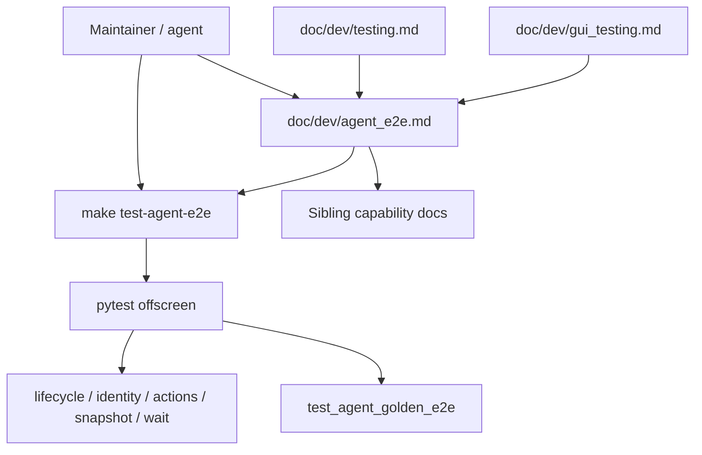

# PYPOST-839: Docs and Makefile target for agent e2e

## Research

### Jira / epic context

- Story: PYPOST-839 — docs and Makefile packaging for agent e2e.
- Epic: PYPOST-832 — E2E Agent UI Testing.
- Builds on (document and wire, do not redefine):
  - PYPOST-833 — `AgentAppSession` / lifecycle (`doc/dev/agent_lifecycle.md`)
  - PYPOST-834 — `pypost.ui.widget_ids` (`doc/dev/ui_identity.md`)
  - PYPOST-835 — UI snapshot (`doc/dev/ui_snapshot.md`)
  - PYPOST-836 — UI actions (`doc/dev/ui_actions.md`)
  - PYPOST-837 — settle / wait (`doc/dev/ui_wait.md`)
  - PYPOST-838 — golden product flow (`doc/dev/agent_golden_e2e.md`,
    `tests/test_agent_golden_e2e.py`)

Sibling docs already point at this story for “broader `make agent-*`
packaging.”

### Existing run surfaces

| Surface | Today |
| --- | --- |
| Fast suite | `make test` — includes all agent/UI harness tests under `tests/` |
| Scoped golden | `make test PYTEST_ARGS="tests/test_agent_golden_e2e.py -v"` |
| Help | `make help` parses `##` comments on Makefile targets |
| Offscreen | `QT_QPA_PLATFORM=offscreen` set by `test` / `test-slow` / `test-cov` |

There is **no** dedicated `test-agent-e2e` (or similar) target yet.

### Related harness tests (compose the stack)

| Test module | Capability |
| --- | --- |
| `tests/test_agent_lifecycle_smoke.py` | Lifecycle smoke |
| `tests/test_ui_identity_spotcheck.py` | Widget identity spot-check |
| `tests/test_ui_actions.py` | Action primitives |
| `tests/test_ui_snapshot.py` | Snapshot capture |
| `tests/test_ui_wait.py` | Settle / wait helpers |
| `tests/test_agent_golden_e2e.py` | Composed golden product flow |

### Doc discovery gaps

- `doc/dev/README.md` lists sibling docs individually; no umbrella “Agent E2E”
  entry.
- `doc/dev/testing.md` documents `make test` / `PYTEST_ARGS` but not an agent
  e2e target.
- `doc/dev/gui_testing.md` links each capability and golden, but is not a
  single onboarding page for the epic stack.
- MCP docs (`mcp_integration.md`, testing.md MCP sections) describe live MCP
  against a running app — different from in-process agent UI e2e; a clarifying
  cross-link is enough.

### Makefile conventions (workspace)

- Prefer `make` over raw pytest (`.cursor/rules/makefile.mdc`).
- Every target needs `##` description for `make help`.
- Existing pattern: `QT_QPA_PLATFORM=offscreen $(BIN)/python -m pytest …`
  with optional `PYTEST_ARGS` override replacing defaults.

### Decision summary

1. **Umbrella doc** `doc/dev/agent_e2e.md` — setup, tool map, identity
   convention pointer, golden scenario pointer, `make test-agent-e2e`, links
   to siblings.
2. **Makefile target** `test-agent-e2e` — runs the six related test modules
   listed above under offscreen Qt; honors `PYTEST_ARGS` like other test
   targets.
3. **Cross-links** — `testing.md`, `doc/dev/README.md`, `gui_testing.md`,
   sibling agent docs that deferred packaging to 839, and a short MCP/testing
   distinction pointer.
4. **No new production code** — packaging/docs only; no new golden scenarios.

## Implementation Plan

1. Add `test-agent-e2e` to `Makefile` (`.PHONY`, recipe, `##` help).
2. Create `doc/dev/agent_e2e.md` (Overview / Architecture / Usage /
   Configuration / Troubleshooting).
3. Update `doc/dev/README.md` index (Testing and quality).
4. Update `doc/dev/testing.md` — document `make test-agent-e2e` near other
   make test targets; link umbrella doc; clarify vs live MCP.
5. Update `doc/dev/gui_testing.md` — point to umbrella as epic entry.
6. Update sibling docs (`agent_golden_e2e.md`, `agent_lifecycle.md`, and
   Related sections as needed) to use `make test-agent-e2e` and link
   `agent_e2e.md` instead of “packaging remains 839.”
7. Light MCP / testing cross-link so agents do not confuse MCP live checks
   with in-process agent e2e.
8. Workflow artifacts Steps 4–7 after implementation.

## Architecture

### Module responsibilities

| Artifact | Responsibility |
| --- | --- |
| `Makefile` `test-agent-e2e` | Canonical run entry for agent UI e2e harness |
| `doc/dev/agent_e2e.md` | Umbrella guide; links stack; documents make target |
| Sibling `doc/dev/*` | Capability detail (unchanged contracts) |
| `doc/dev/testing.md` | Suite-wide discovery + make target list |
| Existing `tests/test_*` | Unchanged behavior; selected by make target |

### Interaction

### Patterns

- **Facade documentation**: umbrella doc is a navigation + run guide, not a
  second API reference.
- **Makefile facade**: dedicated target selects known modules; `PYTEST_ARGS`
  still allows override for debugging one file.
- **No parallel runner**: keep pytest as the harness; do not add a custom
  scenario runner under `pypost/agent/`.

### Interfaces

| Interface | Contract |
| --- | --- |
| `make test-agent-e2e` | Offscreen pytest of the default agent-e2e module |
| | list; `PYTEST_ARGS` replaces defaults when set |
| `make help` | Shows `test-agent-e2e` with `##` description |
| `doc/dev/agent_e2e.md` | Documents setup, tools, identity, golden, |
| | troubleshooting |

### Non-goals (architecture)

- New pytest markers / suite partitions beyond the make file list.
- CI workflow file changes (optional follow-up).
- Production logging/metrics for packaging-only story.

## Q&A

- Q: Include only golden, or sibling smokes too?
  A: Golden **plus** related harness tests — AC says “golden + related agent
  tests”; the six modules above are the epic’s proof surface.

- Q: Marker vs explicit file list?
  A: Explicit file list — no existing `@pytest.mark.agent_e2e` across siblings;
  introducing a marker would touch every test file for packaging alone.
  Document that future goldens should be added to the Makefile list (or a
  later marker migration).

- Q: Should `check` depend on `test-agent-e2e`?
  A: No — `make test` already includes these modules; a dedicated target is
  for focused runs. Avoid doubling runtime in `make check`.
