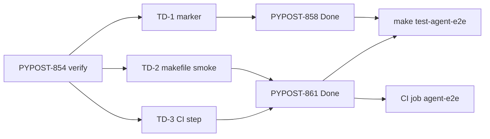

# PYPOST-854: Architecture (verify absorption)

## Research

| Source | Finding |
| --- | --- |
| [PYPOST-839](https://pypost.atlassian.net/browse/PYPOST-839) `60-tech-debt.md` | TD-1 marker; TD-2 makefile smoke; TD-3 optional CI |
| [PYPOST-858](https://pypost.atlassian.net/browse/PYPOST-858) | Done; registers `agent_e2e`; make `-m agent_e2e`; docs |
| [PYPOST-861](https://pypost.atlassian.net/browse/PYPOST-861) | Done; makefile smokes; CI job `agent-e2e`; docs; names 854 absorption |
| `pyproject.toml` markers | `agent_e2e: agent UI e2e / env-pack…` registered |
| `Makefile` `test-agent-e2e` | Default `-m "agent_e2e and not slow"`; `##` help line |
| `tests/test_makefile.py` | Four agent_e2e-related smokes (deps, recipe, help, select) |
| `.github/workflows/test.yml` | Job `agent-e2e` runs `make install` + `make test-agent-e2e` |
| `doc/dev/agent_e2e.md` | Marker, make, CI sections already present (858/861) |

No open residual surface beyond process closeout of this Debt issue.

## Implementation Plan

1. **Map** each TD to Done owner (no code unless gap).
2. **Verify** with makefile smokes and static inspection of marker + CI YAML.
3. **Document** superseded status in ai-tasks artifacts.
4. **Step 7:** confirm `doc/dev/` already covers outcomes; edit only if a
   discoverability gap remains.
5. **Closeout:** SAFE TO CLOSE if all three TDs verified; no NEW Debt.

## Architecture

This task does **not** introduce modules. It is a verification facade over
existing packaging:

| Concern | Owner | Interface |
| --- | --- | --- |
| Marker registration + fixtures | 858 | `pyproject.toml` markers; plugin fixtures |
| Make entry + smokes | 861 (+ 858 marker) | `Makefile` + `tests/test_makefile.py` |
| CI make gate | 861 | `.github/workflows/test.yml` `agent-e2e` |
| Dev discoverability | 858/861 docs | `doc/dev/agent_e2e.md`, env/testing/setup |

**Pattern:** supersession / absorption closeout — requirements verify
outcomes; development is evidence gathering; no new runtime path.

## Q&A

- Q: New make target under 854?
  A: No — extend/verify existing `test-agent-e2e`.
- Q: New CI job under 854?
  A: No — `agent-e2e` already exists via 861.
- Q: Doc page for 854?
  A: Only if umbrella lacks marker/make/CI; research shows it does not.
