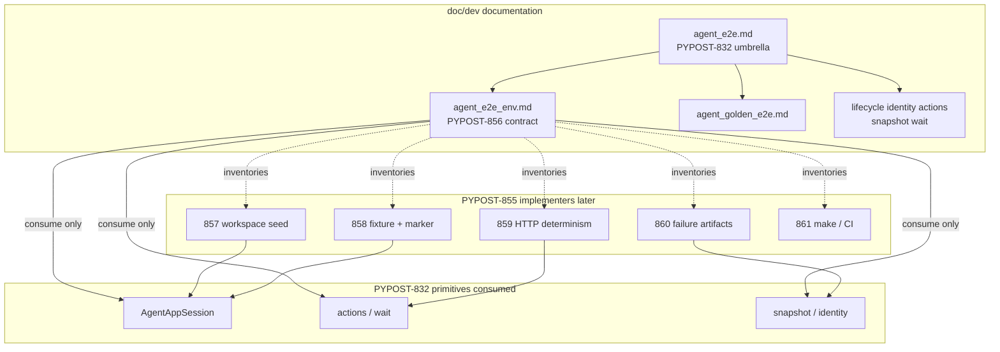

# PYPOST-856: Spec — agent e2e environment contract

## Research

### Jira / epic context

- Story: [PYPOST-856](https://pypost.atlassian.net/browse/PYPOST-856) —
  write the agent e2e **environment contract** (documentation only).
- Parent epic: [PYPOST-855](https://pypost.atlassian.net/browse/PYPOST-855) —
  Agent E2E Environment (seed, fixtures/markers, HTTP determinism, failure
  artifacts, make/CI).
- Foundation epic: [PYPOST-832](https://pypost.atlassian.net/browse/PYPOST-832)
  — drive/observe primitives (lifecycle, identity, actions, snapshot, wait,
  golden) already packaged under [agent_e2e.md](../../doc/dev/agent_e2e.md).

Sibling implementers (out of scope for this story; contract must inventory
them):

| Story | Slice |
| --- | --- |
| [PYPOST-857](https://pypost.atlassian.net/browse/PYPOST-857) | Seeded workspace fixtures |
| [PYPOST-858](https://pypost.atlassian.net/browse/PYPOST-858) | Shared pytest session fixture + `agent_e2e` marker |
| [PYPOST-859](https://pypost.atlassian.net/browse/PYPOST-859) | Deterministic HTTP fixture layer |
| [PYPOST-860](https://pypost.atlassian.net/browse/PYPOST-860) | Failure artifacts (snapshot dump on assert fail) |
| [PYPOST-861](https://pypost.atlassian.net/browse/PYPOST-861) | Make / CI entry for the env pack |

### What exists today (gap)

| Layer | Today | Gap for PYPOST-855 |
| --- | --- | --- |
| Umbrella | `doc/dev/agent_e2e.md` | Covers PYPOST-832 stack + `make test-agent-e2e`; no env-pack model |
| Golden | `doc/dev/agent_golden_e2e.md` | Blank-tab + one-off `HTTPClient.send_request` patch; proves composition, not a reusable seeded env |
| Offscreen / GUI | `doc/dev/gui_testing.md`, Makefile | Offscreen Qt is established; env pack must **state** it as an assumption, not re-invent it |
| Snapshot secrets | `doc/dev/ui_snapshot.md` | Masking exists; failure-artifact story must reuse it (contract only narrates the rule) |

Ad-hoc golden setup does **not** scale to a documented env pack. Without a
written contract, siblings risk five private bootstraps.

### External guidance (web)

- [pytest fixtures](https://docs.pytest.org/en/stable/explanation/fixtures.html):
  fixtures supply a defined, consistent context (environment + content);
  compose modular fixtures rather than one monolith; teardown via yield.
- Fixture scaling practice: prefer the narrowest scope that preserves
  isolation; reserve broader scopes for expensive read-only setup; layer
  infrastructure vs domain fixtures
  ([DEV Community fixture patterns](https://dev.to/peytongreen_dev/pytest-fixtures-that-actually-scale-patterns-from-2-years-of-python-ci-pipelines-3d98)).
- ADR-style docs capture **why** and boundaries so implementers do not
  re-debate structure
  ([ADR process](https://docs.aws.amazon.com/prescriptive-guidance/latest/architectural-decision-records/adr-process.html)).

Applied here: the environment contract is a **human/agent-readable ADR for
the env pack** — seed inventory, isolation, assumptions, consumption path,
and fixture-area inventory — not executable Pact JSON and not premature
pytest API design.

### Architectural decision: dedicated contract page

| Option | Pros | Cons |
| --- | --- | --- |
| A. Extend `agent_e2e.md` only | One file; no new index entry | Umbrella mixes PYPOST-832 primitives with PYPOST-855 env model; harder boundary clarity |
| B. New `doc/dev/agent_e2e_env.md` + umbrella links | Mirrors golden’s dedicated page; clear ownership; discoverable from umbrella | One more page to maintain |
| C. Only update sibling tickets / ai-tasks | Fast for this story | Not discoverable under `doc/dev/`; fails FR1 / DoD |

**Decision: Option B.** Create `doc/dev/agent_e2e_env.md` as the environment
contract. Update `agent_e2e.md` (and light index / Related links) so the
contract is reachable from the existing umbrella. Do **not** move or
duplicate PYPOST-832 capability contracts into the env page.

### What this story owns vs siblings

| Concern | Owner |
| --- | --- |
| Env model narrative (seed, isolation, assumptions, consumption, fixture inventory, 832 boundaries) | **PYPOST-856** (this story → Step 3/7 doc) |
| Seed fixture implementation | PYPOST-857 |
| Session fixture + marker | PYPOST-858 |
| HTTP determinism helper/fixture | PYPOST-859 |
| Failure artifact hook | PYPOST-860 |
| Make / CI wiring for env pack | PYPOST-861 |
| Lifecycle / identity / actions / snapshot / wait / golden APIs | PYPOST-832 (unchanged) |

## Implementation Plan

High-level plan for **this docs-only story** (Steps 3 and 7 deliver the page;
siblings implement code later):

1. **Author** `doc/dev/agent_e2e_env.md` with sections aligned to the env
   contract model below (Overview, Architecture / env model, Boundaries vs
   832, Fixture areas → siblings, Consumption lifecycle, Isolation,
   Offscreen/CI assumptions, Related).
2. **Cross-link** from `doc/dev/agent_e2e.md` (Architecture table + Related)
   so the env pack is discoverable next to lifecycle…golden.
3. **Light index** updates (`doc/dev/README.md` and optionally
   `testing.md` / `gui_testing.md` Related) — link only; no make/CI code.
4. **Name fixture areas**, not concrete pytest symbols. Optional
   placeholder names may appear as *illustrative* only if they aid
   siblings; they are not APIs until 857–861 land.
5. **Do not** implement seed, markers, HTTP layer, artifact hooks, or
   Makefile/CI changes in this story.

Step 3 produces the developer page; Step 7 confirms docs placement and
cross-links per project docs conventions.

## Architecture

### Documentation module diagram



### Doc artifact responsibilities

| Artifact | Responsibility |
| --- | --- |
| `doc/dev/agent_e2e_env.md` | **Environment contract**: seed expectations, isolation, offscreen/CI assumptions, scenario consumption path, fixture-area inventory, explicit non-overlap with PYPOST-832 |
| `doc/dev/agent_e2e.md` | Umbrella for drive/observe stack + `make test-agent-e2e`; **links** to env contract; does not redefine seed/isolation |
| `doc/dev/agent_golden_e2e.md` | Composition proof (blank tab + ad-hoc HTTP mock today); env contract states how future env scenarios differ (seed + shared HTTP layer) |
| Sibling capability docs | Unchanged API contracts for lifecycle / identity / actions / snapshot / wait |
| `ai-tasks/PYPOST-856/*` | Workflow artifacts only; not the lasting developer contract |

### Environment contract model (logical modules)

These are **documentation modules** (and later fixture areas), not product
features:

| Module | Business purpose | Sibling |
| --- | --- | --- |
| Seeded workspace | After bootstrap, known collections, environments, and sample requests exist so scenarios do not hand-build that UI state | PYPOST-857 |
| Isolation | One scenario’s mutable data/session does not bleed into another (temp/scoped config and data dirs at business level) | Cross-cutting; enforced by session/seed stories |
| HTTP determinism | Canned / stubbed responses at the HTTP boundary; UI → worker path stays real; no live external HTTP as the primary path | PYPOST-859 |
| Markers / session fixture | Shared bootstrap path: ready session (+ seed when available) via one documented consumption entry | PYPOST-858 |
| Failure artifacts | On assert fail, dump snapshot / concise diagnostics without exposing secrets contrary to snapshot masking | PYPOST-860 |
| Make / CI entry | Env pack runnable via project-standard make (and CI step) under offscreen Qt — not undocumented shell-only recipes | PYPOST-861 |

### Scenario consumption lifecycle

Business-level path the contract must describe (no concrete fixture names
required):

```mermaid
sequenceDiagram
  participant S as Scenario
  participant E as Env pack
  participant P as PYPOST-832 primitives

  S->>E: Obtain ready env
  Note over E: session + seed + HTTP determinism<br/>as applicable; markers select pack
  S->>P: Drive / observe (actions wait snapshot)
  S->>E: Assert / release
  Note over E: tear down; on fail dump artifacts
```

1. **Bootstrap** — obtain a ready environment (session + seed + HTTP
   determinism as applicable) through the shared env pack path.
2. **Act / observe** — use existing PYPOST-832 capabilities; do not redefine
   those APIs.
3. **Tear down** — release scoped resources; on failure, artifact expectations
   apply (implemented by PYPOST-860).

Golden’s blank-tab + one-off patch remains a valid **composition proof**;
the env pack is the **primary** path for scenarios that need seeded workspace
state.

### Boundaries versus PYPOST-832

| Owns | Env pack (855 / contract) | Primitives (832) |
| --- | --- | --- |
| Launch / ready / shutdown | Consumes | Owns (`AgentAppSession`) |
| Stable widget ids | Consumes | Owns (`widget_ids`) |
| click / fill / select / key | Consumes | Owns (ui actions) |
| Snapshot / wait / golden composition | Consumes (artifacts reuse snapshot) | Owns |
| Workspace seed inventory | Owns (model); 857 implements | Does not own |
| Shared marker / session fixture packaging | Owns (model); 858 implements | Does not own |
| Shared HTTP determinism layer | Owns (model); 859 implements | Golden may keep a one-off until migrated |
| Failure artifact dumps | Owns (model); 860 implements | Snapshot API only |
| Make/CI for **env pack** | Owns (model); 861 implements | `test-agent-e2e` already packages 832 harness |

**Rule:** env pack builds **on** primitives; it must not replace or fork their
public APIs.

### Isolation and offscreen / CI assumptions (contract content)

The contract page must state at business level (siblings fill mechanism):

- **Isolation:** scenarios use scoped temporary config/data; no reliance on
  developer home directories or leftover collections from a prior test.
- **Offscreen:** `QT_QPA_PLATFORM=offscreen` via Makefile / established GUI
  path; same mental model as `gui_testing.md` / `agent_e2e.md`.
- **Determinism:** no live network as the default agent-flow path; HTTP
  boundary stubbed through the shared layer (859).
- **Run entry:** env pack is incomplete until a first-class make (and CI)
  entry exists (861); document the expectation now, wire later.
- **Secrets:** failure dumps must not weaken snapshot / masking policy
  (`ui_snapshot.md`); detail owned by 860.

### Selected patterns and justification

| Pattern | Why |
| --- | --- |
| Dedicated contract page + facade link from umbrella | Boundary clarity and discoverability (FR1, NFR discoverability) without bloating `agent_e2e.md` |
| Describe-before-implement inventory | Siblings implement one shared model (epic why) |
| Layered fixture areas | Matches pytest composition guidance; avoids a monolithic “god fixture” in the spec |
| Consume-don’t-replace for 832 | Prevents API drift and duplicate harnesses |
| Business-level APIs only | Requirements forbid premature concrete fixture names; architecture names **areas** and ownership |

### Interfaces (documentation / narrative)

| Interface | Contract for Step 3 deliverable |
| --- | --- |
| `doc/dev/agent_e2e_env.md` | Single source of truth for env model sections listed above |
| Link from `agent_e2e.md` | Architecture table row and/or Related entry pointing at the env contract |
| Fixture-area → story map | Table mapping seed / HTTP / markers / artifacts / make-CI to PYPOST-857–861 |
| Consumption narrative | Bootstrap → ready env → act/observe via 832 → tear down (+ fail artifacts) |
| Non-interfaces | No new Python modules, pytest markers, Makefile targets, or CI jobs in this story |

### Non-goals (architecture)

- Product “Environments” feature redesign.
- Live MCP verification against a running PyPost.
- Concrete pytest fixture function names, module paths, or marker registration.
- Implementing any of PYPOST-857–861.
- Redesigning PYPOST-832 primitives or relocating golden out of the 832 umbrella.

## Q&A

- Q: New page or extend `agent_e2e.md`?
  A: New `doc/dev/agent_e2e_env.md`, linked from the umbrella. Keeps
  PYPOST-832 packaging separate from the PYPOST-855 env model while remaining
  discoverable.

- Q: Does architecture prescribe fixture function names?
  A: No. Name **areas** and ownership. Concrete wiring is sibling work
  (especially PYPOST-858).

- Q: How does golden relate after the env pack exists?
  A: Golden remains the composition proof. Env scenarios should prefer seed +
  shared HTTP layer; golden may keep a minimal blank-tab path until siblings
  migrate it.

- Q: Why document make/CI before PYPOST-861?
  A: The contract’s inventory is incomplete if runners invent private shell
  recipes. 861 implements against this inventory.

- Q: Where do secrets rules live?
  A: Narrative pointer in the env contract; enforcement and dump format owned
  by PYPOST-860, reusing `ui_snapshot` masking.

- Q: Approval for Step 2?
  A: Treated as pre-approved under sprint-task-runner autonomy (same stance
  as Step 1 in requirements).

### References

- Requirements: [10-requirements.md](10-requirements.md)
- Umbrella: [doc/dev/agent_e2e.md](../../doc/dev/agent_e2e.md)
- Golden: [doc/dev/agent_golden_e2e.md](../../doc/dev/agent_golden_e2e.md)
- Snapshot masking: [doc/dev/ui_snapshot.md](../../doc/dev/ui_snapshot.md)
- pytest fixtures: https://docs.pytest.org/en/stable/explanation/fixtures.html
- ADR guidance: https://docs.aws.amazon.com/prescriptive-guidance/latest/architectural-decision-records/adr-process.html
