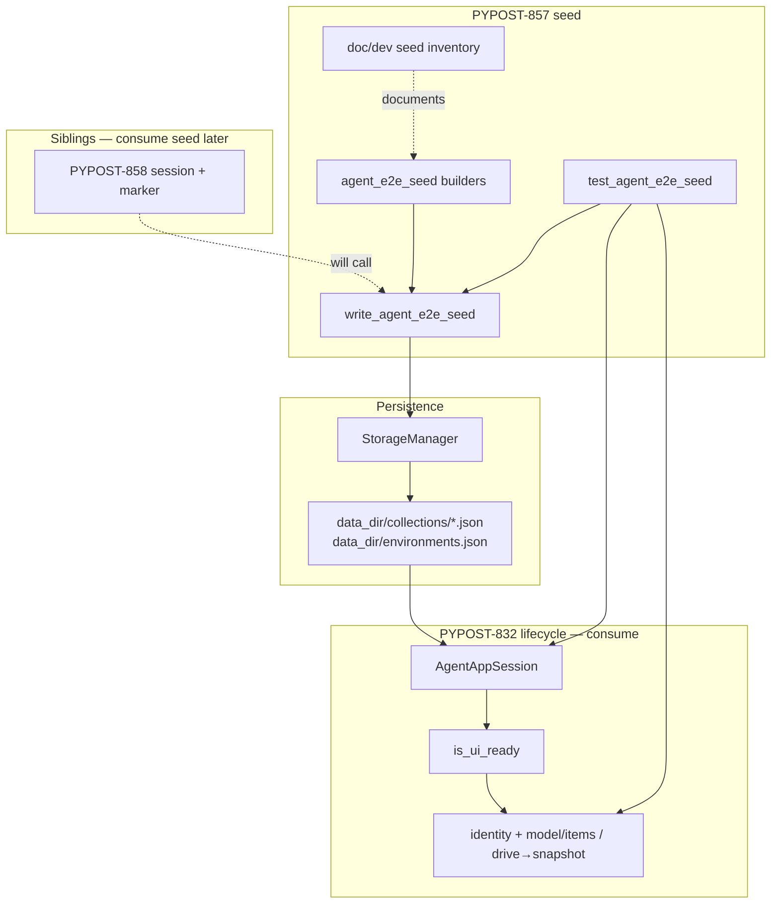
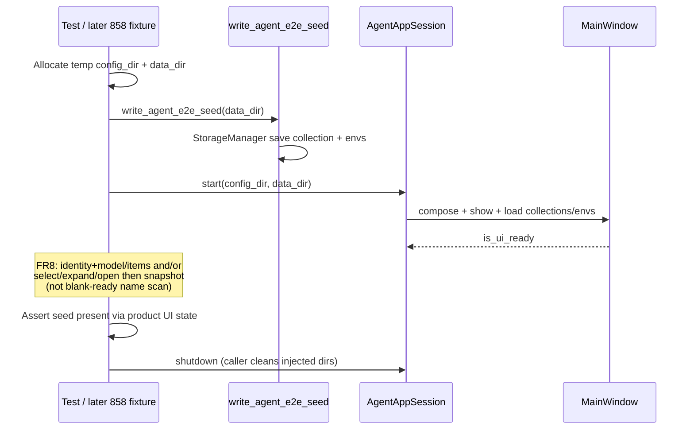

# PYPOST-857: Seeded workspace fixtures (collections/envs)

## Research

### Jira / epic context

- Story: [PYPOST-857](https://pypost.atlassian.net/browse/PYPOST-857) —
  seeded workspace fixtures (collections / environments / sample requests).
- Parent epic: [PYPOST-855](https://pypost.atlassian.net/browse/PYPOST-855) —
  Agent E2E Environment.
- Contract: [PYPOST-856](https://pypost.atlassian.net/browse/PYPOST-856) /
  [agent_e2e_env.md](../../doc/dev/agent_e2e_env.md) — inventory shape,
  isolation, consumption lifecycle; this story **implements** the seed area.
- Foundation: [PYPOST-832](https://pypost.atlassian.net/browse/PYPOST-832) —
  consume `AgentAppSession`, identity, snapshot (and actions/wait as needed
  for proof); do not fork those APIs.
- Sibling packaging (out of scope): PYPOST-858 markers/session fixture,
  PYPOST-859 HTTP determinism, PYPOST-860 failure artifacts, PYPOST-861
  make/CI.

### Existing lifecycle / isolation (consume)

| Piece | Location | Relevance to seed |
| --- | --- | --- |
| `AgentAppSession` | `pypost/agent/lifecycle.py` | Launch → ready → shutdown; injectable `config_dir` / `data_dir`; default temp dirs cleaned only when session-created |
| Ready gate | `MainWindow.is_ui_ready` | True after collections + environments startup load and restore |
| Composition | `compose_app(..., data_dir=...)` | Wires `StorageManager(data_dir=...)`; startup load reads that tree |
| Observation | Identity (`COLLECTION_TREE`, `ENV_SELECTOR`) + model/item enum; optional drive→`ui_snapshot` | FR8 product-facing proof (selection-scoped snapshot) |

Implication: seed must be on disk in the session `data_dir` **before**
`AgentAppSession.start()` so the normal startup load path surfaces it when
ready. Post-start UI hand-building or ad-hoc `reload` is out of scope for the
shared seed path.

### Existing storage layout (write target)

| Artifact | On-disk layout under `data_dir` |
| --- | --- |
| Collections | `collections/<collection_id>.json` via `StorageManager.save_collection` |
| Environments | `environments.json` via `StorageManager.save_environments` |
| Models | `Collection` / `RequestData` / `Environment` in `pypost.models.models` |

`StorageManager` already creates directories and empty `environments.json` when
constructed against a fresh `data_dir`. Seed writers should use this API so
format and paths stay aligned with production persistence.

### Existing fixture patterns (reuse shape, not content)

| Pattern | Location | Lesson |
| --- | --- | --- |
| MCP builders | `pypost/fixtures/mcp_test_fixtures.py` | Python builders + serialize helpers; fixed ids/names |
| MCP test helpers | `tests/helpers/mcp_test_collection.py` | Inventory constants + loaders for asserts |
| Golden e2e | blank `data_dir` + one-off HTTP patch | Proves composition; **not** a seeded workspace |

Agent e2e seed should follow the MCP **builder + constants** shape, but write
into an **isolated temp `data_dir`** for each session rather than committing
user-facing samples under `examples/` / `config/test/` (those paths serve
manual MCP validation, not agent env isolation).

### External guidance (web)

- [pytest fixtures](https://docs.pytest.org/en/stable/explanation/fixtures.html):
  compose small fixtures; teardown via yield; prefer the narrowest scope that
  preserves isolation.
- [pytest `tmp_path` / `tmp_path_factory`](https://docs.pytest.org/en/stable/how-to/tmp_path.html):
  function-scoped unique dirs for per-test isolation; factory for shared
  read-only assets — seed **content** may be shared as builders, but each
  scenario still needs its own writable workspace copy.
- Fixture scaling practice: infrastructure (session) vs domain (seed) layers;
  PYPOST-858 owns session packaging; this story owns domain seed only
  ([DEV Community fixture patterns](https://dev.to/peytongreen_dev/pytest-fixtures-that-actually-scale-patterns-from-2-years-of-python-ci-pipelines-3d98)).

Applied here: **builders + `write_seed(data_dir)`** as the reusable domain
API; tests (and later 858) allocate isolated dirs, write seed, then start
`AgentAppSession(config_dir=..., data_dir=...)`.

### Architectural decision: when and how to seed

| Option | Pros | Cons |
| --- | --- | --- |
| A. Pre-write via `StorageManager` into injectable `data_dir` before `start()` | Matches ready-gate load path; no lifecycle fork; real persistence format | Caller must own temp-dir lifetime when dirs are injected |
| B. Extend `AgentAppSession` with a `seed=` hook | Convenient one-liner | Touches lifecycle API; risks 832/833 boundary bleed |
| C. Seed after ready via UI actions / reload | Exercises UI | Slow, brittle; contradicts env-contract “do not hand-build” |

**Decision: Option A.** Provide `write_agent_e2e_seed(data_dir)` (name
illustrative) using `StorageManager`. Do **not** change `AgentAppSession`
constructor semantics. Document that when callers pass dirs, they own cleanup
(session only cleans dirs it created). PYPOST-858 may wrap this in a yield
fixture later.

### Architectural decision: builders vs committed JSON

| Option | Pros | Cons |
| --- | --- | --- |
| A. Python builders only + documented inventory | Single source of truth; no drift with committed files | Inventory names live in code + docs (must stay synced) |
| B. Committed JSON under `examples/` or `config/test/` | Eyeballable | Collides with MCP manual fixtures; not isolation-oriented |
| C. Builders + committed golden JSON + match test | Strong drift detection | Overkill for minimal seed |

**Decision: Option A** for this story. Export fixed inventory constants from
the fixture module; mirror them in `doc/dev/` inventory. Revisit Option C only
if drift becomes a real maintenance issue (tech-debt follow-up, not blocker).

### Proposed seed inventory (fixed at implementation)

Minimal shared catalog (names/ids finalized in Step 3 and copied into inventory
docs — architecture locks the **shape**):

| Kind | Proposed stable id | Proposed display name | Notes |
| --- | --- | --- | --- |
| Collection | `agent-e2e-seed-collection` | `Agent E2E Seed` | One collection |
| Environment | `agent-e2e-seed-env` | `Agent E2E` | Plaintext vars only |
| Request | `agent-e2e-seed-get` | `Seed GET` | `GET {{base_url}}/get` |
| Request | `agent-e2e-seed-post` | `Seed POST` | `POST {{base_url}}/post` + small JSON body |

Environment variable (test-safe, no secrets):

| Key | Value |
| --- | --- |
| `base_url` | `https://example.test` |

No `hidden_keys`, no real credentials, no live hosts as the primary path
(HTTP determinism remains PYPOST-859). Two sample requests give method
variety without a demo catalog.

### Product-facing proof strategy (FR8)

**Constraint (current `ui_snapshot`):** Do **not** assert that inventory
display names appear in a snapshot taken right after a blank ready load.
Today’s extractors are selection-scoped:

| Control | Snapshot `value` | Implication after ready |
| --- | --- | --- |
| `COLLECTION_TREE` (`QTreeView`) | Up to five **selected** cells only | Unselected collection/request names are invisible in the snapshot |
| `ENV_SELECTOR` (`QComboBox`) | `currentText()` only | Full combo item list is not dumped |
| Default env selection | `"No Environment"` when `last_environment_id` is unset | Seeded env may be **present** in the model but not **active**; snapshot shows `"No Environment"`, not `SEED_ENV_NAME` |

So “name appears somewhere in `ui_snapshot()` after ready” is not a valid
presence proof for the current walker.

**Workable proof paths** (pick one primary path in Step 3; combine if useful):

1. **Identity + model / item enumeration (preferred baseline)**
   - Resolve live widgets by id: `COLLECTION_TREE`, `ENV_SELECTOR`
     (`pypost.ui.widget_ids` / `findChild`).
   - Assert seeded collection (and request rows) via the tree’s **model**
     (root/item text or ids), not via snapshot text alone.
   - Assert seeded environment via combo **item** enumeration
     (`count()` / `itemText(i)` / item data), not via `currentText()` alone.
   - This remains product-facing: it observes the same widgets the UI loads
     from seed, without accepting “files were written” as the sole check.

2. **Drive then snapshot**
   - After ready, use existing UI actions (or equivalent presenter/widget
     calls) to select the seeded env, expand the seeded collection, and/or
     open a seeded request.
   - Then `ui_snapshot()` / `wait_for_snapshot` may assert selected tree
     cells and/or combo `currentText()` match inventory names — because
     those values are now in the selection/current scope the walker exposes.

3. **Other documented product-facing check**
   - Any equivalent observation that proves the loaded UI state (not disk
     alone) — e.g. opening a seeded request and checking URL/method fields
     by identity — is acceptable if Step 3 documents it clearly.

**Present vs active environment (optional note for tests/docs):**

- Seed writes the environment into `environments.json`; startup load puts it
  on the combo. That is **present**.
- Without a restored `last_environment_id` (or an explicit select), the
  active selection stays index 0 → `"No Environment"`. That is **not**
  failure of seed presence.
- Proof must distinguish “env is listed” from “env is selected.” Selecting
  the seeded env (action path) or enumerating combo items (identity path)
  covers presence; requiring `currentText() == SEED_ENV_NAME` without a
  select step does not.

**Hard rule:** Do **not** accept “files exist under `data_dir`” as the sole
assertion (FR8).

## Implementation Plan

1. **Fixture module** — add `pypost/fixtures/agent_e2e_seed.py` with:
   - Inventory constants (ids, display names, variable keys/values).
   - Builders: `build_agent_e2e_seed_collection()`,
     `build_agent_e2e_seed_environments()`.
   - Writer: `write_agent_e2e_seed(data_dir: Path) -> None` using
     `StorageManager(data_dir=...)` (`save_collection` + `save_environments`).
2. **Test helper (optional thin)** — `tests/helpers/agent_e2e_seed.py` may
   re-export constants and provide a small context helper that allocates temp
   config/data dirs, writes seed, and yields paths for
   `AgentAppSession(...)`. Keep it consumable by PYPOST-858 without owning
   markers.
3. **Verification test** — `tests/test_agent_e2e_seed.py` (name final in
   Step 3): offscreen session with seeded dirs → ready → product-facing
   presence proof per FR8 strategy above (identity + model/item enum
   and/or select/expand/open then snapshot — **not** “names in blank
   ready snapshot”). Include a second-session isolation check (mutation
   or distinct dirs) so bleed is caught.
4. **Inventory doc** — `doc/dev/agent_e2e_seed.md` (or equivalent section)
   listing what exists after bootstrap; link from
   [agent_e2e_env.md](../../doc/dev/agent_e2e_env.md) and the umbrella
   [agent_e2e.md](../../doc/dev/agent_e2e.md). Step 7 finalizes placement;
   Step 3 may land a stub inventory alongside code.
5. **Do not** implement `agent_e2e` marker, shared session fixture packaging,
   HTTP stubs, failure dumps, or new make targets (siblings).

## Architecture

### Module diagram



### Bootstrap sequence



### Module responsibilities

| Module / artifact | Responsibility |
| --- | --- |
| `pypost/fixtures/agent_e2e_seed.py` | Builders, inventory constants, write into `data_dir` |
| `StorageManager` | Existing persistence — seed uses it, does not fork format |
| `AgentAppSession` | Unchanged lifecycle; receives pre-seeded dirs |
| `tests/helpers/agent_e2e_seed.py` | Optional helpers / re-exports for tests |
| `tests/test_agent_e2e_seed.py` | Product-facing presence + isolation proof |
| `doc/dev/agent_e2e_seed.md` | Human/agent inventory source of truth after bootstrap |
| Env contract / umbrella | Cross-links only; contract already names the seed area |

### Dependencies

```
tests / (later 858)
  → agent_e2e_seed (builders + write)
  → StorageManager
  → AgentAppSession
  → widget_ids + model/item enum (and/or ui_actions → ui_snapshot)

agent_e2e_seed
  → models (Collection, Environment, RequestData)
  → StorageManager

AgentAppSession / widget_ids / ui_snapshot
  → unchanged; no reverse dependency on seed
```

**Rule:** production UI and `pypost.agent.lifecycle` must not import seed
fixtures. Seed may live under `pypost/fixtures/` like MCP fixtures (test/
harness oriented), not under `pypost.ui`.

### Selected patterns

| Pattern | Why |
| --- | --- |
| Builder + writer (fixture pack) | Deterministic inventory; mirrors MCP fixtures |
| Pre-start filesystem seed | Aligns with `is_ui_ready` load path |
| Dependency injection of dirs | Reuses existing `AgentAppSession` isolation knobs |
| Identity + model/items (or drive→snapshot) | Satisfies FR8 given selection-scoped snapshot |
| Minimal catalog | Unblocks env pack; not a product sample gallery |
| Composition over lifecycle fork | Keeps PYPOST-832 boundaries intact |

### Main interfaces (illustrative; finalize in Step 3)

```python
# pypost/fixtures/agent_e2e_seed.py

SEED_COLLECTION_ID: str
SEED_COLLECTION_NAME: str
SEED_ENV_ID: str
SEED_ENV_NAME: str
SEED_BASE_URL_KEY: str  # "base_url"
SEED_BASE_URL_VALUE: str  # "https://example.test"
# ... request id/name constants ...

def build_agent_e2e_seed_collection() -> Collection: ...
def build_agent_e2e_seed_environments() -> list[Environment]: ...

def write_agent_e2e_seed(data_dir: Path) -> None:
    """Persist the documented seed into data_dir via StorageManager."""
    ...
```

Consumption sketch (tests now; 858 later):

```python
from pathlib import Path
import tempfile

from pypost.agent import AgentAppSession
from pypost.fixtures.agent_e2e_seed import (
    SEED_COLLECTION_NAME,
    SEED_ENV_NAME,
    write_agent_e2e_seed,
)
from pypost.ui.widget_ids import COLLECTION_TREE, ENV_SELECTOR

with tempfile.TemporaryDirectory() as config, tempfile.TemporaryDirectory() as data:
    write_agent_e2e_seed(Path(data))
    with AgentAppSession(
        offscreen=True,
        config_dir=Path(config),
        data_dir=Path(data),
    ) as session:
        # FR8: do not expect inventory names in blank-ready ui_snapshot.
        # Prefer: findChild(COLLECTION_TREE / ENV_SELECTOR) + model/item
        # enumeration; and/or select/expand/open then snapshot.
        ...
```

### Boundaries

| In scope | Out of scope |
| --- | --- |
| Seed builders + write into isolated `data_dir` | `agent_e2e` marker / shared session fixture (858) |
| Inventory constants + developer inventory doc | Deterministic HTTP layer (859) |
| Ready-after product-facing tests | Failure artifact dumps (860) |
| Cross-links from env contract / umbrella | Make/CI env-pack entry (861) |
| | Changing `AgentAppSession` API |
| | Migrating all golden/blank-tab tests onto seed |
| | User-facing product sample gallery |

### Observability notes (light; Step 5 expands)

- Prefer clear assertion messages naming missing inventory items.
- Optional DEBUG/INFO log when seed write completes (count of collections /
  envs / requests) — keep secrets out of logs (seed has none by design).
- No new Prometheus metrics required for this story.

## Q&A

- Q: Why seed before `start()` instead of after ready?
  A: `is_ui_ready` already waits for collections/env startup load. Pre-seeding
  the injectable `data_dir` makes seed appear through the same path interactive
  users get when files exist on disk.

- Q: Why not add `seed=` to `AgentAppSession`?
  A: Requirements forbid forking lifecycle. Injectable dirs already support
  isolation; a writer + caller composition keeps 832 boundaries clean and
  leaves packaging to PYPOST-858.

- Q: Why not reuse the MCP `examples/collections/mcp.json` fixtures?
  A: Those target manual MCP validation and committed config paths, not
  per-session temp isolation. Agent seed needs its own minimal inventory and
  test-safe URLs.

- Q: Who owns temp-dir cleanup when dirs are injected?
  A: The caller. `AgentAppSession` only cleans TemporaryDirectories it
  creates. Tests (and later 858) should use `TemporaryDirectory` / pytest
  `tmp_path` around the session.

- Q: How large is the seed catalog?
  A: One collection, one environment, two sample requests (GET + POST), one
  plaintext `base_url` variable — minimal but complete for the contract.

- Q: How is presence proven?
  A: After ready, product-facing checks must observe loaded UI state — e.g.
  `COLLECTION_TREE` / `ENV_SELECTOR` identity plus model or combo-item
  enumeration, and/or select env / expand tree / open request then
  snapshot. Blank-ready `ui_snapshot` alone will not list unselected tree
  rows or non-current combo items; file-write asserts alone are
  insufficient (FR8).

- Q: Why might the env selector still show “No Environment” after seed?
  A: Seeded envs are loaded onto the combo, but the active selection defaults
  to “No Environment” unless `last_environment_id` restores a match or a
  test selects the seeded env. Presence ≠ active selection.

- Q: Does this story wire `make test-agent-e2e`?
  A: No. Proof tests should still be runnable under existing agent-e2e /
  `make test` conventions where practical; dedicated env-pack make entry is
  PYPOST-861.

- Q: Approval for Step 2?
  A: Treated as pre-approved under sprint-task-runner autonomy (same stance
  as Step 1 in requirements).

### References

- Requirements: [10-requirements.md](10-requirements.md)
- Env contract: [doc/dev/agent_e2e_env.md](../../doc/dev/agent_e2e_env.md)
- Lifecycle: [doc/dev/agent_lifecycle.md](../../doc/dev/agent_lifecycle.md)
- Umbrella: [doc/dev/agent_e2e.md](../../doc/dev/agent_e2e.md)
- Snapshot / identity: [ui_snapshot.md](../../doc/dev/ui_snapshot.md),
  [ui_identity.md](../../doc/dev/ui_identity.md)
- MCP fixture precedent: `pypost/fixtures/mcp_test_fixtures.py`
- pytest fixtures: https://docs.pytest.org/en/stable/explanation/fixtures.html
- pytest tmp_path: https://docs.pytest.org/en/stable/how-to/tmp_path.html

## Worklog

```
tokens_used: 8500
role: fix
step: 2
step_name: architecture
```
