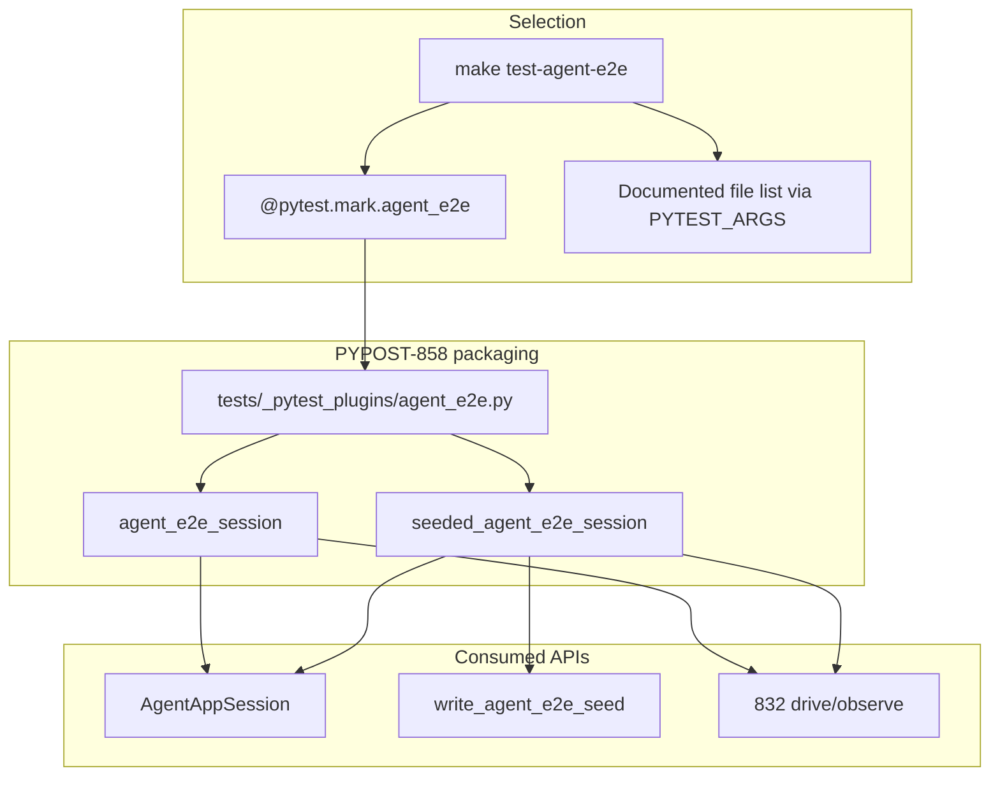
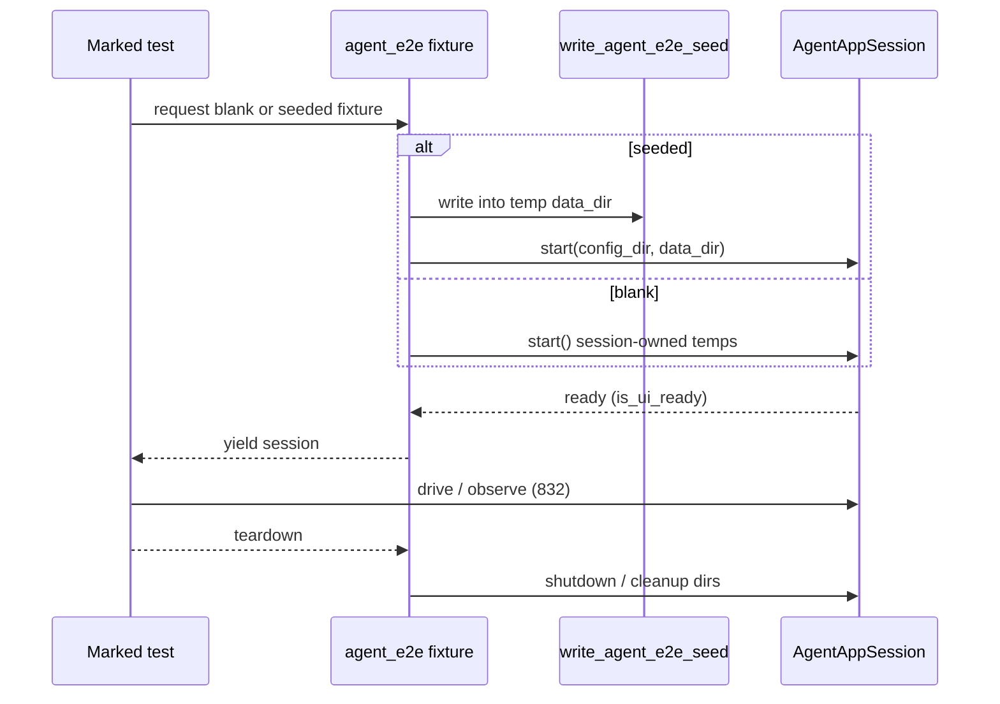

# PYPOST-858: Shared pytest session fixture + agent_e2e mark

## Research

### Jira / epic context

- Story: [PYPOST-858](https://pypost.atlassian.net/browse/PYPOST-858) —
  shared pytest packaging for ready `AgentAppSession` + `agent_e2e` mark.
- Parent epic: [PYPOST-855](https://pypost.atlassian.net/browse/PYPOST-855) —
  Agent E2E Environment.
- Contract: [PYPOST-856](https://pypost.atlassian.net/browse/PYPOST-856) /
  [agent_e2e_env.md](../../doc/dev/agent_e2e_env.md) — this story
  **implements** the “session + `agent_e2e` marker” fixture area.
- Seed (consume): [PYPOST-857](https://pypost.atlassian.net/browse/PYPOST-857) —
  `write_agent_e2e_seed`, inventory in `agent_e2e_seed.md` /
  `pypost/fixtures/agent_e2e_seed.py`; helpers in
  `tests/helpers/agent_e2e_seed.py` (`seeded_agent_dirs`).
- Foundation: [PYPOST-832](https://pypost.atlassian.net/browse/PYPOST-832) —
  consume `AgentAppSession`; do not fork lifecycle APIs.
- Overlap: [PYPOST-854](https://pypost.atlassian.net/browse/PYPOST-854) —
  docs/make follow-ups including marker `agent_e2e`; absorb marker/make
  selection here when it matches this story’s AC.
- Out of scope siblings: PYPOST-859 HTTP, PYPOST-860 failure artifacts,
  PYPOST-861 full env-pack make/CI productization beyond marker/file-list
  selection for `test-agent-e2e`.

### Existing lifecycle / isolation (consume)

| Piece | Location | Relevance |
| --- | --- | --- |
| `AgentAppSession` | `pypost/agent/lifecycle.py` | Context manager: start → ready → shutdown; injectable `config_dir` / `data_dir`; session-created temps cleaned on shutdown |
| Ready gate | `MainWindow.is_ui_ready` | Fixture must yield only after ready (same as `__enter__` → `start()`) |
| Offscreen | `AgentAppSession(offscreen=True)` + Makefile `QT_QPA_PLATFORM` | Keep both; fixture defaults `offscreen=True` |
| Seed writer | `write_agent_e2e_seed(data_dir)` | Must run **before** `start()` so startup load surfaces inventory |
| Seed helper | `seeded_agent_dirs()` | Allocates temp dirs + writes seed; packaging should reuse this shape |

Implication: packaging wraps lifecycle + optional pre-start seed. Do **not**
add a `seed=` hook to `AgentAppSession` (857 already rejected that boundary).

### Current pytest / make surface

| Piece | Today | Gap for 858 |
| --- | --- | --- |
| Markers in `pyproject.toml` | `timeout`, `slow` only | No `agent_e2e` |
| `tests/conftest.py` | Offscreen setdefault; module `qapp`; session MCP live server; mandatory timeout enforcement | No agent session fixture |
| `make test-agent-e2e` | Explicit file list (lifecycle → golden + seed) | No `-m agent_e2e` path |
| Docs | [agent_e2e.md](../../doc/dev/agent_e2e.md) documents file list | Marker undocumented |
| Default `addopts` | `-m "not slow"` | Marker selection must compose with `not slow` |

Harness modules constructing `AgentAppSession` today:

- `tests/test_agent_lifecycle_smoke.py` (incl. two sequential sessions)
- `tests/test_ui_identity_spotcheck.py`
- `tests/test_ui_actions.py`
- `tests/test_ui_snapshot.py`
- `tests/test_ui_wait.py`
- `tests/test_agent_golden_e2e.py` (blank + one-off HTTP patch)
- `tests/test_agent_e2e_seed.py` (seed via `seeded_agent_dirs` / blank isolation)

### External guidance (web)

- [pytest custom markers](https://docs.pytest.org/en/stable/how-to/mark.html):
  register in `pyproject.toml` `[tool.pytest.ini_options] markers`;
  unregistered marks warn; `--strict-markers` turns typos into errors.
  Marks apply to tests, not fixtures.
- [pytest fixtures](https://docs.pytest.org/en/stable/how-to/fixtures.html):
  yield setup/teardown; choose narrowest scope that preserves correctness.
- Fixture scaling practice (2026): use **function** scope for mutable
  workspaces; reserve **session** scope for expensive read-only shared
  resources ([QASkills pytest practices](https://qaskills.sh/blog/pytest-best-practices-2026)).

Applied here: Jira’s “session fixture” means **packaging for
`AgentAppSession`**, not pytest `scope="session"` sharing one mutable app
across mutating agent tests (would violate env-contract isolation FR7).

### Architectural decision: pytest fixture scope

| Option | Pros | Cons |
| --- | --- | --- |
| A. Function-scoped yield of ready `AgentAppSession` | Matches isolation; safe for mutating UI tests; mirrors today’s per-test `with` blocks | Rebuild cost per test (already paid today) |
| B. Module-scoped shared session | Faster within a module | Cross-test bleed; breaks lifecycle two-session proofs |
| C. Session-scoped shared session | Fastest | Violates isolation; unsafe for golden/seed mutations |

**Decision: Option A.** Function-scoped fixtures. Name may include “session”
because the yielded object is `AgentAppSession`, not because of pytest scope.

### Architectural decision: blank vs seeded packaging

| Option | Pros | Cons |
| --- | --- | --- |
| A. One fixture always seeded | Aligns env-pack “prefer seed” | Breaks blank/golden/lifecycle isolation proofs unless they avoid it |
| B. Two fixtures: blank + seeded | Clear migration; seed optional | Two names to document |
| C. One fixture + parametrize/seed flag | Single entry | Awkward for simple injections; harder readability |

**Decision: Option B.**

- `agent_e2e_session` — yield ready blank `AgentAppSession(offscreen=True)`
  (session owns temp dirs).
- `seeded_agent_e2e_session` — allocate dirs, `write_agent_e2e_seed(data_dir)`,
  yield ready `AgentAppSession(..., config_dir=..., data_dir=...)`; caller does
  not need to call seed manually.

Both are the “shared packaging path.” Seed fixture composes 857; blank
fixture covers 832 harness migration without forcing seed.

### Architectural decision: fixture placement

| Option | Pros | Cons |
| --- | --- | --- |
| A. Define in `tests/conftest.py` | Always loaded | Grows an already busy root conftest |
| B. Plugin module + `pytest_plugins` | Matches `duration_report` pattern; keeps conftest thin | One extra import path |
| C. Only in `tests/helpers/` without fixture registration | Reusable helpers | Not a pytest fixture; weaker AC “shared pytest … fixture” |

**Decision: Option B.** Add `tests/_pytest_plugins/agent_e2e.py` (name
illustrative) and register via `pytest_plugins` in `tests/conftest.py`. Keep
thin re-exports in helpers only if tests need non-fixture utilities.

### Architectural decision: marker registration and make selection

| Option | Pros | Cons |
| --- | --- | --- |
| A. Register marker; make keeps file list only; docs show `-m` via `PYTEST_ARGS` | Minimal make risk | Weak “can select via marker” unless documented clearly |
| B. Register marker; mark harness modules; make default `-m agent_e2e` (compose with `not slow`); document file-list override | Marker-first; grows with new marked tests | Must mark all intended modules; discovery may pick future marked tests outside old list |
| C. Make runs both file list **and** `-m agent_e2e` redundantly | Belt and suspenders | Confusing; easy to desync |

**Decision: Option B**, with explicit migration order:

1. Register `agent_e2e` in `pyproject.toml` markers.
2. Apply `@pytest.mark.agent_e2e` (module `pytestmark` alongside timeout) to
   current harness modules under the documented file list.
3. Change `make test-agent-e2e` default selection to `-m agent_e2e` (ensure
   expression remains compatible with global `not slow`, e.g. override/replace
   `-m` thoughtfully in the make recipe).
4. Document the former explicit file list as the supported narrow override via
   `PYTEST_ARGS` (and keep the table in `agent_e2e.md`).

This absorbs PYPOST-854 marker follow-up for `agent_e2e` into this story.

### Architectural decision: migration strategy for existing tests

| Pattern | Approach |
| --- | --- |
| Single `with AgentAppSession(...) as session` | Inject `agent_e2e_session` (or seeded variant) |
| Seed tests using `seeded_agent_dirs` + session | Prefer `seeded_agent_e2e_session`; keep pure storage unit test without UI |
| Two sessions in one test (lifecycle smoke / seed isolation) | Keep **direct** `AgentAppSession` construction (fixture cannot yield two independent instances cleanly in one request) |
| Golden blank + local HTTP patch | Use blank `agent_e2e_session`; leave HTTP one-off until PYPOST-859 |

Coverage must remain: same assertions, ready gate, identity/actions/snapshot/
wait/golden/seed proofs. Mark all migrated modules `agent_e2e`.

### Non-goals (reconfirmed)

- No changes to `AgentAppSession` constructor semantics for seed.
- No HTTP determinism layer; no failure artifact dumps; no PYPOST-861 CI job
  beyond make marker/file-list selection docs.
- No `--strict-markers` mandate in this story unless cheap and non-disruptive;
  registration alone satisfies “registered.”

## Implementation Plan

1. **Register marker** — add
   `agent_e2e: agent UI e2e / env-pack scenarios (select with -m agent_e2e)`
   to `pyproject.toml` `[tool.pytest.ini_options] markers`.
2. **Add plugin fixtures** — `tests/_pytest_plugins/agent_e2e.py`:
   - `agent_e2e_session` (function, yield ready blank session; teardown via
     context/`shutdown`)
   - `seeded_agent_e2e_session` (function, seed then yield ready session)
   - Register plugin from `tests/conftest.py` `pytest_plugins`.
3. **Migrate harness tests** — replace single-session `with AgentAppSession`
   blocks with fixtures; leave multi-session isolation tests on direct API;
   add `agent_e2e` to module `pytestmark`.
4. **Wire make** — `test-agent-e2e` selects via `-m agent_e2e` by default;
   document file-list `PYTEST_ARGS` override; keep `QT_QPA_PLATFORM=offscreen`.
5. **Docs** — update `agent_e2e.md` / `agent_e2e_env.md` status: marker +
   fixtures delivered; how to mark new tests; make selection modes.
6. **Verify** — `make test-agent-e2e`; spot-check `-m agent_e2e` and a
   file-list override; ensure timeout rule still satisfied.

## Architecture

### Module diagram



### Module responsibilities

| Module / surface | Responsibility |
| --- | --- |
| `pyproject.toml` markers | Official `agent_e2e` registration |
| `tests/_pytest_plugins/agent_e2e.py` | Shared fixtures; ready session yield; seed composition |
| `tests/conftest.py` | Register plugin; unchanged timeout gate / offscreen setdefault |
| `pypost/agent/lifecycle.py` | Unchanged consumer API |
| `pypost/fixtures/agent_e2e_seed.py` | Unchanged seed writer (857) |
| `Makefile` `test-agent-e2e` | Marker-based default selection; file-list override documented |
| `doc/dev/agent_e2e.md` (+ env status line) | Marker meaning, fixture names, make modes |

### Interaction sequence



### Main interfaces (illustrative)

```python
# tests/_pytest_plugins/agent_e2e.py
@pytest.fixture
def agent_e2e_session() -> Iterator[AgentAppSession]:
    with AgentAppSession(offscreen=True, ready_timeout=30.0) as session:
        yield session


@pytest.fixture
def seeded_agent_e2e_session() -> Iterator[AgentAppSession]:
    with TemporaryDirectory() as config, TemporaryDirectory() as data:
        config_dir, data_dir = Path(config), Path(data)
        write_agent_e2e_seed(data_dir)
        with AgentAppSession(
            offscreen=True,
            config_dir=config_dir,
            data_dir=data_dir,
            ready_timeout=30.0,
        ) as session:
            yield session
```

Exact names may match project style during Step 3, but the pair (blank +
seeded) and function scope are fixed by decisions above.

### Patterns

- **Facade / packaging fixture** — hide dir + start/ready/shutdown boilerplate.
- **Composition over lifecycle fork** — seed before `start()`, no `AgentAppSession`
  API change.
- **Marker-based test selection** — pack grows by marking new modules/tests.
- **Documented dual selection** — marker default + file-list override for AC.

### Dependencies

```text
tests (marked agent_e2e)
  → agent_e2e fixtures plugin
    → AgentAppSession (832)
    → write_agent_e2e_seed (857) [seeded fixture only]
  → existing 832 observe/drive helpers as today
```

No new runtime product dependency; test-only packaging.

## Q&A

- Q: Why not pytest `scope="session"` for the shared fixture?
  A: Env-contract isolation and mutating UI tests require a fresh workspace
  per scenario. “Session” in the story title refers to `AgentAppSession`.
- Q: Why two fixtures instead of always seeding?
  A: Existing golden/blank/lifecycle coverage must migrate without forcing
  seed; env scenarios that need inventory use the seeded fixture.
- Q: Why absorb PYPOST-854 marker work here?
  A: Jira AC and description explicitly call out overlapping marker/make
  improvements; delivering registration + make selection here avoids a
  second unfinished path.
- Q: Will `-m agent_e2e` conflict with addopts `-m not slow`?
  A: Make recipe must pass a coherent marker expression (or replace addopts
  `-m` for that invocation). Step 3 verifies pytest CLI behavior in this
  repo’s pytest version.
- Q: Must multi-session tests use the fixture?
  A: No. Isolation proofs that need two sessions keep direct construction;
  they still receive the `agent_e2e` mark for selection.
- Q: Does this implement HTTP stubs or failure dumps?
  A: No. Fixtures leave composition points for 859/860 without owning them.
