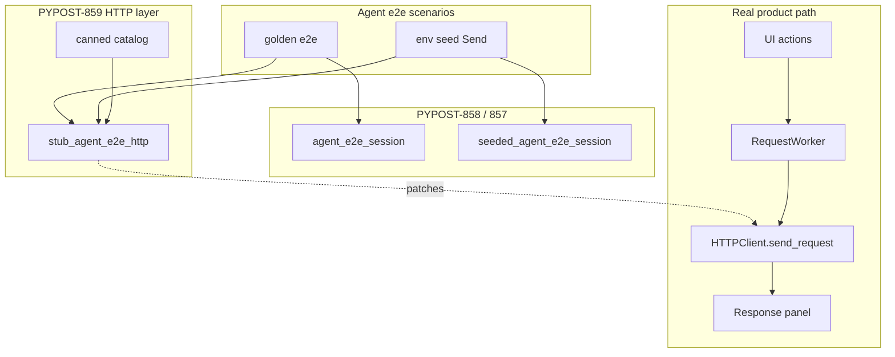

# PYPOST-859: Deterministic HTTP fixture layer for agent flows

## Research

### Jira / epic context

- Story: [PYPOST-859](https://pypost.atlassian.net/browse/PYPOST-859) —
  shared deterministic HTTP fixture layer for agent flows.
- Parent epic: [PYPOST-855](https://pypost.atlassian.net/browse/PYPOST-855).
- Contract: [PYPOST-856](https://pypost.atlassian.net/browse/PYPOST-856) /
  [agent_e2e_env.md](../../doc/dev/agent_e2e_env.md) — this story
  **implements** the “HTTP determinism” fixture area.
- Session packaging (consume): [PYPOST-858](https://pypost.atlassian.net/browse/PYPOST-858)
  — `agent_e2e_session` / `seeded_agent_e2e_session` in
  `tests/_pytest_plugins/agent_e2e.py`.
- Seed (consume): [PYPOST-857](https://pypost.atlassian.net/browse/PYPOST-857)
  — inventory in `pypost/fixtures/agent_e2e_seed.py` (`SEED_*` URLs).
- Out of scope siblings: PYPOST-860 failure artifacts, PYPOST-861 full
  env-pack make/CI.

### Current golden HTTP stub (replace as primary path)

| Piece | Today | Gap for 859 |
| --- | --- | --- |
| Golden test | `tests/test_agent_golden_e2e.py` | Private `_canned_ok()` + `patch(...)` |
| Patch target | `pypost.core.request_service.HTTPClient.send_request` | Correct seam; must stay |
| Result type | `HTTPRequestResult` + `ResponseData` | Keep; share via catalog |
| Env Send | None on shared layer | Seed GET/POST canned + scenario |
| Docs | Golden docs describe one-off patch | Document shared catalog + add flow |

Confirmed: `RequestService` imports `HTTPClient` and workers call
`send_request` through that binding — patching the RequestService module
attribute is the established integration-test seam (also used by
`tests/test_default_retry_policy_integration.py`).

### Seed URL inventory to cover for env Send

| Constant | Value |
| --- | --- |
| `SEED_BASE_URL_VALUE` | `https://example.test` |
| `SEED_GET_URL` | `{{base_url}}/get` → `https://example.test/get` |
| `SEED_POST_URL` | `{{base_url}}/post` → `https://example.test/post` |
| Golden URL | `https://example.test/agent-golden` |

### External guidance

- [unittest.mock.patch](https://docs.python.org/3/library/unittest.mock.html):
  patch where the name is looked up (`request_service.HTTPClient`), not
  where it is defined, for attribute resolution after import.
- [pytest fixtures](https://docs.pytest.org/en/stable/how-to/fixtures.html):
  yield/teardown for stub lifecycle; function scope for isolation.
- Prefer catalog + context manager so non-fixture callers (helpers,
  multi-session tests) can reuse the same API.

### Architectural decision: placement

| Option | Pros | Cons |
| --- | --- | --- |
| A. Only in golden test module | Minimal | Fails AC (not shared / not documented catalog) |
| B. `pypost/fixtures/agent_e2e_http.py` + plugin fixture | Mirrors seed pattern; importable | Slightly more files |
| C. Only `tests/helpers/` | Easy for tests | Weaker “shared fixture” / product-fixture parity with seed |

**Decision: Option B.** Catalog + `stub_agent_e2e_http` context manager in
`pypost/fixtures/agent_e2e_http.py`; thin pytest fixture(s) in
`tests/_pytest_plugins/agent_e2e.py` that expose the same helper.

### Architectural decision: stub API shape

| Option | Pros | Cons |
| --- | --- | --- |
| A. Always auto-fixture with fixed golden OK | Simple for golden | Awkward for seed / multi-response |
| B. Context manager + optional fixture factory | Flexible; explicit activate window | Authors must enter context |
| C. URL→response router only | Powerful | Overkill for current AC |

**Decision: Option B.**

- `make_canned_http_result(...)` builder.
- Named catalog entries: golden OK, seed GET OK, seed POST OK.
- `stub_agent_e2e_http(result | callable)` context manager patches
  `SEND_REQUEST_PATCH_TARGET` and restores on exit.
- Pytest fixture `agent_e2e_http_stub` yields the context-manager callable
  (or a thin wrapper) so scenarios do
  `with agent_e2e_http_stub(CANNED_GOLDEN_OK): ...`.

Optional callable/`side_effect` supports future multi-call sequences
without designing a full router now.

### Architectural decision: keep RequestWorker path

Do **not** mock `RequestWorker` or presenter send handlers. Stub only
`HTTPClient.send_request` at the RequestService import site so:

UI fill/select/click → presenter → worker → `send_request` stub →
response signals → response panel.

### Architectural decision: env scenario proof

Add a dedicated agent e2e scenario (marked `agent_e2e`) that uses
`seeded_agent_e2e_session`, fills the resolved seed GET URL, activates
`stub_agent_e2e_http(CANNED_SEED_GET_OK)`, Sends, and asserts status/body.
Keeps seed inventory ownership in 857 while proving FR4.

## Implementation Plan

1. Add `pypost/fixtures/agent_e2e_http.py`: patch target constant, builder,
   catalog (`CANNED_GOLDEN_OK`, `CANNED_SEED_GET_OK`, `CANNED_SEED_POST_OK`),
   `stub_agent_e2e_http` context manager, INFO log on install.
2. Extend `tests/_pytest_plugins/agent_e2e.py` with
   `agent_e2e_http_stub` fixture yielding the context manager.
3. Add unit tests for builder/catalog/stub install+restore (timeouts).
4. Migrate `tests/test_agent_golden_e2e.py` onto shared catalog + stub.
5. Add env Send scenario using seeded session + `CANNED_SEED_GET_OK`.
6. Observability: structured INFO when stub is installed (mode/name
   scalars only).
7. Dev docs: update `agent_e2e_env.md` status, `agent_golden_e2e.md`,
   umbrella `agent_e2e.md`, logging catalog; document “how to add canned”.

## Architecture



### Module responsibilities

| Module | Responsibility |
| --- | --- |
| `pypost/fixtures/agent_e2e_http.py` | Catalog, builder, stub CM, patch target |
| `tests/_pytest_plugins/agent_e2e.py` | Pytest fixture exposing stub CM |
| Golden / env tests | Consume catalog + stub; drive real UI |
| Docs (`doc/dev/`) | How to add canned; contract status |

### Main interfaces

```python
SEND_REQUEST_PATCH_TARGET: str  # RequestService.HTTPClient.send_request

def make_canned_http_result(
    *,
    url: str,
    status_code: int = 200,
    body: str = '{"ok": true}',
    headers: dict[str, str] | None = None,
    elapsed_time: float = 0.01,
) -> HTTPRequestResult: ...

CANNED_GOLDEN_OK: HTTPRequestResult
CANNED_SEED_GET_OK: HTTPRequestResult
CANNED_SEED_POST_OK: HTTPRequestResult

@contextmanager
def stub_agent_e2e_http(
    result: HTTPRequestResult | Callable[..., HTTPRequestResult] = CANNED_GOLDEN_OK,
    *,
    name: str = "custom",
) -> Iterator[None]: ...
```

Pytest:

```python
@pytest.fixture
def agent_e2e_http_stub():
    """Yield stub_agent_e2e_http for `with agent_e2e_http_stub(result):`."""
    return stub_agent_e2e_http
```

### Patterns

- **Shared fixture module** (like seed): catalog lives next to other
  agent e2e fixtures under `pypost/fixtures/`.
- **Patch-at-use-site**: RequestService binding, not `http_client` module.
- **Function-scoped stub lifetime**: context manager / per-test activate.
- **Composition over inheritance**: HTTP layer composes with session
  fixtures; does not wrap `AgentAppSession`.

## Q&A

- Q: Why not a URL router in v1?
  A: Current AC is golden + env canned use of a shared layer. Named
  catalog + callable covers sequences; a router can be a follow-up if
  multi-URL scenarios proliferate.
- Q: Why log on install?
  A: Grep-friendly proof that the shared layer (not a private patch)
  activated; scalars only (name), no bodies.
- Q: Can non-agent integration tests use this?
  A: Yes, the CM is importable; primary ownership remains agent e2e.
