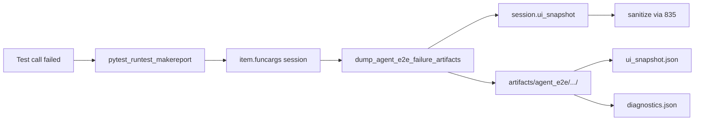

# PYPOST-860: Failure artifacts — snapshot dump on assert fail

## Research

### Jira / epic context

- Story: [PYPOST-860](https://pypost.atlassian.net/browse/PYPOST-860) —
  dump UI snapshot + concise diagnostics on agent e2e assert fail.
- Parent epic: [PYPOST-855](https://pypost.atlassian.net/browse/PYPOST-855).
- Contract: [PYPOST-856](https://pypost.atlassian.net/browse/PYPOST-856) /
  [agent_e2e_env.md](../../doc/dev/agent_e2e_env.md) — this story
  **implements** the “Failure artifacts” fixture area.
- Builds on: [PYPOST-835](https://pypost.atlassian.net/browse/PYPOST-835)
  `capture_ui_snapshot` / `AgentAppSession.ui_snapshot()` (masking + tree).
- Consumes: session fixtures from
  [PYPOST-858](https://pypost.atlassian.net/browse/PYPOST-858)
  (`agent_e2e_session`, `seeded_agent_e2e_session` in
  `tests/_pytest_plugins/agent_e2e.py`).
- Target scenarios: golden (`tests/test_agent_golden_e2e.py`) and env-pack
  Send (`tests/test_agent_e2e_http_env.py`) — both already use those
  fixtures.
- Out of scope: forking snapshot API; MCP tool; remote artifact upload as
  a required product feature; PYPOST-861 make/CI entry.

### Current surface

| Piece | Today | Gap for 860 |
| --- | --- | --- |
| `capture_ui_snapshot` | Masked tree API | Not called on test fail |
| Agent e2e plugin | Blank + seeded fixtures | No failure hook |
| Golden / env Send | Manual excerpt on wait timeout only | No on-disk dump on assert fail |
| Env contract | Failure artifacts “Not yet” | Need Delivered + docs |
| `.gitignore` | No artifacts dir | Ignore dump root |

### External guidance (web)

Pytest docs recommend `pytest_runtest_makereport` (hookwrapper) to
post-process failures and read fixtures from `item.funcargs` while the
call phase report is built — fixtures are still alive before teardown
([pytest examples: post-process failures](https://docs.pytest.org/en/stable/example/simple.html)).
Selenium/UI harnesses commonly dump screenshots the same way. For PyPost,
dump a **JSON snapshot** (already masked) instead of a pixel screenshot.

### Architectural decision: dump trigger

| Option | Pros | Cons |
| --- | --- | --- |
| A. pytest `makereport` hook + shared helper | Auto for all fixture users; matches AC “wired into” | Needs careful best-effort errors |
| B. Per-test try/except only | Explicit | Misses asserts; violates minimalism AC |
| C. Fixture teardown only | Simple | Harder to get report + exception context |

**Decision: Option A.** Implement `dump_agent_e2e_failure_artifacts(...)`
helper in `pypost/fixtures/`, invoke from
`pytest_runtest_makereport` in `tests/_pytest_plugins/agent_e2e.py` when
`report.when == "call"` and `report.failed`, if either session fixture is
in `item.funcargs`.

### Architectural decision: artifact location

| Option | Pros | Cons |
| --- | --- | --- |
| A. Under pytest `basetemp` | Isolated per run | Harder to document / CI upload |
| B. Repo-relative `artifacts/agent_e2e/` | Stable, documentable, CI-friendly | Must gitignore |
| C. Env-only path | Flexible | Undocumented default hurts authors |

**Decision: Option B + override.** Default root:
`artifacts/agent_e2e/` under pytest `rootpath`. Optional override via
`PYPOST_AGENT_E2E_ARTIFACTS` (absolute or relative to cwd). Per failure:
`{root}/{safe_nodeid}/` with `ui_snapshot.json` + `diagnostics.json`.
Gitignore `artifacts/`.

### Architectural decision: diagnostics content

Scalars / short strings only: `nodeid`, `when`, `outcome`, exception
`type` + truncated `message` (cap length), `session_fixture` name,
`ui_ready` bool, optional `dump_error` if snapshot capture failed.
Never write `env_vars`, `hidden_keys`, or raw widget values outside the
masked snapshot file. Logging: INFO with path + nodeid only.

### Architectural decision: secrets

Reuse `session.ui_snapshot()` (or `capture_ui_snapshot(window)`) — same
sanitizer path as PYPOST-835. Do not re-walk widgets or log tree values.
Exception messages in diagnostics are truncated; tests must not put
secrets in assert messages (existing policy).

## Implementation Plan

1. **Helper** — `pypost/fixtures/agent_e2e_failure.py`:
   - `DEFAULT_ARTIFACT_ROOT_NAME = "artifacts/agent_e2e"`
   - `resolve_artifact_root(rootpath) -> Path`
   - `safe_nodeid_dirname(nodeid) -> str`
   - `dump_agent_e2e_failure_artifacts(session, *, nodeid, excinfo=...,
     session_fixture=...) -> Path | None`
   - Write `ui_snapshot.json` (indent=2) + `diagnostics.json`
   - Log INFO `agent_e2e_failure_artifacts_written path=... nodeid=...`
   - On dump error: log WARNING, return None (do not raise)
2. **Hook** — extend `tests/_pytest_plugins/agent_e2e.py`:
   - `pytest_runtest_makereport` hookwrapper
   - Resolve session from `agent_e2e_session` or
     `seeded_agent_e2e_session` in `item.funcargs`
   - Call dump helper on call failure
3. **Gitignore** — `artifacts/`
4. **Tests** — `tests/test_agent_e2e_failure_artifacts.py`:
   - Unit: helper writes snapshot + diagnostics; masking still applied
   - Unit: dump error is best-effort
   - Integration: failing test using fixture produces artifacts (via
     pytest inline / subprocess or direct helper + hook unit)
   - Mark `agent_e2e` + timeout
5. **Docs** — `doc/dev/agent_e2e_failure_artifacts.md`; link from
   `agent_e2e.md`, `agent_e2e_env.md` (status → Delivered),
   `logging.md`, `ui_snapshot.md` as needed.
6. **Golden / env** — no per-test edits required if hook covers fixtures;
   verify by running those modules (and optional assert that hook is
   registered). Document that wiring is automatic.

## Architecture



### Modules and responsibilities

| Module | Responsibility |
| --- | --- |
| `pypost/fixtures/agent_e2e_failure.py` | Resolve paths; write snapshot + diagnostics; safe logging |
| `tests/_pytest_plugins/agent_e2e.py` | Fixtures + failure hook wiring |
| `tests/test_agent_e2e_failure_artifacts.py` | Helper + masking + best-effort + hook smoke |
| `doc/dev/agent_e2e_failure_artifacts.md` | Where files land and how to read them |
| `.gitignore` | Ignore `artifacts/` |

### Interfaces

```python
def dump_agent_e2e_failure_artifacts(
    session: AgentAppSession,
    *,
    nodeid: str,
    exc_type: str | None = None,
    exc_message: str | None = None,
    session_fixture: str | None = None,
    artifact_root: Path | None = None,
) -> Path | None:
    """Write ui_snapshot.json + diagnostics.json; return dump dir or None."""
```

Hook selects session:

```text
for name in ("seeded_agent_e2e_session", "agent_e2e_session"):
    if name in item.funcargs: use that session
```

Prefer seeded when both somehow present (unlikely).

### File layout

```text
artifacts/agent_e2e/
  tests_test_agent_golden_e2e_py__test_agent_golden_.../
    ui_snapshot.json
    diagnostics.json
```

## Q&A

- Q: Why not dump from fixture finalizer?
  A: `makereport` has the failure report and still sees live `funcargs`
  before teardown; matches pytest’s documented pattern.
- Q: Why a fixtures package helper vs tests-only?
  A: Mirrors seed/HTTP fixture modules; keeps dump logic importable and
  unit-testable without going through pytest hooks alone.
- Q: Will golden wait-timeout paths double-dump?
  A: Timeout re-raises → test fails → hook dumps once with final UI
  state. Acceptable; richer than excerpt-only.
- Q: CI upload?
  A: Document optional `actions/upload-artifact` path; not required for
  DoD (local/CI workspace files + docs suffice).
