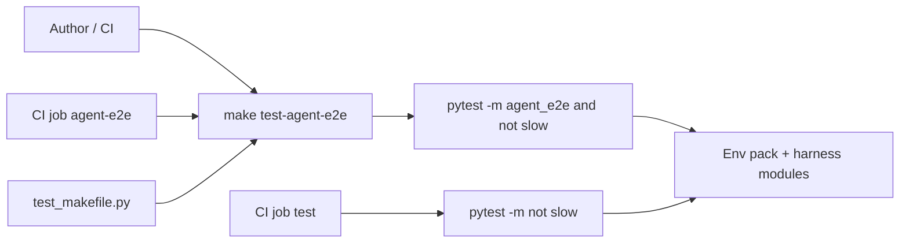

# PYPOST-861: CI job + make target for agent e2e env pack

## Research

### Jira / epic context

- Story: [PYPOST-861](https://pypost.atlassian.net/browse/PYPOST-861) —
  make + CI entry for the agent e2e **env pack**.
- Parent epic: [PYPOST-855](https://pypost.atlassian.net/browse/PYPOST-855).
- Contract: [PYPOST-856](https://pypost.atlassian.net/browse/PYPOST-856) /
  [agent_e2e_env.md](../../doc/dev/agent_e2e_env.md) — this story
  **implements** the “Make / CI entry” fixture area.
- Consumes: marker + `make test-agent-e2e` from
  [PYPOST-858](https://pypost.atlassian.net/browse/PYPOST-858); seed 857;
  HTTP 859.
- Absorbs: [PYPOST-854](https://pypost.atlassian.net/browse/PYPOST-854)
  remaining TD-2 (makefile smoke) + TD-3 (optional CI step). TD-1 marker
  already delivered by 858.
- Out of scope: PYPOST-860 failure artifacts; forking session/HTTP APIs.

### Current make / CI surface

| Piece | Today | Gap for 861 |
| --- | --- | --- |
| `make test-agent-e2e` | Marker + offscreen | Help/docs need env-pack wording; no smoke |
| Main CI `test` job | `-m "not slow"` includes pack | Does not name/run `make test-agent-e2e` |
| `make-install-smoke` | Dedicated slow makefile job | Pattern to mirror for agent-e2e gate |
| `tests/test_makefile.py` | venv/install/test/lint/help | No `test-agent-e2e` contract tests |
| Docs | Make documented; env “Not yet” | CI cross-link + status → Delivered |

### External guidance (web)

- GitHub Actions: keep jobs focused; prefer a dedicated job when the gate
  should appear as its own Actions entry (patterns:
  [reusable workflows / job focus](https://dev.to/datanestdigital/github-actions-workflows-github-actions-patterns-best-practices-pge)).
- For shared setup, composite actions help; for a **first-class pack gate**,
  a sibling job (like existing `make-install-smoke`) is clearer than burying
  the make target inside matrix pytest args.
- Cost: avoid full Python matrix duplication of GUI pack when one version
  proves the make path (mirror `make-install-smoke` → Python 3.11 only).

### Architectural decision: make target shape

| Option | Pros | Cons |
| --- | --- | --- |
| A. Extend `test-agent-e2e` | Already selects env pack via marker; one entry | Help/docs need env-pack wording |
| B. Sibling `test-agent-e2e-env` | Explicit env name | Duplicate selection; confuses authors |
| C. File-list only recipe | Explicit modules | Fights 858 marker design; drifts |

**Decision: Option A.** Keep/extend `test-agent-e2e`. Update `##` help to
mention env pack. Env-pack modules stay under `@pytest.mark.agent_e2e`.

### Architectural decision: CI gate shape

| Option | Pros | Cons |
| --- | --- | --- |
| A. Document only (main job already runs agent_e2e) | Cheap | Weak “first-class”; does not prove `make` recipe |
| B. Step inside main matrix: `make test-agent-e2e` | Named make | Double-runs pack on 3.11+3.13 |
| C. Dedicated job Python 3.11: `make test-agent-e2e` | First-class Actions entry; proves make; mirrors smoke job | Some overlap with main suite on 3.11 |

**Decision: Option C.** Add `agent-e2e` job in `.github/workflows/test.yml`
on Python 3.11 that installs `.[dev,otel]`, Qt runtime libs (same as main),
and runs `make test-agent-e2e`. Document that the main fast suite still
includes `agent_e2e` via `-m "not slow"`.

### Architectural decision: makefile smoke depth

| Option | Pros | Cons |
| --- | --- | --- |
| A. Static recipe / prereq / help only | Fast, no marker registration | Weaker selection proof |
| B. Isolated workspace execution with noop + agent_e2e marks | Proves selection like slow-exclusion test | Needs marker in minimal pyproject |
| C. Full GUI pack under makefile smoke | Strong | Slow; duplicates CI job |

**Decision: Option A + B.** Prereqs + help + selection smoke with a minimal
workspace that registers `agent_e2e` and asserts non-marked tests are
skipped / not run.

## Implementation Plan

1. **Makefile** — Refresh `test-agent-e2e` `##` help to mention env pack /
   `agent_e2e` marker; keep recipe `-m "agent_e2e and not slow"`.
2. **Makefile smoke** — In `tests/test_makefile.py`:
   - `test-agent-e2e` depends on `venv-otel` + marker.
   - `make help` includes `test-agent-e2e`.
   - Selection smoke: agent_e2e-marked pass, unmarked fail-if-run excluded.
3. **CI** — New job `agent-e2e` (Python 3.11): Qt libs, pip install
   `.[dev,otel]`, `make test-agent-e2e`, job summary.
4. **Docs** — Update `agent_e2e.md` (CI section), `agent_e2e_env.md`
   (status Delivered), `testing.md` / `setup.md` cross-links; note 854
   absorption in task artifacts.

## Architecture

### Modules and responsibilities

| Module | Responsibility |
| --- | --- |
| `Makefile` `test-agent-e2e` | First-class local/CI make entry; offscreen; marker default |
| `.github/workflows/test.yml` `agent-e2e` | Dedicated CI gate for the make target |
| `tests/test_makefile.py` | Contract smoke for deps, help, marker selection |
| `doc/dev/agent_e2e.md` | Umbrella: how to run + CI cross-link |
| `doc/dev/agent_e2e_env.md` | Contract status: Make/CI → Delivered |
| `doc/dev/testing.md` | Testing index: make + CI job note |

### Interfaces

- **Make:** `make test-agent-e2e` [ `PYTEST_ARGS=...` ]
  - Default: `-m "agent_e2e and not slow"`
  - Override: `PYTEST_ARGS` replaces default args (existing 791 contract)
- **CI:** job name `agent-e2e`; command `make test-agent-e2e`
- **Smoke:** asserts prereqs contain `venv-otel` and marker; help lists
  target; selection uses registered `agent_e2e` mark

### Patterns

- **Extend, don’t fork** — reuse 858 marker make target.
- **Sibling CI job** — same pattern as `make-install-smoke`.
- **Isolated makefile workspace** — existing `make_workspace` fixture pattern.

## Q&A

- Q: Why a dedicated CI job if main already runs agent_e2e?
  A: Proves the **make** recipe and gives a named Actions gate for the pack
  (FR3 / 854 TD-3). Main suite remains the broad regression net.
- Q: Why not a sibling make target?
  A: Env pack is selected by `agent_e2e`; a second target would duplicate
  selection and confuse “which command?”.
- Q: Why Python 3.11 only for the dedicated job?
  A: Cost parity with `make-install-smoke`; matrix still covers agent_e2e
  inside the main `test` job on 3.11 and 3.13.
