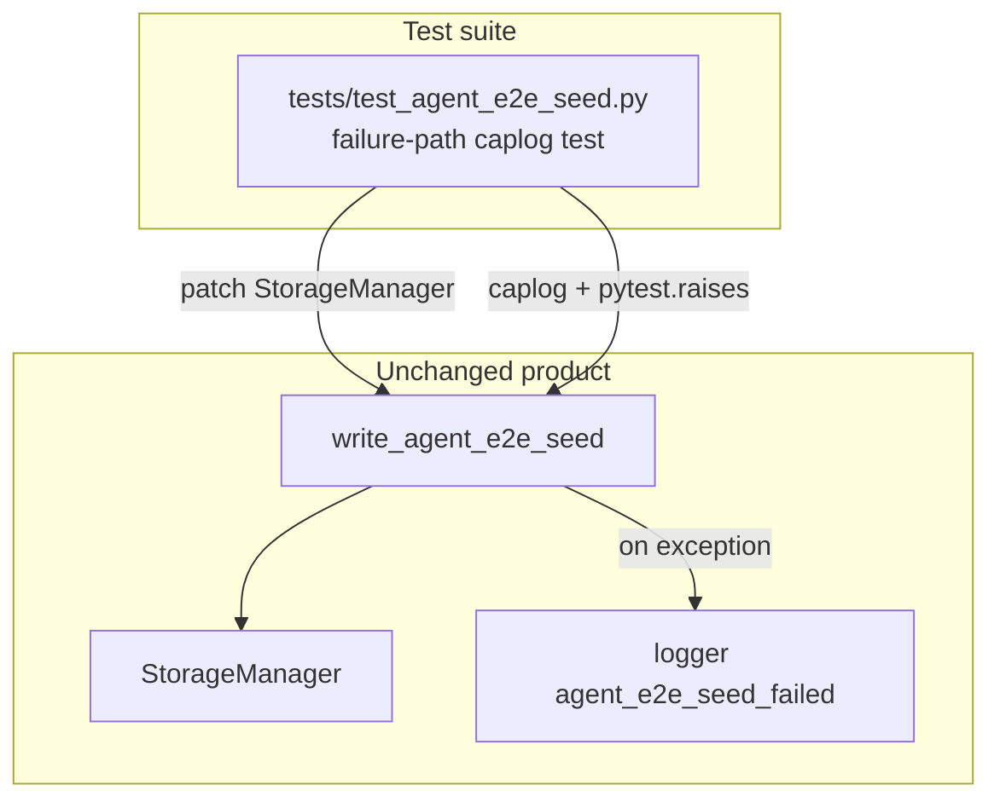

# PYPOST-862: Caplog coverage for agent e2e seed write failure

## Research

### Origin

- Jira: [PYPOST-862](https://pypost.atlassian.net/browse/PYPOST-862), Low Debt
  (2 SP), from [PYPOST-857](https://pypost.atlassian.net/browse/PYPOST-857)
  tech debt (`ai-tasks/PYPOST-857/60-tech-debt.md` — Caplog coverage for seed
  write failure).
- Requirements: `ai-tasks/PYPOST-862/10-requirements.md`.

### Current production contract (already landed)

`pypost/fixtures/agent_e2e_seed.py` → `write_agent_e2e_seed(data_dir)`:

1. Builds documented collection + environments.
2. Persists via `StorageManager(data_dir=...)` (`save_collection`,
   `save_environments`).
3. On any exception: `logger.exception("agent_e2e_seed_failed data_dir=%s",
   ...)` then **re-raises**.
4. On success: INFO `agent_e2e_seed_completed` with inventory fields.

Catalog: `doc/dev/logging.md` and `doc/dev/agent_e2e_seed.md` already describe
`agent_e2e_seed_failed`.

### Existing tests

`tests/test_agent_e2e_seed.py`:

- Module `pytestmark = [timeout(60), agent_e2e]`.
- Covers persist inventory, ready-via-identity, and isolation.
- **Missing:** mocked persist failure + caplog + re-raise (do-testing C1).

### Caplog / mock pattern in suite

Sibling agent e2e failure-path style
(`tests/test_agent_e2e_failure_artifacts.py`):

- `caplog.at_level(..., logger="pypost.fixtures.agent_e2e_failure")`
- Assert event prefix in `caplog.text`
- Mock session/capture boundary; no live network

do-testing C1: assert with
`caplog.at_level(logging.ERROR, logger="pypost.fixtures.agent_e2e_seed")`.

### Decision

**Test-only change.** Add one unit test in `tests/test_agent_e2e_seed.py` that
patches `StorageManager` (or a persist method) to raise, calls
`write_agent_e2e_seed`, asserts `agent_e2e_seed_failed` under caplog ERROR for
logger `pypost.fixtures.agent_e2e_seed`, and asserts the exception propagates
via `pytest.raises`. No production change expected unless the test reveals a
regression.

**Mock target:** Prefer
`unittest.mock.patch("pypost.fixtures.agent_e2e_seed.StorageManager")` so the
writer’s import site is patched; configure `save_collection` (or constructor)
`side_effect=OSError("disk full")` (or similar) for a deterministic failure
without touching the real filesystem beyond `tmp_path`.

## Implementation Plan

1. Keep `pypost/fixtures/agent_e2e_seed.py` unchanged unless the new test
   fails for a real contract gap.
2. Add `test_write_agent_e2e_seed_logs_failure_and_reraises(tmp_path, caplog)`
   to `tests/test_agent_e2e_seed.py`.
3. Inherit module `pytestmark` timeout(60); no new marker required unless the
   test is moved to a pure-unit module (keep co-located for FR4).
4. Run focused: `make test-agent-e2e PYTEST_ARGS="tests/test_agent_e2e_seed.py -v"`
   (and/or `make test` with the same path).
5. Update `doc/dev/agent_e2e_seed.md` Troubleshooting / Proof to mention the
   failure-path caplog test (Step 8).

**Mandatory — Failing Repro (next Step 3):**

- **What:** Automated test asserting desired failure-path behavior:
  - Arrange: patch `StorageManager` so persist raises.
  - Act/Assert: `pytest.raises` around `write_agent_e2e_seed(tmp_path)` under
    `caplog.at_level(logging.ERROR, logger="pypost.fixtures.agent_e2e_seed")`.
  - Assert `"agent_e2e_seed_failed" in caplog.text` (C1 / C5).
- **Where:** `tests/test_agent_e2e_seed.py`.
- **Force without live deps:** mock at writer import site; use `tmp_path` only
  as path argument.
- **Sequencing note:** Production already implements log + re-raise. The gap is
  **missing verification**. On current HEAD the new test is expected to be
  **green** immediately (coverage gap, not a production defect). Step 3 still
  lands the acceptance test as the red→green artifact; if it fails, Step 4
  fixes production. If green, Step 4 confirms no production edits and keeps
  the test as the deliverable.
- **Red probe (strict workflow):** If a literally-red Step 3 is required before
  the full assertions, temporarily land a failing placeholder that documents
  missing coverage, then replace it in Step 4 with the real caplog test.
  Preferred path: land the real test in Step 3 and treat green-on-HEAD as
  proof the contract already holds.

## Architecture

### Modules



### Responsibilities

| Component | Responsibility |
| --- | --- |
| `write_agent_e2e_seed` | Persist seed; log failure event; re-raise (existing) |
| New test | Force persist failure; assert event + propagation |
| `doc/dev/agent_e2e_seed.md` | Point maintainers at failure-path coverage |

### Patterns

- **Arrange–Act–Assert** with mock at dependency boundary.
- **Caplog C1** scoped to one logger per block.
- **No GUI / agent session** for this path (fast unit).

### Interfaces exercised

```text
write_agent_e2e_seed(data_dir: Path) -> None
  raises: whatever StorageManager persist raises (propagated)
  logs ERROR: agent_e2e_seed_failed data_dir=...
```

## Q&A

- Q: Change production logger message?
  A: No — assert the existing event prefix from PYPOST-857.
- Q: Separate test module without `agent_e2e` marker?
  A: Keep in `test_agent_e2e_seed.py` for discoverability; marker cost is
  acceptable for one fast mocked test.
- Q: Is Step 3 N/A?
  A: No — behavioral verification is missing; Step 3 adds the acceptance test.
