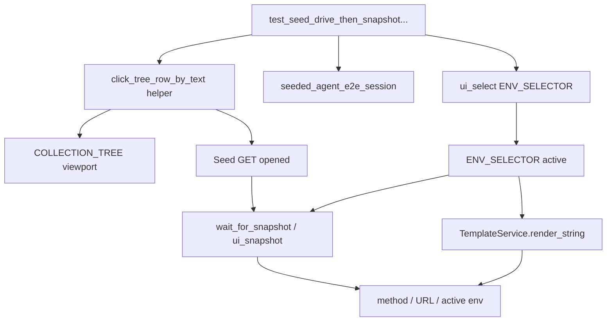

# PYPOST-863: Optional drive-then-snapshot / base_url resolve proof

## Research

### Origin

- Jira: [PYPOST-863](https://pypost.atlassian.net/browse/PYPOST-863), Low Debt
  (3 SP), from [PYPOST-857](https://pypost.atlassian.net/browse/PYPOST-857)
  tech debt — optional drive-then-snapshot / resolve proof.
- Related: `ai-tasks/PYPOST-857/` (seed inventory + identity FR8 path).
- Requirements: `ai-tasks/PYPOST-863/10-requirements.md`.

### Current baseline (PYPOST-857)

`tests/test_agent_e2e_seed.py` proves seed after ready via:

- `COLLECTION_TREE` model text (collection + `GET Seed GET` / `POST Seed POST`)
- `ENV_SELECTOR` item enumeration (`Agent E2E` listed)
- Explicit assert `currentText() == "No Environment"` (present ≠ active)

Architecture Option A identity path; drive-then-snapshot deferred.

### Agent primitives to consume (no fork)

| Primitive | Location | Use here |
| --- | --- | --- |
| `AgentAppSession` / ready | `pypost.agent.lifecycle` | Seeded session |
| `ui_select` | `pypost.agent.ui_actions` | Select `SEED_ENV_NAME` on `ENV_SELECTOR` |
| `ui_snapshot` / `wait_for_snapshot` | snapshot + wait | Assert active env, method, URL |
| Widget ids | `METHOD_COMBO`, `URL_INPUT`, `ENV_SELECTOR`, `COLLECTION_TREE` | Targets |
| Seed constants | `pypost.fixtures.agent_e2e_seed` | Inventory expectations |
| Fixture | `seeded_agent_e2e_session` | Isolated seeded ready session |

### Gap: opening a tree request via `ui_*`

`ui_click(COLLECTION_TREE)` clicks the tree chrome, not a row.
`CollectionsPresenter` opens requests on `clicked` for request indices.
Qt tree items are not widgets; row drive uses `visualRect` +
`QTest.mouseClick(viewport, …)` (same QTest stack as `ui_actions`).

**Decision:** Keep env activation on `session.ui_select`. Add a small **test
helper** (not a production `ui_*` API change) to click a collection-tree row
by display text via viewport `visualRect`. Document that tree-row click is
QTest-equivalent drive, while combo select uses the official agent action.

### Present vs active env

- **Present:** combo item list includes `Agent E2E` (already covered).
- **Active:** after `ui_select(..., SEED_ENV_NAME)`, snapshot / `currentText`
  shows `Agent E2E` and `env.current_variables` expose `base_url`.
- Soft resolve proof: `TemplateService.render_string(SEED_GET_URL, vars)` →
  `https://example.test/get` using **active** env variables (not disk alone).

### External guidance

- Qt / pytest-qt: click item views via viewport + `visualRect` center
  (Stack Overflow: QTreeWidget QTest viewport click pattern).
- Prefer widget APIs for combos (`ui_select` / `setCurrentIndex`); use mouse
  only when the control is an item view row.

## Implementation Plan

1. Add `tests/helpers` helper to expand/click a `QTreeView` row by text
   (scrollTo → visualRect → QTest.mouseClick on viewport; processEvents).
2. Add `test_seed_drive_then_snapshot_active_env_and_open_get` in
   `tests/test_agent_e2e_seed.py`:
   - Arrange: `seeded_agent_e2e_session` ready; document present ≠ active
     (`SEED_ENV_NAME` listed, `currentText == "No Environment"`).
   - Act: `session.ui_select(ENV_SELECTOR, SEED_ENV_NAME)`; expand collection;
     click `GET {SEED_GET_REQUEST_NAME}`; optionally `wait_for_snapshot`.
   - Assert (product-facing):
     - Snapshot (or wait predicate): `ENV_SELECTOR` value == `SEED_ENV_NAME`,
       `METHOD_COMBO` == `GET`, `URL_INPUT` == `SEED_GET_URL`.
     - Resolve: `template_service.render_string(SEED_GET_URL,
       session.window.env.current_variables)` ==
       `f"{SEED_BASE_URL_VALUE}/get"`.
3. Do **not** assert inventory names solely from blank-ready snapshot.
4. Prefer `make test-agent-e2e PYTEST_ARGS="tests/test_agent_e2e_seed.py -v"`.
5. Step 8: update `doc/dev/agent_e2e_seed.md` Proof strategy + present/active.

**Mandatory — Failing Repro (next Step 3):**

- **What:** Automated test asserting drive-then-snapshot + resolve behavior
  above (desired end state).
- **Where:** `tests/test_agent_e2e_seed.py` (+ thin helper under
  `tests/helpers/` if needed).
- **Force without live deps:** offscreen seeded session; no network Send.
- **Sequencing:** Step 3 lands the acceptance test (and helper if required for
  the test to compile). If the test is red because drive/assert wiring is
  incomplete, Step 4 finishes the helper/asserts until green. If green on
  first run (APIs already sufficient), Step 4 confirms no production edits
  and keeps the test as the deliverable — same coverage-debt stance as
  PYPOST-862.
- **Hard rule:** No `xfail`/`skip`; no blank-ready name-scan as sole proof.

## Architecture

### Module diagram

### Module responsibilities

| Artifact | Responsibility |
| --- | --- |
| `tests/test_agent_e2e_seed.py` | New drive-then-snapshot + resolve test |
| `tests/helpers/` (tree click) | Viewport QTest click by row text |
| `AgentAppSession.ui_*` / snapshot / wait | Unchanged consume |
| `pypost/fixtures/agent_e2e_seed.py` | Unchanged inventory constants |
| `doc/dev/agent_e2e_seed.md` | Document present vs active + new proof |

### Boundaries

| In scope | Out of scope |
| --- | --- |
| Soft FR2/FR3 drive + observe | New production `ui_click_tree_item` API (unless forced) |
| Seed test module extension | Seed inventory content changes |
| Present vs active docs | HTTP Send / stub matrix (859) |
| | Replacing identity presence proof |

### Selected patterns

| Pattern | Why |
| --- | --- |
| Drive then snapshot | Architecture FR8 path 2 from PYPOST-857 |
| Official `ui_select` for env | Agent UI action after ready |
| Viewport visualRect click for tree | Qt item-view constraint; mirrors ui_actions QTest |
| Template render for resolve | Proves active env variables without Send/HTTP |
| Co-locate with seed tests | Discoverability (FR6) |

## Q&A

- Q: Why not add production tree-item `ui_*`?
  A: Debt scope is soft coverage; helper in tests avoids lifecycle/API surface
  growth. Revisit if many scenarios need tree clicks.
- Q: Does URL field show resolved `https://example.test/get`?
  A: No — editor keeps `{{base_url}}/get`. Resolve is via TemplateService +
  active `current_variables` (and snapshot shows the template URL).
- Q: Approval for Step 2?
  A: Pre-approved under autonomous sprint-task-runner.

### References

- Requirements: [10-requirements.md](10-requirements.md)
- Seed arch: [../PYPOST-857/20-architecture.md](../PYPOST-857/20-architecture.md)
- UI actions / snapshot / wait: `doc/dev/ui_actions.md`, `ui_snapshot.md`,
  `ui_wait.md`
- Inventory: `doc/dev/agent_e2e_seed.md`
