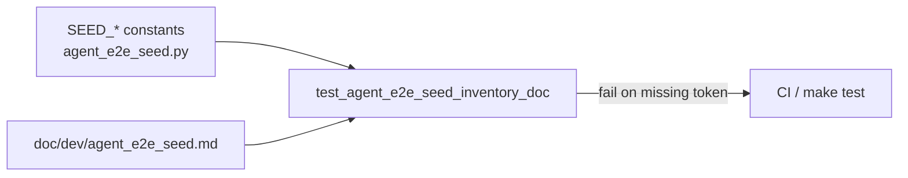

# PYPOST-864: Inventory drift guard (code vs seed doc)

## Research

### Origin

- Jira: [PYPOST-864](https://pypost.atlassian.net/browse/PYPOST-864), Low Debt
  (3 SP), from [PYPOST-857](https://pypost.atlassian.net/browse/PYPOST-857)
  tech debt (`ai-tasks/PYPOST-857/60-tech-debt.md` — Inventory drift guard).
- Requirements: `ai-tasks/PYPOST-864/10-requirements.md`.

### Current sources of truth

| Layer | Location |
| --- | --- |
| Code inventory | `pypost/fixtures/agent_e2e_seed.py` (`SEED_*` constants) |
| Doc inventory | `doc/dev/agent_e2e_seed.md` § Inventory after bootstrap |

PYPOST-857 architecture chose **Option A** (builders + documented inventory)
and deferred **Option C** (builders + committed golden JSON + match test).
This debt implements a **lightweight Option C subset**: assert constants appear
in the markdown inventory — no golden JSON dump.

### Suite patterns for doc↔code guards

- `tests/test_collection_tree_performance_doc.py` — reads `doc/dev/*.md`,
  asserts tokens; short `@pytest.mark.timeout(10)`.
- `tests/test_mcp_user_docs.py` — path constants + `read_text` presence
  asserts for user/dev docs.
- `tests/test_makefile.py` — Makefile / requirements content guards.

No existing agent-e2e seed doc drift guard.

### Decision

**Test-only change** (plus optional doc token tightening in Step 8).

1. Add `tests/test_agent_e2e_seed_inventory_doc.py` (pure unit, no Qt,
   no `agent_e2e` marker) so the guard stays fast and discoverable by name.
2. Import `SEED_*` constants from `pypost.fixtures.agent_e2e_seed`.
3. Read `doc/dev/agent_e2e_seed.md` and assert each inventory token is
   present (ids, display names, `base_url` key/value, GET/POST URL
   templates). Prefer scoping asserts to the inventory section when easy;
   full-file presence is acceptable if section parsing is brittle.
4. Clear assertion messages naming the missing token.
5. No production fixture or StorageManager changes unless the guard reveals
   a real doc gap that must be fixed in markdown.

**Not chosen:** committed golden JSON + round-trip match (full Option C) —
  overkill for the fixed four-row catalog (same rationale as PYPOST-857).

## Implementation Plan

1. Step 3: land a red placeholder test
   `test_seed_inventory_constants_match_doc` that fails with an explicit
   message documenting the missing drift guard (same pattern as PYPOST-862).
2. Step 4: replace placeholder with real constant↔doc presence asserts;
   run focused pytest; keep production seed module unchanged unless a doc
   token fix is required.
3. List the new module under discoverability notes in
   `doc/dev/agent_e2e_seed.md` (Step 8) — Configuration / Proof /
   Troubleshooting.
4. Run: `make test PYTEST_ARGS="tests/test_agent_e2e_seed_inventory_doc.py -v"`
   (and optionally keep seed module under `make test-agent-e2e` unchanged).

**Mandatory — Failing Repro (next Step 3):**

- **What:** Automated test asserting desired drift-guard behavior. Step 3
  lands a `pytest.fail(...)` placeholder stating the guard is missing.
  Step 4 replaces it with asserts that each inventory constant appears in
  `doc/dev/agent_e2e_seed.md`.
- **Where:** `tests/test_agent_e2e_seed_inventory_doc.py`.
- **Force without live deps:** local Path read + fixture constants only.
- **Sequencing:** research → red placeholder → real asserts until green →
  docs note.

## Architecture

### Modules



### Responsibilities

| Component | Responsibility |
| --- | --- |
| `pypost/fixtures/agent_e2e_seed.py` | Code source of truth (unchanged) |
| `doc/dev/agent_e2e_seed.md` | Human/agent mirror; must list tokens |
| New unit test | Fail when a required constant is absent from the doc |

### Patterns

- **Arrange–Act–Assert** with file read + constant list.
- **Doc presence guard** (same family as collection-tree / MCP user docs).
- **No GUI / agent session** for this path.

### Interfaces exercised

```text
SEED_* constants (import)
Path("doc/dev/agent_e2e_seed.md").read_text(encoding="utf-8")
```

## Q&A

- Q: Put the test in `test_agent_e2e_seed.py`?
  A: Prefer a dedicated pure-unit module so it does not pay the `agent_e2e`
  / Qt tax; name still ties it to seed inventory.
- Q: Bidirectional parse of markdown tables into structured rows?
  A: Not required. Presence of each constant token is enough for FR1/FR2;
  full table AST parsing is optional follow-up if false positives appear.
- Q: Is Step 3 N/A?
  A: No — verification is missing; Step 3 adds the acceptance test via a
  red placeholder, then Step 4 lands the real body.
