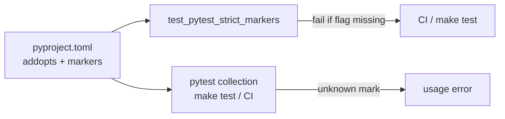

# PYPOST-865: Enable pytest --strict-markers (or document deferral)

## Research

### Origin

- Jira: [PYPOST-865](https://pypost.atlassian.net/browse/PYPOST-865), Low Debt
  (3 SP), from [PYPOST-858](https://pypost.atlassian.net/browse/PYPOST-858)
  tech debt (`ai-tasks/PYPOST-858/60-tech-debt.md` — Enable pytest
  `--strict-markers`).
- Requirements: `ai-tasks/PYPOST-865/10-requirements.md`.

### Current config

| Setting | Location | Value |
| --- | --- | --- |
| Pytest ini | `pyproject.toml` `[tool.pytest.ini_options]` | single source |
| `addopts` | same | `-v`, `--tb=short`, `--cov-fail-under=70`, `-m not slow` |
| Registered markers | same | `timeout`, `slow`, `agent_e2e` |
| `--strict-markers` | absent | unknown marks warn only |

### Suite marker audit (pre-change)

Custom marks used under `tests/`: `timeout`, `slow`, `agent_e2e`.
Builtins also present: `parametrize`, `usefixtures` (not subject to
registration). No unregistered custom marks found — safe to enable.

### Pytest behavior

`--strict-markers` raises a usage error when an unknown marker is present
(pytest docs / pytest 8). Putting it in `addopts` applies to `make test`,
`make test-cov`, `make test-agent-e2e`, and CI invocations that inherit
project config.

### Decision

**ENABLE** `--strict-markers` in `addopts` (not defer).

1. Add `"--strict-markers"` to `addopts` in `pyproject.toml`.
2. Keep existing `markers` registrations unchanged.
3. Add a small config guard test that asserts the flag remains in `addopts`
   and that required custom markers stay registered.
4. Document the policy in `doc/dev/testing.md` (markers / timeouts area).
5. No CI workflow flag duplication — inherit from `pyproject.toml`.

**Not chosen:** document-only deferral — unjustified when the suite is already
clean.

## Implementation Plan

1. Step 3: land red test
   `tests/test_pytest_strict_markers.py::test_addopts_includes_strict_markers`
   asserting `--strict-markers` is present in pytest `addopts` (fails today).
2. Step 4: add `--strict-markers` to `addopts`; extend guard to assert
   registered markers include `timeout`, `slow`, `agent_e2e`; collect/run
   focused tests to prove green.
3. Step 8: document strict markers under `doc/dev/testing.md`.
4. Run: `make test PYTEST_ARGS="tests/test_pytest_strict_markers.py -v"` and
   a collection smoke (`pytest --collect-only -q`) to confirm no unknown marks.

**Mandatory — Failing Repro (next Step 3):**

- **What:** Assert `pyproject.toml` `[tool.pytest.ini_options].addopts`
  contains `--strict-markers`. Fails while the flag is absent.
- **Where:** `tests/test_pytest_strict_markers.py`.
- **Force without live deps:** `tomllib` read of local `pyproject.toml` only.
- **Sequencing:** research → red config assert → add flag until green → docs.

## Architecture

### Modules

### Responsibilities

| Component | Responsibility |
| --- | --- |
| `pyproject.toml` | Enable `--strict-markers`; keep marker registry |
| New unit test | Lock flag + required registered markers |
| `doc/dev/testing.md` | Tell authors to register new custom marks |

### Patterns

- **Config-as-policy** via `addopts` (same family as coverage fail-under).
- **Doc/config guard** via `tomllib` (same family as `test_pyproject.py`).
- **No production runtime change.**

## Q&A

| Q | A |
| --- | --- |
| Duplicate flag in CI YAML? | No — inherit `addopts` from `pyproject.toml`. |
| New markers later? | Register under `markers` before use, or collection fails. |
