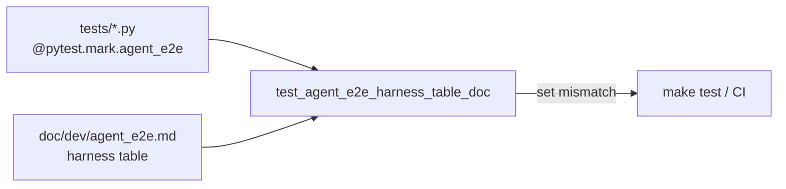

# PYPOST-866: Keep agent_e2e.md harness table synced with markers

## Research

### Origin

- Jira: [PYPOST-866](https://pypost.atlassian.net/browse/PYPOST-866), Low Debt
  from [PYPOST-858](https://pypost.atlassian.net/browse/PYPOST-858)
  tech debt (`ai-tasks/PYPOST-858/60-tech-debt.md` — Keep `agent_e2e.md`
  harness table synced with marked modules).
- Requirements: `ai-tasks/PYPOST-866/10-requirements.md`.
- Remediation hint in the debt item: checklist in `agent_e2e.md`, **or a
  cheap test** that asserts marked modules match the documented list.

### Current sources of truth

| Layer | Location |
| --- | --- |
| Suite selection | `@pytest.mark.agent_e2e`; make uses `-m "agent_e2e and not slow"` |
| Human/agent map | `doc/dev/agent_e2e.md` harness table (~77–93), “under the marker” |
| Marker convention | Module `pytestmark = [timeout(…), agent_e2e]` (same page) |

Make selects by marker; the table is discovery for humans/agents. They can
diverge independently.

### Observed drift (today)

AST scan of `tests/test_*.py` for `agent_e2e` on module `pytestmark` or
decorators yields **12** marked modules. The umbrella table lists **13**
rows. Extra documented row:

- `tests/test_agent_e2e_seed_inventory_doc.py` — PYPOST-864 inventory
  drift guard; intentionally **not** marked `agent_e2e` (pure unit, no
  Qt; see `ai-tasks/PYPOST-864/20-architecture.md`).

All twelve marked modules already appear in the table. So current failure
mode is a **stale documented row**, not a missing marked module. Future
risk is the opposite (new mark without a table row).

### Analogues in-repo

| Pattern | Module | Lesson |
| --- | --- | --- |
| Seed inventory | `test_agent_e2e_seed_inventory_doc.py` | Fast Path guard; no `agent_e2e` |
| Collection / MCP docs | doc presence tests | Short-timeout doc token asserts |
| Makefile content | `tests/test_makefile.py` | Recipe/string guards without make |

### Discovery approaches (external + local)

- **AST / static parse** of `pytestmark` and `@pytest.mark.*` without
  importing modules — avoids Qt/GUI import cost; matches how marks are
  applied in this suite today
  ([AST mark inspection](https://devork.be/blog/2012/06/inspecting-un-imported-modules-using/)).
- **`pytest --collect-only -m agent_e2e`** — authoritative for runtime
  selection, but heavier and pulls collection plugins; unnecessary for a
  docs hygiene guard.
- **Hardcoded expected list in the test** — defeats the purpose (list
  drifts with the table).

### Decision

**Prefer an automated set-equality drift guard** (debt Option: cheap test),
plus a short maintenance note in `doc/dev/agent_e2e.md` (Step 8). Do **not**
rely on checklist-only process.

1. Add `tests/test_agent_e2e_harness_table_doc.py` (pure unit, timeout 10,
   **no** `agent_e2e` mark — same placement rationale as PYPOST-864).
2. Discover marked modules under `tests/` via `ast` (module `pytestmark`
   list/attr and function/class decorators named `agent_e2e`).
3. Parse the harness table in `doc/dev/agent_e2e.md` by anchoring on the
   prose “Harness modules under the marker”, then reading the following
   `| Module | Covers |` rows (backtick paths in the Module column).
4. Assert **set equality** of relative paths
   (`tests/test_….py`). Failure messages must name modules only in marks,
   only in the table, or both sides when empty.
5. Coverage (“Covers”) text stays **manual** — the guard enforces module
   identity (FR1/FR4), not prose quality (FR2 is author responsibility when
   adding a row).
6. Step 4/8: remove the unmarked `seed_inventory_doc` row from this table
   (mention that guard elsewhere if useful), ensure every marked module has
   a useful Covers note, and document the maintenance rule next to the
   table / marker section.

**Not chosen:** docs-only checklist — easy to skip; debt already predicted
table lag. **Not chosen:** auto-generating the markdown table from marks —
overkill for Low debt; loses curated Covers notes. **Not chosen:**
`pytest --collect-only` subprocess — slower and couples the guard to full
collection.

## Implementation Plan

1. **Step 3 (red):** Add
   `tests/test_agent_e2e_harness_table_doc.py` with the real set-equality
   body (AST discover + table parse). It fails on current drift (extra
   `test_agent_e2e_seed_inventory_doc.py` row) without any production
   code change.
2. **Step 4 (green):** Align `doc/dev/agent_e2e.md` harness table with
   marked modules; add maintenance process note (FR3). Keep the guard
   unmarked and out of the harness table.
3. **Steps 5–7:** Standard cleanup / observability / tech-debt artifacts
   (test-only change; no product logging).
4. **Step 8:** Confirm umbrella + any cross-links describe how to keep
   marks and the table aligned (update table when adding/removing
   `agent_e2e`; rely on the guard in `make test`).

Run focused:

```bash
make test PYTEST_ARGS="tests/test_agent_e2e_harness_table_doc.py -v"
```

**Mandatory — Failing Repro (next Step 3):**

- **What:** Automated test asserting desired behavior: the set of
  `tests/test_*.py` modules carrying `@pytest.mark.agent_e2e` (module or
  decorator) equals the set of module paths listed in the harness module
  table of `doc/dev/agent_e2e.md`. Clear message listing
  only-in-marks / only-in-doc deltas.
- **Where:** `tests/test_agent_e2e_harness_table_doc.py`
  (e.g. `test_agent_e2e_harness_table_matches_marked_modules`).
- **Force without live deps:** filesystem + `ast` only; no Qt, no
  `AgentAppSession`, no network. Current repo state already fails (stale
  inventory-doc row).
- **Sequencing:** research (done) → red set-equality test → fix table +
  maintenance note until green → docs polish in Step 8.

## Architecture

### Modules



### Responsibilities

| Component | Responsibility |
| --- | --- |
| Marked harness modules | Suite membership via `agent_e2e` (source of truth) |
| `doc/dev/agent_e2e.md` table | Human/agent mirror + Covers notes |
| New unit drift guard | Fail when mark set ≠ documented module paths |
| Maintenance note (Step 8) | Authors update the table when marks change |

### Patterns

- **Doc↔code drift guard** (same family as PYPOST-864 seed inventory).
- **Static AST discovery** so the guard stays offscreen-free and fast
  (NFR1).
- **Set equality**, not one-way subset — covers both missing rows and
  stale rows (FR1).
- **No product / GUI change** (NFR4).

### Interfaces exercised

```text
ast.parse(tests/test_*.py)  →  frozenset[str]  # marked module paths
Path("doc/dev/agent_e2e.md").read_text(...)
  → parse harness table Module column → frozenset[str]
assert marked == documented  # with delta in AssertionError
```

### Out of scope (unchanged)

- Marker registration, `make test-agent-e2e` selection, suite layout.
- Sibling hygiene (strict markers, seed inventory contents, HTTP stubs,
  failure artifacts).
- Auto-writing Covers prose or regenerating the whole markdown page.

## Q&A

- Q: Should the new guard carry `agent_e2e`?
  A: No — pure unit under `make test`, like PYPOST-864. Listing it in the
  harness table would be incorrect under “modules under the marker.”
- Q: Why is `test_agent_e2e_seed_inventory_doc.py` in the table today?
  A: Discoverability leftover after PYPOST-864; it is not marked. Step 4
  removes it from this table (may still be linked from seed docs).
- Q: Bidirectional markdown table AST / require Covers tokens?
  A: Module path set equality is enough for FR1/FR4. Covers quality stays
  editorial (FR2).
- Q: Docs-only checklist instead of a test?
  A: Rejected — requirements allow either, but prefer enforcement that
  fails clearly in CI (NFR2).
- Q: Is Step 3 N/A?
  A: No — verification is missing; Step 3 lands the red set-equality test
  against current drift.
