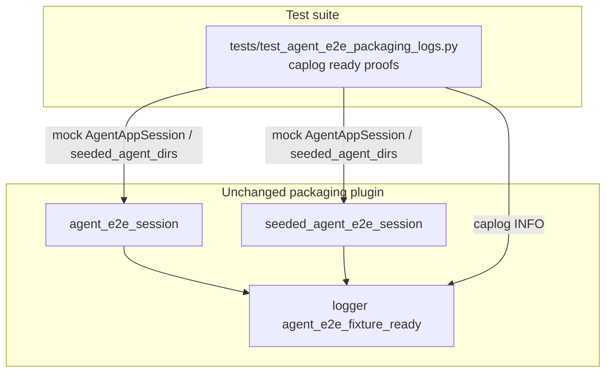

# PYPOST-867: Optional caplog proof for agent_e2e_fixture_ready

## Research

### Origin

- Jira: [PYPOST-867](https://pypost.atlassian.net/browse/PYPOST-867), Low Debt
  (3 SP), from [PYPOST-858](https://pypost.atlassian.net/browse/PYPOST-858)
  tech debt (`ai-tasks/PYPOST-858/60-tech-debt.md` — Optional caplog proof for
  packaging ready event).
- Requirements: `ai-tasks/PYPOST-867/10-requirements.md`.

### Current production contract (already landed)

`tests/_pytest_plugins/agent_e2e.py`:

1. `agent_e2e_session` — after `AgentAppSession` enters ready context:
   `logger.info("agent_e2e_fixture_ready mode=blank")`.
2. `seeded_agent_e2e_session` — after seeded dirs + ready session:
   `logger.info("agent_e2e_fixture_ready mode=seeded")`.
3. Logger name: `tests._pytest_plugins.agent_e2e` (`logging.getLogger(__name__)`).

Catalog: `doc/dev/logging.md` lists `agent_e2e_fixture_ready` with
`mode=blank|seeded`. Umbrella packaging notes live in `doc/dev/agent_e2e.md`.

### Existing tests

- Caplog siblings: `tests/test_agent_e2e_seed.py` (PYPOST-862 failure path),
  `tests/test_agent_e2e_failure_artifacts.py` (INFO/WARNING events).
- **Missing:** any assert of `agent_e2e_fixture_ready` under caplog.

### Caplog / mock pattern

Remediation from PYPOST-858:

```text
caplog.at_level(INFO, logger="tests._pytest_plugins.agent_e2e")
```

Prefer **mocked** `AgentAppSession` / `seeded_agent_dirs` and drive the fixture
generators directly so proofs stay fast unit tests (no offscreen Qt), matching
do-testing preference for deterministic isolation. Do **not** mark the new
module `agent_e2e` (same rule as harness-table / seed-inventory pure unit
guards) so it stays out of the umbrella harness table.

### Decision

**Test-only change.** Add `tests/test_agent_e2e_packaging_logs.py` with two
tests (blank + seeded) that patch session boundaries, run the fixture
generators from `tests._pytest_plugins.agent_e2e`, and assert
`agent_e2e_fixture_ready mode=blank` / `mode=seeded` in `caplog.text`. No
production change expected unless the test reveals a regression.

## Implementation Plan

1. Keep `tests/_pytest_plugins/agent_e2e.py` unchanged unless the new tests
   fail for a real contract gap.
2. Add `tests/test_agent_e2e_packaging_logs.py` with module
   `pytestmark = pytest.mark.timeout(30)` (pure unit / mocked I/O).
3. Cover both modes (cheap with mocks):
   - `test_agent_e2e_session_logs_fixture_ready_blank`
   - `test_seeded_agent_e2e_session_logs_fixture_ready_seeded`
4. Run focused:
   `make test PYTEST_ARGS="tests/test_agent_e2e_packaging_logs.py -v"`.
5. Step 8: note the packaging ready caplog proof in `doc/dev/agent_e2e.md`
   and/or logging catalog related text.

**Mandatory — Failing Repro (next Step 3):**

- **What:** Automated test documenting missing coverage for
  `agent_e2e_fixture_ready` (blank and/or seeded). Because production already
  emits the event, Step 3 lands a **literally red** placeholder that fails
  with an explicit PYPOST-867 message proving the gap is tracked; Step 4
  replaces it with the real mocked caplog assertions (both modes).
- **Where:** `tests/test_agent_e2e_packaging_logs.py`.
- **Force without live deps:** placeholder needs no deps; green path mocks
  `AgentAppSession` and `seeded_agent_dirs` at the plugin import site.
- **Sequencing:** Step 3 red placeholder + failing `make test` output →
  Step 4 real assertions until green. No product edit unless green tests
  expose a real logging bug.

## Architecture

### Modules



### Responsibilities

| Component | Responsibility |
| --- | --- |
| Packaging fixtures | Emit ready event after session ready (existing) |
| New packaging-logs tests | Assert blank + seeded ready events via caplog |
| `doc/dev/agent_e2e.md` / logging | Point maintainers at the caplog proof |

### Patterns

- **Arrange–Act–Assert** with mock at session boundary.
- Caplog scoped to one logger per block (INFO for ready event).
- Pure unit module: timeout(30), no `agent_e2e` marker.

### Interfaces exercised

```text
agent_e2e_session() fixture generator
  logs INFO: agent_e2e_fixture_ready mode=blank

seeded_agent_e2e_session() fixture generator
  logs INFO: agent_e2e_fixture_ready mode=seeded
```

## Q&A

- Q: Change production logger message?
  A: No — assert existing prefixes from PYPOST-858.
- Q: Put tests in an existing `agent_e2e`-marked module?
  A: Prefer a dedicated pure-unit module so proofs stay fast and out of the
  harness table (FR4 still met via naming).
- Q: Is Step 3 N/A?
  A: No — verification is missing; Step 3 adds a red placeholder, Step 4 the
  acceptance tests.
