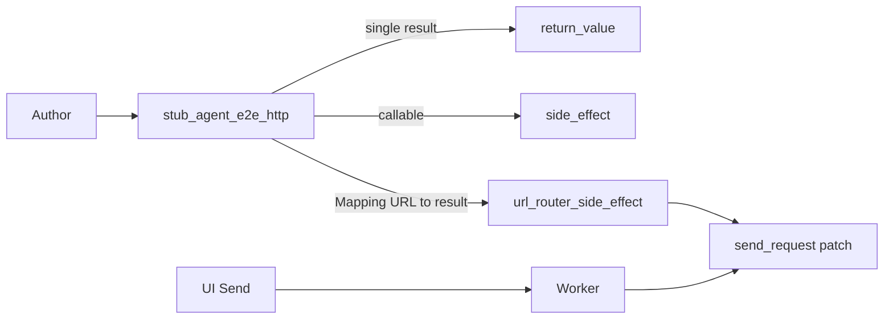

# PYPOST-868: Optional URL→canned response router helper

## Research

### Debt source / parent

- Ticket: [PYPOST-868](https://pypost.atlassian.net/browse/PYPOST-868) —
  Optional URL→canned response router helper (Debt, Low, SP 3).
- Parent: [PYPOST-859](https://pypost.atlassian.net/browse/PYPOST-859);
  follow-up in `ai-tasks/PYPOST-859/60-tech-debt.md`:
  *“Authors with multi-URL Send flows may want a small map keyed by
  resolved URL (or method+URL) instead of a custom callable.”*
- Shared layer today: `pypost/fixtures/agent_e2e_http.py` —
  `stub_agent_e2e_http(result | callable)`, catalog `CANNED_*`,
  docs in `doc/dev/agent_e2e_http.md`.
- Unit coverage: `tests/test_agent_e2e_http.py` (return_value, callable
  side_effect, catalog). GUI Send scenarios still use **single** canned
  results (golden, env GET, seed POST) or streaming callables
  (`canned_send_with_one_chunk`), not multi-URL maps.

### Current API gap

| Mode | Supported? | Multi-URL? |
| --- | --- | --- |
| Single `HTTPRequestResult` | Yes (`return_value`) | No — same body every call |
| Callable `side_effect` | Yes | Yes, but author owns match logic |
| `Mapping[str, HTTPRequestResult]` | **No** | Would be the safe map form |

Call site seam (unchanged): patch
`pypost.core.request_service.HTTPClient.send_request`. Product path still
passes `(self, request_data: RequestData, …)`; stubs must read
`request_data.url` from positional args (or `request_data=` kw). Template
rendering lives **inside** the real client — stubs see the URL string
present on `RequestData` (agent scenarios fill resolved URLs in the UI).

### ENABLE vs DEFER

| Option | Pros | Cons |
| --- | --- | --- |
| **DEFER** | True YAGNI while no multi-URL GUI scenario exists; callable already works | Leaves match rules tribal; ticket acceptance weaker without helper |
| **ENABLE** | Small overload; safer/documented multi-URL; matches parent remediation | Adds API surface before GUI multi-URL proliferation |

**Decision: ENABLE.** Cost is low (helper + unit tests + docs). Callable
remains the escape hatch for sequences/streaming. Match on exact
`request_data.url` (string key); method+URL deferred unless a second
key form is needed later. Miss → clear `AssertionError` listing known
keys (fail loud in tests).

External notes:

- [unittest.mock side_effect](https://docs.python.org/3/library/unittest.mock.html#unittest.mock.Mock.side_effect):
  callable receives same args as the mocked call — use for URL dispatch.
- Prefer extending existing CM over a second entry point so
  `agent_e2e_http_stub` keeps one teachable API.

## Implementation Plan

1. Add `url_router_side_effect(responses: Mapping[str, HTTPRequestResult])`
   (or private `_`) in `pypost/fixtures/agent_e2e_http.py` that extracts
   `RequestData.url` and returns the mapped canned result (or raises).
2. Extend `stub_agent_e2e_http` so a `Mapping` first argument installs that
   side_effect; log `name=url_router` (or `name=` override) plus key count.
3. Keep single-result and callable paths unchanged.
4. Unit tests in `tests/test_agent_e2e_http.py`: multi-URL hit, miss error,
   restore; timeout via existing module `pytestmark`.
5. Docs: `doc/dev/agent_e2e_http.md` — match rules, example map, miss
   behavior; note callable for streaming/ordered sequences.
6. Observability: reuse install INFO; optional debug on route hit is N/A
   unless cheap (prefer install-only to avoid noise).

**Failing Repro (Step 3):** Add
`test_stub_agent_e2e_http_url_router_map` in
`tests/test_agent_e2e_http.py` that builds a two-URL map
(`SEED_GET_RESOLVED_URL` → `CANNED_SEED_GET_OK`,
`SEED_POST_RESOLVED_URL` → `CANNED_SEED_POST_OK`), enters
`stub_agent_e2e_http(responses_map)`, calls patched `send_request` twice
with `RequestData`-like mocks (`.url` / `.method`), and asserts each
returns the matching canned result; plus a miss case expecting
`AssertionError` mentioning the unknown URL. Run with
`make test PYTEST_ARGS="tests/test_agent_e2e_http.py -q"` — **red** until
Step 4 implements Mapping support (today Mapping is treated incorrectly
or is unsupported). No live network; no GUI.

Sequencing: research (done) → red tests → implement router → green →
cleanup → observability note → tech debt → docs.

## Architecture



| Module | Responsibility |
| --- | --- |
| `pypost/fixtures/agent_e2e_http.py` | Detect Mapping; URL router side_effect; CM |
| `tests/test_agent_e2e_http.py` | Unit proofs for map hit/miss/restore |
| `doc/dev/agent_e2e_http.md` | Match rules + usage example |
| `tests/_pytest_plugins/agent_e2e.py` | Unchanged — still yields same CM |

### Patterns

- **Context manager** for stub lifecycle (existing).
- **Strategy overload** on first argument type: result | callable | Mapping.
- **Fail-loud miss** (`AssertionError`) for test clarity.

### Public API (delta)

```text
stub_agent_e2e_http(
  result: HTTPRequestResult | Callable | Mapping[str, HTTPRequestResult]
         = CANNED_GOLDEN_OK,
  *,
  name: str = "custom",
) -> ContextManager[None]
```

Match rules (v1):

1. Key = exact string equality on `request_data.url`.
2. `request_data` = first positional arg that has `.url` and `.method`, else
   `kwargs["request_data"]`.
3. Unknown URL → `AssertionError` with `url=` and sorted known keys.
4. Not supported in v1: glob/prefix, method+URL compound keys, ordered
   multi-call queues (use callable).

## Q&A

| Q | A |
| --- | --- |
| Why ENABLE despite no GUI multi-URL scenario? | Ticket AC + low cost; callable remains for complex cases; units prove safety. |
| Why exact URL only? | Agent scenarios already use resolved URL strings; avoids fake template engine in the stub. |
| Why not keyword `responses=` only? | Positional Mapping matches parent “overload” wording; one teachable call shape. |
| Change plugin fixture? | No — same `stub_agent_e2e_http` object. |
