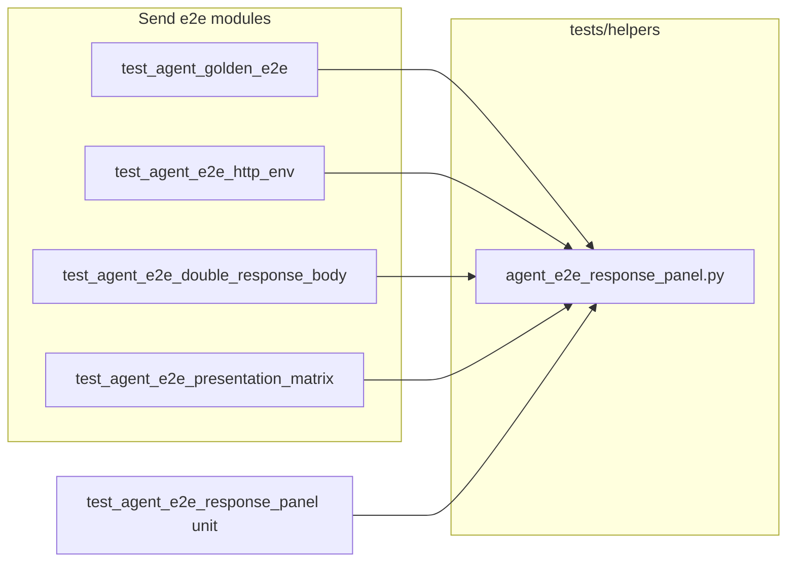

# PYPOST-869: Share response-panel snapshot helpers across Send tests

## Research

### Jira / parent debt

- Issue: [PYPOST-869](https://pypost.atlassian.net/browse/PYPOST-869) —
  share response-panel snapshot helpers across Send / golden tests.
- Parent note: [PYPOST-859](https://pypost.atlassian.net/browse/PYPOST-859)
  `60-tech-debt.md` — “Response-panel helpers duplicated”; suggested path
  `tests/helpers/agent_e2e_response_panel.py`.
- Related Send consumers today (identical private copies):
  - `tests/test_agent_golden_e2e.py`
  - `tests/test_agent_e2e_http_env.py`
  - `tests/test_agent_e2e_double_response_body.py`
  - `tests/test_agent_e2e_presentation_matrix.py`
- Existing helper pattern: `tests/helpers/agent_e2e_seed.py`,
  `tests/helpers/qt_wait.py` — import as `from tests.helpers.<mod> import …`.
- Docs that call helpers “test-local”:
  [agent_golden_e2e.md](../../doc/dev/agent_golden_e2e.md) (update in
  Step 8). HTTP / umbrella docs may cross-link.

### Current helper surface (duplicated)

| Helper | Behavior |
| --- | --- |
| `_walk_values(node)` | Collect non-empty string `value` fields depth-first |
| `_subtree_by_name(node, name)` | First subtree whose `name` matches |
| `_response_panel_excerpt(snap)` | Join panel values with ` \| `; truncate >400 |
| `_joined_panel_values(snap)` | Join panel values with `\n` (double-body / matrix) |
| Local `_response_ready` / asserts | Scenario-specific expected tokens — **stay local** |

Env Send inlines join inside `_response_ready` without a named
`_joined_panel_values` / excerpt helper; after share it should import
`joined_panel_values` (and may optionally use `response_panel_excerpt` on
timeout — optional, not required for AC if diagnostics stay as today).

### External guidance

pytest / test-helper packages commonly keep pure tree/DOM walkers in
`tests/helpers` (or `tests/support`) rather than product packages —
matches this repo’s seed helpers. No third-party library needed for a
~40-line dict walk.

### Architectural decisions

| Decision | Choice | Rationale |
| --- | --- | --- |
| Module path | `tests/helpers/agent_e2e_response_panel.py` | Matches debt note + seed helper layout |
| Public names | `walk_values`, `subtree_by_name`, `response_panel_excerpt`, `joined_panel_values` | No leading underscore for a shared API |
| Panel constant | Import `RESPONSE_PANEL` from `pypost.ui.widget_ids` inside helper module | Call sites already use that id; keep one source |
| Ready predicates | Remain local per scenario | Encode scenario tokens (status/body) |
| Product code | Untouched | Test-only debt |
| `__init__.py` | Do not re-export in `tests/helpers/__init__.py` | Avoid bloating FakeStorageManager module; import submodule directly (seed pattern) |

## Implementation Plan

1. **Shared module** — add
   `tests/helpers/agent_e2e_response_panel.py` with the four helpers and
   `__all__`.
2. **Unit red → green** — `tests/test_agent_e2e_response_panel.py`
   (timeout-marked, non-GUI) imports helpers and asserts walk / subtree /
   excerpt / join on a tiny synthetic tree; also proves consumer modules
   do not redefine local `_walk_values` / `_subtree_by_name` (AST or
   source check) — see Failing Repro below.
3. **Rewire** — replace local helper defs in the four Send modules with
   imports; keep local `_response_ready` / `_assert_response_ui` that call
   shared helpers.
4. **Docs (Step 8)** — update golden (and briefly umbrella / HTTP or
   double-body) to point at the shared module.
5. **Verify** — unit test via `make test`; rewired Send via
   `make test-agent-e2e` with targeted `PYTEST_ARGS` (and smoke matrix
   cell if needed).

**Mandatory — Failing Repro (next Step 3):**

Write `tests/test_agent_e2e_response_panel.py` **before** adding the
helper module / rewires:

1. Assert `from tests.helpers.agent_e2e_response_panel import (
   walk_values, subtree_by_name, response_panel_excerpt,
   joined_panel_values)` succeeds and helpers behave on a synthetic
   snapshot dict (expected walk order, subtree find, excerpt truncation
   policy, join newlines).
2. Assert each of the four consumer modules’ source does **not** contain
   a local `def _walk_values` (string/AST check on file text) — proves
   rewire, not only that a new module exists.

On current HEAD this fails with `ImportError` (module missing) and/or
local-def presence. Step 4 adds the module + rewires until green.
No product/runtime fix. Force failure without live Qt / network.

Sequencing: research (done) → red unit test → shared module + rewires →
green unit + green targeted agent e2e.

## Architecture



### Module responsibilities

| Module | Responsibility |
| --- | --- |
| `tests/helpers/agent_e2e_response_panel.py` | Pure snapshot-dict helpers for RESPONSE_PANEL |
| Send scenario modules | Fill/Send/wait; local ready predicates; import helpers |
| `tests/test_agent_e2e_response_panel.py` | Unit proof + no-local-duplicate guard |

### Interfaces (shared API)

```python
def walk_values(node: dict[str, Any]) -> list[str]: ...
def subtree_by_name(node: dict[str, Any], name: str) -> dict[str, Any] | None: ...
def response_panel_excerpt(snap: dict[str, Any], *, max_len: int = 400) -> str: ...
def joined_panel_values(snap: dict[str, Any]) -> str: ...
```

`response_panel_excerpt` / `joined_panel_values` use `RESPONSE_PANEL` and
`walk_values` / `subtree_by_name` internally.

### Patterns

- **Extract shared test helper** (DRY) — same as `agent_e2e_seed` helpers.
- **Keep scenario predicates local** — composition over a mega-ready API.

## Q&A

- Q: Put helpers under `pypost/fixtures/`?
  A: No — they are pytest/UI-snapshot test utilities, not product fixtures
  or HTTP stubs. `tests/helpers/` matches seed temp-dir helpers.
- Q: Should excerpt use `max_len` as a parameter?
  A: Optional kwarg with default 400 preserves today’s behavior and allows
  tests; not required by call sites.
- Q: Env Send lacks excerpt today — must it gain one?
  A: Not required for AC; importing walk/subtree/join is enough. Optional
  excerpt on timeout is a nice consistency follow-up.
