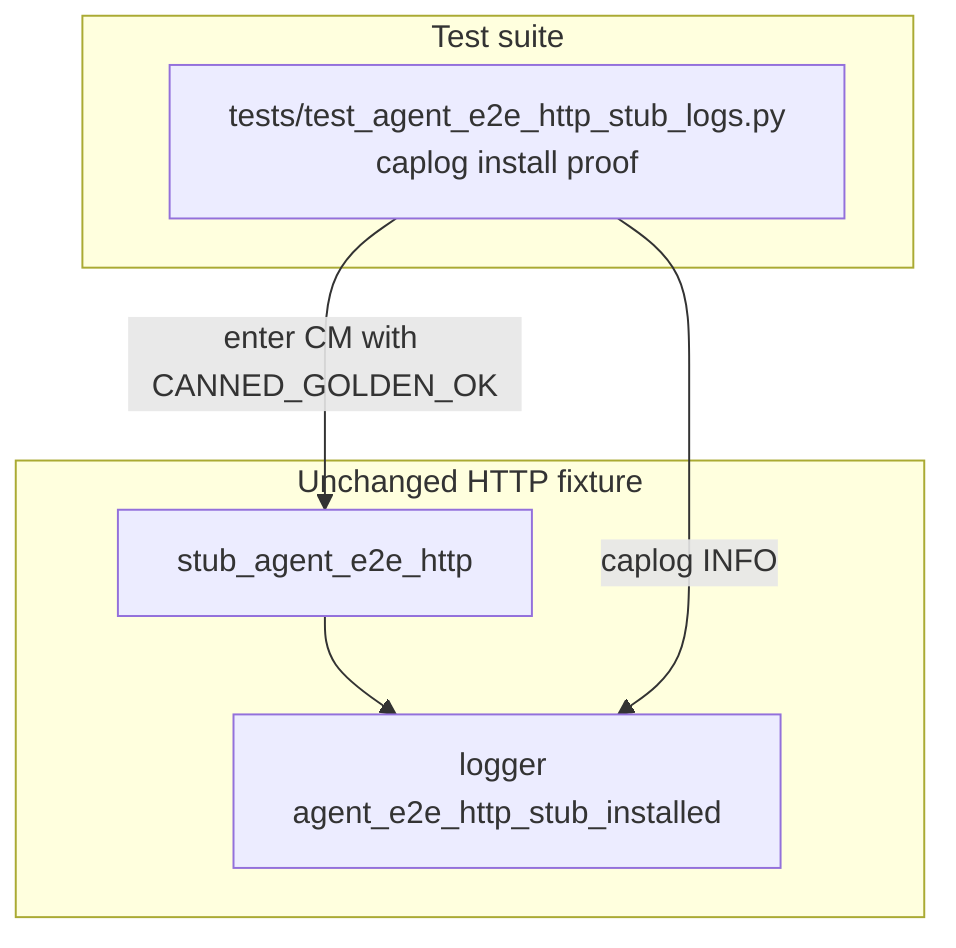

# PYPOST-870: Optional caplog proof for agent_e2e_http_stub_installed

## Research

### Origin

- Jira: [PYPOST-870](https://pypost.atlassian.net/browse/PYPOST-870), Low Debt
  (2 SP), from [PYPOST-859](https://pypost.atlassian.net/browse/PYPOST-859)
  tech debt (`ai-tasks/PYPOST-859/60-tech-debt.md` — Optional caplog proof for
  HTTP stub install event).
- Requirements: `ai-tasks/PYPOST-870/10-requirements.md`.
- Sibling pattern: [PYPOST-867](https://pypost.atlassian.net/browse/PYPOST-867)
  (`tests/test_agent_e2e_packaging_logs.py` — packaging ready caplog).

### Current production contract (already landed)

`pypost/fixtures/agent_e2e_http.py`:

1. `stub_agent_e2e_http(...)` — before patching `send_request`:
   `logger.info("agent_e2e_http_stub_installed name=%s", catalog_name)`.
2. Catalog identity (`is`) maps known constants to `golden_ok`,
   `seed_get_ok`, `seed_post_ok`, `double_body_lock_ok`; Mapping defaults to
   `url_router` when `name="custom"`; otherwise uses explicit `name=`.
3. Logger name: `pypost.fixtures.agent_e2e_http`
   (`logging.getLogger(__name__)`).

Catalog: `doc/dev/logging.md` lists `agent_e2e_http_stub_installed` with
`name` field. Umbrella notes live in `doc/dev/agent_e2e_http.md`.

### Existing tests

- Behavioral stub coverage: `tests/test_agent_e2e_http.py` (return/restore,
  callable, URL router) — **no** install-event caplog assert.
- Packaging-logs sibling: `tests/test_agent_e2e_packaging_logs.py`
  (PYPOST-867) — pattern to mirror for logging-catalog proofs.

### Caplog / unit pattern

Remediation from PYPOST-859:

```text
caplog.at_level(INFO, logger="pypost.fixtures.agent_e2e_http")
```

Prefer exercising `stub_agent_e2e_http(CANNED_GOLDEN_OK)` directly (already a
pure unit path; patches RequestService site). Do **not** mark the proof
module `agent_e2e` so it stays out of the umbrella harness table.

### Decision

**Test-only change.** Add `tests/test_agent_e2e_http_stub_logs.py` with one
test that enters `stub_agent_e2e_http(CANNED_GOLDEN_OK)` under caplog and
asserts `agent_e2e_http_stub_installed name=golden_ok` in `caplog.text`. No
production change expected unless the test reveals a regression.

## Implementation Plan

1. Keep `pypost/fixtures/agent_e2e_http.py` unchanged unless the new test
   fails for a real contract gap.
2. Add `tests/test_agent_e2e_http_stub_logs.py` with module
   `pytestmark = pytest.mark.timeout(10)` (pure unit / mocked I/O).
3. Cover install event for catalog golden:
   - `test_stub_agent_e2e_http_logs_installed_event`
4. Run focused:
   `make test PYTEST_ARGS="tests/test_agent_e2e_http_stub_logs.py -v"`.
5. Step 8: note the HTTP stub install caplog proof in
   `doc/dev/agent_e2e_http.md` and/or `doc/dev/logging.md`.

**Mandatory — Failing Repro (next Step 3):**

- **What:** Automated test documenting missing coverage for
  `agent_e2e_http_stub_installed`. Because production already emits the
  event, Step 3 lands a **literally red** placeholder that fails with an
  explicit PYPOST-870 message proving the gap is tracked; Step 4 replaces
  it with the real caplog assertion.
- **Where:** `tests/test_agent_e2e_http_stub_logs.py`.
- **Force without live deps:** placeholder needs no deps; green path only
  needs `stub_agent_e2e_http` (unittest mock patch of send_request).
- **Sequencing:** Step 3 red placeholder + failing `make test` output →
  Step 4 real assertion until green. No product edit unless green tests
  expose a real logging bug.

## Architecture

### Modules



### Responsibilities

| Component | Responsibility |
| --- | --- |
| HTTP stub CM | Emit install event before patch (existing) |
| New stub-logs test | Assert install event via caplog |
| `doc/dev/agent_e2e_http.md` / logging | Point maintainers at the caplog proof |

### Patterns

- **Arrange–Act–Assert** with real CM entry (patch is local to the CM).
- Caplog scoped to one logger per block (INFO for install event).
- Pure unit module: timeout(10), no `agent_e2e` marker.
- Mirrors PYPOST-867 packaging-logs structure (dedicated log-proof module).

### Interfaces exercised

```text
stub_agent_e2e_http(CANNED_GOLDEN_OK)
  logs INFO: agent_e2e_http_stub_installed name=golden_ok
```

## Q&A

- Q: Change production logger message?
  A: No — assert existing prefixes from PYPOST-859.
- Q: Put the test in `tests/test_agent_e2e_http.py`?
  A: Prefer a dedicated stub-logs module (FR4 + PYPOST-867 discoverability);
  behavioral stub tests stay separate from catalog proofs.
- Q: Is Step 3 N/A?
  A: No — verification is missing; Step 3 adds a red placeholder, Step 4 the
  acceptance test.
- Q: Cover every catalog name?
  A: No — one `name=golden_ok` install satisfies AC; other names remain
  optional follow-up.
