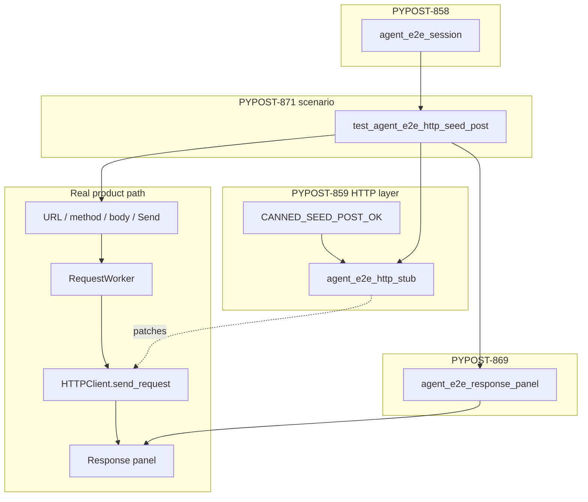

# PYPOST-871: Seed POST GUI Send scenario on shared HTTP layer

## Research

### Jira / parent debt

- Issue: [PYPOST-871](https://pypost.atlassian.net/browse/PYPOST-871) —
  seed POST GUI Send on the shared HTTP layer.
- Parent note: [PYPOST-859](https://pypost.atlassian.net/browse/PYPOST-859)
  `60-tech-debt.md` — catalog has `CANNED_SEED_POST_OK` but no GUI Send
  exercises the POST body path.
- Mirror scenario: `tests/test_agent_e2e_http_env.py` (seed GET: method /
  URL fill → `agent_e2e_http_stub(CANNED_SEED_GET_OK)` → status/body).
- Shared HTTP layer: `pypost/fixtures/agent_e2e_http.py` —
  `CANNED_SEED_POST_OK`, `SEED_POST_RESOLVED_URL`, `SEED_POST_OK_BODY`;
  seed body text `SEED_POST_BODY` from `agent_e2e_seed`.
- Body fill identity: `REQUEST_BODY_EDIT` (`pypost/ui/widget_ids.py`);
  presentation matrix shows POST auto-focuses Body (no tab switch
  required for POST).
- Panel helpers: `tests.helpers.agent_e2e_response_panel`
  (`joined_panel_values`, `subtree_by_name`) — PYPOST-869.
- Docs: [agent_e2e_http.md](../../doc/dev/agent_e2e_http.md) lists
  `seed_post_ok` in catalog; umbrella [agent_e2e.md](../../doc/dev/agent_e2e.md)
  lists env GET Send only — Step 8 adds POST scenario.

### External guidance

pytest GUI e2e patterns already established in-repo (offscreen Qt,
`pytest.mark.agent_e2e`, bounded `wait_for_snapshot`). No new library.

### Architectural decisions

| Decision | Choice | Rationale |
| --- | --- | --- |
| New module | `tests/test_agent_e2e_http_seed_post.py` | Keeps POST body path distinct from env GET; mirrors env module shape |
| Session fixture | Blank `agent_e2e_session` | Explicit URL/method/body fill; avoids collection-tree navigation (same boundary as env GET) |
| Stub | `agent_e2e_http_stub(CANNED_SEED_POST_OK)` | Catalog identity auto-names `seed_post_ok` |
| Body fill | `ui_fill(REQUEST_BODY_EDIT, SEED_POST_BODY)` | Proves POST body path; POST does not need Body-tab switch |
| Panel helpers | Import shared helpers | FR5; no local walk/subtree duplicates |
| Settle timeout | 15s (same as env GET) | Consistency; not introducing shared constant this story |
| Product / catalog | Untouched | Entry already exists |
| Red proof shape | Inventory gate in unit module | Full GUI scenario would pass today once written; inventory proves gap until module lands |

## Implementation Plan

1. **Failing repro (Step 3)** — unit inventory assert that
   `tests.test_agent_e2e_http_seed_post` is importable and exposes
   `test_seed_post_send_uses_shared_http_stub` (add to
   `tests/test_agent_e2e_http.py`). Fails with `ModuleNotFoundError`
   until Step 4.
2. **Scenario module (Step 4)** — add
   `tests/test_agent_e2e_http_seed_post.py`:
   - marks: `timeout(60)`, `agent_e2e`
   - fill `URL_INPUT` → `SEED_POST_RESOLVED_URL`, `METHOD_COMBO` →
     `POST`, `REQUEST_BODY_EDIT` → `SEED_POST_BODY`
   - `with agent_e2e_http_stub(CANNED_SEED_POST_OK):` click Send
   - wait/assert `Status: 200` + compact JSON of `SEED_POST_OK_BODY`
     via shared panel helpers
3. **Cleanup / observability** — flake8 on new test; reuse existing stub
   install log (no new events required).
4. **Docs (Step 8)** — mention seed POST Send in `agent_e2e_http.md`
   and umbrella `agent_e2e.md` scenario table.

**Mandatory — Failing Repro (next Step 3):**

Add to `tests/test_agent_e2e_http.py` (unit, timeout already marked):

```python
def test_seed_post_gui_send_scenario_module_exists() -> None:
    """PYPOST-871: seed POST GUI Send scenario module must exist."""
    import importlib

    mod = importlib.import_module("tests.test_agent_e2e_http_seed_post")
    assert callable(
        getattr(mod, "test_seed_post_send_uses_shared_http_stub", None)
    )
```

Run via `make test PYTEST_ARGS='tests/test_agent_e2e_http.py::test_seed_post_gui_send_scenario_module_exists -q'`.
Expected: **red** (`ModuleNotFoundError` or assert) — intended missing
scenario, not a broken fixture.

Sequencing: research → red inventory → Step 4 adds GUI module → inventory
green + GUI scenario green under `make test-agent-e2e`.

## Architecture



### Modules and responsibilities

| Module | Responsibility |
| --- | --- |
| `tests/test_agent_e2e_http_seed_post.py` | GUI Send scenario (POST + body) |
| `tests/test_agent_e2e_http.py` | Unit inventory gate (Step 3) + existing catalog/stub unit tests |
| `pypost/fixtures/agent_e2e_http.py` | Unchanged catalog/stub |
| `tests.helpers.agent_e2e_response_panel` | Shared wait/assert helpers |
| `doc/dev/agent_e2e_http.md` / `agent_e2e.md` | Author discovery (Step 8) |

### Interfaces (test-facing)

| Symbol | Use |
| --- | --- |
| `CANNED_SEED_POST_OK` | Stub return value |
| `SEED_POST_RESOLVED_URL` / `SEED_POST_OK_BODY` | URL fill + body assert |
| `SEED_POST_BODY` | Request body fill |
| `REQUEST_BODY_EDIT` / `METHOD_COMBO` / `URL_INPUT` / `SEND_BUTTON` | UI identities |
| `joined_panel_values` / `subtree_by_name` | Ready predicate + assert |
| `agent_e2e_http_stub` | Fixture entry to shared CM |

### Patterns

- **Mirror env GET Send** — same settle/wait/diagnostics shape.
- **Deterministic boundary stub** — no live HTTP; no RequestWorker mock.
- **Identity-driven UI** — no widget-type walks for fill (Body tab not
  required for POST).

## Q&A

- Q: Why blank session instead of seeded?
  A: Env GET uses seeded mainly for session composition; URL is still
  filled explicitly. Blank + explicit fill is enough for POST body proof
  and simpler.
- Q: Why an inventory unit red test instead of writing the GUI test red?
  A: A correctly written GUI scenario would pass immediately (catalog/
  stub/UI already exist). Inventory gate is the honest “missing
  scenario” failure mode.
- Q: Streaming `canned_send_with_one_chunk`?
  A: Not required — env GET and golden use plain `return_value`; seed
  POST status/body assert matches that path.
- Q: Extend env module instead of a new file?
  A: New file keeps GET vs POST scenarios discoverable and matches the
  debt’s “add a scenario” framing without growing env Send scope.
