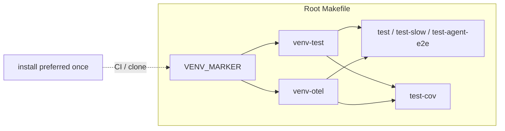

# PYPOST-872: Make test targets depend on venv-test / install-first

## Research

### Jira / parent debt

- Issue: [PYPOST-872](https://pypost.atlassian.net/browse/PYPOST-872) —
  make `test` / `test-agent-e2e` depend on `venv-test` **or** document
  install-first clearly.
- Parent: [PYPOST-861](https://pypost.atlassian.net/browse/PYPOST-861)
  `60-tech-debt.md` item 1 — same latent pattern as the
  `test` / `test-cov` dependency split.

### Current Makefile (root)

| Target | Prerequisites today |
| --- | --- |
| `venv-test` | marker → `pip install -e ".[dev]"` |
| `venv-otel` | marker → `pip install -e ".[otel]"` |
| `install` | marker → `pip install -e ".[dev,otel]"` |
| `test` | marker + `venv-otel` (**no** `venv-test`) |
| `test-slow` | marker + `venv-otel` (**no** `venv-test`) |
| `test-cov` | marker + `venv-test` + `venv-otel` |
| `test-agent-e2e` | marker + `venv-otel` (**no** `venv-test`) |
| `lint` | marker only |

Neither `venv-test` nor `venv-otel` uses a stamp file: each Make visit
re-runs pip. `test` already pays that cost for otel every run.

### Docs today

- `doc/dev/testing.md` § Reproducible test environment already says
  `run` / `test` / `lint` do not auto-install — run `make install` first.
- The same section does not call out `test-agent-e2e`, and it conflicts
  with the fact that `test` **does** auto-run `venv-otel`.
- Contract table in § Makefile automation tests documents
  `test-cov` + `venv-test` but not a `venv-test` expectation for
  `test` / `test-agent-e2e`.

### Contract tests today (`tests/test_makefile.py`)

- `test_test_depends_on_venv_otel_and_marker` — otel + marker only.
- `test_test_agent_e2e_depends_on_venv_otel_and_marker` — same.
- `test_runtime_targets_depend_on_marker_only` parametrizes
  `run` / `test` / `lint` and asserts **`venv-test` not in** prereqs.
- `test_test_cov_depends_on_venv_test_venv_otel_and_marker` — already
  requires `venv-test`.

### Decision: **ENABLE** makefile `venv-test` prerequisites

| Option | Pros | Cons |
| --- | --- | --- |
| **ENABLE** (chosen) | Aligns `test` / `test-slow` / `test-agent-e2e` with `test-cov`; fixes fresh-venv “otel installed, pytest missing” failure; matches primary ticket wording | Re-runs `pip install -e ".[dev]"` each make visit (same class of cost as existing `venv-otel`) |
| Document-only | Zero runtime cost change; CI unchanged | Leaves half-auto install (`venv-otel` without pytest); docs already partially state install-first and still confuse |

**Rationale:** Targets that invoke pytest must ensure `[dev]` is present.
`test` already depends on `venv-otel`; omitting `venv-test` is the
inconsistent half. Prefer ENABLE over document-only. Keep recommending
`make install` once after clone (single `[dev,otel]` install) in docs;
prerequisites remain the safety net. Stamp/caching for `venv-*` is
out of scope (optional follow-up).

**Scope of ENABLE:** `test`, `test-slow`, `test-agent-e2e`. Leave `lint`
and `run` on marker-only + install-first wording (out of ticket summary;
flake8 needs `[dev]` but is not in this Debt’s title).

### External guidance

GNU Make re-runs recipe-bearing prerequisites without stamps. No new
tools; project already uses `make -p` parsing in `test_makefile.py`.

### Architectural decisions

| Decision | Choice | Rationale |
| --- | --- | --- |
| ENABLE vs docs | **ENABLE** `venv-test` on pytest targets | Consistency with `venv-otel` + `test-cov`; FR2 safety net |
| Targets touched | `test`, `test-slow`, `test-agent-e2e` | All invoke pytest; slow shares the same gap |
| `lint` / `run` | Unchanged deps; docs clarify install-first | Outside ticket title; avoid scope creep |
| Docs | Update `testing.md` (and setup touch if needed) | Remove contradictory “test does not auto-install” |
| Red proof | Assert `venv-test` in prereqs for `test` + `test-agent-e2e` | Fails today; green after Makefile change |
| Stamps | Defer | SP 2 / NFR follow-up only |

## Implementation Plan

1. **Failing repro (Step 3)** — extend `tests/test_makefile.py`
   dependency-chain asserts so `test` and `test-agent-e2e` require
   `venv-test` in prerequisites. Run targeted; expect **red**
   (AssertionError: `venv-test` missing).
2. **Makefile (Step 4)** — add `venv-test` to `test`, `test-slow`,
   `test-agent-e2e` prerequisite lists (order: marker, `venv-test`,
   `venv-otel` to mirror `test-cov`).
3. **Contract test cleanup (Step 4)** — update
   `test_runtime_targets_depend_on_marker_only` so `test` is no longer
   asserted free of `venv-test` (keep `run` / `lint`); rename/extend
   otel-only tests to require `venv-test`.
4. **Docs (Step 8)** — canonical install-first + auto-`venv-test` note
   in `doc/dev/testing.md`; light sync in `setup.md` if needed.

**Mandatory — Failing Repro (next Step 3):**

In `tests/test_makefile.py` `TestDependencyChain`:

- Change / add asserts so prerequisites for `test` and `test-agent-e2e`
  include `"venv-test"` (desired post-fix contract).
- Do **not** edit the root `Makefile` in Step 3.
- Run:

```bash
make test PYTEST_ARGS='tests/test_makefile.py::TestDependencyChain -q'
```

Expected: **red** — `venv-test` not in current prereqs (intended gap),
not a broken fixture.

Sequencing: research → red contract asserts → Makefile ENABLE → green
asserts + docs.

## Architecture



| Module | Responsibility |
| --- | --- |
| Root `Makefile` | ENABLE `venv-test` on pytest-running targets |
| `tests/test_makefile.py` | Lock dependency-chain contract |
| `doc/dev/testing.md` | Canonical developer contract + install-first advice |

## Q&A

| Q | A |
| --- | --- |
| Why not depend on `install` instead? | `install` is `[dev,otel]` in one pip; workable but heavier rename vs adding `venv-test` beside existing `venv-otel`. ENABLE mirrors `test-cov`. |
| Why include `test-slow`? | Same pytest gap; keeps slow/fast e2e family consistent. |
| Document-only rejected? | Yes — see Decision table; half-auto otel without pytest is worse DX than either pure docs or full ENABLE. |
