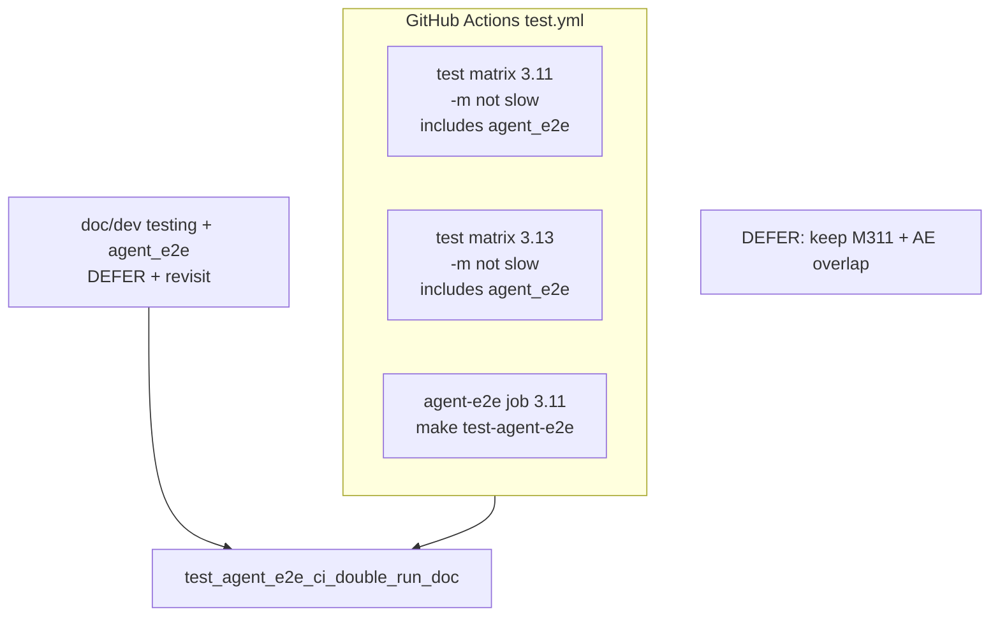

# PYPOST-873: Optional CI cost trim for agent-e2e double-run

## Research

### Jira / parent debt

- Issue: [PYPOST-873](https://pypost.atlassian.net/browse/PYPOST-873) —
  optional CI cost trim if agent-e2e + other jobs double-run painfully on
  Python 3.11.
- Parent: [PYPOST-861](https://pypost.atlassian.net/browse/PYPOST-861)
  `60-tech-debt.md` item 3 — “Only if double-run minutes become painful;
  keep dual coverage until then.”

### Current CI (`.github/workflows/test.yml`)

| Job | Python | Agent e2e coverage |
| --- | --- | --- |
| `test` (matrix) | 3.11, 3.13 | Yes — `pytest … -m "not slow"` includes `agent_e2e` |
| `agent-e2e` | 3.11 only | Yes — `make install` + `make test-agent-e2e` |
| Other jobs | 3.11 | No agent e2e pack |

Workflow job summary already states the overlap:

> Main `test` job still includes the same tests via `-m "not slow"`.

Local collect: **48** tests under `-m "agent_e2e and not slow"` out of
~1782 collected (small fraction of the main suite). Dedicated job still
pays full Qt apt + `make install` setup; that fixed cost dominates job
wall time more than re-running 48 already-collected tests inside the warm
main matrix process.

### Docs today

- `doc/dev/agent_e2e.md` § CI: table shows both entries; notes make-gate
  vs multi-version coverage — **does not** name the cost-trim decision or
  revisit criteria.
- `doc/dev/testing.md`: mentions job `agent-e2e` and that the main suite
  also includes the pack — **no** PYPOST-873 / DEFER language.
- No automated lock that the intentional dual-run / deferral is documented.

### External guidance

Industry CI advice favors cutting redundancy when cost hurts (matrix
exclude, marker `-m "not X"`, path filters). Pytest markers are the
natural ENABLE lever here (`-m "not slow and not agent_e2e"` on the main
job for 3.11, or whole-matrix). Parent debt and NFR1 prefer **not** to
optimize until minutes are painful.

### Decision: **DEFER** (document intentional double-run)

| Option | Pros | Cons |
| --- | --- | --- |
| **ENABLE** | Saves re-running ~48 agent e2e tests on 3.11 main job | Loses “agent e2e beside rest of suite” on 3.11; asymmetric if only 3.11 trimmed; needs careful 3.13 / make-gate story |
| **DEFER** (chosen) | Keeps dual coverage + 3.13 matrix coverage; matches parent “until painful”; zero workflow risk | Continues intentional 3.11 overlap |

**Rationale:** No evidenced CI-minute pain. Pack size is modest. Dedicated
job proves the Makefile recipe; matrix keeps multi-version coverage.
Document the overlap and revisit criteria; do **not** change
`.github/workflows/test.yml` selection in this task.

**Revisit when (ENABLE later):** agent e2e pack grows enough that main-job
durations or billable minutes are clearly dominated by the overlap, or
maintainers report painful double failures / queue time. ENABLE sketch:
main matrix `-m "not slow and not agent_e2e"` **only if** 3.13 coverage
moves onto an expanded `agent-e2e` matrix (or an explicit alternate gate).

### Architectural decisions

| Decision | Choice | Rationale |
| --- | --- | --- |
| ENABLE vs DEFER | **DEFER** | Parent condition unmet; keep dual coverage |
| Workflow change | None | Avoid premature trim |
| Docs | `testing.md` + `agent_e2e.md` | Canonical CI layout + revisit criteria |
| Red proof | Doc + workflow dual-run lock | Fails until docs/anchors exist; locks current YAML |

## Implementation Plan

1. **Failing repro (Step 3)** — add
   `tests/test_agent_e2e_ci_double_run_doc.py` (pure unit, timeout 10,
   **no** `agent_e2e` mark) asserting:
   - Docs contain a PYPOST-873 / deferred cost-trim anchor (or equivalent
     stable phrase) describing intentional 3.11 double-run + revisit
     criteria.
   - `.github/workflows/test.yml` still has job `agent-e2e` and main
     `test` pytest uses `-m "not slow"` **without** excluding `agent_e2e`.
   - Run targeted; expect **red** on missing doc anchors (workflow asserts
     may already pass — doc asserts are the red signal).
2. **Docs (Step 4 / 8)** — add DEFER section to `doc/dev/testing.md` and
   expand CI note in `doc/dev/agent_e2e.md`; no YAML selection change.
3. **Green** — re-run the lock test until green.

**Mandatory — Failing Repro (next Step 3):**

- **Where:** `tests/test_agent_e2e_ci_double_run_doc.py`
- **Asserts (desired):** documented DEFER decision (anchor
  `PYPOST-873` + intentional double-run / revisit wording) and workflow
  still dual-covers agent e2e (job `agent-e2e:` + main `-m "not slow"`
  without `not agent_e2e`).
- **Force red:** do not edit docs or workflow in Step 3; doc assert fails.
- **Run:**

```bash
make test PYTEST_ARGS='tests/test_agent_e2e_ci_double_run_doc.py -v'
```

Sequencing: research → red lock → docs DEFER → green.

## Architecture



| Module | Responsibility |
| --- | --- |
| `.github/workflows/test.yml` | Unchanged dual coverage (locked) |
| `doc/dev/testing.md` | Suite-wide CI DEFER / revisit |
| `doc/dev/agent_e2e.md` | Agent-facing CI double-run note |
| `tests/test_agent_e2e_ci_double_run_doc.py` | Lock docs + workflow contract |

## Q&A

| Q | A |
| --- | --- |
| Why not ENABLE and exclude only on 3.11? | Leaves 3.13-only matrix agent e2e while 3.11 relies solely on dedicated job — workable but changes failure surfaces without proven savings. |
| Why lock the workflow against trim? | DEFER means dual coverage is the contract until a future ENABLE story updates both YAML and this lock. |
| Why no `agent_e2e` mark on the lock test? | Pure doc/YAML guard; same placement as harness-table / seed-inventory guards. |
