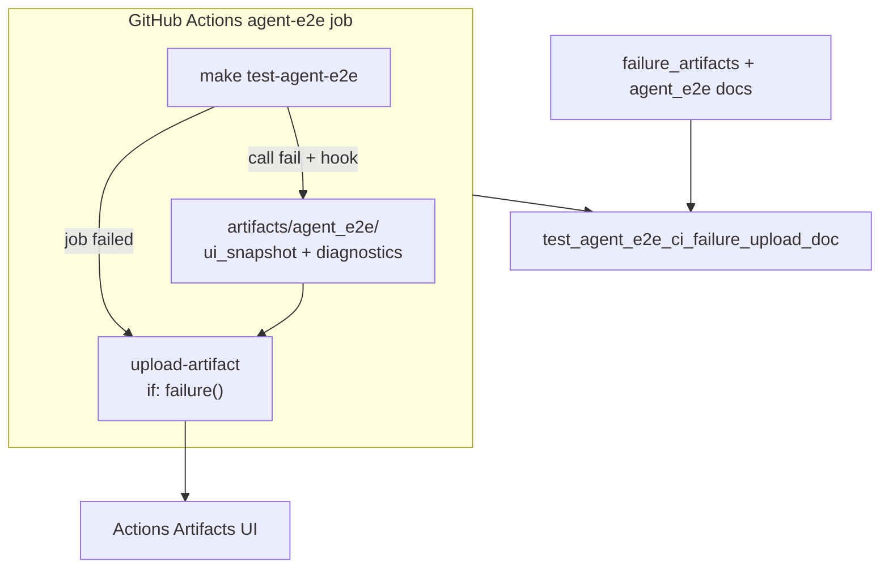

# PYPOST-874: Optional CI upload of agent e2e failure artifacts

## Research

### Jira / parent debt

- Issue: [PYPOST-874](https://pypost.atlassian.net/browse/PYPOST-874) —
  upload `artifacts/agent_e2e/` on `agent-e2e` CI job failure.
- Parent: [PYPOST-860](https://pypost.atlassian.net/browse/PYPOST-860)
  `60-tech-debt.md` — “No GitHub Actions upload step… optional
  `upload-artifact`; implementing it is follow-up debt.”
- Related: dump helper + hook already write masked
  `ui_snapshot.json` + `diagnostics.json` under `artifacts/agent_e2e/`.

### Current CI (`.github/workflows/test.yml`)

| Job | Uploads today | Agent e2e dumps |
| --- | --- | --- |
| `test` (matrix) | `junit.xml`, `coverage.xml` via pinned `actions/upload-artifact` (`if: always()`) | Dumps may exist on disk if fixture tests fail; **not** uploaded |
| `agent-e2e` | **None** | Same dump root after `make test-agent-e2e` failures; lost with runner |

`agent-e2e` steps today: checkout → Qt apt → setup-python → pip upgrade →
`make install` → `make test-agent-e2e` → job summary (`if: always()`).

Pinned upload action already in-repo:

```text
actions/upload-artifact@ea165f8d65b6e75b540449e92b4886f43607fa02 # v4.6.2
```

### Docs today

- `doc/dev/agent_e2e_failure_artifacts.md` § CI tip — optional upload
  language only; no wired step; no PYPOST-874 anchor.
- `doc/dev/agent_e2e.md` / `testing.md` — dump path documented; no
  Actions download instructions for this job.

### External guidance

GitHub Actions docs / `upload-artifact` README: use `if: failure()` for
debug uploads; set `if-no-files-found: ignore` when the failure may
precede dump creation (install fail, non-fixture fail). Industry practice:
upload failure diagnostics only on red runs to avoid artifact storage on
green CI.

### Decision: **ENABLE** (wire failure upload on `agent-e2e`)

| Option | Pros | Cons |
| --- | --- | --- |
| **ENABLE** (chosen) | Downloads dumps from Actions UI; matches ticket; reuses pinned action; low risk | Small YAML + retention; rare empty upload when fail before dump |
| **DEFER** | Zero workflow change | Leaves 860 tip unimplemented; triage still needs runner access |

**Rationale:** Parent deferred upload only relative to 860 DoD. Cost/risk
is low (`if: failure()`, ignore missing path, masked dumps). Ticket SP 2
and summary call for the upload itself. ENABLE delivers the debt; DEFER
would only restate the tip.

**Revisit / follow-up (not this ticket):** optional same upload on main
`test` matrix when agent e2e fails there (3.11/3.13 overlap from
PYPOST-873).

### Architectural decisions

| Decision | Choice | Rationale |
| --- | --- | --- |
| ENABLE vs DEFER | **ENABLE** | Ticket goal; low cost; triage value |
| Job scope | `agent-e2e` only | Matches issue description |
| Condition | `if: failure()` | NFR2 — no green-run storage |
| Path | `artifacts/agent_e2e/` | PYPOST-860 default root |
| Missing files | `if-no-files-found: ignore` | Install/setup fail may leave no dumps |
| Action pin | Same SHA as main job | Consistency / supply-chain |
| Artifact name | `agent-e2e-failure-artifacts` | Stable, job-scoped |

## Implementation Plan

1. **Failing repro (Step 3)** — add
   `tests/test_agent_e2e_ci_failure_upload_doc.py` (pure unit, timeout 10,
   **no** `agent_e2e` mark) asserting:
   - Docs contain PYPOST-874 / ENABLE upload anchors (stable phrases).
   - `.github/workflows/test.yml` job `agent-e2e` includes
     `actions/upload-artifact` with path `artifacts/agent_e2e/` and
     failure-gated upload (`if: failure()`).
   - Run targeted; expect **red** until YAML + docs land.
2. **Workflow (Step 4)** — add upload step after agent-e2e test / summary
   as appropriate (`if: failure()` still runs after a failed test step).
3. **Docs** — replace optional tip with ENABLE download instructions in
   `agent_e2e_failure_artifacts.md`; cross-link from `agent_e2e.md` /
   `testing.md` as needed.
4. **Green** — re-run lock until green.

**Mandatory — Failing Repro (next Step 3):**

- **Where:** `tests/test_agent_e2e_ci_failure_upload_doc.py`
- **Asserts (desired):** documented ENABLE decision (anchor `PYPOST-874`
  + upload / failure-artifact wording) and workflow uploads
  `artifacts/agent_e2e/` under job `agent-e2e` with `if: failure()`.
- **Force red:** do not edit workflow or docs in Step 3; asserts fail.
- **Run:**

```bash
make test PYTEST_ARGS='tests/test_agent_e2e_ci_failure_upload_doc.py -v'
```

Sequencing: research → red lock → ENABLE YAML + docs → green.

## Architecture



| Module | Responsibility |
| --- | --- |
| `.github/workflows/test.yml` | Failure upload step on `agent-e2e` |
| `doc/dev/agent_e2e_failure_artifacts.md` | ENABLE download instructions |
| `doc/dev/agent_e2e.md` / `testing.md` | Cross-links as needed |
| `tests/test_agent_e2e_ci_failure_upload_doc.py` | Lock docs + workflow contract |

### Upload step sketch

```yaml
- name: Upload agent e2e failure artifacts
  if: failure()
  uses: actions/upload-artifact@ea165f8d65b6e75b540449e92b4886f43607fa02 # v4.6.2
  with:
    name: agent-e2e-failure-artifacts
    path: artifacts/agent_e2e/
    if-no-files-found: ignore
```

## Q&A

| Q | A |
| --- | --- |
| Why not `if: always()`? | Green runs have no dumps worth storing; NFR2. |
| Why ignore missing files? | Failures before pytest (or non-fixture fails) leave an empty root. |
| Why not main matrix too? | Out of ticket scope; list as unticketed follow-up. |
| Secrets? | Upload only already-masked PYPOST-860 dumps. |
