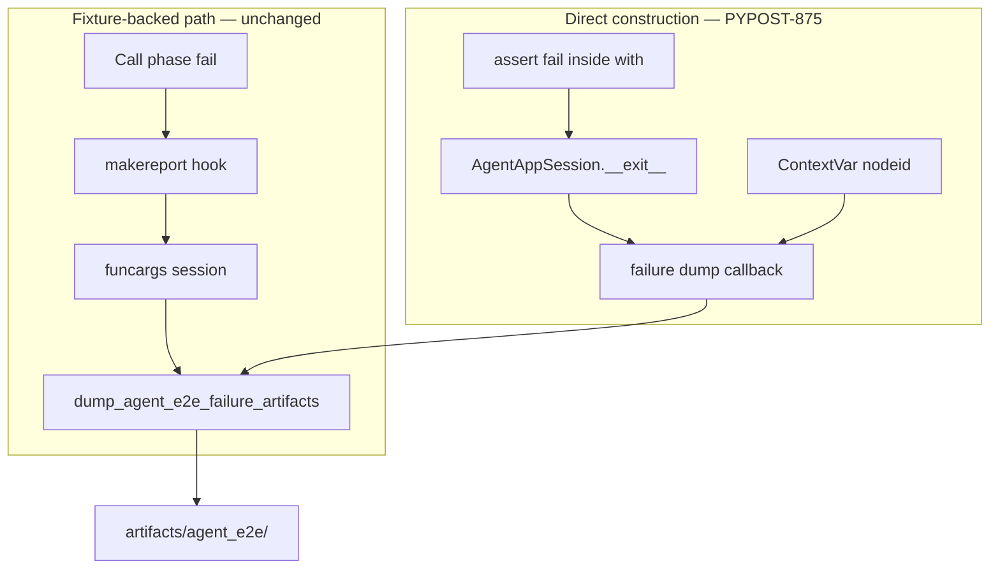

# PYPOST-875: Auto-dump for direct AgentAppSession constructions

## Research

### Jira / parent debt

- Issue: [PYPOST-875](https://pypost.atlassian.net/browse/PYPOST-875) —
  auto-dump failure artifacts for tests that construct `AgentAppSession`
  directly (not via packaging fixtures).
- Parent: [PYPOST-860](https://pypost.atlassian.net/browse/PYPOST-860)
  `60-tech-debt.md` — “Auto-dump only for shared fixtures… Consider a
  context manager or stash registry so direct constructions can opt into
  the same dump.”
- Related sibling: [PYPOST-874](https://pypost.atlassian.net/browse/PYPOST-874)
  CI upload of the same `artifacts/agent_e2e/` root (orthogonal).

### Current behavior (PYPOST-860)

| Path | How session is obtained | Auto-dump today |
| --- | --- | --- |
| Packaging fixtures | `agent_e2e_session` / `seeded_agent_e2e_session` | Yes — `pytest_runtest_makereport` + `session_from_funcargs` |
| Direct construction | `with AgentAppSession(...) as session:` in test body | No — no fixture in funcargs; session already shut down when makereport runs |

Direct users today:

- `tests/test_agent_e2e_seed.py::test_seed_isolation_across_sessions`
- `tests/test_agent_lifecycle_smoke.py` (window-after-shutdown, relaunch)

Dump helper: `pypost/fixtures/agent_e2e_failure.py` —
`dump_agent_e2e_failure_artifacts` (masked snapshot + diagnostics).
Plugin always loaded via `tests/conftest.py` →
`tests._pytest_plugins.agent_e2e`.

### Why makereport alone cannot cover direct `with` blocks

When an assert fails **inside** `with AgentAppSession(...)`:

1. Exception triggers `__exit__` → session shuts down.
2. Exception reaches pytest → `makereport(when=call)`.
3. No session fixture in `funcargs`; live session is gone.

Yield fixtures differ: teardown resumes after `yield` **without** injecting
the test exception into the `with`, so fixture `__exit__` sees
`exc_type=None`. Makereport therefore remains the correct dump trigger for
fixtures (session still alive at call-report time).

### Options

| Option | Pros | Cons |
| --- | --- | --- |
| **A. Dump in `AgentAppSession.__exit__` when `exc_type` set + plugin hook** | Covers all direct `with` uses; no per-test API change; fixtures unchanged (no exc on fixture exit) | Small lifecycle hook surface; needs nodeid without importing pytest into product |
| B. New `tracked_agent_app_session` CM only | Clear opt-in | Authors must migrate every direct site; easy to miss |
| C. Stash registry + makereport only | Reuses hook | Session already dead at makereport for in-body `with` |

**Decision: Option A.** Register a best-effort failure-dump callback from the
agent_e2e plugin; invoke it from `AgentAppSession.__exit__` when an
`Exception` is propagating and the session is still started. Provide
nodeid via a `contextvars.ContextVar` set per test by the plugin.

`session_fixture` diagnostic value for this path: `"direct"` (provenance
distinct from fixture names).

Double-dump: fixtures keep makereport; fixture `__exit__` has no exception
→ no second dump. Direct path: `__exit__` dumps; makereport finds no
funcargs → no second dump.

### Architectural decisions

| Decision | Choice | Rationale |
| --- | --- | --- |
| Mechanism | `__exit__` dump hook + ContextVar nodeid | Fixes timing; parent suggested CM/registry; hook is the registry |
| Product coupling | Optional callback on lifecycle; plugin installs it | Agent API stays free of pytest imports |
| Fixture path | Keep makereport | Yield fixtures never see test exc in `__exit__` |
| Provenance | `session_fixture="direct"` | FR3 |
| Exception filter | `Exception` only (not `BaseException`) | Avoid dump on `KeyboardInterrupt` / `SystemExit` |
| Opt-out | Hook absent ⇒ no dump (non-plugin runs) | Safe for non-test AgentAppSession users |

## Implementation Plan

1. **Failing repro (Step 3)** — extend
   `tests/test_agent_e2e_failure_artifacts.py` with a subprocess probe that
   constructs `AgentAppSession` directly, asserts intentionally, and expects
   `ui_snapshot.json` + `diagnostics.json` (desired behavior). Run targeted;
   expect **red** (no dumps today). No production fix in Step 3.
2. **Lifecycle (Step 4)** — optional failure-dump hook invoked from
   `AgentAppSession.__exit__` when an `Exception` is in flight.
3. **Failure module** — ContextVar for current nodeid; install/clear helpers;
   hook implementation calling `dump_agent_e2e_failure_artifacts`.
4. **Plugin** — set/reset ContextVar per test; register hook at import/setup.
5. **Green** — re-run red test until green; keep existing fixture subprocess
   proof green.
6. **Docs** — update `doc/dev/agent_e2e_failure_artifacts.md` (and brief
   cross-links) for direct-construction auto-dump.

**Mandatory — Failing Repro (next Step 3):**

- **Where:** `tests/test_agent_e2e_failure_artifacts.py` —
  `test_makereport_hook_dumps_on_direct_session_assert_fail` (name may vary).
- **Asserts (desired):** failing test using bare
  `with AgentAppSession(offscreen=True, …)` writes snapshot + diagnostics
  under `PYPOST_AGENT_E2E_ARTIFACTS`; diagnostics `exc_type` is
  `AssertionError`; provenance is direct (not a packaging fixture name).
- **Force red:** do not change lifecycle/plugin/helper wiring in Step 3.
- **Run:**

```bash
make test PYTEST_ARGS='tests/test_agent_e2e_failure_artifacts.py::test_makereport_hook_dumps_on_direct_session_assert_fail -v'
```

Sequencing: research → red subprocess → hook + `__exit__` dump → green.

## Architecture



| Module | Responsibility |
| --- | --- |
| `pypost/agent/lifecycle.py` | Call optional dump hook in `__exit__` when `Exception` pending |
| `pypost/fixtures/agent_e2e_failure.py` | ContextVar nodeid; hook factory; dump helper (existing) |
| `tests/_pytest_plugins/agent_e2e.py` | Install hook; bind nodeid per test; keep makereport |
| `tests/test_agent_e2e_failure_artifacts.py` | Subprocess proof for direct construction |
| `doc/dev/agent_e2e_failure_artifacts.md` | Document direct auto-dump |

### Hook sketch

```python
# lifecycle: if dump_hook and exc is Exception subclass → dump_hook(self, exc)
# plugin: set_agent_session_failure_dump_hook(make_dump_hook())
# dump_hook uses current_nodeid ContextVar + session_fixture="direct"
```

## Q&A

| Q | A |
| --- | --- |
| Why not only a tracked CM? | Parent allowed CM or registry; `__exit__` hook covers all direct sites without migration. |
| Why keep makereport? | Yield fixtures do not surface test exceptions to session `__exit__`. |
| Will fixtures double-dump? | No — fixture `__exit__` has `exc_type=None`. |
| Secrets? | Same helper / `ui_snapshot()` masking as PYPOST-860. |
| Non-test AgentAppSession? | Hook unset → no dump. |
