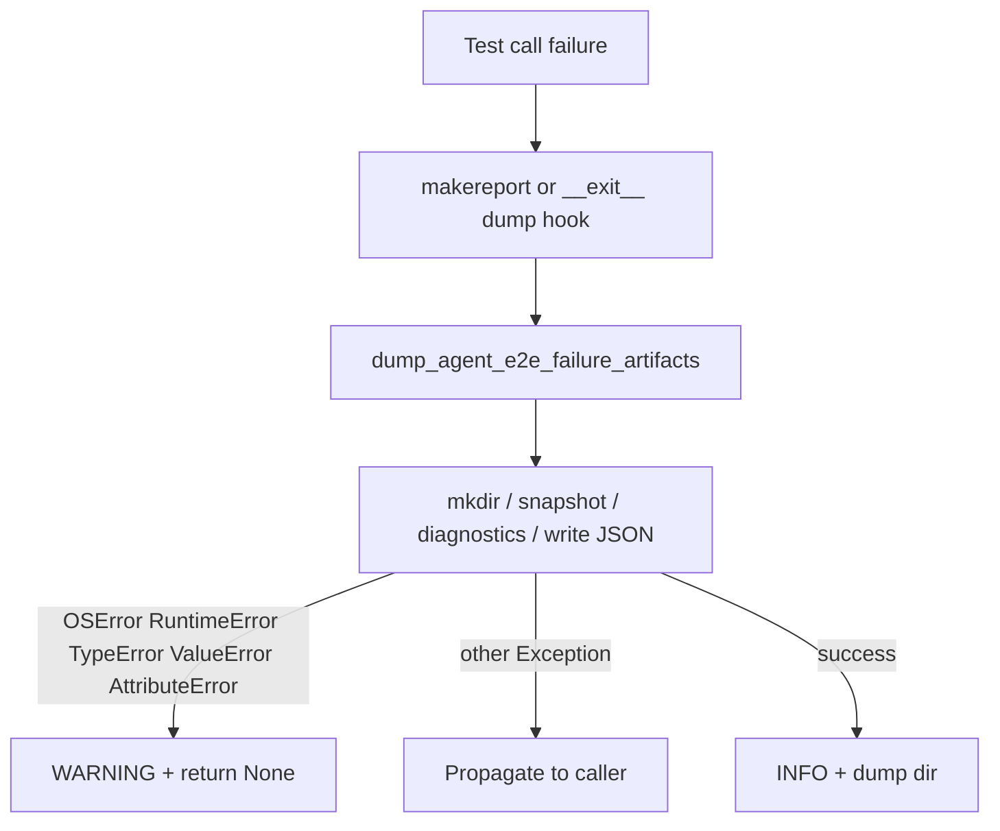

# PYPOST-876: Narrow dump helper exception types

## Research

### Current code (PYPOST-860 / 875)

`pypost/fixtures/agent_e2e_failure.py` has two broad catches:

1. **`dump_agent_e2e_failure_artifacts`** — wraps mkdir, `ui_snapshot()`,
   diagnostics build, and JSON write. On any `Exception`: WARNING
   `agent_e2e_failure_artifacts_failed`, return `None`. Marked
   `# noqa: BLE001`.
2. **`_build_diagnostics` `ui_ready` probe** — reads
   `session.window.is_ui_ready`; on any `Exception` sets `ui_ready=None`.
   Also `# noqa: BLE001`.

Callers: pytest makereport hook (fixtures) and
`make_direct_session_failure_dump_hook` → `AgentAppSession.__exit__`
(PYPOST-875). Lifecycle still wraps the hook in its own
`except Exception` (`lifecycle.py`) — **out of scope** for this ticket.

Parent debt suggested tuple:
`(OSError, RuntimeError, TypeError, ValueError, …)`.

### Failure-mode catalogue (dump body)

| Operation | Likely exceptions |
| --- | --- |
| `Path.mkdir` / `write_text` | `OSError` (incl. subclasses) |
| `json.dumps` / non-serializable | `TypeError`, `ValueError` |
| `session.ui_snapshot()` | `RuntimeError`, `TypeError`, `AttributeError` |
| Half-torn `window.is_ui_ready` | `AttributeError`, `RuntimeError`, `TypeError` |

`AttributeError` is a common half-torn / mock miss and should be in the
intentional best-effort set (parent ellipsis).

### Standards

- [Ruff BLE001](https://docs.astral.sh/ruff/rules/blind-except/): catch
  specific expected types; avoid blind `except Exception` that masks bugs.
- [Python tutorial — Errors](https://docs.python.org/3/tutorial/errors.html):
  be as specific as possible; allow unexpected exceptions to propagate.

### Existing tests

`tests/test_agent_e2e_failure_artifacts.py`:
`test_dump_best_effort_on_capture_error` uses `RuntimeError` (must stay
green). No test yet for propagation of unexpected types.

## Implementation Plan

1. Introduce a module-level constant for the intentional catch tuple, e.g.
   `_DUMP_BEST_EFFORT_ERRORS = (OSError, RuntimeError, TypeError,
   ValueError, AttributeError)`.
2. Replace both `except Exception` sites in
   `agent_e2e_failure.py` with that tuple; remove `# noqa: BLE001`.
3. Keep WARNING + `return None` semantics for caught kinds.
4. Document the tuple in `doc/dev/agent_e2e_failure_artifacts.md`.
5. Tests: keep RuntimeError best-effort; add red-then-green propagation
   for an unexpected type (e.g. `LookupError`).

**Failing Repro (Step 3):**

- **File:** `tests/test_agent_e2e_failure_artifacts.py`
- **Test:** `test_dump_propagates_unexpected_exception`
- **Assert:** when `ui_snapshot` raises `LookupError`,
  `dump_agent_e2e_failure_artifacts` re-raises `LookupError` (does not
  return `None` / log dump-failed as success path).
- **Force without live deps:** `MagicMock(spec=AgentAppSession)` +
  `side_effect=LookupError(...)`.
- **Why red today:** broad `except Exception` swallows `LookupError`.
- **Sequencing:** write/run red → Step 4 narrow tuple → green; keep
  `test_dump_best_effort_on_capture_error` green throughout Step 4.

## Architecture

### Modules

| Module | Change |
| --- | --- |
| `pypost/fixtures/agent_e2e_failure.py` | Named catch tuple; narrow both sites |
| `tests/test_agent_e2e_failure_artifacts.py` | Propagation + optional AttributeError best-effort |
| `doc/dev/agent_e2e_failure_artifacts.md` | Document intentional catch set |
| `pypost/agent/lifecycle.py` | No change (hook wrapper BLE001 stays) |

### Patterns

- **Best-effort boundary** with an explicit exception catalogue (not
  blind `Exception`).
- **Constant for the tuple** so docs and tests share one contract.

### Interfaces

No public API signature change. Behavior change: unexpected exceptions
from the dump body propagate instead of returning `None`.

## Q&A

| Q | A |
| --- | --- |
| Include `AttributeError`? | Yes — half-torn session / missing attrs are expected at dump time. |
| Narrow lifecycle hook too? | No — out of scope; record in Step 7 if needed. |
| Use `json.JSONDecodeError`? | N/A — helper only dumps (`dumps`/`write`), never loads. |
